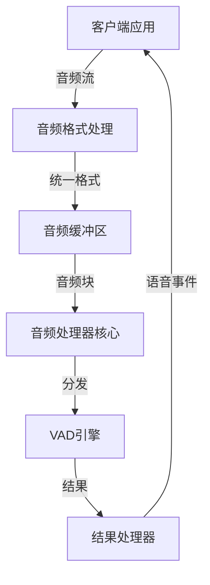

# Cascade: 音频流并行VAD处理库

Cascade是一个高性能、低延迟的音频流处理库，专为语音活动检测(VAD)设计。它通过并行处理技术，显著降低VAD处理延迟，同时保证检测结果的准确性。

## 项目背景

传统VAD处理方式存在严重延迟问题。例如，当处理2秒的音频时，需要将其切割为多个16ms的小块（每块256个采样点）依次处理，这导致了显著的处理延迟。Cascade通过将音频分割为多个大块并行处理，同时使用重叠区域解决边界问题，大幅降低了处理延迟。

## 核心特性

- **并行处理**：将音频分割为多块，使用多个VAD实例并行处理
- **重叠处理**：通过块间重叠区域解决边界问题，确保检测准确性
- **异步设计**：基于Python 3.12的异步编程模型，提供高并发能力
- **低延迟**：优化的缓冲区和处理流程，确保最小处理延迟
- **格式支持**：支持WAV和PCMA格式，16kHz和8kHz采样率，单声道音频
- **线程安全**：细粒度锁设计和原子操作，确保多线程环境下的数据一致性
- **零拷贝设计**：最小化内存复制，提高处理效率
- **多后端支持**：支持VLLM和ONNXRuntime两种VAD后端

## 系统架构

Cascade由三个核心组件组成：

1. **音频处理器**：负责接收音频流、分割音频块、处理边界问题
2. **音频缓冲区**：提供高效的音频数据存储和访问机制
3. **音频格式处理**：负责音频格式的验证、转换和适配



## 安装要求

- Python 3.12+
- NumPy
- SciPy
- AsyncIO
- ONNXRuntime 或 VLLM (根据选择的后端)

## 快速开始

### 基本使用

```python
import asyncio
from cascade import AsyncParallelVAD

async def main():
    # 创建VAD实例 - 线程池+模型实例池架构
    vad = AsyncParallelVAD(
        backend_type="onnx",
        num_workers=4,  # 4个线程，每个绑定独立的VAD实例
        threshold=0.5
    )
    
    # 异步初始化 - 包含模型加载和线程预热
    model_config = {
        "model_path": "path/to/vad_model.onnx",
        "optimization_level": "all"
    }
    await vad.initialize(model_config)
    
    # 流式处理音频文件
    async for result in vad.process_file("audio.wav"):
        if "result" in result:
            vad_output = result["result"]
            metadata = result["metadata"]
            print(f"音频块 {metadata['sequence_number']}: "
                  f"语音概率={vad_output['probability']:.3f}")
    
    # 优雅关闭，释放所有线程和模型资源
    await vad.close()

# 运行主函数
asyncio.run(main())
```

### 流式处理

```python
async def process_stream(audio_stream):
    # 高性能流式处理配置
    vad = AsyncParallelVAD(
        backend_type="onnx",
        num_workers=4,
        chunk_duration_ms=500,  # 500ms音频块
        overlap_ms=16,          # 16ms重叠
        threshold=0.5
    )
    
    # 模型配置
    model_config = {
        "model_path": "path/to/vad_model.onnx",
        "optimization_level": "all",
        "providers": ["CPUExecutionProvider"]
    }
    await vad.initialize(model_config)
    
    # 并行流式处理
    async for chunk in audio_stream:
        # 高效的异步处理 - 每个音频块并行提交给线程池
        async for result in vad.process_stream_chunk(chunk):
            if "result" in result:
                vad_result = result["result"]
                metadata = result["metadata"]
                
                # 实时语音事件检测
                if vad_result["is_speech"]:
                    print(f"检测到语音: 时间={metadata['start_time_ms']}ms, "
                          f"概率={vad_result['probability']:.3f}")
                
                # 语音段边界检测
                if vad_result.get("speech_start"):
                    print(f"语音开始: {metadata['start_time_ms']}ms")
                elif vad_result.get("speech_end"):
                    print(f"语音结束: {metadata['end_time_ms']}ms")
    
    # 处理缓冲区中剩余数据
    await vad.finalize()
    
    # 获取性能统计
    stats = await vad.get_performance_stats()
    print(f"处理统计: 平均延迟={stats['avg_latency_ms']:.2f}ms, "
          f"吞吐量={stats['throughput_qps']:.1f} chunks/s")
    
    await vad.close()
```

## 高级配置

```python
# 高级配置示例
config = {
    "backend_type": "vllm",          # VAD后端类型: "vllm" 或 "onnx"
    "num_workers": 8,                # 工作线程数
    "hop_size": 256,                 # 帧大小 (16ms @ 16kHz)
    "threshold": 0.5,                # VAD阈值
    "overlap_ms": 16,                # 重叠区域大小 (毫秒)
    "chunk_duration_ms": 500,        # 块大小 (毫秒)
    "buffer_capacity_seconds": 5,    # 缓冲区容量 (秒)
    "sample_rate": 16000,            # 采样率
    "channels": 1,                   # 通道数
    "format_type": "wav"             # 音频格式: "wav" 或 "pcma"
}

vad = AsyncParallelVAD(**config)
```

## 性能优化

Cascade提供了多种性能优化选项：

- **线程数调整**：根据CPU核心数调整`num_workers`参数
- **块大小调整**：通过`chunk_duration_ms`参数调整块大小
- **重叠大小调整**：通过`overlap_ms`参数调整重叠区域大小
- **缓冲区容量调整**：通过`buffer_capacity_seconds`参数调整缓冲区容量
- **批处理**：启用批处理模式，减少函数调用开销

## 文档

详细文档请参考`docs/`目录：

- [架构设计](docs/架构设计.md)：整体架构设计文档
- [音频处理器](docs/音频处理器.md)：音频处理器模块设计
- [音频缓冲区](docs/音频缓冲区.md)：音频缓冲区设计
- [音频格式处理](docs/音频格式处理.md)：音频格式处理设计
- [音频处理器架构设计](docs/音频处理器架构设计.md)：详细的音频处理器架构设计

## 贡献指南

欢迎贡献代码、报告问题或提出改进建议。请遵循以下步骤：

1. Fork本仓库
2. 创建您的特性分支 (`git checkout -b feature/amazing-feature`)
3. 提交您的更改 (`git commit -m 'Add some amazing feature'`)
4. 推送到分支 (`git push origin feature/amazing-feature`)
5. 打开Pull Request

## 许可证

本项目采用Apache License 2.0许可证。详情请参见[LICENSE](LICENSE)文件。

## 致谢

- TEN Framework项目提供的VAD实现
- 所有贡献者和用户