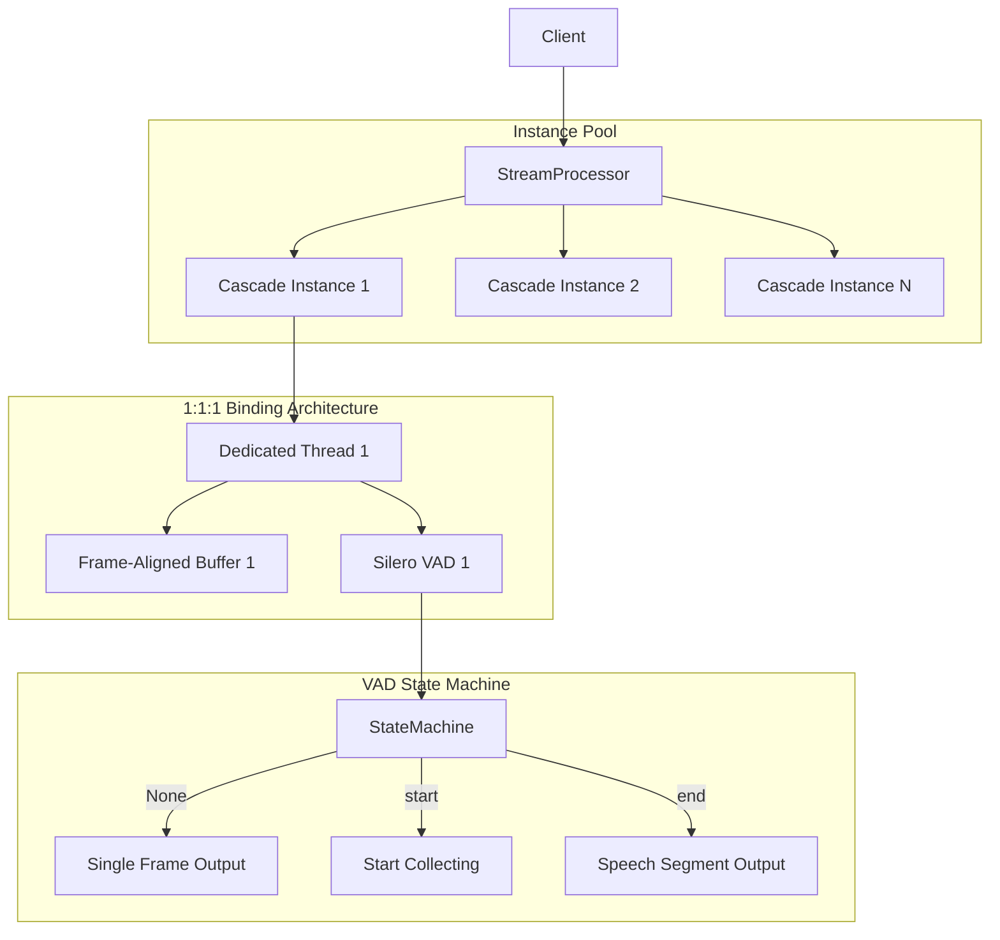
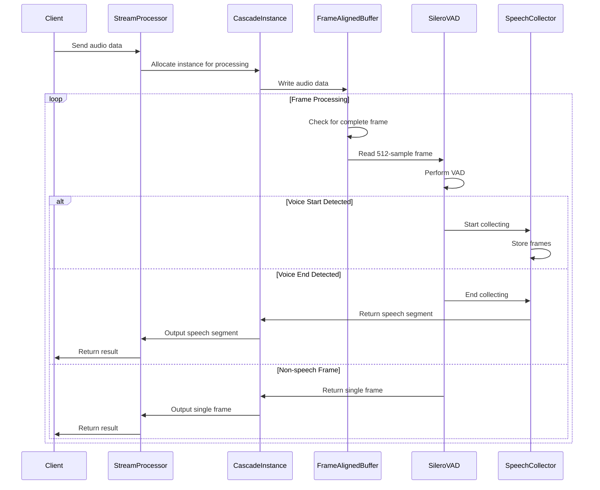

# Cascade - Production-Ready, High-Performance, Asynchronous VAD Library

[中文](./README_zh.md)

[](https://python.org)
[](LICENSE)
[](https://github.com/xucailiang/cascade)
[](https://github.com/snakers4/silero-vad)
[](https://github.com/xucailiang/cascade)
[](https://github.com/xucailiang/cascade)

**Cascade** is a **production-ready**, **high-performance**, and **low-latency** audio stream processing library designed for Voice Activity Detection (VAD). Built upon the excellent [Silero VAD](https://github.com/snakers4/silero-vad) model, Cascade significantly reduces VAD processing latency while maintaining high accuracy through its **1:1:1 binding architecture** and **asynchronous streaming technology**.

## 📊 Performance Benchmarks

Based on our latest performance tests:

| Metric                  | Value         | Description                             |
|-------------------------|---------------|-----------------------------------------|
| **Processing Speed**    | 2430.3 fps    | Average frames processed per second     |
| **Latency**             | 29.04ms       | Average processing latency              |
| **Memory Usage**        | 471.1MB       | Average memory footprint                |
| **Success Rate**        | 100%          | Processing success rate                 |
| **Accuracy**            | High          | Guaranteed by the Silero VAD model      |

For a detailed analysis, please see the [Performance Test Report](performance_tests/performance_test_report.md).

## ✨ Core Features

### 🚀 High-Performance Engineering

- **Lock-Free Design**: The 1:1:1 binding architecture eliminates lock contention, boosting performance.
- **Frame-Aligned Buffer**: A highly efficient buffer optimized for 512-sample frames.
- **Asynchronous Streaming**: Non-blocking audio stream processing based on `asyncio`.
- **Memory Optimization**: Zero-copy design, object pooling, and cache alignment.
- **Concurrency Optimization**: Dedicated threads, asynchronous queues, and batch processing.

### 🔧 Robust Software Engineering

- **Modular Design**: A component architecture with high cohesion and low coupling.
- **Interface Abstraction**: Dependency inversion through interface-based design.
- **Type System**: Data validation and type checking using Pydantic.
- **Comprehensive Testing**: Unit, integration, and performance tests.
- **Code Standards**: Adherence to PEP 8 style guidelines.

### 🛡️ Production-Ready Reliability

- **Error Handling**: Robust error handling and recovery mechanisms.
- **Resource Management**: Automatic cleanup and graceful shutdown.
- **Monitoring Metrics**: Real-time performance monitoring and statistics.
- **Scalability**: Horizontal scaling by increasing the number of instances.
- **Stability Assurance**: Handles boundary conditions and exceptional cases gracefully.

## 🏗️ Architecture

Cascade employs a **1:1:1 binding architecture** to ensure optimal performance and resource utilization.



### Core Component Interaction Flow



## 🔍 Performance Optimization Strategies

### 1. Lock-Free Design (1:1:1 Architecture)

Each Cascade instance has its own dedicated thread, buffer, and VAD model, completely avoiding lock contention.

```python
# Example of lock-free design
class CascadeInstance:
    def __init__(self):
        # 1:1:1 Binding: One instance, one buffer, one thread, one VAD
        self.frame_buffer = FrameAlignedBuffer()  # Dedicated buffer
        self.vad_iterator = VADIterator(model)    # Dedicated VAD model
        self.speech_collector = SpeechCollector() # Dedicated collector
```

### 2. Frame-Aligned Buffer

An efficient buffer optimized for 512-sample frames, avoiding complex overlap handling.

```python
# Example of frame-aligned buffer
def read_frame(self) -> Optional[bytes]:
    """Reads a complete 512-sample frame."""
    if not self.has_complete_frame():
        return None
    
    # Extract the 512-sample frame
    frame_data = bytes(self._buffer[:self._frame_size_bytes])
    
    # Remove the read data from the buffer
    self._buffer = self._buffer[self._frame_size_bytes:]
    
    return frame_data
```

### 3. Memory Optimization

Uses `bytearray` and zero-copy design to reduce memory allocation and data copying.

```python
# Example of memory optimization
def write(self, audio_data: bytes) -> None:
    """Writes audio data to the buffer."""
    self._buffer.extend(audio_data)  # Extend buffer directly to avoid copying
```

## 🚀 Quick Start

### Installation

```bash
# Using uv is recommended
uv venv -p 3.12

source .venv/bin/activate

# Install from PyPI (recommended)
pip install cascade-vad

# Or install from source
git clone https://github.com/xucailiang/cascade.git
cd cascade
pip install -e .
```

### Basic Usage

```python
import cascade
import asyncio

async def basic_example():
    """A basic usage example."""
    
    # Method 1: Simple file processing
    async for result in cascade.process_audio_file("audio.wav"):
        if result.result_type == "segment":
            segment = result.segment
            print(f"🎤 Speech Segment: {segment.start_timestamp_ms:.0f}ms - {segment.end_timestamp_ms:.0f}ms")
        else:
            frame = result.frame
            print(f"🔇 Single Frame: {frame.timestamp_ms:.0f}ms")
    
    # Method 2: Stream processing
    async with cascade.StreamProcessor() as processor:
        async for result in processor.process_stream(audio_stream):
            if result.result_type == "segment":
                segment = result.segment
                print(f"🎤 Speech Segment: {segment.start_timestamp_ms:.0f}ms - {segment.end_timestamp_ms:.0f}ms")
            else:
                frame = result.frame
                print(f"🔇 Single Frame: {frame.timestamp_ms:.0f}ms")

asyncio.run(basic_example())
```

### Advanced Configuration

```python
from cascade.stream import StreamProcessor, create_default_config

async def advanced_example():
    """An advanced configuration example."""
    
    # Custom configuration
    config = create_default_config(
        vad_threshold=0.7,          # Higher detection threshold
        max_instances=3,            # Max 3 concurrent instances
        buffer_size_frames=128      # Larger buffer
    )
    
    # Use the custom config
    async with StreamProcessor(config) as processor:
        # Process audio stream
        async for result in processor.process_stream(audio_stream, "my-stream"):
            # Process results...
            pass
        
        # Get performance statistics
        stats = processor.get_stats()
        print(f"Processing Stats: {stats.summary()}")
        print(f"Throughput: {stats.throughput_chunks_per_second:.1f} chunks/sec")

asyncio.run(advanced_example())
```

## 🧪 Testing

```bash
# Run basic integration tests
python tests/test_simple_vad.py -v

# Run simulated audio stream tests
python tests/test_stream_vad.py -v

# Run performance benchmark tests
python tests/benchmark_performance.py
```

Test Coverage:
- ✅ Basic API Usage
- ✅ Stream Processing
- ✅ File Processing
- ✅ Real Audio VAD
- ✅ Automatic Speech Segment Saving
- ✅ 1:1:1 Architecture Validation
- ✅ Performance Benchmarks
- ✅ FrameAlignedBuffer Tests

## 🔧 Production Deployment

### Best Practices

1.  **Resource Allocation**
    -   Each instance uses approximately 50MB of memory.
    -   Recommended: 2-3 instances per CPU core.
    -   Monitor memory usage to prevent Out-of-Memory (OOM) errors.

2.  **Performance Tuning**
    -   Adjust `max_instances` to match server CPU cores.
    -   Increase `buffer_size_frames` for higher throughput.
    -   Tune `vad_threshold` to balance accuracy and sensitivity.

3.  **Error Handling**
    -   Implement retry mechanisms for transient errors.
    -   Use health checks to monitor service status.
    -   Log detailed information for troubleshooting.

### Monitoring Metrics

```python
# Get performance monitoring metrics
stats = processor.get_stats()

# Key monitoring metrics
print(f"Active Instances: {stats.active_instances}/{stats.total_instances}")
print(f"Average Processing Time: {stats.average_processing_time_ms}ms")
print(f"Success Rate: {stats.success_rate:.2%}")
print(f"Memory Usage: {stats.memory_usage_mb:.1f}MB")
```

## 🔧 Requirements

### Core Dependencies

-   **Python**: 3.12 (recommended)
-   **pydantic**: 2.4.0+ (Data validation)
-   **numpy**: 1.24.0+ (Numerical computation)
-   **scipy**: 1.11.0+ (Signal processing)
-   **silero-vad**: 5.1.2+ (VAD model)
-   **onnxruntime**: 1.22.1+ (ONNX inference)
-   **torchaudio**: 2.7.1+ (Audio processing)

### Development Dependencies

-   **pytest**: Testing framework
-   **black**: Code formatter
-   **ruff**: Linter
-   **mypy**: Type checker
-   **pre-commit**: Git hooks

## 🤝 Contribution Guide

We welcome community contributions! Please follow these steps:

1.  **Fork the project** and create a feature branch.
2.  **Install development dependencies**: `pip install -e .[dev]`
3.  **Run tests**: `pytest`
4.  **Lint your code**: `ruff check . && black --check .`
5.  **Type check**: `mypy cascade`
6.  **Submit a Pull Request** with a clear description of your changes.

### Development Setup

```bash
# Clone the project
git clone https://github.com/xucailiang/cascade.git
cd cascade

# Create a virtual environment
python -m venv venv
source venv/bin/activate  # Linux/Mac
# or venv\Scripts\activate  # Windows

# Install development dependencies
pip install -e .

# Install pre-commit hooks
pre-commit install

# Run tests
python -m pytest tests/ -v

# Run performance tests
python tests/benchmark_performance.py
```

## 📄 License

This project is licensed under the MIT License - see the [LICENSE](LICENSE) file for details.

## 🙏 Acknowledgments

-   **Silero Team**: For their excellent VAD model.
-   **PyTorch Team**: For the deep learning framework.
-   **Pydantic Team**: For the type validation system.
-   **Python Community**: For the rich ecosystem.

## 📞 Contact

-   **Author**: Xucailiang
-   **Email**: xucailiang.ai@gmail.com
-   **Project Homepage**: https://github.com/xucailiang/cascade
-   **Issue Tracker**: https://github.com/xucailiang/cascade/issues
-   **Documentation**: https://cascade-vad.readthedocs.io/

## 🗺️ Roadmap

### v0.2.0 (Planned)
- [ ] Support for more audio formats (MP3, FLAC)
- [ ] Real-time microphone input support
- [ ] WebSocket API interface
- [ ] Performance optimization and memory reduction

### v0.3.0 (Planned)
- [ ] Multi-language VAD model support
- [ ] Speech separation and enhancement
- [ ] Cloud deployment support
- [ ] Visual monitoring dashboard

---

**⭐ If you find this project helpful, please give it a star!**