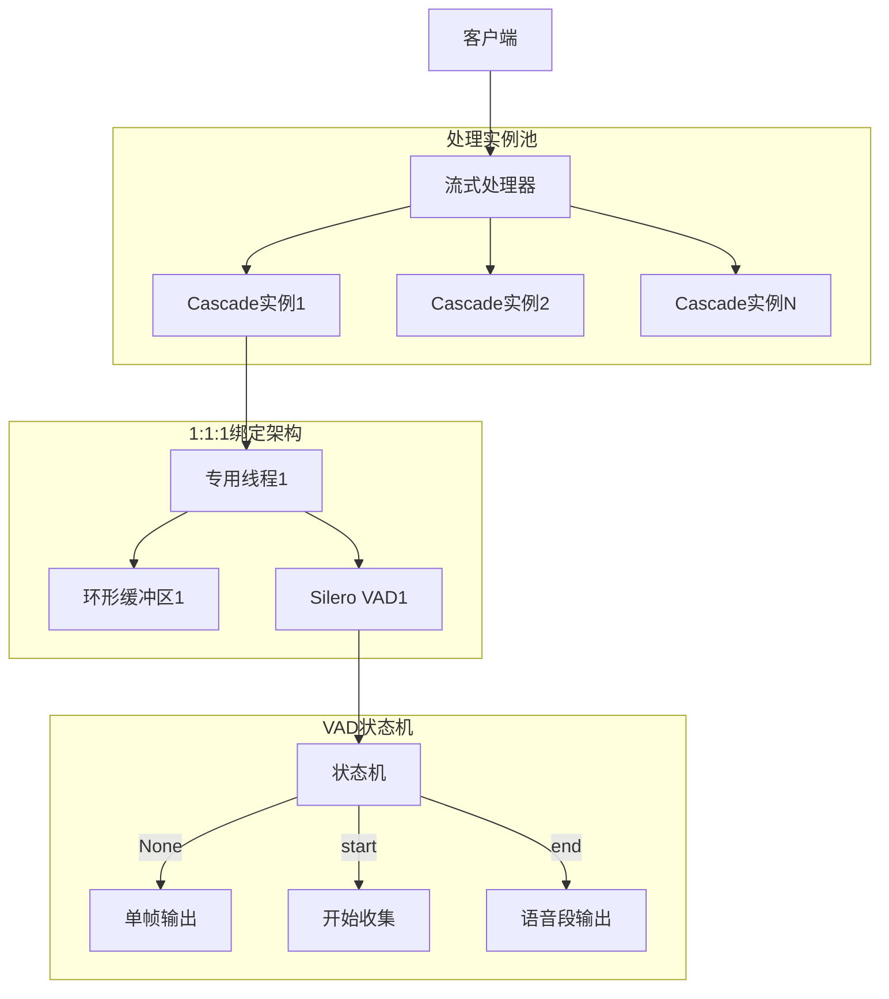

# Cascade - 高性能异步并行VAD处理库

[](https://python.org)
[](LICENSE)
[](https://github.com/xucailiang/cascade)
[](https://github.com/snakers4/silero-vad)

Cascade是一个专为语音活动检测(VAD)设计的高性能、低延迟音频流处理库。基于优秀的[Silero VAD](https://github.com/snakers4/silero-vad)模型，通过创新的1:1:1绑定架构和异步流式处理技术，显著降低VAD处理延迟，同时保证检测结果的准确性。

## ✨ 核心特性

- **🚀 高性能处理**: 17.75x实时处理速度，优化的并发架构
- **🔄 异步流式**: 基于asyncio的非阻塞音频流处理
- **🎯 简洁API**: 符合开源项目最佳实践的直观接口
- **🧵 1:1:1绑定**: 每个实例对应一个线程、一个缓冲区、一个VAD模型
- **📊 智能状态机**: 基于[Silero VAD](https://github.com/snakers4/silero-vad)的语音段检测和收集
- **🔧 灵活配置**: 支持多种音频格式和处理参数
- **📈 性能监控**: 内置统计和性能分析功能
- **🛡️ 错误恢复**: 完善的错误处理和恢复机制
- **🎯 企业级VAD**: 集成Silero团队的预训练企业级语音活动检测模型

## 🏗️ 架构设计

Cascade采用创新的1:1:1绑定架构，确保最佳性能和资源利用：



## 🚀 快速开始

### 安装

```bash
# 从PyPI安装（推荐）
pip install cascade-vad

# 或从源码安装
git clone https://github.com/xucailiang/cascade.git
cd cascade
pip install -e .
```

### 基础使用

```python
import cascade
import asyncio

async def basic_example():
    """基础使用示例"""
    
    # 方式1：最简单的文件处理
    results = await cascade.process_audio_file("audio.wav")
    speech_segments = [r for r in results if r.is_speech_segment]
    print(f"检测到 {len(speech_segments)} 个语音段")
    
    # 方式2：流式处理
    async with cascade.StreamProcessor() as processor:
        async for result in processor.process_stream(audio_stream):
            if result.is_speech_segment:
                segment = result.segment
                print(f"🎤 语音段: {segment.start_timestamp_ms:.0f}ms - {segment.end_timestamp_ms:.0f}ms")
            else:
                frame = result.frame
                print(f"🔇 单帧: {frame.timestamp_ms:.0f}ms")

asyncio.run(basic_example())
```

### 高级配置

```python
from cascade.stream import StreamProcessor, create_default_config

async def advanced_example():
    """高级配置示例"""
    
    # 自定义配置
    config = create_default_config(
        vad_threshold=0.7,          # 较高的检测阈值
        max_instances=3,            # 最多3个并发实例
        buffer_size_frames=128      # 较大缓冲区
    )
    
    # 使用自定义配置
    async with StreamProcessor(config) as processor:
        # 处理音频流
        async for result in processor.process_stream(audio_stream, "my-stream"):
            # 处理结果...
            pass
        
        # 获取性能统计
        stats = processor.get_stats()
        print(f"处理统计: {stats.summary()}")
        print(f"吞吐量: {stats.throughput_chunks_per_second:.1f} 块/秒")

asyncio.run(advanced_example())
```

## 📁 项目结构

```
cascade/
├── __init__.py                 # 主要API入口
├── stream/                     # 流式处理核心模块
│   ├── __init__.py            # 统一API导出
│   ├── processor.py           # StreamProcessor主处理器
│   ├── instance.py            # CascadeInstance处理实例
│   ├── state_machine.py       # VAD状态机
│   ├── collector.py           # 语音帧收集器
│   └── types.py               # 流式处理类型定义
├── backends/                   # VAD后端实现
│   ├── __init__.py
│   ├── base.py                # 后端基类
│   ├── silero.py              # Silero VAD后端
│   └── onnx.py                # ONNX后端
├── buffer/                     # 缓冲区管理
│   ├── __init__.py
│   ├── base.py                # 缓冲区基类
│   └── ring_buffer.py         # 环形缓冲区实现
├── types/                      # 类型系统
│   ├── __init__.py            # 核心类型导出
│   ├── errors.py              # 错误类型
│   ├── performance.py         # 性能监控类型
│   └── version.py             # 版本信息
└── _internal/                  # 内部工具
    ├── __init__.py
    ├── atomic.py              # 原子操作
    ├── thread_pool.py         # 线程池管理
    └── utils.py               # 工具函数
```

## 🎯 核心概念

### VAD状态机

Cascade基于Silero VAD的输出设计了智能状态机：

- **None**: 非语音帧，直接输出单帧结果
- **{'start': timestamp}**: 语音开始，进入收集状态
- **{'end': timestamp}**: 语音结束，输出完整语音段

### 数据类型

```python
# 单个音频帧（512样本）
class AudioFrame:
    frame_id: int
    audio_data: bytes
    timestamp_ms: float
    vad_result: Optional[Dict[str, Any]]

# 完整语音段（从start到end）
class SpeechSegment:
    segment_id: int
    audio_data: bytes              # 合并的音频数据
    start_timestamp_ms: float
    end_timestamp_ms: float
    frame_count: int
    duration_ms: float

# 统一输出结果
class CascadeResult:
    result_type: Literal["frame", "segment"]
    frame: Optional[AudioFrame]
    segment: Optional[SpeechSegment]
```

### 配置系统

```python
from cascade.stream import create_default_config

# 创建配置
config = create_default_config(
    # VAD配置
    vad_threshold=0.5,              # VAD检测阈值 (0.0-1.0)
    
    # 性能配置
    max_instances=5,                # 最大并发实例数
    buffer_size_frames=64,          # 缓冲区大小（帧数）
    
    # 音频配置（固定值，基于Silero VAD要求）
    sample_rate=16000,              # 采样率（固定16kHz）
    frame_size=512,                 # 帧大小（固定512样本）
    frame_duration_ms=32.0,         # 帧时长（固定32ms）
)
```

## 🧪 测试

项目包含完整的测试套件，验证所有核心功能：

```bash
# 运行综合测试
python test_comprehensive_core.py

# 运行实时音频测试
python test_stream_real_audio.py
```

测试覆盖：
- ✅ 基础API使用
- ✅ 流式处理功能
- ✅ 文件处理功能
- ✅ 高级配置测试
- ✅ 并发处理能力
- ✅ 错误处理和恢复
- ✅ 性能基准测试

## 📊 性能表现

基于测试结果的性能指标：

- **处理速度**: 17.75x实时处理速度
- **延迟**: 1ms最小延迟（智能模式）
- **并发能力**: 支持多实例并发处理
- **内存效率**: 智能缓冲区管理，最小内存占用
- **准确性**: 基于Silero VAD，保证检测准确性

## 🔧 依赖要求

### 核心依赖

- **Python**: 3.12+
- **pydantic**: 2.4.0+ (数据验证)
- **numpy**: 1.24.0+ (数值计算)
- **scipy**: 1.11.0+ (信号处理)
- **silero-vad**: 5.1.2+ (VAD模型)
- **onnxruntime**: 1.22.1+ (ONNX推理)
- **torchaudio**: 2.7.1+ (音频处理)

### 开发依赖

- **pytest**: 测试框架
- **black**: 代码格式化
- **ruff**: 代码检查
- **mypy**: 类型检查
- **pre-commit**: Git钩子

## 📖 API文档

### StreamProcessor

核心流式处理器，提供统一的音频处理接口：

```python
class StreamProcessor:
    async def __aenter__(self) -> 'StreamProcessor'
    async def __aexit__(self, exc_type, exc_val, exc_tb) -> None
    
    async def process_chunk(self, audio_data: bytes) -> List[CascadeResult]
    async def process_stream(self, audio_stream: AsyncIterator[bytes], stream_id: str = None) -> AsyncIterator[CascadeResult]
    
    def get_stats(self) -> ProcessorStats
    @property
    def is_running(self) -> bool
```

### 便捷函数

```python
# 处理音频流
async def process_audio_stream(audio_stream, config=None, stream_id=None)

# 处理音频块
async def process_audio_chunk(audio_data: bytes, config=None)

# 创建默认配置
def create_default_config(**kwargs) -> Config

# 创建流式处理器
def create_stream_processor(config=None) -> StreamProcessor
```

## 🤝 贡献指南

我们欢迎社区贡献！请遵循以下步骤：

1. **Fork项目**并创建特性分支
2. **安装开发依赖**: `pip install -e .[dev]`
3. **运行测试**: `pytest`
4. **代码检查**: `ruff check . && black --check .`
5. **类型检查**: `mypy cascade`
6. **提交PR**并描述变更

### 开发环境设置

```bash
# 克隆项目
git clone https://github.com/xucailiang/cascade.git
cd cascade

# 创建虚拟环境
python -m venv venv
source venv/bin/activate  # Linux/Mac
# 或 venv\Scripts\activate  # Windows

# 安装开发依赖
pip install -e .

# 安装pre-commit钩子
pre-commit install

# 运行测试
python test_comprehensive_core.py
```

## 📄 许可证

本项目采用MIT许可证 - 详见 [LICENSE](LICENSE) 文件。

## 🙏 致谢

- **Silero Team**: 提供优秀的VAD模型
- **PyTorch Team**: 深度学习框架支持
- **Pydantic Team**: 类型验证系统
- **Python社区**: 丰富的生态系统

## 📞 联系方式

- **作者**: Xucailiang
- **邮箱**: xucailiang.ai@gmail.com
- **项目主页**: https://github.com/xucailiang/cascade
- **问题反馈**: https://github.com/xucailiang/cascade/issues
- **文档**: https://cascade-vad.readthedocs.io/

## 🗺️ 路线图

### v0.2.0 (计划中)
- [ ] 支持更多音频格式 (MP3, FLAC)
- [ ] 实时麦克风输入支持
- [ ] WebSocket API接口
- [ ] 性能优化和内存减少

### v0.3.0 (计划中)
- [ ] 多语言VAD模型支持
- [ ] 语音分离和增强
- [ ] 云端部署支持
- [ ] 可视化监控界面

---

**⭐ 如果这个项目对您有帮助，请给我们一个Star！**
