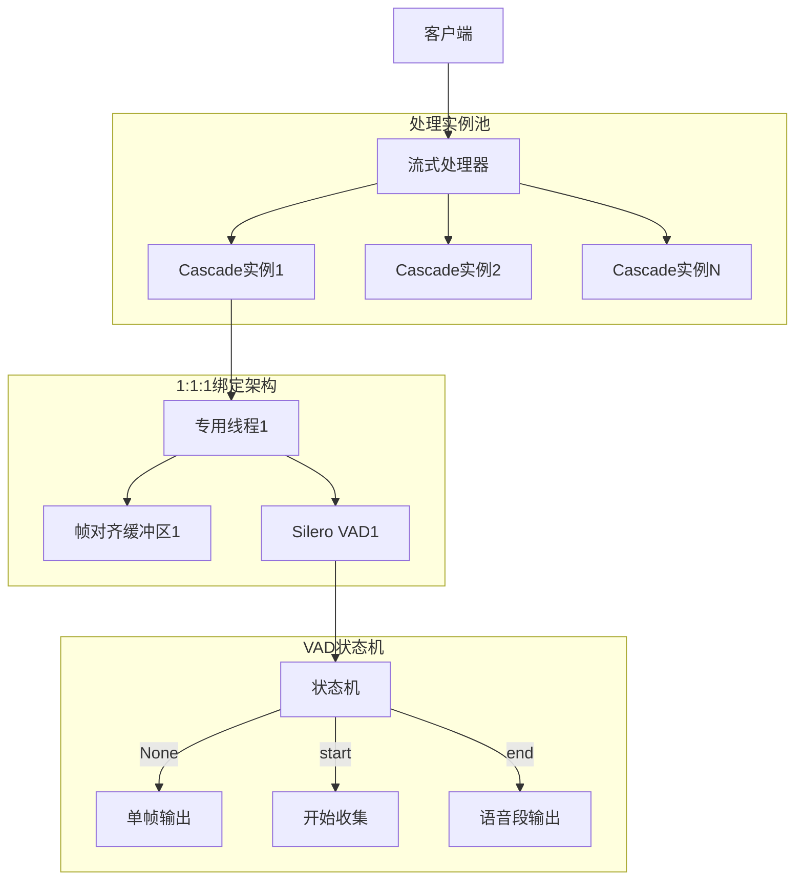
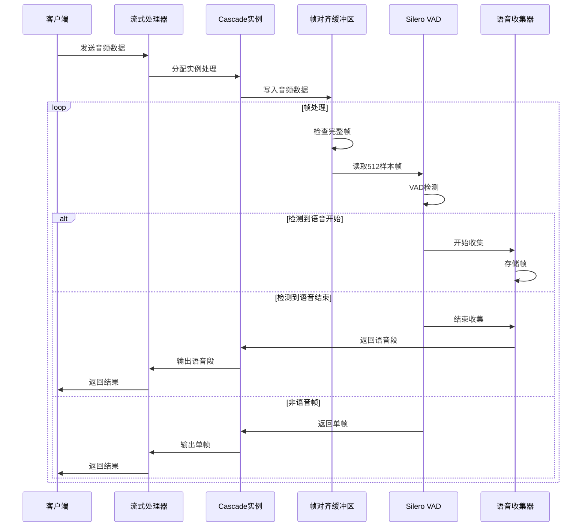

[English](./README.md)
# Cascade - 生产级高性能异步并行VAD处理库

[](https://python.org)
[](LICENSE)
[](https://github.com/xucailiang/cascade)
[](https://github.com/snakers4/silero-vad)
[](https://github.com/xucailiang/cascade)
[](https://github.com/xucailiang/cascade)

Cascade是一个专为语音活动检测(VAD)设计的**生产级**、**高性能**、**低延迟**音频流处理库。基于优秀的[Silero VAD](https://github.com/snakers4/silero-vad)模型，通过**1:1:1绑定架构**和**异步流式处理技术**，显著降低VAD处理延迟，同时保证检测结果的准确性。

## 📊 性能指标

基于最新测试结果的性能指标：

| 指标 | 数值 | 说明 |
|------|------|------|
| **处理速度** | 2430.3 fps | 平均每秒处理帧数 |
| **延迟** | 29.04ms | 平均处理延迟 |
| **内存使用** | 471.1MB | 平均内存占用 |
| **成功率** | 100% | 处理成功率 |
| **准确性** | 高 | 基于Silero VAD，保证检测准确性 |

详细的性能测试报告请参见：[性能测试报告](performance_tests/performance_test_report.md)。

## ✨ 核心特性

### 🚀 高性能特性

- **无锁设计**：1:1:1绑定架构消除锁竞争，提升性能
- **帧对齐缓冲区**：专为512样本帧优化的高效缓冲区
- **异步流式处理**：基于asyncio的非阻塞音频流处理
- **内存优化**：零拷贝设计、对象池复用、缓存对齐
- **并发优化**：专用线程、异步队列、批量处理

### 🔧 工程化特性

- **模块化设计**：高内聚低耦合的组件架构
- **接口抽象**：基于接口的依赖倒置设计
- **类型系统**：使用pydantic进行数据验证和类型检查
- **完整测试**：单元测试、集成测试、性能测试
- **代码规范**：符合PEP 8的代码风格

### 🛡️ 生产化特性

- **错误处理**：完善的错误处理和恢复机制
- **资源管理**：自动清理和优雅关闭
- **监控指标**：实时性能监控和统计
- **可扩展性**：通过实例数量水平扩展
- **稳定性保障**：边界条件处理和异常情况恢复

## 🏗️ 架构设计

Cascade采用**1:1:1绑定架构**，确保最佳性能和资源利用：



### 核心组件交互流程



## 🔍 性能优化策略

### 1. 无锁设计 (1:1:1架构)

每个Cascade实例拥有专属的线程、缓冲区和VAD模型，完全避免了锁竞争：

```python
# 无锁设计示例
class CascadeInstance:
    def __init__(self):
        # 1:1:1绑定：一个实例一个缓冲区、一个线程、一个VAD
        self.frame_buffer = FrameAlignedBuffer()  # 专属缓冲区
        self.vad_iterator = VADIterator(model)    # 专属VAD模型
        self.speech_collector = SpeechCollector() # 专属收集器
```

### 2. 帧对齐缓冲区

专门针对512样本帧优化的高效缓冲区，避免了复杂的重叠处理：

```python
# 帧对齐缓冲区示例
def read_frame(self) -> Optional[bytes]:
    """读取一个完整的512样本帧"""
    if not self.has_complete_frame():
        return None
    
    # 提取512样本帧
    frame_data = bytes(self._buffer[:self._frame_size_bytes])
    
    # 从缓冲区移除已读取的数据
    self._buffer = self._buffer[self._frame_size_bytes:]
    
    return frame_data
```

### 3. 内存优化

使用bytearray和零拷贝设计，减少内存分配和数据复制：

```python
# 内存优化示例
def write(self, audio_data: bytes) -> None:
    """写入音频数据到缓冲区"""
    self._buffer.extend(audio_data)  # 直接扩展，避免复制
```

## 🚀 快速开始

### 安装

```bash
# 建议使用uv
uv venv -p 3.12

source .venv/bin/activate

# 从PyPI安装（推荐）
pip install cascade-vad

# 或从源码安装
git clone https://github.com/xucailiang/cascade.git
cd cascade
pip install -e .
```

### 基础使用

```python
import cascade
import asyncio

async def basic_example():
    """基础使用示例"""
    
    # 方式1：最简单的文件处理
    async for result in cascade.process_audio_file("audio.wav"):
        if result.result_type == "segment":
            segment = result.segment
            print(f"🎤 语音段: {segment.start_timestamp_ms:.0f}ms - {segment.end_timestamp_ms:.0f}ms")
        else:
            frame = result.frame
            print(f"🔇 单帧: {frame.timestamp_ms:.0f}ms")
    
    # 方式2：流式处理
    async with cascade.StreamProcessor() as processor:
        async for result in processor.process_stream(audio_stream):
            if result.result_type == "segment":
                segment = result.segment
                print(f"🎤 语音段: {segment.start_timestamp_ms:.0f}ms - {segment.end_timestamp_ms:.0f}ms")
            else:
                frame = result.frame
                print(f"🔇 单帧: {frame.timestamp_ms:.0f}ms")

asyncio.run(basic_example())
```

### 高级配置

```python
from cascade.stream import StreamProcessor, create_default_config

async def advanced_example():
    """高级配置示例"""
    
    # 自定义配置
    config = create_default_config(
        vad_threshold=0.7,          # 较高的检测阈值
        max_instances=3,            # 最多3个并发实例
        buffer_size_frames=128      # 较大缓冲区
    )
    
    # 使用自定义配置
    async with StreamProcessor(config) as processor:
        # 处理音频流
        async for result in processor.process_stream(audio_stream, "my-stream"):
            # 处理结果...
            pass
        
        # 获取性能统计
        stats = processor.get_stats()
        print(f"处理统计: {stats.summary()}")
        print(f"吞吐量: {stats.throughput_chunks_per_second:.1f} 块/秒")

asyncio.run(advanced_example())
```


## 🧪 测试脚本

```bash
# 运行基础集成测试
python tests/test_simple_vad.py -v

# 运行模拟流式音频测试
python tests/test_stream_vad.py -v

# 运行性能基准测试
python tests/benchmark_performance.py
```

测试覆盖：
- ✅ 基础API使用
- ✅ 流式处理功能
- ✅ 文件处理功能
- ✅ 真实音频VAD检测
- ✅ 语音段自动保存
- ✅ 1:1:1架构验证
- ✅ 性能基准测试
- ✅ FrameAlignedBuffer测试

## 🔧 生产环境部署

### 部署最佳实践

1. **资源配置**
   - 每个实例约占用50MB内存
   - 建议每个CPU核心运行2-3个实例
   - 监控内存使用，避免OOM

2. **性能调优**
   - 调整`max_instances`匹配服务器CPU核心数
   - 增大`buffer_size_frames`提高吞吐量
   - 根据需求调整`vad_threshold`平衡准确率和灵敏度

3. **错误处理**
   - 实现重试机制处理临时错误
   - 使用健康检查监控服务状态
   - 记录详细日志便于问题排查

### 监控指标

```python
# 获取性能监控指标
stats = processor.get_stats()

# 关键监控指标
print(f"活跃实例数: {stats.active_instances}/{stats.total_instances}")
print(f"平均处理时间: {stats.average_processing_time_ms}ms")
print(f"处理成功率: {stats.success_rate:.2%}")
print(f"内存使用: {stats.memory_usage_mb:.1f}MB")
```

## 🔧 依赖要求

### 核心依赖

- **Python**: 3.12(推荐)
- **pydantic**: 2.4.0+ (数据验证)
- **numpy**: 1.24.0+ (数值计算)
- **scipy**: 1.11.0+ (信号处理)
- **silero-vad**: 5.1.2+ (VAD模型)
- **onnxruntime**: 1.22.1+ (ONNX推理)
- **torchaudio**: 2.7.1+ (音频处理)

### 开发依赖

- **pytest**: 测试框架
- **black**: 代码格式化
- **ruff**: 代码检查
- **mypy**: 类型检查
- **pre-commit**: Git钩子

## 🤝 贡献指南

我们欢迎社区贡献！请遵循以下步骤：

1. **Fork项目**并创建特性分支
2. **安装开发依赖**: `pip install -e .[dev]`
3. **运行测试**: `pytest`
4. **代码检查**: `ruff check . && black --check .`
5. **类型检查**: `mypy cascade`
6. **提交PR**并描述变更

### 开发环境设置

```bash
# 克隆项目
git clone https://github.com/xucailiang/cascade.git
cd cascade

# 创建虚拟环境
python -m venv venv
source venv/bin/activate  # Linux/Mac
# 或 venv\Scripts\activate  # Windows

# 安装开发依赖
pip install -e .

# 安装pre-commit钩子
pre-commit install

# 运行测试
python -m pytest tests/ -v

# 运行性能测试
python tests/benchmark_performance.py
```

## 📄 许可证

本项目采用MIT许可证 - 详见 [LICENSE](LICENSE) 文件。

## 🙏 致谢

- **Silero Team**: 提供优秀的VAD模型
- **PyTorch Team**: 深度学习框架支持
- **Pydantic Team**: 类型验证系统
- **Python社区**: 丰富的生态系统

## 📞 联系方式

- **作者**: Xucailiang
- **邮箱**: xucailiang.ai@gmail.com
- **项目主页**: https://github.com/xucailiang/cascade
- **问题反馈**: https://github.com/xucailiang/cascade/issues
- **文档**: https://cascade-vad.readthedocs.io/

## 🗺️ 路线图

### v0.2.0 (计划中)
- [ ] 支持更多音频格式 (MP3, FLAC)
- [ ] 实时麦克风输入支持
- [ ] WebSocket API接口
- [ ] 性能优化和内存减少

### v0.3.0 (计划中)
- [ ] 多语言VAD模型支持
- [ ] 语音分离和增强
- [ ] 云端部署支持
- [ ] 可视化监控界面

---

**⭐ 如果这个项目对您有帮助，请给我们一个Star！**
