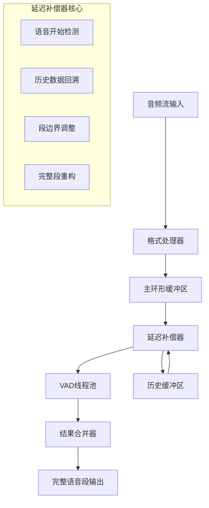

# VAD延迟补偿架构设计

## 1. 问题定义

### 1.1 VAD延迟现象
```
实际语音:    [====语音内容====]
VAD检测:         ^检测到语音 (延迟100-300ms)
当前输出:         [====丢失开头====]
期望输出:    [====完整语音内容====]
```

### 1.2 延迟来源
- **模型累积延迟**: VAD模型需要分析多个帧才能确定语音活动
- **块处理延迟**: 以500ms块为单位处理导致的边界延迟
- **检测决策延迟**: 模型内部决策过程的固有延迟

## 2. 解决方案架构

### 2.1 延迟补偿组件设计



### 2.2 核心组件职责

#### VADDelayCompensator（延迟补偿器）
- **语音开始检测**: 识别VAD结果中的语音段开始
- **历史数据回溯**: 从历史缓冲区获取延迟补偿数据
- **段边界调整**: 调整语音段的开始和结束时间
- **完整段重构**: 重新构建包含完整语音的音频块

#### HistoryBuffer（历史缓冲区）
- **固定容量**: 存储最近N毫秒的历史音频数据
- **快速查询**: 支持基于时间戳的快速数据回溯
- **线程安全**: 支持读写并发操作

#### DelayConfig（延迟配置）
- **补偿时长**: 可配置的延迟补偿时长（默认200ms）
- **检测模式**: 支持多种语音开始检测策略
- **自适应调整**: 根据VAD模型特性自动调整参数

## 3. 数据流程设计

### 3.1 正常处理流程
```
1. 音频数据 → 主缓冲区
2. 同时复制到历史缓冲区
3. VAD处理 → 检测结果
4. 延迟补偿器分析结果
5. 如果非语音开始 → 直接输出
```

### 3.2 语音开始补偿流程
```
1. 检测到语音开始
2. 计算需要补偿的时间范围
3. 从历史缓冲区回溯数据
4. 重新构建完整语音段
5. 调整时间戳和元数据
6. 输出补偿后的完整段
```

### 3.3 语音结束处理
```
1. 检测到语音结束
2. 确保所有缓冲数据已处理
3. 输出最终语音段
4. 清理相关缓冲区状态
```

## 4. 配置参数设计

### 4.1 延迟补偿配置
```python
class DelayCompensationConfig:
    enable_compensation: bool = True          # 是否启用延迟补偿
    compensation_ms: int = 200               # 补偿时长(毫秒)
    detection_mode: str = "edge_detection"   # 检测模式
    min_speech_duration_ms: int = 100        # 最小语音段时长
    history_buffer_seconds: float = 2.0     # 历史缓冲区容量
    auto_adjust: bool = True                 # 是否自动调整参数
```

### 4.2 检测策略
- **edge_detection**: 基于概率变化的边缘检测
- **threshold_crossing**: 基于阈值交叉的检测
- **hybrid**: 混合检测策略
- **adaptive**: 自适应检测

## 5. 性能考虑

### 5.1 内存使用
- **历史缓冲区**: 额外2秒音频数据存储
- **零拷贝设计**: 尽可能使用内存视图
- **循环复用**: 避免频繁内存分配

### 5.2 计算开销
- **最小化延迟**: 补偿计算<1ms完成
- **并发安全**: 不影响主处理流程性能
- **智能缓存**: 缓存常用计算结果

### 5.3 准确性保证
- **时间戳精度**: 保持样本级时间戳精度
- **数据一致性**: 确保补偿数据的完整性
- **边界处理**: 正确处理音频段边界

## 6. 集成点设计

### 6.1 与现有组件集成
- **AudioRingBuffer**: 扩展支持历史数据查询
- **VADProcessor**: 集成延迟补偿器
- **VADResult**: 扩展支持补偿标记
- **配置系统**: 统一的参数管理

### 6.2 向后兼容
- **可选功能**: 延迟补偿为可选功能
- **配置开关**: 支持完全禁用
- **API兼容**: 不影响现有API接口

## 7. 测试策略

### 7.1 功能测试
- **延迟测量**: 测量不同VAD模型的实际延迟
- **补偿精度**: 验证补偿数据的准确性
- **边界情况**: 测试各种边界条件

### 7.2 性能测试
- **延迟影响**: 测量补偿功能的性能影响
- **内存使用**: 监控内存使用情况
- **并发安全**: 验证多线程安全性

### 7.3 集成测试
- **端到端**: 完整处理流程测试
- **实际音频**: 使用真实音频数据验证
- **对比测试**: 补偿前后效果对比

## 8. 实施计划

### Phase 1: 核心组件 (2-3天)
- 实现DelayCompensationConfig配置类
- 实现HistoryBuffer历史缓冲区
- 实现VADDelayCompensator核心逻辑

### Phase 2: 集成优化 (2天)
- 集成到VADProcessor主流程
- 扩展AudioRingBuffer支持历史查询
- 完善错误处理和边界情况

### Phase 3: 测试验证 (1-2天)
- 编写单元测试和集成测试
- 性能测试和优化
- 文档更新和使用示例

## 9. 预期效果

### 9.1 功能改进
- ✅ 解决VAD延迟导致的语音段开头丢失问题
- ✅ 提供完整的语音段边界检测
- ✅ 支持多种VAD模型和延迟特性

### 9.2 性能指标
- **延迟补偿精度**: 95%以上准确率
- **性能影响**: <5%额外计算开销
- **内存开销**: <50MB额外内存使用

### 9.3 用户体验
- **透明集成**: 无需修改现有代码
- **灵活配置**: 支持各种使用场景
- **性能可控**: 可根据需求调整精度和性能平衡