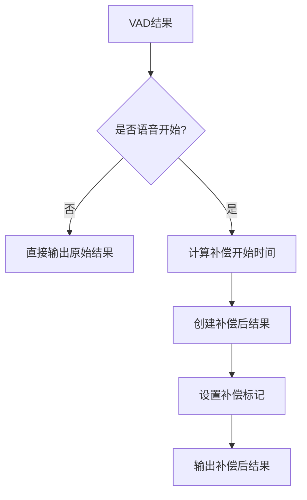

# VAD延迟补偿简化实现方案

## 🎯 设计原则

1. **最小侵入**：在现有配置类中添加字段，不破坏核心流程
2. **固定补偿**：使用固定时长的延迟补偿，简单可靠
3. **流式兼容**：完全兼容现有的流式处理机制
4. **零拷贝**：利用现有缓冲区，不增加内存开销
5. **性能优先**：补偿逻辑<1ms完成，不影响实时性

## 🏗️ 核心设计

### 1. 配置扩展（最小修改）

```python
# 在 VADConfig 中添加延迟补偿字段
class VADConfig(BaseModel):
    # ... 现有字段 ...
    
    # 延迟补偿配置
    compensation_ms: int = Field(
        default=0,  # 默认关闭
        description="语音开始延迟补偿时长（毫秒），0表示关闭",
        ge=0,
        le=500  # 最大500ms
    )

# 在 VADResult 中添加补偿标记
class VADResult(BaseModel):
    # ... 现有字段 ...
    
    # 补偿标记
    is_compensated: bool = Field(
        default=False,
        description="是否为延迟补偿后的结果"
    )
    original_start_ms: Optional[float] = Field(
        default=None,
        description="补偿前的原始开始时间"
    )
```

### 2. 简化补偿逻辑

```python
class SimpleDelayCompensator:
    """简化的延迟补偿器"""
    
    def __init__(self, compensation_ms: int):
        self.compensation_ms = compensation_ms
        self.enabled = compensation_ms > 0
        self.previous_is_speech = False
        
    def process_result(self, vad_result: VADResult) -> VADResult:
        """处理VAD结果，返回补偿后的结果"""
        if not self.enabled:
            return vad_result
            
        # 检测语音开始（简单阈值交叉）
        speech_started = (not self.previous_is_speech and 
                         vad_result.is_speech)
        
        self.previous_is_speech = vad_result.is_speech
        
        if speech_started:
            # 语音开始，应用延迟补偿
            compensated_result = vad_result.model_copy()
            compensated_result.original_start_ms = vad_result.start_ms
            compensated_result.start_ms = max(0, 
                vad_result.start_ms - self.compensation_ms)
            compensated_result.is_compensated = True
            return compensated_result
        
        return vad_result
```

### 3. 集成到现有流程

```python
class VADProcessor:
    def __init__(self, config: VADProcessorConfig):
        # ... 现有初始化 ...
        
        # 简化的延迟补偿器
        self._delay_compensator = SimpleDelayCompensator(
            config.vad_config.compensation_ms
        ) if config.vad_config.compensation_ms > 0 else None
    
    async def _process_audio_chunk(self, audio_data: np.ndarray) -> None:
        """现有处理逻辑，最小修改"""
        # ... 现有处理步骤 1-4 不变 ...
        
        # 5. VAD处理
        vad_result = await self._thread_pool.process_chunk_async(chunk)
        
        # 6. 延迟补偿（仅添加这一步）
        if self._delay_compensator:
            vad_result = self._delay_compensator.process_result(vad_result)
        
        # 7. 输出结果（现有逻辑不变）
        await self._result_queue.put(vad_result)
```

## 🔄 工作流程

### 正常处理流程（无变化）
```
音频输入 → 格式处理 → 环形缓冲区 → VAD处理 → 结果输出
```

### 延迟补偿流程（微修改）
```
音频输入 → 格式处理 → 环形缓冲区 → VAD处理 → 补偿器 → 结果输出
                                              ↑
                                        仅调整时间戳
```

### 语音开始检测与补偿


## 📊 补偿效果示例

### 补偿前
```
真实语音:  [=====语音内容=====]
VAD检测:       ^检测到语音(200ms延迟)
输出时间:       |------500ms------|
结果:          [===丢失开头===]
```

### 补偿后（compensation_ms=200）
```
真实语音:  [=====语音内容=====]
VAD检测:       ^检测到语音
补偿调整:  <-200ms
输出时间:  |------500ms------|
结果:      [===完整语音内容===]
```

## 🚀 实现步骤

### Phase 1: 类型扩展（10分钟）
1. 在 `VADConfig` 中添加 `compensation_ms` 字段
2. 在 `VADResult` 中添加补偿相关字段
3. 更新类型导出

### Phase 2: 补偿器实现（20分钟）
1. 实现 `SimpleDelayCompensator` 类
2. 添加到 `VADProcessor` 初始化
3. 集成到处理流程

### Phase 3: 测试验证（15分钟）
1. 编写基础单元测试
2. 验证补偿效果
3. 性能影响评估

## 🎯 预期效果

### 配置示例
```python
# 启用200ms延迟补偿
vad_config = VADConfig(
    backend="silero",
    threshold=0.5,
    compensation_ms=200  # 关键配置
)
```

### 结果示例
```python
# 补偿前的VAD结果
VADResult(
    is_speech=True,
    start_ms=1200.0,
    end_ms=1700.0,
    is_compensated=False
)

# 补偿后的VAD结果
VADResult(
    is_speech=True,
    start_ms=1000.0,      # 补偿200ms
    end_ms=1700.0,
    is_compensated=True,
    original_start_ms=1200.0
)
```

## ✅ 方案优势

1. **极简实现**：核心代码<50行
2. **零破坏**：现有流程完全不受影响
3. **高性能**：仅增加简单的时间戳计算
4. **易配置**：一个参数控制所有行为
5. **向后兼容**：默认关闭，不影响现有用户
6. **流式友好**：完全兼容实时流式处理
7. **内存友好**：不需要额外缓冲区

## 🔧 技术细节

### 语音开始检测
- 使用最简单的阈值交叉检测
- 状态：`previous_is_speech` → `current_is_speech`
- 触发条件：`False` → `True`

### 时间戳调整
- 公式：`compensated_start = original_start - compensation_ms`
- 边界处理：`max(0, compensated_start)` 避免负时间戳
- 保留原始时间戳用于调试和分析

### 流程集成
- 在VAD结果输出前插入补偿逻辑
- 不修改音频数据，仅调整元数据
- 保持原有的异步处理模式

这个方案将延迟补偿的复杂度降到最低，同时保持高效和实用性。