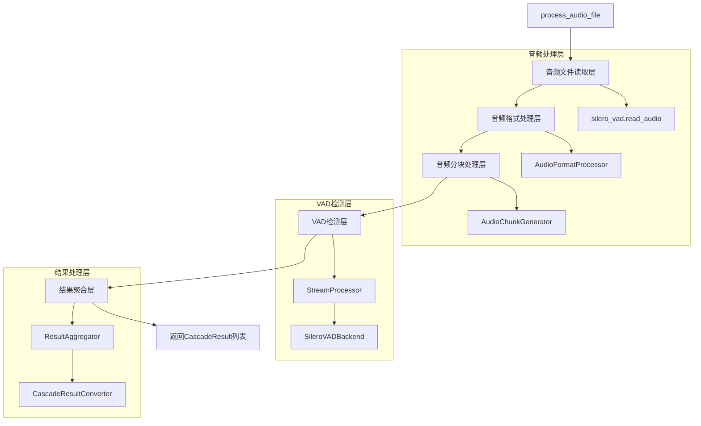
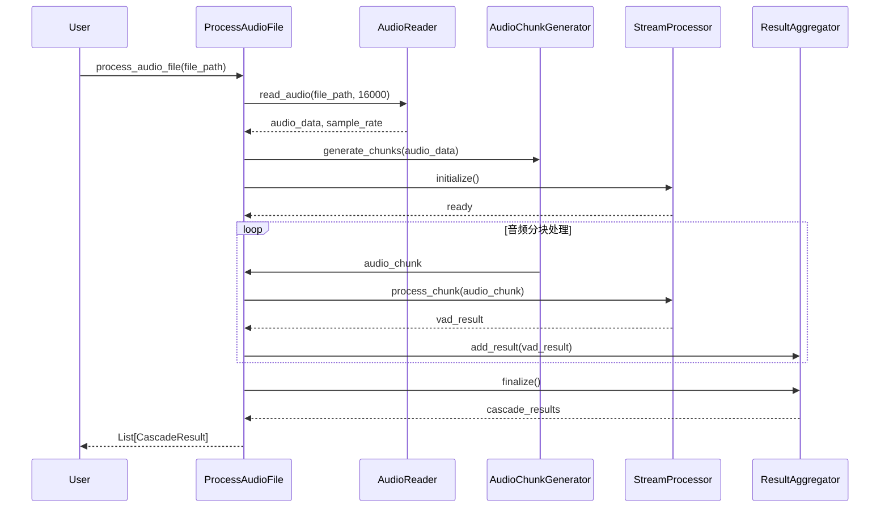

# 音频文件处理实现设计文档

## ▮ 概述

本文档设计了 `cascade.process_audio_file()` 函数的完整实现方案，替换当前的模拟实现，提供真正的音频文件处理能力。

## ▮ 需求分析

### 当前问题
- `cascade/__init__.py` 中的 `process_audio_file()` 函数只是模拟实现
- 缺少真正的音频文件读取和处理逻辑
- 需要集成 Silero VAD 进行实际的语音活动检测

### 目标功能
1. **音频文件读取** - 支持 WAV 格式音频文件
2. **音频格式转换** - 转换为 Silero VAD 要求的格式
3. **音频分块处理** - 按照 512 样本（16kHz）进行分块
4. **VAD 检测** - 使用现有的 StreamProcessor 进行检测
5. **结果聚合** - 将检测结果转换为 CascadeResult 列表

## ▮ 系统架构设计

### 整体架构图



### 时序图



## ▮ 核心组件设计

### 1. 音频文件读取器 (AudioFileReader)

```python
class AudioFileReader:
    """音频文件读取器，基于 silero-vad 的 read_audio 函数"""
    
    @staticmethod
    def read_audio_file(file_path: str, target_sample_rate: int = 16000) -> tuple[np.ndarray, int]:
        """
        读取音频文件
        
        Args:
            file_path: 音频文件路径
            target_sample_rate: 目标采样率
            
        Returns:
            (audio_data, sample_rate): 音频数据和采样率
        """
```

### 2. 音频分块生成器 (AudioChunkGenerator)

```python
class AudioChunkGenerator:
    """音频分块生成器，按照 Silero VAD 要求生成固定大小的音频块"""
    
    def __init__(self, sample_rate: int = 16000):
        self.sample_rate = sample_rate
        self.chunk_size = 512 if sample_rate == 16000 else 256
        
    def generate_chunks(self, audio_data: np.ndarray) -> Iterator[AudioChunk]:
        """
        生成音频块
        
        Args:
            audio_data: 完整的音频数据
            
        Yields:
            AudioChunk: 音频数据块
        """
```

### 3. 结果聚合器 (ResultAggregator)

```python
class ResultAggregator:
    """VAD结果聚合器，将VAD检测结果转换为CascadeResult"""
    
    def __init__(self):
        self.results: List[VADResult] = []
        self.speech_segments: List[CascadeResult] = []
        
    def add_vad_result(self, vad_result: VADResult) -> None:
        """添加VAD检测结果"""
        
    def finalize(self) -> List[CascadeResult]:
        """完成处理并返回最终结果"""
```

## ▮ 实现方案

### 核心函数重构

#### 需要改造的函数
- `process_audio_file()` - 完全重写，实现真正的音频处理逻辑

#### 需要新增的函数
- `_read_audio_file()` - 音频文件读取
- `_generate_audio_chunks()` - 音频分块生成
- `_process_chunks_with_vad()` - VAD批量处理
- `_aggregate_vad_results()` - 结果聚合
- `_convert_to_cascade_results()` - 结果格式转换

#### 需要删除的函数
- 无（当前的模拟实现将被替换）

### 详细实现逻辑

#### 1. 音频文件读取
```python
def _read_audio_file(file_path: str, target_sample_rate: int = 16000) -> tuple[np.ndarray, int]:
    """
    使用 silero-vad 的 read_audio 函数读取音频文件
    
    实现要点：
    - 使用 silero_vad.read_audio() 函数
    - 自动处理采样率转换
    - 支持常见音频格式（WAV, MP3等）
    - 错误处理和验证
    """
    try:
        from silero_vad import read_audio
        audio_data = read_audio(file_path, sampling_rate=target_sample_rate)
        return audio_data, target_sample_rate
    except ImportError:
        raise CascadeError("silero-vad 包未安装", ErrorCode.BACKEND_UNAVAILABLE)
    except Exception as e:
        raise AudioFormatError(f"音频文件读取失败: {e}")
```

#### 2. 音频分块处理
```python
def _generate_audio_chunks(audio_data: np.ndarray, sample_rate: int) -> Iterator[AudioChunk]:
    """
    生成符合 Silero VAD 要求的音频块
    
    实现要点：
    - 16kHz: 512样本/块 (32ms)
    - 8kHz: 256样本/块 (32ms)
    - 生成 AudioChunk 对象
    - 包含时间戳和序列号
    """
    chunk_size = 512 if sample_rate == 16000 else 256
    
    for i in range(0, len(audio_data), chunk_size):
        chunk_data = audio_data[i:i + chunk_size]
        
        # 如果最后一块不足，进行零填充
        if len(chunk_data) < chunk_size:
            padded_chunk = np.zeros(chunk_size, dtype=np.float32)
            padded_chunk[:len(chunk_data)] = chunk_data
            chunk_data = padded_chunk
            
        yield AudioChunk(
            data=chunk_data,
            sequence_number=i // chunk_size,
            start_frame=i,
            chunk_size=chunk_size,
            timestamp_ms=i * 1000.0 / sample_rate,
            sample_rate=sample_rate,
            is_last=(i + chunk_size >= len(audio_data))
        )
```

#### 3. VAD检测处理
```python
async def _process_chunks_with_vad(
    chunks: Iterator[AudioChunk], 
    processor: StreamProcessor
) -> List[VADResult]:
    """
    使用VAD处理器处理音频块
    
    实现要点：
    - 异步处理音频块
    - 错误处理和重试
    - 进度跟踪
    """
    results = []
    
    for chunk in chunks:
        try:
            # 使用现有的StreamProcessor处理
            vad_result = await processor.process_chunk(chunk)
            results.append(vad_result)
        except Exception as e:
            # 记录错误但继续处理
            logger.warning(f"处理音频块 {chunk.sequence_number} 失败: {e}")
            
    return results
```

#### 4. 结果聚合转换
```python
def _convert_to_cascade_results(vad_results: List[VADResult]) -> List[CascadeResult]:
    """
    将VAD结果转换为CascadeResult格式
    
    实现要点：
    - 检测语音段边界
    - 合并连续的语音块
    - 生成语音段和单帧结果
    - 符合CascadeResult规范
    """
    cascade_results = []
    current_segment = None
    
    for vad_result in vad_results:
        if vad_result.is_speech:
            if current_segment is None:
                # 开始新的语音段
                current_segment = _start_speech_segment(vad_result)
            else:
                # 继续当前语音段
                _extend_speech_segment(current_segment, vad_result)
        else:
            if current_segment is not None:
                # 结束当前语音段
                cascade_results.append(_finalize_speech_segment(current_segment))
                current_segment = None
            
            # 添加单帧结果
            cascade_results.append(_create_frame_result(vad_result))
    
    # 处理最后的语音段
    if current_segment is not None:
        cascade_results.append(_finalize_speech_segment(current_segment))
    
    return cascade_results
```

### 完整的 process_audio_file 实现

```python
async def process_audio_file(file_path: str, backend_type: str = "silero", **kwargs) -> List[CascadeResult]:
    """
    处理音频文件的完整实现
    
    Args:
        file_path: 音频文件路径
        backend_type: VAD后端类型，默认使用 "silero"
        **kwargs: VAD配置参数
        
    Returns:
        List[CascadeResult]: VAD检测结果列表
        
    Raises:
        AudioFormatError: 音频格式错误
        VADProcessingError: VAD处理错误
        CascadeError: 其他处理错误
    """
    # 1. 参数验证
    if not os.path.exists(file_path):
        raise AudioFormatError(f"音频文件不存在: {file_path}")
    
    # 2. 创建VAD处理器
    processor = create_vad_processor(backend_type=backend_type, **kwargs)
    
    try:
        # 3. 初始化处理器
        await processor.initialize()
        
        # 4. 读取音频文件
        audio_data, sample_rate = _read_audio_file(file_path, target_sample_rate=16000)
        
        # 5. 生成音频块
        chunks = list(_generate_audio_chunks(audio_data, sample_rate))
        
        # 6. VAD检测处理
        vad_results = []
        for chunk in chunks:
            vad_result = await processor.process_chunk(chunk)
            vad_results.append(vad_result)
        
        # 7. 结果聚合转换
        cascade_results = _convert_to_cascade_results(vad_results)
        
        # 8. 统计信息
        speech_segments = [r for r in cascade_results if r.is_speech_segment]
        print(f"音频文件处理完成: {file_path}")
        print(f"总时长: {len(audio_data) / sample_rate:.2f}秒")
        print(f"检测到 {len(speech_segments)} 个语音段")
        
        return cascade_results
        
    finally:
        # 9. 清理资源
        await processor.close()
```

## ▮ 错误处理策略

### 错误类型和处理
1. **文件不存在** - 抛出 `AudioFormatError`
2. **音频格式不支持** - 抛出 `AudioFormatError`
3. **VAD处理失败** - 抛出 `VADProcessingError`
4. **内存不足** - 抛出 `CascadeError`
5. **依赖缺失** - 抛出 `CascadeError` with `BACKEND_UNAVAILABLE`

### 容错机制
- 单个音频块处理失败时继续处理其他块
- 提供详细的错误上下文信息
- 支持部分结果返回

## ▮ 性能优化

### 内存优化
- 流式处理音频块，避免加载整个文件到内存
- 及时释放处理完的音频数据
- 使用生成器减少内存占用

### 处理优化
- 批量处理音频块
- 异步处理提高并发性能
- 缓存VAD模型避免重复加载

## ▮ 测试策略

### 单元测试
- 音频文件读取测试
- 音频分块生成测试
- VAD结果聚合测试
- 错误处理测试

### 集成测试
- 完整音频文件处理流程测试
- 不同音频格式兼容性测试
- 性能基准测试

### 测试用例
1. **正常情况** - 标准WAV文件处理
2. **边界情况** - 空文件、超大文件、损坏文件
3. **错误情况** - 文件不存在、格式不支持、权限问题

## ▮ 实施计划

### 阶段1：核心功能实现
- [ ] 实现 `_read_audio_file()` 函数
- [ ] 实现 `_generate_audio_chunks()` 函数
- [ ] 实现 `_convert_to_cascade_results()` 函数

### 阶段2：集成和优化
- [ ] 重写 `process_audio_file()` 函数
- [ ] 添加错误处理和验证
- [ ] 性能优化和内存管理

### 阶段3：测试和验证
- [ ] 编写单元测试
- [ ] 集成测试验证
- [ ] 性能基准测试

## ▮ 依赖关系

### 必需依赖
- `silero-vad` - 音频读取和VAD模型
- `numpy` - 音频数据处理
- `torch` - Silero VAD 后端支持

### 内部依赖
- `cascade.stream.StreamProcessor` - VAD处理器
- `cascade.types.AudioChunk` - 音频块类型
- `cascade.types.VADResult` - VAD结果类型
- `cascade.stream.types.CascadeResult` - 输出结果类型

## ▮ 总结

本设计文档提供了完整的音频文件处理实现方案，将现有的模拟实现替换为真正的音频处理功能。通过模块化设计、完善的错误处理和性能优化，确保系统的可靠性和高性能。

实现后，用户将能够：
- 处理真实的音频文件
- 获得准确的VAD检测结果
- 享受高性能的处理体验
- 获得详细的错误信息和调试支持