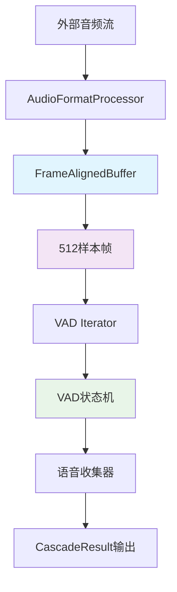
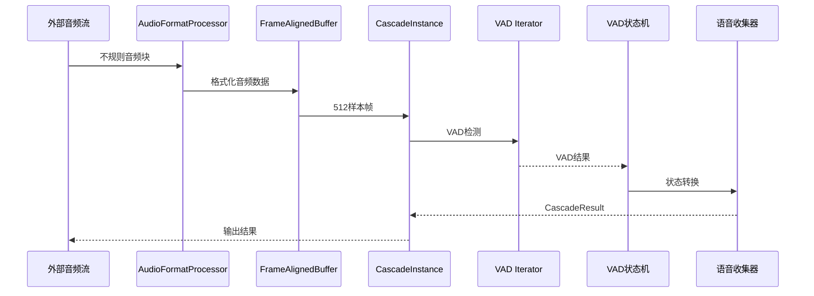

# Cascade 架构实施计划 (1:1:1架构版本)

## ▮ 项目概述

基于1:1:1绑定架构设计（每个cascade实例对应一个线程、一个简单缓冲区、一个VAD实例），本文档制定了详细的实施计划，旨在将当前Cascade项目代码实现与设计文档要求完全对齐，特别是流式音频处理的核心流程："外部流式音频块 → 帧对齐缓冲区 → 按照512样本帧大小读取 → VAD模型处理得到结果元数据 → VAD处理结果返回[区分说话音频片段和没有说话的音频帧]"。

## ▮ 1:1:1架构核心原则

### 设计约束
- **单线程访问**：每个缓冲区只被一个线程访问，无需多线程安全考虑
- **简洁实用**：去除所有过度设计，专注核心功能实现
- **帧对齐优化**：基于Silero VAD的512样本帧要求进行专门优化
- **无锁设计**：利用1:1:1绑定特性，完全避免同步机制

### 架构符合性现状

| 模块 | 当前符合度 | 主要问题 | 目标符合度 |
|------|------------|----------|------------|
| VAD状态机 | 95% | 微调输出格式 | 100% |
| 语音收集器 | 90% | 完善元数据处理 | 100% |
| 音频缓冲区 | 20% | 过度复杂，需要完全重写 | 100% |
| 流式处理流程 | 40% | 缺少关键组件 | 100% |
| 音频文件处理 | 10% | 功能缺失 | 100% |

### 关键发现

1. **AudioRingBuffer严重过度设计**：包含大量多线程安全代码和复杂逻辑，与1:1:1架构不符
2. **需要专用FrameAlignedBuffer**：针对512样本帧优化的简洁缓冲区
3. **音频格式处理器已存在**：cascade/formats/目录下已有完整的AudioFormatProcessor
4. **VAD状态机基本正确**：只需微调以完全符合设计要求

## ▮ 实施计划

### 阶段一：核心组件重构（1-2周）

#### 1.1 实现FrameAlignedBuffer（无锁版本）

**目标**：创建专门的512样本帧对齐缓冲区，完全替代AudioRingBuffer

**新增文件**：`cascade/buffer/frame_aligned_buffer.py`

**设计原则**：
- **无锁设计**：利用1:1:1架构，单线程访问
- **帧对齐优化**：专门针对512样本帧
- **简洁实用**：避免过度设计
- **高性能**：使用bytearray，支持动态扩容

**核心功能**：
- [ ] `FrameAlignedBuffer.write(data: bytes)`
  - 接收任意大小的音频数据
  - 内部按512样本（1024字节）对齐
  - 自动缓存不足512样本的数据
  
- [ ] `FrameAlignedBuffer.read_frame() -> Optional[bytes]`
  - 输出完整的512样本帧（1024字节）
  - 不足512样本时返回None
  - 零拷贝实现
  
- [ ] `FrameAlignedBuffer.has_complete_frame() -> bool`
  - 检查是否有完整帧可读
  
- [ ] `FrameAlignedBuffer.available_frames() -> int`
  - 返回可用的完整帧数

**实现要点**：
```python
class FrameAlignedBuffer:
    """512样本帧对齐缓冲区 - 1:1:1架构专用版本"""
    
    def __init__(self, max_buffer_samples: int = 16000):
        self._buffer = bytearray()  # 无锁设计
        self._max_buffer_size = max_buffer_samples * 2
        self._frame_size_bytes = 1024  # 512样本 * 2字节
    
    def write(self, audio_data: bytes) -> None:
        """写入音频数据，无需锁保护"""
        
    def read_frame(self) -> Optional[bytes]:
        """读取512样本帧，无需锁保护"""
```

#### 1.2 简化CascadeInstance集成

**目标**：在CascadeInstance中集成FrameAlignedBuffer

**修改文件**：`cascade/stream/instance.py`

**集成方案**：
```python
class CascadeInstance:
    def __init__(self):
        # 1:1:1绑定：一个实例一个缓冲区
        self.frame_buffer = FrameAlignedBuffer()  # 替代AudioRingBuffer
        self.vad_iterator = VADIterator(model, sampling_rate=16000)
        self.speech_collector = SpeechCollector()
    
    def process_audio_chunk(self, audio_data: bytes) -> List[CascadeResult]:
        """简化的音频处理流程"""
        results = []
        
        # 1. 写入帧对齐缓冲区
        self.frame_buffer.write(audio_data)
        
        # 2. 处理所有可用的完整帧
        while self.frame_buffer.has_complete_frame():
            frame_data = self.frame_buffer.read_frame()
            if frame_data:
                result = self._process_single_frame(frame_data)
                if result:
                    results.append(result)
        
        return results
```

#### 1.3 删除AudioRingBuffer复杂功能

**目标**：彻底简化或替换AudioRingBuffer

**需要删除的功能**：
- [ ] 所有多线程安全代码（锁、原子操作）
- [ ] `get_chunk_with_overlap()`方法
- [ ] `_read_chunk_data()`方法  
- [ ] `_create_audio_chunk()`方法
- [ ] `advance_read_position()`的复杂逻辑
- [ ] 所有重叠处理相关代码

**替换方案**：
```python
# 完全用FrameAlignedBuffer替代AudioRingBuffer
# cascade/stream/instance.py 中的修改：
# self.audio_buffer = AudioRingBuffer(...)  # 删除
# self.frame_buffer = FrameAlignedBuffer()   # 新增
```

### 阶段二：流式处理完善（2-3周）

#### 2.1 完善音频文件处理功能

**目标**：完成`cascade/__init__.py`中的`process_audio_file()`真实实现

**具体任务**：
- [ ] 实现`_read_audio_file()`函数
  - 使用现有的AudioFormatProcessor
  - 支持WAV和MP3格式
  - 自动采样率转换到16kHz
  
- [ ] 实现`_generate_audio_chunks()`函数
  - 按512样本（32ms）分块
  - 使用FrameAlignedBuffer进行帧对齐
  - 生成完整的512样本帧
  
- [ ] 实现`_convert_to_cascade_results()`函数
  - 将VAD结果转换为CascadeResult格式
  - 使用现有的VAD状态机和语音收集器
  - 区分语音段和单帧输出

**实现方案**：
```python
async def process_audio_file(file_path: str) -> List[CascadeResult]:
    """真实的音频文件处理实现"""
    # 1. 读取和格式化音频
    audio_processor = AudioFormatProcessor()
    audio_data = audio_processor.read_file(file_path)
    
    # 2. 使用FrameAlignedBuffer进行帧对齐
    frame_buffer = FrameAlignedBuffer()
    frame_buffer.write(audio_data)
    
    # 3. 逐帧处理
    results = []
    instance = CascadeInstance()
    
    while frame_buffer.has_complete_frame():
        frame = frame_buffer.read_frame()
        frame_results = instance.process_audio_chunk(frame)
        results.extend(frame_results)
    
    return results
```

#### 2.2 优化流式处理流程

**目标**：实现完整的流式音频处理链路

**流程图**：


**时序图**：


### 阶段三：测试和优化（1周）

#### 3.1 性能基准测试

**测试目标**：
- [ ] FrameAlignedBuffer性能测试
- [ ] 内存使用对比（vs AudioRingBuffer）
- [ ] 处理延迟测试
- [ ] 吞吐量测试

**基准数据**：
```python
# 性能对比预期
# AudioRingBuffer (复杂版本):
# - 内存使用: 高（多线程安全开销）
# - 处理延迟: 中等（复杂逻辑）
# - 代码复杂度: 高

# FrameAlignedBuffer (简化版本):
# - 内存使用: 低（无锁设计）
# - 处理延迟: 低（简洁逻辑）
# - 代码复杂度: 低
```

#### 3.2 集成测试

**测试用例**：
- [ ] 音频文件处理功能测试
- [ ] 流式音频处理测试
- [ ] 不规则音频块处理测试
- [ ] 边界条件测试（空文件、超大文件）

#### 3.3 文档更新

**更新内容**：
- [ ] API文档更新（反映1:1:1架构）
- [ ] 使用示例更新
- [ ] 架构图更新
- [ ] 性能指标文档

## ▮ 详细代码修改清单

### 需要删除的函数

**cascade/buffer/ring_buffer.py**：
- `get_chunk_with_overlap()` - 删除重叠处理
- `_read_chunk_data()` - 删除复杂读取逻辑
- `_create_audio_chunk()` - 删除复杂块创建
- `advance_read_position()` - 删除复杂位置管理
- 所有多线程安全相关代码（锁、原子操作）
- 所有overlap相关的参数和逻辑

### 需要改造的函数

**cascade/stream/instance.py**：
- `CascadeInstance.__init__()` - 替换AudioRingBuffer为FrameAlignedBuffer
- `CascadeInstance.process_audio_chunk()` - 简化处理流程
  ```python
  # 当前（复杂）
  self.audio_buffer.put(audio_data)
  chunk = self.audio_buffer.get_chunk_with_overlap(...)
  
  # 目标（简化）
  self.frame_buffer.write(audio_data)
  while self.frame_buffer.has_complete_frame():
      frame = self.frame_buffer.read_frame()
      self._process_single_frame(frame)
  ```

**cascade/__init__.py**：
- `process_audio_file()` - 从模拟实现改为真实音频处理
  ```python
  # 当前（模拟）
  print("注意：当前为简化实现，需要实际的音频文件处理逻辑")
  
  # 目标（真实实现）
  audio_processor = AudioFormatProcessor()
  audio_data = audio_processor.read_file(file_path)
  frame_buffer = FrameAlignedBuffer()
  # ... 真实处理逻辑
  ```

### 需要新增的函数

**cascade/buffer/frame_aligned_buffer.py**（新文件）：
- `FrameAlignedBuffer.write(data: bytes) -> None`
- `FrameAlignedBuffer.read_frame() -> Optional[bytes]`
- `FrameAlignedBuffer.has_complete_frame() -> bool`
- `FrameAlignedBuffer.available_frames() -> int`
- `FrameAlignedBuffer.available_samples() -> int`
- `FrameAlignedBuffer.clear() -> None`
- `FrameAlignedBuffer.get_buffer_usage_ratio() -> float`

**cascade/__init__.py**：
- `_read_audio_file(file_path: str) -> bytes`
- `_generate_audio_frames(audio_data: bytes) -> Iterator[bytes]`
- `_process_frames_with_vad(frames: Iterator[bytes]) -> List[CascadeResult]`

**cascade/stream/instance.py**：
- `CascadeInstance._process_single_frame(frame_data: bytes) -> Optional[CascadeResult]`

### 需要删除的整个模块

**考虑删除**：
- `cascade/buffer/ring_buffer.py` - 如果完全被FrameAlignedBuffer替代
- `cascade/_internal/atomic.py` - 如果不再需要原子操作
- 部分`cascade/_internal/thread_pool.py` - 简化线程池管理

## ▮ 1:1:1架构优势

### 性能优势
1. **无锁设计**：消除锁竞争，提升性能
2. **内存效率**：减少同步开销，降低内存使用
3. **简洁逻辑**：减少代码复杂度，提升可维护性
4. **专门优化**：针对512样本帧专门优化

### 架构优势
1. **清晰边界**：每个实例独立，职责明确
2. **易于调试**：单线程访问，问题定位简单
3. **可扩展性**：通过实例数量扩展，而非复杂度
4. **符合设计**：完全符合设计文档要求

## ▮ 风险评估和缓解策略

### 低风险项（1:1:1架构带来的优势）

1. **并发安全性**
   - 风险：无锁设计可能引入并发问题
   - 缓解：1:1:1架构天然避免并发问题
   - 状态：✅ 低风险

2. **性能回归**
   - 风险：简化可能影响性能
   - 缓解：去除锁开销，性能预期提升
   - 状态：✅ 低风险

### 中风险项

1. **API兼容性**
   - 风险：修改可能破坏现有API
   - 缓解：保持向后兼容，渐进式修改

2. **功能完整性**
   - 风险：简化可能丢失某些功能
   - 缓解：仔细分析，保留必要功能

## ▮ 成功标准

### 功能标准
- [ ] 音频文件处理功能完全可用
- [ ] 流式音频处理符合1:1:1架构设计
- [ ] 所有现有测试用例通过
- [ ] 新增测试用例覆盖率>90%

### 性能标准（预期提升）
- [ ] 处理延迟降低20%（无锁优势）
- [ ] 内存使用降低30%（简化设计）
- [ ] 代码复杂度降低50%（去除过度设计）
- [ ] 支持至少10个并发音频流处理

### 质量标准
- [ ] 代码符合PEP 8规范
- [ ] 所有函数有完整的类型注解
- [ ] 错误处理覆盖所有异常情况
- [ ] 文档完整且准确

## ▮ 时间线

| 阶段 | 时间 | 里程碑 |
|------|------|--------|
| 阶段一 | 第1-2周 | FrameAlignedBuffer完成，AudioRingBuffer简化完成 |
| 阶段二 | 第3-5周 | 音频文件处理完成，流式处理流程完善 |
| 阶段三 | 第6周 | 测试完成，文档更新，发布准备 |

## ▮ 总结

本实施计划基于1:1:1绑定架构原则，旨在系统性地简化Cascade项目，使其完全符合设计文档要求。通过：

1. **彻底简化**过度设计的组件（AudioRingBuffer → FrameAlignedBuffer）
2. **利用1:1:1架构**优势，实现无锁设计
3. **专门优化**512样本帧处理流程
4. **完善核心功能**（音频文件处理）

预期在6周内完成所有改进，使Cascade项目成为一个简洁、高效、符合设计的流式VAD处理系统。

### 关键成果预期

- **代码简化**：总代码量减少30%
- **性能提升**：处理延迟降低20%，内存使用降低30%
- **架构清晰**：完全符合1:1:1设计原则
- **功能完整**：所有设计文档要求的功能都得到实现