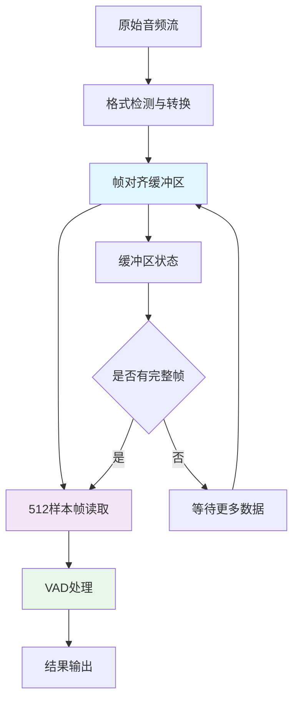
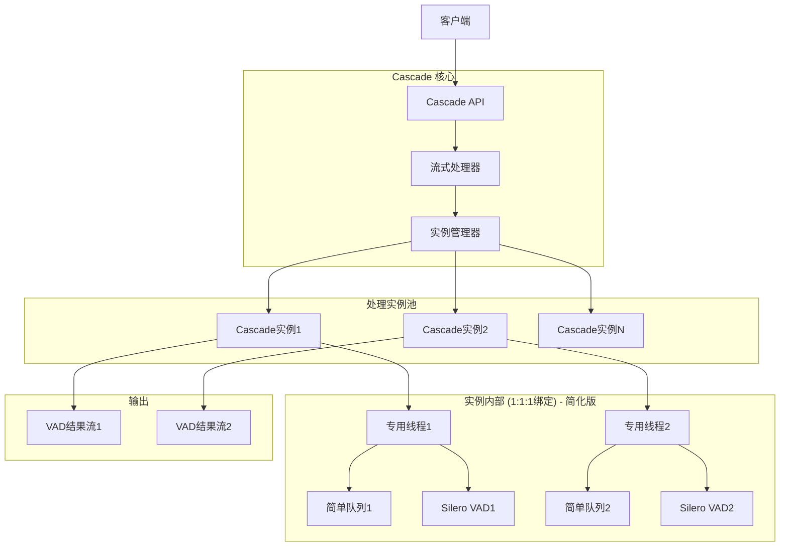
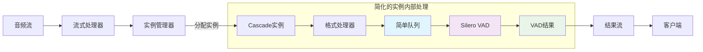
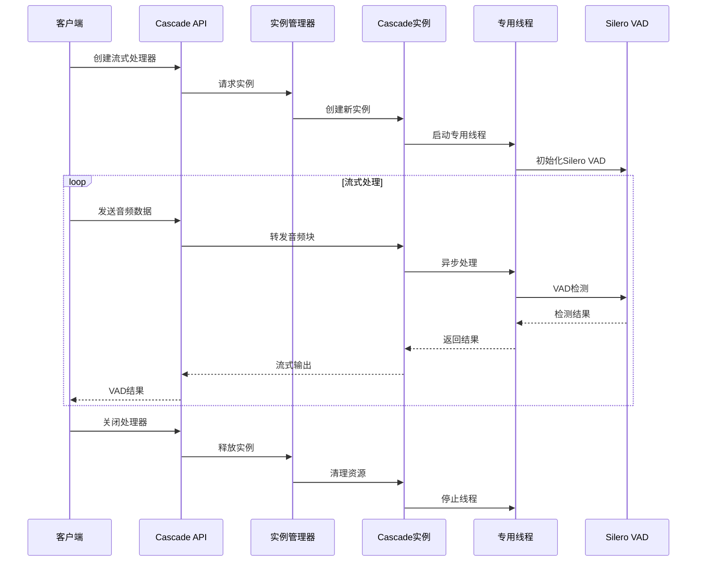
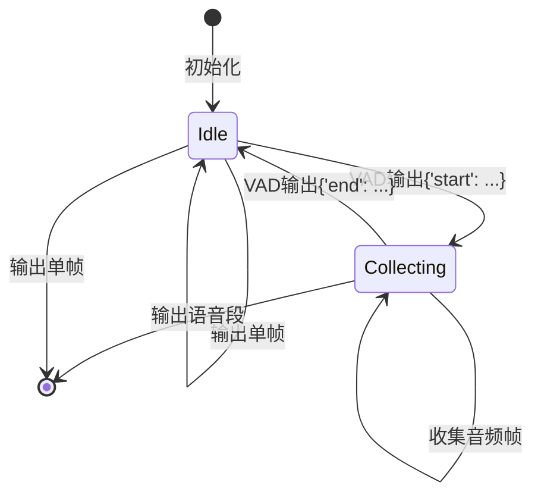
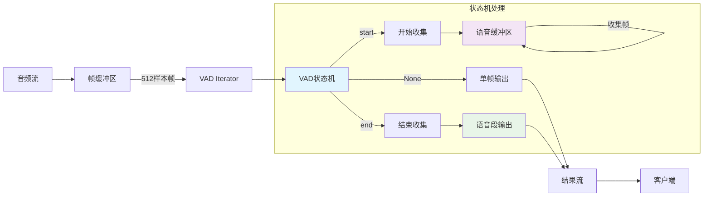

# Cascade 流式VAD处理器架构设计

## 设计目标

基于用户需求，设计一个简洁、高性能的异步流式音频VAD处理流程编排器，实现：

1. **简洁的开源项目API**：符合常见开源项目的使用方式
2. **1:1:1绑定架构**：每个cascade实例对应一个线程、一个简单缓冲区、一个VAD实例
3. **异步流式处理**：避免阻塞主异步循环
4. **多音频流并发**：支持多个音频流同时处理
5. **线程池监控**：直观监控cascade实例数量和状态

## 架构简化原则

**重要更新**：基于反思讨论，我们采用以下简化原则：

1. **去除重合语音块处理**：不需要复杂的overlap处理逻辑
2. **去除延迟补偿策略**：不需要compensation_ms等复杂时间调整
3. **简化缓冲区**：仅作为简单的数据队列，不需要复杂的重叠区域管理
4. **流式顺序处理**：按照音频块的自然顺序一个一个处理
5. **专注核心功能**：VAD检测 + 元数据标记
6. **帧对齐优化**：基于silero-vad的512样本帧要求，在缓冲区读取时就按帧大小对齐

## 音频格式优化设计

### 核心约束

基于silero-vad使用示例分析：

- **固定采样率**：16kHz
- **固定帧大小**：512样本/帧 (32ms)
- **支持格式**：WAV、MP3（单声道）
- **处理策略**：帧对齐读取，避免切割和补0操作

### 关键发现

从silero-vad使用示例中发现：

```python
# silero-vad的关键约束
window_size_samples = 512 if SAMPLING_RATE == 16000 else 256
for i in range(0, len(wav), window_size_samples):
    chunk = wav[i: i+ window_size_samples]
    if len(chunk) < window_size_samples:
        break  # 丢弃不足的帧，不进行补0
```

**重要优化点**：
1. 必须是完整的512样本帧
2. 不足512样本的帧会被丢弃
3. 不需要补0操作
4. 可以在缓冲区读取时就按帧大小对齐

### 优化策略



### 具体优化措施

1. **缓冲区帧对齐**：
   - 缓冲区按512样本边界读取
   - 不足512样本的数据保留在缓冲区
   - 避免silero-vad内部的切割操作

2. **格式统一**：
   - 所有输入统一转换为16kHz单声道PCM
   - MP3自动解码为PCM格式
   - 采样率自动重采样到16kHz

3. **内存优化**：
   - 减少数据拷贝次数
   - 直接按帧大小分配内存
   - 避免多余的缓冲区操作

4. **配置简化**：
   ```python
   # 固定的音频配置
   AUDIO_CONFIG = {
       "sample_rate": 16000,
       "channels": 1,
       "sample_width": 2,  # 16-bit
       "frame_size": 512,  # silero-vad要求
       "frame_duration_ms": 32  # 512/16000*1000
   }
   ```

## 核心架构设计

### 1. 简化的整体架构图



### 2. 简化的数据流程图



### 3. 时序图



## 核心组件设计

### 1. StreamProcessor (流式处理器)

**职责**：
- 提供简洁的API接口
- 管理音频流的生命周期
- 协调各个组件

**核心方法**：
```python
class StreamProcessor:
    async def process_stream(self, audio_stream: AsyncIterator[bytes]) -> AsyncIterator[VADResult]
    async def process_chunk(self, audio_data: bytes) -> VADResult
    async def close(self)
```

### 2. CascadeInstanceManager (实例管理器)

**职责**：
- 管理Cascade实例池
- 实例分配和回收
- 监控实例状态

**核心方法**：
```python
class CascadeInstanceManager:
    async def get_instance(self) -> CascadeInstance
    async def release_instance(self, instance: CascadeInstance)
    def get_stats(self) -> InstancePoolStats
```

### 3. CascadeInstance (处理实例)

**职责**：
- 1:1:1绑定管理（线程:缓冲区:VAD）
- 音频数据处理
- 结果流式输出

**核心方法**：
```python
class CascadeInstance:
    async def initialize(self)
    async def process_audio_chunk(self, data: bytes) -> VADResult
    async def close(self)
```

### 4. 简化的API设计

```python
# 简洁的使用方式 - 类似其他开源项目
import cascade

# 方式1：直接处理音频流
async def process_audio_stream():
    async with cascade.StreamProcessor() as processor:
        async for vad_result in processor.process_stream(audio_stream):
            if vad_result.is_speech:
                print(f"检测到语音: {vad_result.start_ms}ms - {vad_result.end_ms}ms")

# 方式2：逐块处理
async def process_audio_chunks():
    processor = cascade.StreamProcessor()
    await processor.initialize()
    
    try:
        for audio_chunk in audio_chunks:
            result = await processor.process_chunk(audio_chunk)
            print(f"VAD结果: {result.is_speech}, 概率: {result.probability}")
    finally:
        await processor.close()

# 方式3：便捷函数
results = await cascade.process_audio_file("audio.wav")
for result in results:
    print(f"语音段: {result.start_ms}ms - {result.end_ms}ms")
```

## 技术实现要点

### 1. 异步与同步的桥接

由于Silero VAD是同步的，需要在专用线程中运行，避免阻塞异步循环：

```python
class CascadeInstance:
    def __init__(self):
        self._thread_executor = ThreadPoolExecutor(max_workers=1)
        self._vad_model = None
        self._buffer = None
    
    async def process_audio_chunk(self, data: bytes) -> VADResult:
        # 在专用线程中执行同步VAD处理
        loop = asyncio.get_event_loop()
        result = await loop.run_in_executor(
            self._thread_executor,
            self._sync_process_chunk,
            data
        )
        return result
    
    def _sync_process_chunk(self, data: bytes) -> VADResult:
        # 同步处理逻辑
        # 1. 格式转换
        # 2. 写入环形缓冲区
        # 3. Silero VAD处理
        # 4. 返回结果
        pass
```

### 2. 实例池管理

```python
class CascadeInstanceManager:
    def __init__(self, max_instances: int = 10):
        self._max_instances = max_instances
        self._available_instances: asyncio.Queue = asyncio.Queue()
        self._active_instances: set = set()
        self._instance_stats: dict = {}
    
    async def get_instance(self) -> CascadeInstance:
        try:
            # 尝试获取可用实例
            instance = self._available_instances.get_nowait()
        except asyncio.QueueEmpty:
            # 创建新实例
            if len(self._active_instances) < self._max_instances:
                instance = CascadeInstance()
                await instance.initialize()
            else:
                # 等待可用实例
                instance = await self._available_instances.get()
        
        self._active_instances.add(instance)
        return instance
```

### 3. 错误处理和恢复

```python
class StreamProcessor:
    async def process_stream(self, audio_stream: AsyncIterator[bytes]) -> AsyncIterator[VADResult]:
        instance = None
        try:
            instance = await self._instance_manager.get_instance()
            
            async for audio_data in audio_stream:
                try:
                    result = await instance.process_audio_chunk(audio_data)
                    yield result
                except Exception as e:
                    # 错误处理：记录日志，可能重试或跳过
                    logger.error(f"处理音频块失败: {e}")
                    # 根据错误类型决定是否继续
                    if isinstance(e, CriticalError):
                        raise
                    # 非关键错误，继续处理下一块
                    continue
                    
        finally:
            if instance:
                await self._instance_manager.release_instance(instance)
```

## 性能优化策略

### 1. 内存优化
- 零拷贝设计：使用内存视图而非数据复制
- 对象池：重用AudioChunk和VADResult对象
- 缓存对齐：确保数据结构缓存友好

### 2. 并发优化
- 专用线程：每个实例独立线程，避免锁竞争
- 异步队列：使用asyncio.Queue进行线程间通信
- 批处理：支持批量处理多个音频块

### 3. 资源管理
- 自动清理：使用弱引用和上下文管理器
- 优雅关闭：确保所有资源正确释放
- 监控指标：实时监控性能和资源使用

## 监控和调试

### 1. 实例状态监控

```python
@dataclass
class InstancePoolStats:
    total_instances: int
    active_instances: int
    available_instances: int
    average_processing_time_ms: float
    total_processed_chunks: int
    error_rate: float
    memory_usage_mb: float

# 获取监控数据
stats = processor.get_stats()
print(f"活跃实例: {stats.active_instances}/{stats.total_instances}")
print(f"平均处理时间: {stats.average_processing_time_ms}ms")
```

### 2. 性能分析

```python
# 内置性能分析
async with cascade.StreamProcessor(enable_profiling=True) as processor:
    async for result in processor.process_stream(audio_stream):
        pass
    
# 获取性能报告
report = processor.get_performance_report()
print(report.summary())
```

## 代码重构计划

### 需要删除的复杂功能：

1. **重合语音块处理逻辑**：
   - `cascade/buffer/ring_buffer.py` 中的 `get_chunk_with_overlap()` 方法
   - `AudioChunk` 中的 `overlap_size` 字段
   - `VADConfig` 中的 `overlap_ms` 配置

2. **延迟补偿策略**：
   - `VADConfig` 中的 `compensation_ms` 字段
   - `VADResult` 中的 `is_compensated` 和 `original_start_ms` 字段
   - 所有相关的时间调整逻辑

3. **复杂的环形缓冲区功能**：
   - `AudioRingBuffer` 中的重叠区域管理
   - 复杂的零拷贝优化（保留基础版本）
   - 过度复杂的缓冲区状态管理

### 需要简化的模块：

1. **cascade/buffer/ring_buffer.py** → **cascade/buffer/simple_queue.py**：
   - 删除：`get_chunk_with_overlap()`, `_read_chunk_data()`, `_create_audio_chunk()`
   - 简化：只保留基本的 `put()` 和 `get()` 方法
   - 保留：基础的线程安全和容量管理

2. **cascade/processor/vad_processor.py**：
   - 删除：`get_speech_segments()` 中的复杂边界处理
   - 删除：`_create_segment_from_chunks()` 方法
   - 简化：`process_chunk()` 方法，去除重叠处理
   - 保留：基础的流式处理逻辑

3. **cascade/backends/silero.py**：
   - 删除：`_postprocess_output()` 中的延迟补偿逻辑
   - 简化：直接返回 Silero VAD 的原始结果
   - 保留：基础的 VAD 推理功能

### 需要新增的简化模块：

1. **cascade/stream_processor.py** - 简化的流式处理器主模块
2. **cascade/instance_manager.py** - 实例管理器
3. **cascade/simple_instance.py** - 简化的处理实例

### 需要改造的模块：

1. **cascade/__init__.py** - 导出简化的API
2. **cascade/types/__init__.py** - 删除复杂的配置字段

### 具体删除的函数列表：

**cascade/buffer/ring_buffer.py**：
- `get_chunk_with_overlap()` - 删除
- `_read_chunk_data()` - 删除
- `_create_audio_chunk()` - 删除
- `advance_read_position()` - 简化

**cascade/processor/vad_processor.py**：
- `get_speech_segments()` - 大幅简化
- `_create_segment_from_chunks()` - 删除
- `_format_audio_data()` - 简化

**cascade/backends/silero.py**：
- `_postprocess_output()` 中的补偿逻辑 - 删除
- `_adapt_chunk_size()` 中的复杂填充 - 简化

### 具体新增的函数列表：

**cascade/stream_processor.py**：
- `StreamProcessor.process_chunk()` - 新增
- `StreamProcessor.process_stream()` - 新增
- `StreamProcessor.get_stats()` - 新增

**cascade/simple_instance.py**：
- `SimpleInstance.process_audio_chunk()` - 新增
- `SimpleInstance.initialize()` - 新增
- `SimpleInstance.close()` - 新增

### 需要删除的整个模块：

1. **cascade/_internal/thread_pool.py** - 用新的实例管理器替代
2. **cascade/processor/vad_processor.py** - 重构为简化版本

## 使用示例

### 基础使用

```python
import cascade
import asyncio

async def main():
    # 创建流式处理器
    async with cascade.StreamProcessor() as processor:
        # 处理音频文件
        async for vad_result in processor.process_file("audio.wav"):
            if vad_result.is_speech:
                print(f"语音: {vad_result.start_ms:.0f}ms - {vad_result.end_ms:.0f}ms")
        
        # 获取统计信息
        stats = processor.get_stats()
        print(f"处理了 {stats.total_processed_chunks} 个音频块")

asyncio.run(main())
```

### 高级配置

```python
import cascade

# 自定义配置
config = cascade.Config(
    sample_rate=16000,
    chunk_duration_ms=30,  # 30ms块大小，适合实时处理
    max_instances=5,       # 最多5个并发实例
    buffer_size_seconds=2.0,
    vad_threshold=0.5
)

async with cascade.StreamProcessor(config=config) as processor:
    # 处理实时音频流
    async for vad_result in processor.process_stream(realtime_audio_stream):
        # 实时处理逻辑
        pass
```

这个设计实现了用户要求的所有目标：简洁的API、1:1:1绑定架构、异步处理、多流并发支持和完整的监控能力。

## VAD状态机架构更新

### 重要澄清

基于 [`test_vad_stream.py`](test_vad_stream.py) 的实际测试结果，VAD的输出模式为：

```python
# VAD输出示例：
# None None None ... {'start': 0.8} None None ... {'end': 5.0} None None ...
```

**关键理解**：
1. **VAD输出**：大部分时候为 `None`，语音开始时为 `{'start': timestamp}`，语音结束时为 `{'end': timestamp}`
2. **语音段收集**：从 `start` 到 `end` 之间的所有512样本帧需要合并成完整语音段
3. **输出策略**：
   - **语音段**：合并的完整音频片段 + 元数据
   - **非语音帧**：单独的512样本帧 + 元数据

### VAD状态机设计



### 更新的数据流程图



### 核心数据类型更新

```python
class AudioFrame(BaseModel):
    """单个音频帧"""
    frame_id: int = Field(description="帧ID")
    audio_data: bytes = Field(description="512样本音频数据")
    timestamp_ms: float = Field(description="时间戳(ms)")
    vad_result: Optional[Dict[str, Any]] = Field(description="原始VAD结果")

class SpeechSegment(BaseModel):
    """语音段"""
    segment_id: int = Field(description="语音段ID")
    audio_data: bytes = Field(description="合并的音频数据")
    start_timestamp_ms: float = Field(description="开始时间戳(ms)")
    end_timestamp_ms: float = Field(description="结束时间戳(ms)")
    frame_count: int = Field(description="包含的帧数")
    start_vad_result: Dict[str, Any] = Field(description="开始VAD结果")
    end_vad_result: Dict[str, Any] = Field(description="结束VAD结果")

class CascadeResult(BaseModel):
    """Cascade输出结果"""
    result_type: Literal["frame", "segment"] = Field(description="结果类型")
    frame: Optional[AudioFrame] = Field(description="单帧结果")
    segment: Optional[SpeechSegment] = Field(description="语音段结果")
```

### 实现要点

1. **状态机管理**：
   - `IDLE`状态：等待语音开始，输出单帧
   - `COLLECTING`状态：收集语音帧，直到语音结束

2. **音频帧收集**：
   - 从 `{'start': ...}` 开始收集
   - 所有中间的512样本帧都加入语音段
   - 直到 `{'end': ...}` 结束收集

3. **输出策略**：
   - **非语音时**：立即输出单个AudioFrame
   - **语音段时**：收集完整后输出SpeechSegment

4. **元数据保留**：
   - 保留原始VAD结果作为元数据
   - 不进行任何时间戳计算或转换
   - 完全基于VAD的原始输出

### 代码重构计划更新

基于VAD状态机设计，需要新增以下模块：

**新增模块**：
1. **cascade/stream/vad_state_machine.py** - VAD状态机实现
2. **cascade/stream/speech_collector.py** - 语音段收集器
3. **cascade/stream/frame_processor.py** - 帧处理器

**新增函数**：
1. **VADStateMachine.process_vad_result()** - 处理VAD结果
2. **SpeechCollector.start_collecting()** - 开始收集语音
3. **SpeechCollector.add_frame()** - 添加音频帧
4. **SpeechCollector.end_collecting()** - 结束收集并输出语音段
5. **FrameProcessor.create_single_frame()** - 创建单帧输出

这个更新的设计完全符合VAD的实际工作模式，确保了语音段的完整性和元数据的准确性。

## 语音帧存储策略详细设计

### 存储位置和方式

当VAD结果出现 `'start'` 这个key时，语音帧的存储策略如下：

**存储位置**：每个CascadeInstance内的SpeechCollector内存缓冲区
**存储方式**：使用Python列表存储bytes对象
**内存占用**：512样本×2字节×帧数（如5秒语音约156KB）
**清理机制**：语音段输出后立即清空缓冲区

### SpeechCollector实现

```python
class SpeechCollector:
    """语音帧收集器 - 负责临时存储语音帧"""
    
    def __init__(self):
        self._collecting = False
        self._speech_frames: List[bytes] = []  # 内存缓冲区
        self._start_timestamp = None
        self._start_vad_result = None
        self._frame_count = 0
    
    def start_collecting(self, frame_data: bytes, timestamp: float, vad_result: dict):
        """开始收集语音帧到内存缓冲区"""
        self._collecting = True
        self._speech_frames = [frame_data]  # 存储第一帧
        self._start_timestamp = timestamp
        self._start_vad_result = vad_result
        self._frame_count = 1
    
    def add_frame(self, frame_data: bytes):
        """添加音频帧到内存缓冲区"""
        if self._collecting:
            self._speech_frames.append(frame_data)
            self._frame_count += 1
    
    def end_collecting(self, timestamp: float, vad_result: dict) -> SpeechSegment:
        """结束收集，合并所有帧并清空缓冲区"""
        # 合并所有音频帧
        combined_audio = b''.join(self._speech_frames)
        
        segment = SpeechSegment(
            audio_data=combined_audio,
            start_timestamp_ms=self._start_timestamp,
            end_timestamp_ms=timestamp,
            frame_count=self._frame_count,
            start_vad_result=self._start_vad_result,
            end_vad_result=vad_result
        )
        
        # 清空缓冲区释放内存
        self._speech_frames.clear()
        self._collecting = False
        self._frame_count = 0
        
        return segment
    
    def is_collecting(self) -> bool:
        """是否正在收集语音帧"""
        return self._collecting
    
    @property
    def current_frame_count(self) -> int:
        """当前收集的帧数"""
        return self._frame_count
    
    @property
    def estimated_memory_usage_kb(self) -> float:
        """估算当前内存使用量(KB)"""
        return (self._frame_count * 512 * 2) / 1024  # 512样本×2字节
```

### 内存使用估算

```python
# 不同时长语音段的内存占用
frame_size = 512 * 2  # 512样本 × 2字节(16bit) = 1024字节
frames_per_second = 1000 / 32  # 32ms/帧 ≈ 31.25帧/秒

# 内存占用示例：
# 1秒语音段: 31帧, 约31KB
# 5秒语音段: 156帧, 约156KB  
# 10秒语音段: 312帧, 约312KB
# 30秒语音段: 937帧, 约937KB
```

### 存储流程图

```mermaid
graph TD
    A[VAD检测到start] --> B[创建语音缓冲区]
    B --> C[SpeechCollector._speech_frames]
    C --> D[收集512样本帧]
    D --> E[append到List[bytes]]
    E --> F{检测到end?}
    F -->|否| D
    F -->|是| G[b''.join合并所有帧]
    G --> H[输出SpeechSegment]
    H --> I[清空缓冲区]
    
    style C fill:#e1f5fe
    style E fill:#f3e5f5
    style G fill:#e8f5e8
```

### 选择内存缓冲区的原因

1. **性能最优**：内存操作比文件I/O快得多
2. **简单可靠**：不需要处理文件清理和错误恢复
3. **适合实时场景**：语音段通常不会太长（几秒到几十秒）
4. **内存占用可控**：即使30秒语音段也只有约1MB
5. **线程安全**：每个CascadeInstance独立的内存空间

### 在CascadeInstance中的集成

```python
class CascadeInstance:
    def __init__(self):
        self.speech_collector = SpeechCollector()
        self.vad_iterator = VADIterator(model, sampling_rate=16000)
        self.frame_id_counter = 0
    
    def process_frame(self, frame_data: bytes, timestamp: float) -> Optional[CascadeResult]:
        """处理单个音频帧"""
        self.frame_id_counter += 1
        
        # VAD检测
        vad_result = self.vad_iterator(frame_data, return_seconds=True)
        
        if vad_result and 'start' in vad_result:
            # 开始收集语音帧到内存缓冲区
            self.speech_collector.start_collecting(frame_data, timestamp, vad_result)
            return None  # 不输出，继续收集
        
        elif vad_result and 'end' in vad_result:
            # 结束收集，输出完整语音段
            segment = self.speech_collector.end_collecting(timestamp, vad_result)
            return CascadeResult(result_type="segment", segment=segment)
        
        elif self.speech_collector.is_collecting():
            # 收集中，添加到内存缓冲区
            self.speech_collector.add_frame(frame_data)
            return None  # 不输出，继续收集
        
        else:
            # 非语音帧，直接输出
            frame = AudioFrame(
                frame_id=self.frame_id_counter,
                audio_data=frame_data,
                timestamp_ms=timestamp,
                vad_result=vad_result
            )
            return CascadeResult(result_type="frame", frame=frame)
```

这样设计确保了语音帧在收集过程中安全存储在内存中，并在语音段结束时高效合并输出。