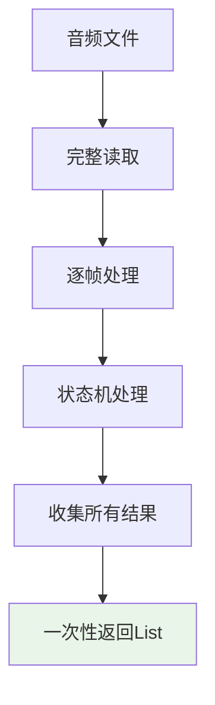
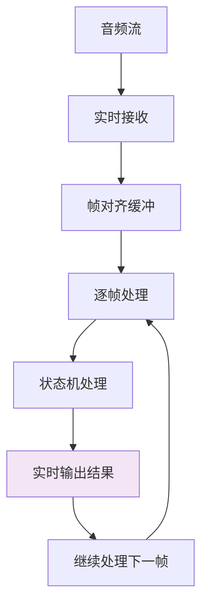

# 文件处理 vs 流式音频处理结果对比分析

## ▮ 核心差异概述

虽然文件处理和流式音频处理都使用相同的VAD状态机和语音收集器，但在结果输出、时间戳处理和用户体验方面存在重要差异。

## ▮ 处理模式对比

### 文件处理模式
```python
# 批量处理，一次性返回所有结果
results = await cascade.process_audio_file("audio.wav")
# 结果：List[CascadeResult] - 完整的结果列表
```

### 流式处理模式
```python
# 实时处理，逐步返回结果
async for result in cascade.StreamProcessor().process_stream(audio_stream):
    # 结果：单个CascadeResult - 实时流式输出
```

## ▮ 详细差异分析

### 1. 时间戳处理差异

#### 文件处理时间戳
```python
class FileProcessingResult:
    """文件处理结果 - 基于文件内容的相对时间戳"""
    
    # 语音段示例
    segment = SpeechSegment(
        start_timestamp_ms=1200.0,    # 文件开始后1.2秒
        end_timestamp_ms=3400.0,      # 文件开始后3.4秒
        audio_data=b'...',            # 完整语音段数据
        frame_count=69,               # 包含69个512样本帧
        duration_ms=2200.0            # 语音段时长2.2秒
    )
    
    # 单帧示例
    frame = AudioFrame(
        frame_id=15,
        timestamp_ms=480.0,           # 文件开始后0.48秒
        audio_data=b'...',            # 512样本帧数据
        vad_result=None               # 非语音帧
    )
```

#### 流式处理时间戳
```python
class StreamProcessingResult:
    """流式处理结果 - 基于实时时间戳"""
    
    # 语音段示例
    segment = SpeechSegment(
        start_timestamp_ms=1634567890123.0,  # 绝对时间戳（Unix毫秒）
        end_timestamp_ms=1634567892323.0,    # 绝对时间戳（Unix毫秒）
        audio_data=b'...',                   # 完整语音段数据
        frame_count=69,                      # 包含69个512样本帧
        duration_ms=2200.0                   # 语音段时长2.2秒
    )
    
    # 单帧示例
    frame = AudioFrame(
        frame_id=15,
        timestamp_ms=1634567890603.0,        # 绝对时间戳（Unix毫秒）
        audio_data=b'...',                   # 512样本帧数据
        vad_result=None                      # 非语音帧
    )
```

### 2. 结果输出模式差异

#### 文件处理 - 批量输出


**特点**：
- **完整性**：包含文件的所有VAD结果
- **有序性**：按时间顺序排列
- **可回溯**：可以分析整个文件的语音模式
- **延迟高**：需要处理完整个文件才返回结果

#### 流式处理 - 实时输出


**特点**：
- **实时性**：立即输出检测结果
- **低延迟**：最大延迟32ms（一个帧的时长）
- **流式输出**：逐个返回CascadeResult
- **内存友好**：不需要缓存所有结果

### 3. 语音段处理差异

#### 文件处理中的语音段
```python
# 文件处理可以进行全局优化
def optimize_speech_segments(results: List[CascadeResult]) -> List[CascadeResult]:
    """文件处理可以进行后处理优化"""
    
    # 1. 合并相邻的短语音段
    # 2. 过滤过短的语音段
    # 3. 平滑语音边界
    # 4. 全局语音活动分析
    
    optimized_results = []
    for result in results:
        if result.result_type == "segment":
            # 可以访问前后语音段进行优化
            optimized_segment = apply_global_optimization(result.segment)
            optimized_results.append(optimized_segment)
    
    return optimized_results
```

#### 流式处理中的语音段
```python
# 流式处理只能基于当前状态
def process_stream_segment(current_result: CascadeResult) -> CascadeResult:
    """流式处理只能进行局部优化"""
    
    # 1. 只能基于当前语音段
    # 2. 无法访问未来的语音段
    # 3. 有限的历史信息
    # 4. 实时决策
    
    if current_result.result_type == "segment":
        # 只能基于当前语音段进行处理
        return apply_local_optimization(current_result.segment)
    
    return current_result
```

### 4. 错误处理和恢复差异

#### 文件处理错误处理
```python
async def process_audio_file(file_path: str) -> List[CascadeResult]:
    """文件处理 - 可以重试整个文件"""
    try:
        results = []
        audio_data = read_audio_file(file_path)
        
        for frame in generate_frames(audio_data):
            try:
                result = process_frame(frame)
                if result:
                    results.append(result)
            except FrameProcessingError as e:
                # 可以跳过单个帧，继续处理
                logger.warning(f"跳过帧处理错误: {e}")
                continue
        
        return results
        
    except FileReadError as e:
        # 可以重试整个文件
        logger.error(f"文件读取失败，重试: {e}")
        return await retry_process_audio_file(file_path)
```

#### 流式处理错误处理
```python
async def process_stream(audio_stream) -> AsyncIterator[CascadeResult]:
    """流式处理 - 需要优雅降级"""
    try:
        async for audio_chunk in audio_stream:
            try:
                results = process_audio_chunk(audio_chunk)
                for result in results:
                    yield result
                    
            except ChunkProcessingError as e:
                # 只能跳过当前块，无法重试
                logger.warning(f"跳过音频块: {e}")
                
                # 可能需要重置状态机
                if isinstance(e, CriticalError):
                    reset_vad_state_machine()
                
                continue
                
    except StreamConnectionError as e:
        # 流断开，无法恢复历史数据
        logger.error(f"音频流断开: {e}")
        raise
```

## ▮ 使用场景对比

### 文件处理适用场景

```python
# 1. 音频文件分析
results = await cascade.process_audio_file("meeting.wav")
speech_segments = [r.segment for r in results if r.result_type == "segment"]

# 分析整个会议的语音活动
total_speech_time = sum(s.duration_ms for s in speech_segments)
speech_ratio = total_speech_time / get_file_duration("meeting.wav")

# 2. 批量音频处理
for audio_file in audio_files:
    results = await cascade.process_audio_file(audio_file)
    save_analysis_results(audio_file, results)

# 3. 音频质量评估
results = await cascade.process_audio_file("sample.wav")
quality_score = calculate_audio_quality(results)
```

### 流式处理适用场景

```python
# 1. 实时语音检测
async def real_time_vad():
    async with cascade.StreamProcessor() as processor:
        async for result in processor.process_stream(microphone_stream):
            if result.result_type == "segment":
                print(f"检测到语音: {result.segment.duration_ms}ms")
                # 立即触发语音识别
                await trigger_speech_recognition(result.segment.audio_data)

# 2. 实时音频监控
async def audio_monitoring():
    async with cascade.StreamProcessor() as processor:
        async for result in processor.process_stream(audio_stream):
            if result.result_type == "frame" and result.frame.vad_result is None:
                # 检测到静音，可能需要调整音频增益
                await adjust_audio_gain()

# 3. 实时会议转录
async def live_transcription():
    async with cascade.StreamProcessor() as processor:
        async for result in processor.process_stream(meeting_stream):
            if result.result_type == "segment":
                # 实时发送语音段进行转录
                transcript = await transcribe_audio(result.segment.audio_data)
                await broadcast_transcript(transcript)
```

## ▮ 性能特性对比

| 特性 | 文件处理 | 流式处理 |
|------|----------|----------|
| **延迟** | 高（需处理完整文件） | 低（最大32ms） |
| **内存使用** | 中等（需缓存结果） | 低（流式输出） |
| **CPU使用** | 突发高（集中处理） | 平稳（持续处理） |
| **可扩展性** | 受文件大小限制 | 受并发流数限制 |
| **错误恢复** | 可重试整个文件 | 只能跳过错误块 |
| **结果完整性** | 100%完整 | 依赖流的稳定性 |

## ▮ 数据结构统一性

尽管处理模式不同，但两种方式输出的CascadeResult数据结构是完全一致的：

```python
# 统一的结果数据结构
class CascadeResult(BaseModel):
    result_type: Literal["frame", "segment"]
    frame: Optional[AudioFrame] = None
    segment: Optional[SpeechSegment] = None
    
    # 元数据（两种模式都有）
    processing_time_ms: float
    confidence_score: Optional[float] = None
    
# 统一的语音段结构
class SpeechSegment(BaseModel):
    segment_id: int
    audio_data: bytes
    start_timestamp_ms: float  # 唯一差异：相对 vs 绝对时间戳
    end_timestamp_ms: float
    frame_count: int
    start_vad_result: Dict[str, Any]
    end_vad_result: Dict[str, Any]

# 统一的音频帧结构
class AudioFrame(BaseModel):
    frame_id: int
    audio_data: bytes
    timestamp_ms: float        # 唯一差异：相对 vs 绝对时间戳
    vad_result: Optional[Dict[str, Any]]
```

## ▮ 总结

**主要差异**：
1. **时间戳语义**：文件处理使用相对时间戳，流式处理使用绝对时间戳
2. **输出模式**：文件处理批量输出，流式处理实时输出
3. **优化能力**：文件处理可全局优化，流式处理只能局部优化
4. **错误恢复**：文件处理可重试，流式处理只能跳过

**共同点**：
1. **数据结构**：使用相同的CascadeResult、SpeechSegment、AudioFrame
2. **VAD逻辑**：使用相同的VAD状态机和语音收集器
3. **帧处理**：都基于512样本帧进行处理
4. **质量保证**：都提供相同质量的VAD检测结果

这种设计确保了用户可以根据具体需求选择合适的处理模式，同时保持结果的一致性和可比较性。