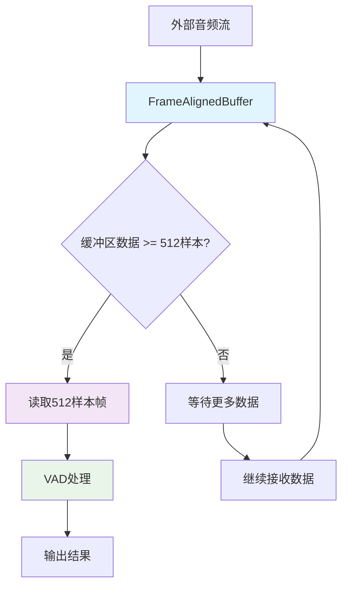
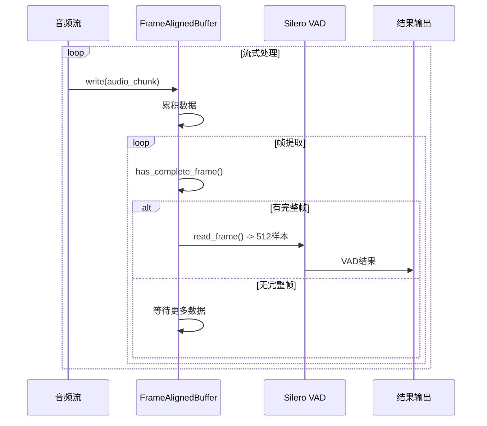

# 512样本帧对齐缓冲区设计 (1:1:1架构版本)

## 设计目标

基于1:1:1绑定架构（每个cascade实例对应一个线程、一个简单缓冲区、一个VAD实例），设计一个专门用于512样本帧对齐的简洁缓冲区，**无需考虑多线程安全性**。

## 核心约束

### Silero VAD要求
- **固定帧大小**：512样本/帧 (32ms @ 16kHz)
- **完整帧处理**：不足512样本的帧会被丢弃
- **无补0操作**：避免人工填充
- **顺序处理**：按音频块自然顺序处理

### 1:1:1架构约束
- **单线程访问**：每个缓冲区只被一个线程访问
- **无锁设计**：不需要任何同步机制
- **简洁实现**：专注核心功能，避免过度设计

## 架构设计

### 整体流程图



### 数据流时序图



## 核心数据结构

### FrameAlignedBuffer类设计

```python
from typing import Optional
from pydantic import BaseModel, Field
import numpy as np

class FrameAlignedBuffer:
    """512样本帧对齐缓冲区 - 1:1:1架构专用版本
    
    特点：
    - 单线程访问，无锁设计
    - 专门针对512样本帧优化
    - 简洁实用，避免过度设计
    """
    
    def __init__(self, max_buffer_samples: int = 16000):  # 默认1秒缓冲
        """初始化帧对齐缓冲区
        
        Args:
            max_buffer_samples: 最大缓冲样本数，防止内存无限增长
        """
        self._buffer = bytearray()  # 内部字节缓冲区
        self._max_buffer_size = max_buffer_samples * 2  # 16bit = 2字节/样本
        self._frame_size_bytes = 512 * 2  # 512样本 * 2字节 = 1024字节
        self._samples_per_frame = 512
        
    def write(self, audio_data: bytes) -> None:
        """写入音频数据到缓冲区"""
        self._buffer.extend(audio_data)
        
        # 防止缓冲区无限增长
        if len(self._buffer) > self._max_buffer_size:
            # 保留最新的数据，丢弃最旧的数据
            excess = len(self._buffer) - self._max_buffer_size
            self._buffer = self._buffer[excess:]
    
    def has_complete_frame(self) -> bool:
        """检查是否有完整的512样本帧"""
        return len(self._buffer) >= self._frame_size_bytes
    
    def read_frame(self) -> Optional[bytes]:
        """读取一个完整的512样本帧
        
        Returns:
            512样本的音频数据，如果不足则返回None
        """
        if not self.has_complete_frame():
            return None
        
        # 提取512样本帧
        frame_data = bytes(self._buffer[:self._frame_size_bytes])
        
        # 从缓冲区移除已读取的数据
        self._buffer = self._buffer[self._frame_size_bytes:]
        
        return frame_data
    
    def available_samples(self) -> int:
        """返回缓冲区中可用的样本数"""
        return len(self._buffer) // 2  # 2字节/样本
    
    def available_frames(self) -> int:
        """返回缓冲区中可用的完整帧数"""
        return len(self._buffer) // self._frame_size_bytes
    
    def clear(self) -> None:
        """清空缓冲区"""
        self._buffer.clear()
    
    def get_buffer_usage_ratio(self) -> float:
        """获取缓冲区使用率 (0.0-1.0)"""
        return len(self._buffer) / self._max_buffer_size
    
    @property
    def buffer_size_bytes(self) -> int:
        """当前缓冲区大小（字节）"""
        return len(self._buffer)
    
    @property
    def max_buffer_size_bytes(self) -> int:
        """最大缓冲区大小（字节）"""
        return self._max_buffer_size
```

## 使用示例

### 基础使用模式

```python
# 在CascadeInstance中的使用
class CascadeInstance:
    def __init__(self):
        # 1:1:1绑定：一个实例一个缓冲区
        self.frame_buffer = FrameAlignedBuffer(max_buffer_samples=16000)
        self.vad_iterator = VADIterator(model, sampling_rate=16000)
        self.speech_collector = SpeechCollector()
    
    def process_audio_chunk(self, audio_data: bytes) -> List[CascadeResult]:
        """处理音频块，返回VAD结果列表"""
        results = []
        
        # 1. 写入缓冲区
        self.frame_buffer.write(audio_data)
        
        # 2. 处理所有可用的完整帧
        while self.frame_buffer.has_complete_frame():
            frame_data = self.frame_buffer.read_frame()
            if frame_data:
                # 3. VAD处理
                result = self._process_single_frame(frame_data)
                if result:
                    results.append(result)
        
        return results
    
    def _process_single_frame(self, frame_data: bytes) -> Optional[CascadeResult]:
        """处理单个512样本帧"""
        # VAD检测
        vad_result = self.vad_iterator(frame_data, return_seconds=True)
        timestamp = time.time() * 1000  # 当前时间戳
        
        # 状态机处理
        if vad_result and 'start' in vad_result:
            self.speech_collector.start_collecting(frame_data, timestamp, vad_result)
            return None
        elif vad_result and 'end' in vad_result:
            segment = self.speech_collector.end_collecting(timestamp, vad_result)
            return CascadeResult(result_type="segment", segment=segment)
        elif self.speech_collector.is_collecting():
            self.speech_collector.add_frame(frame_data)
            return None
        else:
            # 非语音帧
            frame = AudioFrame(
                frame_id=self._get_next_frame_id(),
                audio_data=frame_data,
                timestamp_ms=timestamp,
                vad_result=vad_result
            )
            return CascadeResult(result_type="frame", frame=frame)
```

### 性能监控示例

```python
def monitor_buffer_performance():
    """监控缓冲区性能"""
    buffer = FrameAlignedBuffer()
    
    # 模拟音频数据写入
    for i in range(100):
        audio_chunk = b'\x00' * 256  # 128样本的音频数据
        buffer.write(audio_chunk)
        
        print(f"写入第{i+1}次:")
        print(f"  可用样本数: {buffer.available_samples()}")
        print(f"  可用帧数: {buffer.available_frames()}")
        print(f"  缓冲区使用率: {buffer.get_buffer_usage_ratio():.2%}")
        
        # 读取可用帧
        while buffer.has_complete_frame():
            frame = buffer.read_frame()
            print(f"  读取帧: {len(frame)} 字节")
```

## 性能特性

### 内存使用

```python
# 内存占用计算
frame_size = 512 * 2  # 1024字节/帧
max_buffer_samples = 16000  # 1秒@16kHz
max_buffer_size = 16000 * 2  # 32KB

# 典型使用场景内存占用：
# - 空闲状态: 0-1KB
# - 正常处理: 1-2KB  
# - 满缓冲区: 32KB
# - 峰值使用: <64KB
```

### 处理延迟

```python
# 延迟分析
sample_rate = 16000  # Hz
frame_size = 512    # 样本
frame_duration = 512 / 16000 * 1000  # 32ms

# 处理延迟：
# - 最小延迟: 0ms (有完整帧时立即处理)
# - 最大延迟: 32ms (等待完整帧)
# - 平均延迟: 16ms
```

## 与现有代码的集成

### 替换AudioRingBuffer

```python
# 需要修改的文件和函数

# cascade/stream/instance.py
class CascadeInstance:
    def __init__(self):
        # 替换复杂的AudioRingBuffer
        # self.audio_buffer = AudioRingBuffer(...)  # 删除
        self.frame_buffer = FrameAlignedBuffer()    # 新增
        
    # 简化process_audio_chunk方法
    def process_audio_chunk(self, audio_data: bytes):
        # 使用新的帧对齐缓冲区
        pass

# cascade/buffer/目录结构调整
# ring_buffer.py -> 标记为废弃
# frame_aligned_buffer.py -> 新增
```

### 删除的复杂功能

**需要删除的函数**：
1. `AudioRingBuffer.get_chunk_with_overlap()` - 重叠处理
2. `AudioRingBuffer._read_chunk_data()` - 复杂读取逻辑
3. `AudioRingBuffer._create_audio_chunk()` - 音频块创建
4. `AudioRingBuffer.advance_read_position()` - 复杂位置管理

**需要简化的函数**：
1. `CascadeInstance.process_audio_chunk()` - 使用新缓冲区
2. `StreamProcessor.process_stream()` - 简化流处理逻辑

**需要新增的函数**：
1. `FrameAlignedBuffer.write()` - 写入音频数据
2. `FrameAlignedBuffer.read_frame()` - 读取512样本帧
3. `FrameAlignedBuffer.has_complete_frame()` - 检查完整帧
4. `CascadeInstance._process_single_frame()` - 处理单帧

## 测试验证

### 单元测试用例

```python
import pytest
from cascade.buffer.frame_aligned_buffer import FrameAlignedBuffer

class TestFrameAlignedBuffer:
    
    def test_empty_buffer(self):
        """测试空缓冲区"""
        buffer = FrameAlignedBuffer()
        assert not buffer.has_complete_frame()
        assert buffer.read_frame() is None
        assert buffer.available_samples() == 0
    
    def test_incomplete_frame(self):
        """测试不完整帧"""
        buffer = FrameAlignedBuffer()
        # 写入256样本 (不足512)
        buffer.write(b'\x00' * 512)  # 256样本 * 2字节
        assert not buffer.has_complete_frame()
        assert buffer.available_samples() == 256
    
    def test_complete_frame(self):
        """测试完整帧"""
        buffer = FrameAlignedBuffer()
        # 写入512样本
        frame_data = b'\x00' * 1024  # 512样本 * 2字节
        buffer.write(frame_data)
        
        assert buffer.has_complete_frame()
        assert buffer.available_frames() == 1
        
        read_frame = buffer.read_frame()
        assert read_frame == frame_data
        assert not buffer.has_complete_frame()
    
    def test_multiple_frames(self):
        """测试多帧处理"""
        buffer = FrameAlignedBuffer()
        
        # 写入1.5帧数据
        buffer.write(b'\x01' * 1024)  # 第1帧
        buffer.write(b'\x02' * 512)   # 第2帧的一半
        
        assert buffer.available_frames() == 1
        
        frame1 = buffer.read_frame()
        assert frame1 == b'\x01' * 1024
        assert not buffer.has_complete_frame()
        
        # 补充第2帧的另一半
        buffer.write(b'\x02' * 512)
        assert buffer.has_complete_frame()
        
        frame2 = buffer.read_frame()
        assert frame2 == b'\x02' * 1024
    
    def test_buffer_overflow(self):
        """测试缓冲区溢出保护"""
        buffer = FrameAlignedBuffer(max_buffer_samples=1024)  # 小缓冲区
        
        # 写入超过容量的数据
        large_data = b'\x00' * 4096  # 2048样本
        buffer.write(large_data)
        
        # 应该自动截断
        assert buffer.available_samples() <= 1024
        assert buffer.get_buffer_usage_ratio() <= 1.0
```

### 性能基准测试

```python
import time
import numpy as np

def benchmark_frame_aligned_buffer():
    """性能基准测试"""
    buffer = FrameAlignedBuffer()
    
    # 生成测试数据
    test_chunks = [np.random.randint(-32768, 32767, 256, dtype=np.int16).tobytes() 
                   for _ in range(1000)]
    
    # 写入性能测试
    start_time = time.time()
    for chunk in test_chunks:
        buffer.write(chunk)
    write_time = time.time() - start_time
    
    # 读取性能测试
    frames_read = 0
    start_time = time.time()
    while buffer.has_complete_frame():
        buffer.read_frame()
        frames_read += 1
    read_time = time.time() - start_time
    
    print(f"写入性能: {len(test_chunks)/write_time:.0f} chunks/sec")
    print(f"读取性能: {frames_read/read_time:.0f} frames/sec")
    print(f"总帧数: {frames_read}")
```

## 总结

这个简化的FrameAlignedBuffer设计完全符合1:1:1架构原则：

### 核心优势
1. **简洁实用**：去除所有多线程安全代码，专注核心功能
2. **性能优化**：针对512样本帧专门优化
3. **内存高效**：使用bytearray，支持动态扩容和自动截断
4. **易于测试**：简单的接口，便于单元测试
5. **符合设计**：完全符合Silero VAD的帧大小要求

### 关键特性
- **无锁设计**：单线程访问，无需同步机制
- **帧对齐**：确保每次读取都是完整的512样本
- **溢出保护**：防止内存无限增长
- **状态透明**：提供详细的缓冲区状态信息

这个设计将显著简化现有的AudioRingBuffer实现，提升整体系统的可维护性和性能。