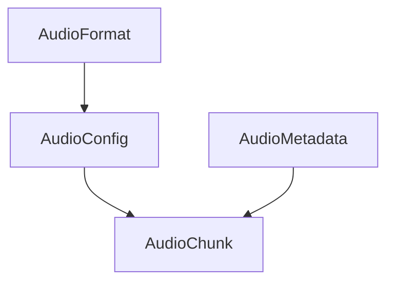
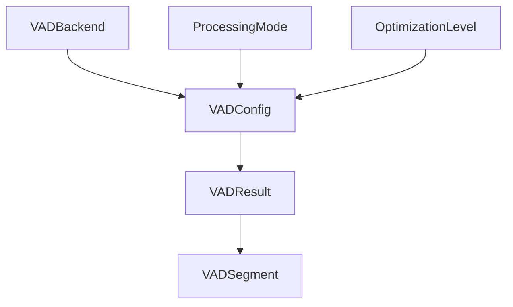
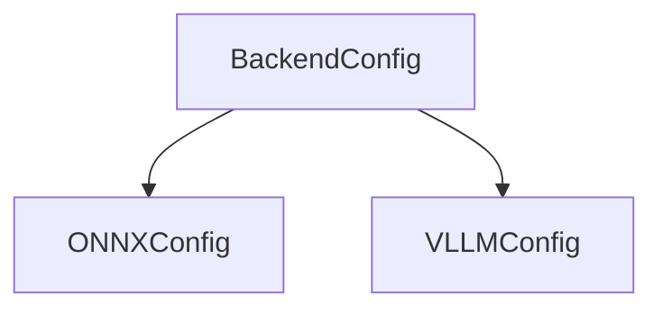
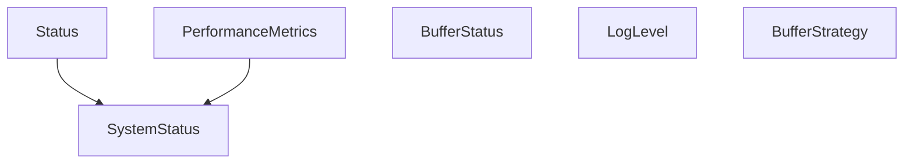
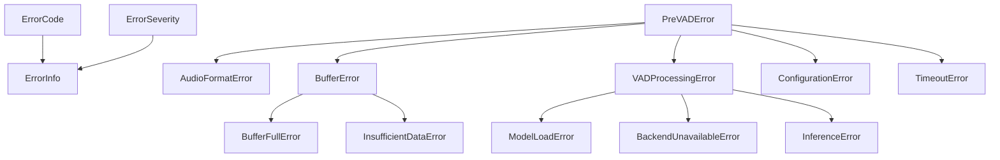

# Cascade核心类型系统

Cascade的核心类型系统基于pydantic构建，提供了完整的类型安全和数据验证功能。本文档详细介绍类型系统的设计理念、核心组件和使用方法。

## 1. 设计理念

Cascade的类型系统遵循以下设计理念：

- **零依赖核心**：类型模块是整个系统的基础，不依赖其他业务模块
- **类型安全**：所有数据结构都有明确的类型定义和验证规则
- **自动验证**：使用pydantic的验证机制，确保数据符合预期
- **文档即代码**：类型定义同时生成API文档和IDE提示
- **序列化支持**：内置JSON序列化/反序列化功能
- **扩展性**：支持自定义验证器和扩展字段

## 2. 核心组件

类型系统包含以下核心组件：

### 2.1 音频相关类型



- **AudioFormat**：音频格式枚举（WAV、PCMA等）
- **AudioConfig**：音频配置，包含采样率、格式、通道数等
- **AudioChunk**：音频数据块，包含音频数据和元数据
- **AudioMetadata**：音频元数据，包含标题、时长等信息

### 2.2 VAD相关类型



- **VADBackend**：VAD后端枚举（ONNX、VLLM等）
- **ProcessingMode**：处理模式枚举（流式、批量、实时）
- **OptimizationLevel**：优化级别枚举
- **VADConfig**：VAD配置，包含后端类型、阈值、块大小等
- **VADResult**：VAD检测结果，包含语音概率、时间戳等
- **VADSegment**：VAD语音段，由多个VADResult合并而成

### 2.3 后端配置类型



- **BackendConfig**：后端配置基类
- **ONNXConfig**：ONNX后端配置
- **VLLMConfig**：VLLM后端配置

### 2.4 通用类型



- **Status**：操作状态
- **SystemStatus**：系统状态
- **PerformanceMetrics**：性能指标
- **BufferStatus**：缓冲区状态
- **LogLevel**：日志级别枚举
- **BufferStrategy**：缓冲区策略枚举

### 2.5 错误处理类型



- **ErrorCode**：错误码枚举
- **ErrorSeverity**：错误严重程度枚举
- **ErrorInfo**：错误信息
- **PreVADError**：错误基类
- 各种具体错误类型

## 3. 使用指南

### 3.1 音频配置

```python
from cascade.types import AudioConfig, AudioFormat

# 创建默认配置
config = AudioConfig()
print(f"默认采样率: {config.sample_rate}")  # 16000

# 创建自定义配置
custom_config = AudioConfig(
    sample_rate=44100,
    format=AudioFormat.WAV,
    channels=1,
    dtype="float32",
    bit_depth=24
)

# 使用配置方法
frame_size = custom_config.get_frame_size(500)  # 500ms的帧大小
print(f"500ms在44.1kHz下的帧大小: {frame_size}样本")  # 22050

bytes_per_second = custom_config.get_bytes_per_second()
print(f"每秒字节数: {bytes_per_second} bytes/s")  # 176400
```

### 3.2 VAD配置

```python
from cascade.types import VADConfig, VADBackend, ProcessingMode, OptimizationLevel

# 创建默认配置
config = VADConfig()
print(f"默认后端: {config.backend}")  # onnx

# 创建自定义配置
custom_config = VADConfig(
    backend=VADBackend.ONNX,
    workers=8,
    threshold=0.7,
    chunk_duration_ms=1000,
    overlap_ms=32,
    buffer_capacity_seconds=10,
    processing_mode=ProcessingMode.BATCH,
    optimization_level=OptimizationLevel.BASIC
)

# 使用配置方法
chunk_samples = custom_config.get_chunk_samples(16000)
print(f"块样本数 (16kHz): {chunk_samples}")  # 16000

overlap_samples = custom_config.get_overlap_samples(16000)
print(f"重叠样本数 (16kHz): {overlap_samples}")  # 512
```

### 3.3 音频数据块

```python
import numpy as np
from cascade.types import AudioChunk

# 创建一个简单的音频块
sample_rate = 16000
duration_ms = 500
samples = int(sample_rate * duration_ms / 1000)

# 生成一个正弦波作为示例数据
t = np.linspace(0, duration_ms/1000, samples, False)
data = np.sin(2 * np.pi * 1000 * t).astype(np.float32)

chunk = AudioChunk(
    data=data,
    sequence_number=1,
    start_frame=0,
    chunk_size=samples,
    overlap_size=160,  # 10ms at 16kHz
    timestamp_ms=0.0,
    sample_rate=sample_rate,
    is_last=False
)

# 使用数据块方法
total_size = chunk.get_total_size()
print(f"总大小: {total_size}样本")  # 8160

duration = chunk.get_duration_ms()
print(f"块时长: {duration}ms")  # 500.0

end_timestamp = chunk.get_end_timestamp_ms()
print(f"结束时间戳: {end_timestamp}ms")  # 500.0
```

### 3.4 VAD结果

```python
from cascade.types import VADResult

# 创建VAD结果
result = VADResult(
    is_speech=True,
    probability=0.85,
    start_ms=1000.0,
    end_ms=1500.0,
    chunk_id=2,
    confidence=0.9,
    energy_level=0.7,
    snr_db=15.0,
    speech_type="male"
)

# 使用结果方法
duration = result.get_duration_ms()
print(f"语音段时长: {duration}ms")  # 500.0

speech_ratio = result.get_speech_ratio()
print(f"语音比例: {speech_ratio}")  # 0.85

is_high_confidence = result.is_high_confidence()
print(f"是否高置信度: {is_high_confidence}")  # True
```

### 3.5 状态管理

```python
from cascade.types import Status

# 创建成功状态
ok_status = Status.ok("操作成功", {"operation": "audio_processing"})
print(f"状态是否正常: {ok_status.is_ok()}")  # True

# 创建错误状态
error_status = Status.error(404, "资源不存在", {"resource_id": "123"})
print(f"状态是否错误: {error_status.is_error()}")  # True
```

### 3.6 错误处理

```python
from cascade.types import (
    AudioFormatError, PreVADError, ErrorInfo,
    ErrorCode, ErrorSeverity
)

try:
    # 模拟音频格式错误
    raise AudioFormatError(
        "不支持的音频格式: MP3",
        {"format": "mp3", "sample_rate": 44100}
    )
except PreVADError as e:
    # 处理错误
    print(f"捕获到错误: {e.message}")
    print(f"错误码: {e.error_code}")
    print(f"严重程度: {e.severity}")
    print(f"上下文: {e.context}")
    
    # 转换为错误信息对象
    error_info = ErrorInfo.from_exception(e)
    print(f"错误信息: {error_info.json()}")
```

### 3.7 后端配置

```python
from cascade.types import ONNXConfig, VLLMConfig

# 创建ONNX配置
onnx_config = ONNXConfig(
    model_path="/path/to/model.onnx",
    device="cuda",
    providers=["CUDAExecutionProvider", "CPUExecutionProvider"],
    intra_op_num_threads=4,
    inter_op_num_threads=2,
    execution_mode="parallel",
    graph_optimization_level="basic"
)

# 创建VLLM配置
vllm_config = VLLMConfig(
    model_path="/path/to/model",
    device="cuda",
    tensor_parallel_size=2,
    max_model_len=4096,
    gpu_memory_utilization=0.8,
    swap_space=8,
    dtype="float16"
)
```

### 3.8 性能指标

```python
from cascade.types import PerformanceMetrics

# 创建性能指标
metrics = PerformanceMetrics(
    avg_latency_ms=10.5,
    p50_latency_ms=8.2,
    p95_latency_ms=15.3,
    p99_latency_ms=20.1,
    max_latency_ms=25.0,
    throughput_qps=100.0,
    throughput_mbps=5.0,
    error_rate=0.01,
    success_count=990,
    error_count=10,
    memory_usage_mb=256.0,
    cpu_usage_percent=45.0,
    active_threads=4,
    queue_depth=10,
    buffer_utilization=0.5,
    zero_copy_rate=0.8,
    cache_hit_rate=0.9,
    collection_duration_seconds=60.0
)

# 使用指标方法
total_ops = metrics.get_total_operations()
print(f"总操作数: {total_ops}")  # 1000

success_rate = metrics.get_success_rate()
print(f"成功率: {success_rate}")  # 0.99

is_healthy = metrics.is_healthy()
print(f"性能是否健康: {is_healthy}")  # True
```

## 4. 验证机制

Cascade的类型系统使用pydantic的验证机制，确保数据符合预期：

### 4.1 字段验证

```python
from cascade.types import AudioConfig

try:
    # 无效的采样率
    config = AudioConfig(sample_rate=10000)
except Exception as e:
    print(f"验证错误: {str(e)}")
    # 输出: 验证错误: 1 validation error for AudioConfig
    # sample_rate
    #   采样率必须是以下之一: [8000, 16000, 22050, 44100, 48000] (type=value_error)
```

### 4.2 交叉字段验证

```python
from cascade.types import VADConfig

try:
    # 无效的配置组合
    config = VADConfig(
        chunk_duration_ms=500,
        min_speech_duration_ms=600  # 大于块时长
    )
except Exception as e:
    print(f"验证错误: {str(e)}")
    # 输出: 验证错误: 1 validation error for VADConfig
    # __root__
    #   最小语音段时长不能超过块时长 (type=value_error)
```

### 4.3 自定义验证器

```python
from pydantic import BaseModel, Field, validator
from typing import List

class CustomConfig(BaseModel):
    values: List[int] = Field(description="值列表")
    
    @validator('values')
    def validate_values(cls, v):
        if len(v) == 0:
            raise ValueError("值列表不能为空")
        if sum(v) > 100:
            raise ValueError("值列表总和不能超过100")
        return v
```

## 5. 扩展类型系统

### 5.1 添加新的类型

```python
from pydantic import BaseModel, Field
from cascade.types import OptimizationLevel

class NewModelConfig(BaseModel):
    """新模型配置"""
    model_name: str = Field(description="模型名称")
    version: str = Field(description="模型版本")
    optimization_level: OptimizationLevel = Field(
        default=OptimizationLevel.BASIC,
        description="优化级别"
    )
    parameters: int = Field(description="模型参数数量", gt=0)
```

### 5.2 添加新的验证器

```python
from cascade.types import AudioConfig

# 扩展AudioConfig添加新的验证器
def validate_custom_format(cls, values):
    """验证自定义格式"""
    format_type = values.get('format')
    sample_rate = values.get('sample_rate')
    
    # 添加自定义验证逻辑
    if format_type == "custom" and sample_rate != 16000:
        raise ValueError("自定义格式仅支持16kHz采样率")
    
    return values

# 添加验证器到类
AudioConfig.__validators__.append(validate_custom_format)
```

## 6. 最佳实践

### 6.1 类型安全

- 始终使用类型注解
- 使用pydantic的Field定义字段约束
- 使用验证器确保数据一致性

```python
from cascade.types import AudioConfig, VADConfig

def process_audio(audio_config: AudioConfig, vad_config: VADConfig):
    """处理音频"""
    # 类型安全的函数
    pass
```

### 6.2 错误处理

- 使用专门的错误类型
- 捕获特定的异常
- 提供有用的错误信息

```python
from cascade.types import AudioFormatError, BufferFullError, PreVADError

try:
    # 可能引发错误的代码
    pass
except AudioFormatError as e:
    # 处理音频格式错误
    print(f"音频格式错误: {e.message}")
except BufferFullError as e:
    # 处理缓冲区已满错误
    print(f"缓冲区已满: {e.message}")
except PreVADError as e:
    # 处理其他Cascade错误
    print(f"Cascade错误: {e.message}")
except Exception as e:
    # 处理其他错误
    print(f"未知错误: {str(e)}")
```

### 6.3 序列化

- 使用pydantic的序列化功能
- 处理特殊类型（如datetime）

```python
from cascade.types import VADConfig
import json

# 序列化
config = VADConfig(workers=4, threshold=0.5)
json_str = config.json(indent=2)

# 反序列化
restored_config = VADConfig.parse_raw(json_str)
```

## 7. 总结

Cascade的核心类型系统提供了强大的类型安全和数据验证功能，是整个系统的基础。通过使用pydantic，我们实现了：

- 类型安全：所有数据结构都有明确的类型定义
- 自动验证：确保数据符合预期
- 文档生成：类型定义同时生成API文档
- 序列化支持：内置JSON序列化/反序列化
- 扩展性：支持自定义验证器和扩展字段

更多示例请参考`examples/types_usage.py`。