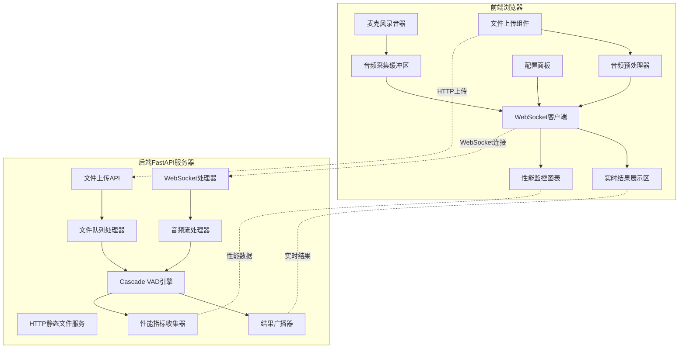

# Cascade VAD Web演示界面 - 技术设计文档

## 🎯 整体架构设计

### 核心设计理念
- **实时流式处理** - WebSocket + Cascade异步VAD引擎
- **双输入模式** - 麦克风实时录音 + 文件上传处理
- **直观可视化** - 实时语音段检测结果展示
- **性能监控** - 延迟、吞吐量、准确率实时统计

### 技术栈选择
```
后端技术栈:
├── FastAPI - 高性能异步Web框架
├── WebSocket - 实时双向通信
├── Cascade - 核心VAD处理引擎
├── asyncio - 异步并发处理
└── uvicorn - ASGI服务器

前端技术栈:
├── 原生JavaScript - 轻量级无框架
├── WebRTC API - 麦克风音频采集
├── WebSocket API - 实时通信
├── Chart.js - 性能图表可视化
└── Bootstrap 5 - 响应式UI组件
```

## 📊 系统架构图



## 🔧 核心功能模块设计

### 1. 麦克风实时流式处理

#### 前端实现
- **WebRTC API** 获取麦克风音频流
- **AudioContext** 处理音频数据
- **WebSocket** 实时传输音频数据
- 支持16kHz采样率、单声道、浮点数格式

#### 后端实现
- **WebSocket处理器** 接收实时音频数据
- **音频流处理器** 转换为Cascade可处理的格式
- **VAD处理器** 实时处理音频数据
- **结果广播器** 实时返回VAD结果

#### 数据流程
1. 浏览器请求麦克风权限
2. 创建AudioContext处理音频
3. 通过WebSocket发送音频数据
4. 后端接收并处理音频数据
5. 实时返回VAD结果
6. 前端可视化展示结果

### 2. 音频文件上传处理

#### 支持格式
- WAV (16kHz/8kHz, 单声道/立体声)
- MP3 (自动转换为16kHz单声道)
- FLAC, OGG (可选支持)

#### 处理流程
1. 前端上传文件到后端API
2. 后端进行格式验证和预处理
3. 使用Cascade批量处理整个文件
4. 返回完整的VAD结果和性能指标

### 3. 实时结果可视化

#### 语音段可视化
- 波形图显示原始音频
- 高亮显示检测到的语音段
- 时间轴标记语音开始/结束点
- 置信度颜色编码

#### 性能指标展示
- 实时延迟图表
- 处理吞吐量统计
- CPU/内存使用监控
- 线程利用率展示

### 4. 参数动态调整

#### 可调整参数
- VAD阈值 (0.1-0.9)
- 块大小 (256ms-1024ms)
- 重叠大小 (16ms-64ms)
- 工作线程数 (1-8)
- 后端选择 (ONNX/Silero)

#### 实时效果
- 参数变更即时生效
- 结果对比展示
- 性能影响分析

## 📡 通信协议设计

### WebSocket消息类型

#### 客户端 → 服务器
- `audio_chunk`: 音频数据块
- `config_update`: 配置更新
- `start_recording`: 开始录音
- `stop_recording`: 停止录音

#### 服务器 → 客户端
- `vad_result`: VAD检测结果
- `performance_metrics`: 性能指标
- `error`: 错误信息
- `status`: 状态更新

### 消息格式示例

#### 音频数据块
```json
{
  "type": "audio_chunk",
  "data": [0.1, 0.2, -0.1, ...],
  "timestamp": 1640995200000,
  "sample_rate": 16000,
  "sequence": 123
}
```

#### VAD结果
```json
{
  "type": "vad_result",
  "is_speech": true,
  "probability": 0.85,
  "start_ms": 1234.5,
  "end_ms": 1756.8,
  "chunk_id": 123,
  "processing_time_ms": 2.3
}
```

## 🖥️ 用户界面设计

### 主界面布局

```
+-----------------------------------------------+
|                  页面标题栏                    |
+-----------------------------------------------+
|        |                                      |
|        |                                      |
| 控制面板|           结果显示区域                |
|        |                                      |
|        |                                      |
+-----------------------------------------------+
|              性能监控与统计区域                 |
+-----------------------------------------------+
```

### 控制面板设计

- **麦克风控制区**
  - 开始/停止录音按钮
  - 麦克风选择下拉菜单
  - 音量指示器

- **文件上传区**
  - 拖放区域
  - 文件选择按钮
  - 支持格式提示

- **VAD参数调整区**
  - 阈值滑块 (0.1-0.9)
  - 块大小选择 (256ms-1024ms)
  - 重叠大小设置 (16ms-64ms)

- **性能配置区**
  - 线程数调整 (1-8)
  - 后端选择 (ONNX/Silero)
  - 缓冲区大小设置

### 结果显示区设计

- **波形图显示区**
  - 原始音频波形
  - 语音段高亮显示
  - 时间轴标记

- **语音段列表**
  - 开始时间
  - 结束时间
  - 持续时间
  - 置信度

- **状态指示器**
  - 处理状态
  - 错误信息
  - 连接状态

### 性能监控区设计

- **延迟图表**
  - 实时处理延迟
  - 平均/最大/最小值

- **吞吐量指标**
  - 块/秒处理速率
  - 实时倍率

- **资源使用**
  - CPU使用率
  - 内存占用
  - 线程活动

## 🚀 实现路线图

### 前端实现步骤

1. 创建基础HTML/CSS页面结构
2. 实现麦克风录音功能
3. 实现WebSocket通信
4. 开发文件上传处理
5. 实现结果可视化组件
6. 集成性能监控图表
7. 完善配置面板交互

### 后端实现步骤

1. 搭建FastAPI基础框架
2. 实现WebSocket处理器
3. 集成Cascade VAD引擎
4. 开发文件上传API
5. 实现性能指标收集
6. 添加错误处理机制
7. 优化并发处理能力

## 🧪 测试场景

### 实时麦克风测试

**测试流程**:
1. 用户点击"开始录音"
2. 允许麦克风访问
3. 说话并观察实时VAD结果
4. 调整参数观察效果变化

**预期结果**:
- 延迟<100ms
- 准确检测语音段
- 参数调整即时生效

### 文件上传测试

**测试流程**:
1. 上传预先录制的音频文件
2. 配置处理参数
3. 观察处理结果和性能指标

**预期结果**:
- 正确识别所有语音段
- 高性能并行处理
- 完整的性能统计

## 📦 部署与运行

### 开发环境

```bash
# 安装依赖
pip install fastapi uvicorn websockets python-multipart

# 启动服务器
uvicorn web_demo.app:app --host 0.0.0.0 --port 8000 --reload
```

### 生产环境

```bash
# 优化启动
uvicorn web_demo.app:app --host 0.0.0.0 --port 8000 --workers 4
```

### 浏览器兼容性

- Chrome 90+
- Firefox 88+
- Safari 14+
- Edge 90+

## 📝 注意事项与限制

### 浏览器限制
- WebRTC需要HTTPS或localhost环境
- 部分浏览器可能限制音频采样率
- 移动设备可能有不同的麦克风访问策略

### 性能考虑
- WebSocket传输可能受网络延迟影响
- 大文件上传需要考虑超时设置
- 高并发场景需要优化服务器资源

### 安全考虑
- 限制上传文件大小
- 验证文件类型
- 防止恶意WebSocket连接

## 🔮 未来扩展

### 潜在功能扩展
- 多语言支持
- 批量文件处理
- 语音段导出功能
- 更多VAD模型支持

### 性能优化方向
- WebAssembly前端处理
- 音频数据压缩传输
- 服务端缓存优化
- 分布式处理支持
