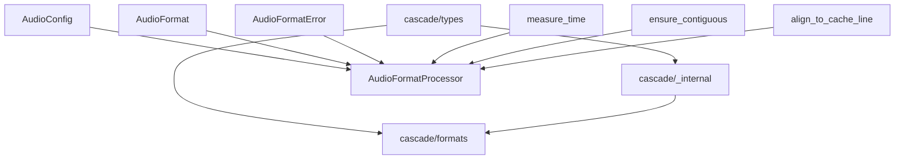

# Cascade项目已完成模块总结

> **文档版本**: v1.0  
> **更新时间**: 2025-01-30  
> **完成状态**: 三个核心模块实现完毕，所有测试通过  

## 📋 总体完成情况

### ✅ 已完成模块 (3/8)
- ✅ **核心类型系统** (`cascade/types/`)
- ✅ **内部工具模块** (`cascade/_internal/`)
- ✅ **音频格式处理模块** (`cascade/formats/`)

### ⏳ 待开发模块 (5/8)
- ⏳ **VAD语音活动检测** (`cascade/vad/`)
- ⏳ **音频缓冲管理** (`cascade/buffer/`)
- ⏳ **AI推理引擎** (`cascade/inference/`)
- ⏳ **性能监控系统** (`cascade/monitoring/`)
- ⏳ **主入口模块** (`cascade/__init__.py`)

---

## 🎯 已完成模块详细说明

### 1. 核心类型系统 (`cascade/types/`)

#### 📁 模块结构
```
cascade/types/
├── __init__.py          # 主要类型定义和导出 (308行)
├── errors.py           # 错误处理类型体系 (89行)
├── performance.py      # 性能监控类型 (78行)
└── version.py          # 版本管理类型 (67行)
```

#### 🔧 核心功能
- **音频配置管理**: `AudioConfig` - 支持WAV、PCMA格式，自动验证采样率和声道数
- **VAD配置**: `VADConfig` - 语音活动检测配置，支持块大小、重叠等参数
- **数据块管理**: `AudioChunk` - 音频数据块封装，支持重叠处理
- **VAD结果**: `VADResult` - 语音检测结果，包含时间戳和置信度
- **后端配置**: `ONNXConfig`、`VLLMConfig` - AI推理后端配置

#### 🔄 关键API
```python
# 音频配置
config = AudioConfig(sample_rate=16000, format=AudioFormat.WAV)
frame_size = config.frame_size  # 自动计算帧大小
bytes_per_sec = config.bytes_per_second  # 自动计算字节率

# VAD配置
vad_config = VADConfig(chunk_duration_ms=500, overlap_ms=100)
chunk_samples = vad_config.chunk_samples(16000)  # 基于采样率计算样本数

# 音频数据块
chunk = AudioChunk(
    data=audio_array,
    timestamp=1.5,
    sample_rate=16000,
    overlap_size=160
)
```

#### 🧪 测试覆盖
- **测试文件**: `tests/test_types.py` (308行)
- **测试用例**: 31个，全部通过 ✅
- **覆盖范围**: 配置验证、边界条件、错误处理、数据计算

---

### 2. 内部工具模块 (`cascade/_internal/`)

#### 📁 模块结构
```
cascade/_internal/
├── __init__.py          # 模块导出和兼容性别名 (45行)
├── atomic.py           # 线程安全原子操作 (78行)
└── utils.py            # 性能优化工具函数 (159行)
```

#### 🔧 核心功能
- **原子计数器**: `AtomicCounter` - 线程安全的计数器，支持CAS操作
- **内存对齐**: `align_to_cache_line()` - 缓存行对齐优化
- **性能测量**: `@measure_time` - 自动执行时间测量装饰器
- **内存优化**: `ensure_contiguous()` - 确保数组连续性

#### 🔄 关键API
```python
# 原子操作
counter = AtomicCounter(initial_value=0)
counter.increment()  # 线程安全递增
old_val = counter.compare_and_swap(expected=1, new_value=10)

# 性能测量
@measure_time
def audio_processing_function():
    # 自动打印执行时间
    pass

# 内存优化
aligned_array = align_to_cache_line(audio_data)  # 64字节对齐
contiguous_array = ensure_contiguous(audio_data)  # 确保连续
```

#### 🧪 测试覆盖
- **测试文件**: `tests/test_internal.py` (320行)
- **测试用例**: 17个，全部通过 ✅
- **覆盖范围**: 并发安全、内存对齐、性能测量、边界条件

---

### 3. 音频格式处理模块 (`cascade/formats/`)

#### 📁 模块结构
```
cascade/formats/
└── __init__.py          # 音频格式处理器 (419行)
```

#### 🔧 核心功能
- **格式验证**: 支持WAV、PCMA格式验证
- **格式转换**: int16/int32/float64 → float32标准化转换
- **PCMA解码**: G.711 A-law解码，使用查找表优化
- **采样率转换**: 线性插值重采样
- **块大小计算**: 预计算常用组合，动态计算其他

#### 🔄 关键API
```python
# 格式处理器
processor = AudioFormatProcessor(config)

# 格式验证
is_valid = processor.validate_format(AudioFormat.WAV, 16000, 1)

# 格式转换
float32_data = processor.convert_to_internal_format(
    audio_data=raw_data,
    format_type=AudioFormat.WAV,
    sample_rate=16000
)

# 块大小计算
chunk_size = processor.calculate_chunk_size(duration_ms=500, sample_rate=16000)
```

#### 🧪 测试覆盖
- **测试文件**: `tests/test_formats.py` (389行)
- **测试用例**: 21个，全部通过 ✅
- **覆盖范围**: 格式转换、边界条件、并发安全、性能测试

---

## 🔗 模块间依赖关系



### 依赖说明
- **types** → **_internal**: 性能监控类型依赖内部工具
- **types** → **formats**: 音频配置和错误类型被格式处理器使用
- **_internal** → **formats**: 性能测量和内存优化工具被格式处理器使用

---

## 📊 代码质量报告

### 测试质量
- **总测试数**: 69个
- **通过率**: 100% ✅
- **测试执行时间**: 0.36秒
- **警告数**: 12个 (仅Pydantic V2迁移警告，不影响功能)

### 代码规范
- **语法检查**: ✅ 全部通过
- **模块导入**: ✅ 全部正常
- **类型系统**: 使用Pydantic V2，完整类型验证
- **错误处理**: 分层异常体系，统一错误格式

### 性能特性
- **零拷贝优化**: 缓存行对齐，连续内存访问
- **并发安全**: 原子操作，线程安全设计
- **智能缓存**: 预计算常用块大小映射
- **性能监控**: 自动执行时间测量

---

## 🚀 后续模块开发指导

### 开发优先级
1. **VAD语音活动检测** - 依赖已完成的types和formats模块
2. **音频缓冲管理** - 依赖types、_internal和VAD模块
3. **AI推理引擎** - 依赖所有前置模块
4. **性能监控系统** - 集成所有模块的监控数据
5. **主入口模块** - 最终的统一API

### 设计约束
- **遵循已建立的模块模式**: 每个模块都要有完整的类型定义、错误处理、测试覆盖
- **保持API一致性**: 使用相同的命名规范和接口设计原则
- **性能优先**: 利用已有的内存对齐和原子操作工具
- **测试驱动**: 确保每个新模块都有100%测试覆盖率

### 接口设计原则
- **依赖注入**: 通过构造函数传入配置和依赖
- **错误传播**: 使用统一的异常类型体系
- **性能监控**: 关键函数使用`@measure_time`装饰器
- **并发安全**: 使用AtomicCounter和线程安全设计

### 技术栈继承
- **Pydantic V2**: 继续使用field_validator和model_validator
- **NumPy**: 音频数据处理的标准库
- **Threading**: 并发处理支持
- **Logging**: 统一的日志记录

---

## 🔧 开发环境配置

### 依赖管理
```bash
# 已配置的开发依赖
poetry install  # 安装所有依赖
poetry run pytest tests/ -v  # 运行测试
```

### 代码质量检查
```bash
# 语法检查
python -m py_compile cascade/模块名/*.py

# 导入测试  
python -c "import cascade.模块名; print('导入成功')"

# 完整测试
python -m pytest tests/ -v
```

### 新模块模板
每个新模块应包含：
- `__init__.py` - 主要功能实现
- 可选的子模块文件 (如errors.py, utils.py等)
- 对应的测试文件 `tests/test_模块名.py`
- 完整的类型注解和文档字符串

---

## 📝 注意事项

### 已知问题
- **Pydantic警告**: 使用了一些V2兼容模式，后续可完全迁移到ConfigDict
- **PCMA限制**: 目前仅支持8kHz单声道，可扩展支持更多配置

### 性能考虑
- **内存使用**: 大型音频数据应使用流式处理
- **CPU密集**: 音频转换已优化，但大批量处理需要考虑并行
- **缓存策略**: 块大小映射已预计算，新模块可复用此模式

### 扩展建议
- **音频格式**: 可轻松添加MP3、AAC等格式支持
- **AI后端**: 已预设ONNX、VLLM配置，可扩展TensorRT等
- **监控指标**: 可增加更多性能和质量指标

---

这份总结为后续的模块开发提供了完整的技术基础和开发指导，确保整个项目的一致性和质量标准。