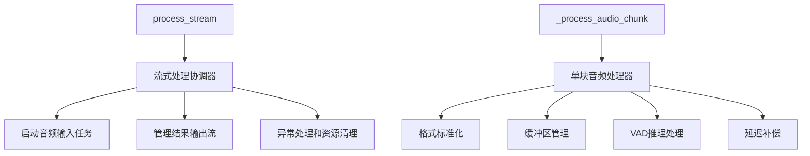
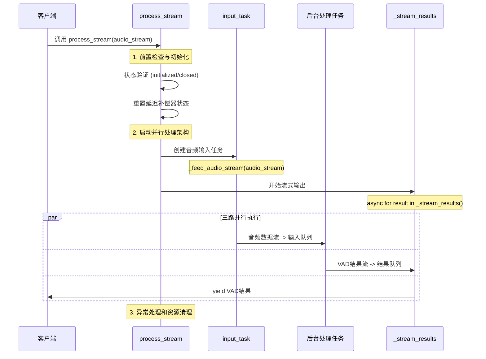
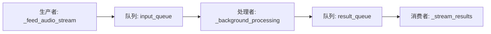
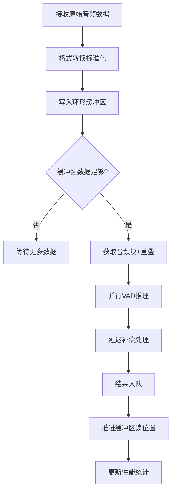

# VAD处理器流式处理核心逻辑详解

## 📖 概述

本文档详细解析VAD处理器(VADProcessor)的两个核心方法：`_process_audio_chunk`和`process_stream`的实现逻辑，这两个方法构成了整个流式VAD处理系统的核心。

## 🎯 核心方法概览

### 方法职责分工



## 🔄 process_stream 流式处理核心

### 方法签名与接口设计

```python
async def process_stream(self, audio_stream: AsyncIterator[np.ndarray]) -> AsyncIterator[VADResult]:
    """
    流式处理音频数据的核心协调器
    
    设计模式：
    - 异步生成器模式：支持 async for 语法
    - 生产者-消费者模式：输入->处理->输出的流水线
    - 双任务并行架构：输入任务与输出迭代并行执行
    """
```

### 流式处理架构



### 详细流程步骤

#### 1. 前置检查与初始化

```python
# 状态验证 - 确保处理器处于可用状态
if not self._initialized.get():
    raise CascadeError("处理器未初始化", ErrorCode.INVALID_STATE)
if self._closed.get():
    raise CascadeError("处理器已关闭", ErrorCode.INVALID_STATE)

# 延迟补偿器状态重置 - 每个新音频流开始时重置
if self._delay_compensator:
    self._delay_compensator.reset()
    logger.debug(f"延迟补偿器已重置，补偿时长: {self._delay_compensator.get_compensation_ms()}ms")
```

**关键设计要点：**
- 原子状态检查：使用AtomicBoolean确保线程安全
- 延迟补偿状态管理：每个新流开始时重置，避免状态污染

#### 2. 双任务并行架构

```python
# 启动音频输入任务 - 独立运行
input_task = asyncio.create_task(self._feed_audio_stream(audio_stream))

# 流式输出结果 - 主线程执行
async for result in self._stream_results():
    yield result
```

**架构特点：**
- **输入任务**：异步独立运行，持续从音频流读取数据
- **输出迭代**：主线程执行，实现背压控制
- **后台处理**：独立运行，连接输入输出队列

#### 3. 异常处理与资源清理

```python
finally:
    # 优雅取消未完成的任务
    if not input_task.done():
        input_task.cancel()
        try:
            await input_task
        except asyncio.CancelledError:
            pass
    logger.info("流式VAD处理结束")
```

### 关键设计模式

#### 异步生成器模式
```python
async for result in self._stream_results():
    yield result  # 实时流式输出，支持背压控制
```
- 支持 `async for` 语法
- 自动实现背压控制机制
- 消费速度控制生产速度

#### 生产者-消费者模式


#### 结束信号传播机制
```python
# 输入结束 -> 输入队列
await self._input_queue.put(None)

# 处理结束 -> 结果队列  
await self._result_queue.put(None)

# 输出结束 -> 停止迭代
if result is None:
    break
```

## ⚙️ _process_audio_chunk 音频块处理核心

### 方法职责与流程



### 详细处理步骤

#### 1. 格式转换和标准化

```python
# 统一音频格式处理
processed_data = self._format_processor.convert_to_internal_format(
    audio_data,  # 从输入队列取出的原始数据
    self._config.audio_config.format,
    self._config.audio_config.sample_rate
)
```

**设计要点：**
- 输入：原始多格式音频数据
- 输出：标准化的内部格式数据
- 支持多种音频格式自动转换

#### 2. 环形缓冲区写入

```python
# 非阻塞写入，避免系统阻塞
success = self._buffer.write(processed_data, blocking=False)
if not success:
    logger.warning("缓冲区满，丢弃音频数据")
    return
```

**关键特性：**
- 非阻塞写入：避免系统卡死
- 优雅降级：缓冲区满时丢弃数据而非崩溃
- 零拷贝设计：高效内存管理

#### 3. 重叠窗口处理

```python
# 计算音频块大小和重叠大小
chunk_size = self._config.vad_config.get_chunk_samples(
    self._config.audio_config.sample_rate
)
overlap_size = self._config.vad_config.get_overlap_samples(
    self._config.audio_config.sample_rate
)

# 获取带重叠的音频块
chunk, available = self._buffer.get_chunk_with_overlap(chunk_size, overlap_size)
```

**重叠窗口优势：**
- 提高VAD检测连续性
- 减少边界效应
- 提升整体检测准确性

#### 4. 并行VAD推理

```python
if available and chunk is not None:
    # 异步并行VAD处理
    result = await self._thread_pool.process_chunk_async(chunk)
```

**并行设计：**
- 专用VAD线程池
- 异步非阻塞处理
- 支持多线程并发推理

#### 5. 延迟补偿处理

```python
# 简化延迟补偿实现
if self._delay_compensator:
    result = self._delay_compensator.process_result(result)
```

#### 6. 结果队列管理

```python
# 非阻塞结果入队
try:
    self._result_queue.put_nowait(result)
except asyncio.QueueFull:
    logger.warning("结果队列满，丢弃VAD结果")
```

#### 7. 缓冲区位置推进

```python
# 推进读位置，为下一块处理做准备
advance_size = chunk_size - overlap_size
self._buffer.advance_read_position(advance_size)
```

### 性能统计与监控

```python
# 实时性能统计
processing_time = (time.perf_counter() - start_time) * 1000
self._chunks_processed.increment(1)
self._total_processing_time_ms.add(processing_time)
```

## 🚀 性能优化特性

### 1. 非阻塞流控机制

```python
# 队列容量限制
maxsize=self._config.max_queue_size

# 队列满时的处理策略
except asyncio.QueueFull:
    logger.warning("队列满，丢弃数据")  # 优雅降级
```

### 2. 超时防护机制

```python
# 避免无限等待
result = await asyncio.wait_for(
    self._result_queue.get(),
    timeout=0.1
)
```

### 3. 零拷贝内存管理

- 环形缓冲区实现高效内存复用
- 减少数据拷贝操作
- 提升整体处理性能

### 4. 并发处理优化

- VAD推理使用专用线程池
- 支持多线程并发处理
- 异步非阻塞设计

## 🛡️ 异常处理与恢复

### 错误分类处理

```python
try:
    # 核心处理逻辑
    await self._process_audio_chunk(audio_data)
except Exception as e:
    logger.error(f"处理音频块失败: {e}")
    self._error_count.increment(1)
    # 错误统计，但不中断流程
```

### 重试机制配置

```python
class VADProcessorConfig:
    max_retries: int = Field(default=3, description="最大重试次数")
    retry_delay_seconds: float = Field(default=0.1, description="重试延迟")
```

### 资源清理机制

```python
# 确保资源正确释放
async def _cleanup(self):
    # 停止后台任务
    if self._processing_task:
        self._processing_task.cancel()
    
    # 关闭线程池
    if self._thread_pool:
        await self._thread_pool.close()
    
    # 清空队列
    # ... 清理逻辑
```

## 📊 性能监控指标

### 延迟指标
- 平均延迟 (avg_latency_ms)
- P50/P95/P99延迟分位数
- 最大延迟 (max_latency_ms)

### 吞吐量指标
- 每秒处理块数 (throughput_qps)
- 每秒处理数据量 (throughput_mbps)

### 错误指标
- 错误率 (error_rate)
- 成功/失败计数

### 资源指标
- 活跃线程数
- 队列深度
- 缓冲区利用率

## 🎯 设计优势总结

1. **真正的流式处理**：音频流入的同时，VAD结果实时流出
2. **模块化设计**：各组件职责清晰，易于维护和扩展
3. **高性能优化**：零拷贝、并行处理、非阻塞设计
4. **完善的错误处理**：优雅降级、错误统计、资源清理
5. **生产级特性**：性能监控、配置管理、状态管理

这个设计实现了一个**高性能、可扩展、生产就绪**的语音活动检测流式处理系统，特别适合实时音频流处理场景。