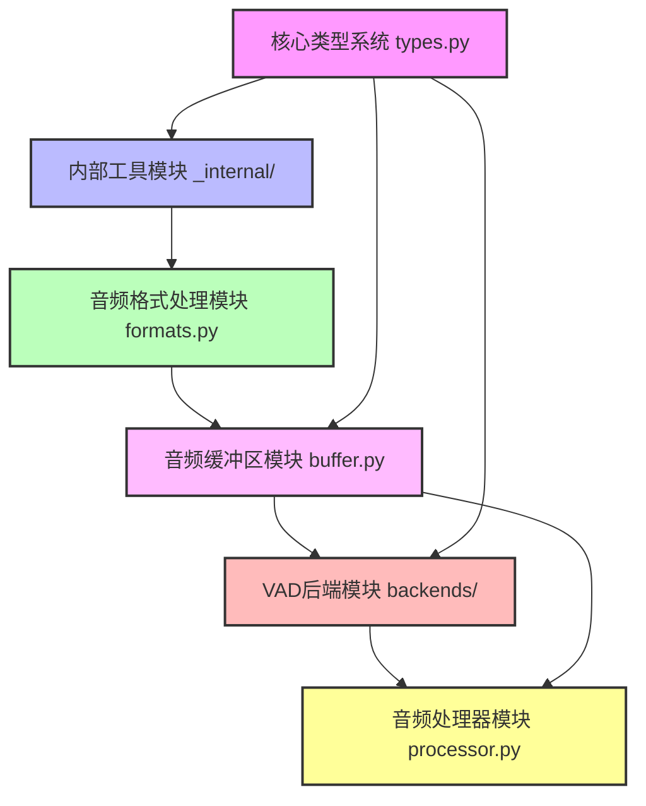

# Cascade项目代码实施计划

本文档提供了Cascade项目的代码实施计划，按照依赖关系和复杂度排序，优先实施无状态的非核心部分。

## 实施顺序与优先级



## 第一阶段：无状态非核心模块实施

### 1. 核心类型系统 (types.py)

**实施内容**：
- 实现所有pydantic模型类定义
- 实现枚举类型定义
- 实现验证器和辅助方法

**具体任务**：
- 实现基础枚举类型 (AudioFormat, VADBackend, ProcessingMode等)
- 实现音频配置类型 (AudioConfig)
- 实现VAD配置类型 (VADConfig)
- 实现音频数据类型 (AudioChunk, AudioMetadata)
- 实现VAD结果类型 (VADResult, VADSegment)
- 实现后端配置类型 (BackendConfig, ONNXConfig, VLLMConfig)
- 实现性能监控类型 (PerformanceMetrics, SystemStatus, BufferStatus)
- 实现错误处理类型 (ErrorCode, ErrorSeverity, PreVADError等)
- 实现版本和兼容性类型 (VersionInfo, CompatibilityInfo)

**预计工作量**：中等（约500行代码）

**实施步骤**：
```python
# 1. 导入必要的库
from typing import Optional, Dict, Any, List, Union, Literal
from enum import Enum
from datetime import datetime, timezone
from pydantic import BaseModel, Field, validator, root_validator
import sys

# 2. 实现基础枚举类型
class AudioFormat(str, Enum):
    """支持的音频格式"""
    WAV = "wav"
    PCMA = "pcma"
    
    @classmethod
    def get_supported_formats(cls) -> List[str]:
        """获取支持的格式列表"""
        return [format.value for format in cls]

# 3. 实现音频配置类型
class AudioConfig(BaseModel):
    """音频处理配置"""
    sample_rate: int = Field(default=16000, description="采样率")
    format: AudioFormat = Field(default=AudioFormat.WAV, description="音频格式")
    channels: int = Field(default=1, description="通道数")
    dtype: str = Field(default="float32", description="数据类型")
    
    @validator('sample_rate')
    def validate_sample_rate(cls, v):
        """验证采样率"""
        supported_rates = [8000, 16000, 22050, 44100, 48000]
        if v not in supported_rates:
            raise ValueError(f'采样率必须是以下之一: {supported_rates}')
        return v

# 4. 实现其他类型...
```

### 2. 内部工具模块 (_internal/)

#### 2.1 原子操作工具 (_internal/atomic.py)

**实施内容**：
- 实现原子整数类 (AtomicInteger)
- 实现原子浮点数类 (AtomicFloat)
- 实现原子布尔类 (AtomicBoolean)
- 实现原子引用类 (AtomicReference)

**具体任务**：
- 实现基于threading.Lock的原子操作
- 实现原子增减操作
- 实现原子比较和交换操作
- 实现原子更新操作

**预计工作量**：小（约100行代码）

**实施步骤**：
```python
# 1. 导入必要的库
import threading
from typing import TypeVar, Generic, Optional, Callable

# 2. 实现AtomicInteger类
class AtomicInteger:
    """线程安全的原子整数类"""
    
    def __init__(self, initial_value: int = 0):
        self._value = initial_value
        self._lock = threading.Lock()
    
    def get(self) -> int:
        """获取当前值"""
        with self._lock:
            return self._value
    
    def set(self, new_value: int) -> None:
        """设置新值"""
        with self._lock:
            self._value = new_value
    
    def increment(self, delta: int = 1) -> int:
        """增加值并返回新值"""
        with self._lock:
            self._value += delta
            return self._value
    
    def decrement(self, delta: int = 1) -> int:
        """减少值并返回新值"""
        with self._lock:
            self._value -= delta
            return self._value
    
    def compare_and_set(self, expected: int, update: int) -> bool:
        """比较并设置值"""
        with self._lock:
            if self._value == expected:
                self._value = update
                return True
            return False

# 3. 实现其他原子类...
```

#### 2.2 内部工具函数 (_internal/utils.py)

**实施内容**：
- 实现通用工具函数
- 实现性能优化工具
- 实现调试辅助工具

**具体任务**：
- 实现内存对齐函数
- 实现时间测量装饰器
- 实现日志工具函数
- 实现配置验证工具
- 实现异常处理工具

**预计工作量**：小（约150行代码）

**实施步骤**：
```python
# 1. 导入必要的库
import time
import functools
import logging
import asyncio
from typing import Any, Callable, TypeVar, Optional, Dict
import numpy as np

# 2. 实现内存对齐函数
def align_to_cache_line(array: np.ndarray, cache_line_size: int = 64) -> np.ndarray:
    """将数组对齐到缓存行"""
    element_size = array.itemsize
    total_bytes = array.size * element_size
    aligned_bytes = (total_bytes + cache_line_size - 1) // cache_line_size * cache_line_size
    aligned_size = aligned_bytes // element_size
    
    aligned_array = np.zeros(aligned_size, dtype=array.dtype)
    aligned_array[:array.size] = array
    
    # 验证对齐
    assert aligned_array.ctypes.data % cache_line_size == 0, "数组未正确对齐"
    
    return aligned_array[:array.size]  # 返回原始大小的视图

# 3. 实现时间测量装饰器
def measure_time(func):
    """测量函数执行时间的装饰器"""
    @functools.wraps(func)
    def wrapper(*args, **kwargs):
        start_time = time.time()
        result = func(*args, **kwargs)
        end_time = time.time()
        print(f"{func.__name__} 执行时间: {(end_time - start_time) * 1000:.2f}ms")
        return result
    return wrapper

# 4. 实现其他工具函数...
```

### 3. 音频格式处理模块 (formats.py)

**实施内容**：
- 实现AudioFormatProcessor类
- 实现格式验证和转换功能
- 实现性能优化策略

**具体任务**：
- 实现格式验证函数
- 实现格式转换函数 (PCMA到float32, int16到float32等)
- 实现采样率转换函数
- 实现块大小计算函数
- 实现内存优化函数
- 实现缓存策略

**预计工作量**：中等（约300行代码）

**实施步骤**：
```python
# 1. 导入必要的库
import numpy as np
from typing import Tuple, Dict, Any, Optional, List
from .types import AudioConfig, AudioFormat
from ._internal.utils import align_to_cache_line, measure_time

# 2. 预计算块大小映射
CHUNK_SIZES = {
    8000: {  # 8kHz
        16: 128,     # 16ms
        32: 256,     # 32ms
        100: 800,    # 100ms
        250: 2000,   # 250ms
        500: 4000,   # 500ms
        1000: 8000   # 1000ms
    },
    16000: { # 16kHz
        16: 256,     # 16ms
        32: 512,     # 32ms
        100: 1600,   # 100ms
        250: 4000,   # 250ms
        500: 8000,   # 500ms
        1000: 16000  # 1000ms
    }
}

# 3. 实现AudioFormatProcessor类
class AudioFormatProcessor:
    """音频格式处理器 - 纯功能实现"""
    
    def __init__(self, config: AudioConfig):
        """初始化格式处理器"""
        self.config = config
        self._chunk_size_cache = {}  # 预计算缓存
        self._conversion_cache = {}  # 转换函数缓存
    
    def validate_format(self, format_type: AudioFormat, sample_rate: int, channels: int) -> bool:
        """验证音频格式是否支持"""
        # 验证格式
        if format_type not in AudioFormat:
            return False
        
        # 验证采样率
        if sample_rate not in [8000, 16000]:
            return False
        
        # 验证通道数
        if channels != 1:
            return False
        
        # 验证格式特定限制
        if format_type == AudioFormat.PCMA and sample_rate not in [8000, 16000]:
            return False
        
        return True
    
    def convert_to_internal_format(self, audio_data: np.ndarray, 
                                 format_type: AudioFormat, 
                                 sample_rate: int) -> np.ndarray:
        """转换为内部处理格式(float32)"""
        # 格式转换
        if format_type == AudioFormat.PCMA:
            audio_data = self._pcma_to_float32(audio_data)
        elif audio_data.dtype == np.int16:
            audio_data = self._int16_to_float32(audio_data)
        elif audio_data.dtype != np.float32:
            audio_data = audio_data.astype(np.float32)
        
        # 采样率转换
        if sample_rate != self.config.sample_rate:
            audio_data = self._resample_audio(audio_data, sample_rate, self.config.sample_rate)
        
        return audio_data
    
    def calculate_chunk_size(self, duration_ms: int, sample_rate: int) -> int:
        """计算指定时长的块大小"""
        # 1. 尝试从缓存获取
        cache_key = (duration_ms, sample_rate)
        if cache_key in self._chunk_size_cache:
            return self._chunk_size_cache[cache_key]
        
        # 2. 尝试从预计算表获取
        if sample_rate in CHUNK_SIZES and duration_ms in CHUNK_SIZES[sample_rate]:
            result = CHUNK_SIZES[sample_rate][duration_ms]
            self._chunk_size_cache[cache_key] = result
            return result
        
        # 3. 动态计算
        result = int(duration_ms * sample_rate / 1000)
        self._chunk_size_cache[cache_key] = result
        return result
    
    # 4. 实现其他方法...
```

## 第二阶段：有状态模块实施（后续计划）

### 4. 音频缓冲区模块 (buffer.py)

**实施内容**：
- 实现AudioRingBuffer类
- 实现线程安全机制
- 实现零拷贝读取
- 实现重叠块获取

**预计工作量**：大（约400行代码）

### 5. VAD后端模块 (backends/)

**实施内容**：
- 实现VADBackend抽象基类
- 实现ONNX后端
- 实现VLLM后端
- 实现线程本地存储机制

**预计工作量**：大（约500行代码）

### 6. 音频处理器模块 (processor.py)

**实施内容**：
- 实现VADProcessor类
- 实现异步处理流程
- 实现并行处理机制
- 实现结果合并策略

**预计工作量**：大（约600行代码）

## 实施建议

1. **先实现基础类型**：从types.py开始，因为它是所有其他模块的基础
2. **编写单元测试**：为每个模块编写单元测试，确保功能正确
3. **遵循代码规范**：使用black、isort、ruff等工具确保代码质量
4. **文档注释**：为所有类和方法添加详细的文档注释
5. **渐进式实施**：先实现基本功能，然后再添加优化和高级特性
6. **持续集成**：设置CI/CD流程，确保代码质量和测试覆盖率

## 测试计划

为每个模块编写单元测试，确保功能正确性和性能符合预期：

```python
# tests/unit/test_types.py
def test_audio_config_validation():
    """测试音频配置验证"""
    # 有效配置
    valid_config = AudioConfig(sample_rate=16000, format="wav")
    assert valid_config.sample_rate == 16000
    
    # 无效配置
    with pytest.raises(ValidationError):
        AudioConfig(sample_rate=99999)  # 不支持的采样率

# tests/unit/test_formats.py
def test_format_conversion():
    """测试格式转换"""
    processor = AudioFormatProcessor(AudioConfig())
    
    # 创建测试数据
    pcma_data = np.random.randint(0, 256, size=1000, dtype=np.uint8)
    
    # 转换为内部格式
    float32_data = processor.convert_to_internal_format(
        pcma_data, AudioFormat.PCMA, 8000
    )
    
    # 验证结果
    assert float32_data.dtype == np.float32
    assert len(float32_data) == 2000  # 8kHz -> 16kHz
```

## 性能基准测试

为关键模块编写性能基准测试，确保性能符合预期：

```python
# tests/benchmarks/test_formats_performance.py
def test_format_conversion_performance():
    """测试格式转换性能"""
    processor = AudioFormatProcessor(AudioConfig())
    
    # 创建大型测试数据
    pcma_data = np.random.randint(0, 256, size=160000, dtype=np.uint8)  # 10秒@16kHz
    
    # 测量转换性能
    start_time = time.time()
    for _ in range(100):
        processor.convert_to_internal_format(
            pcma_data, AudioFormat.PCMA, 8000
        )
    end_time = time.time()
    
    # 计算平均转换时间
    avg_time_ms = (end_time - start_time) * 1000 / 100
    
    # 验证性能
    assert avg_time_ms < 10  # 平均转换时间应小于10ms
```

## 下一步行动

1. 创建项目基础结构
2. 实现types.py模块
3. 实现_internal/atomic.py模块
4. 实现_internal/utils.py模块
5. 实现formats.py模块
6. 为已实现的模块编写单元测试

这个实施计划优先实现了无状态的非核心部分，为后续的有状态模块实施奠定了基础。这些模块相对独立，可以并行开发，并且易于测试和验证。