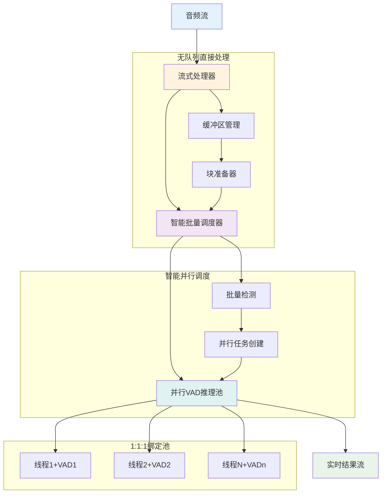
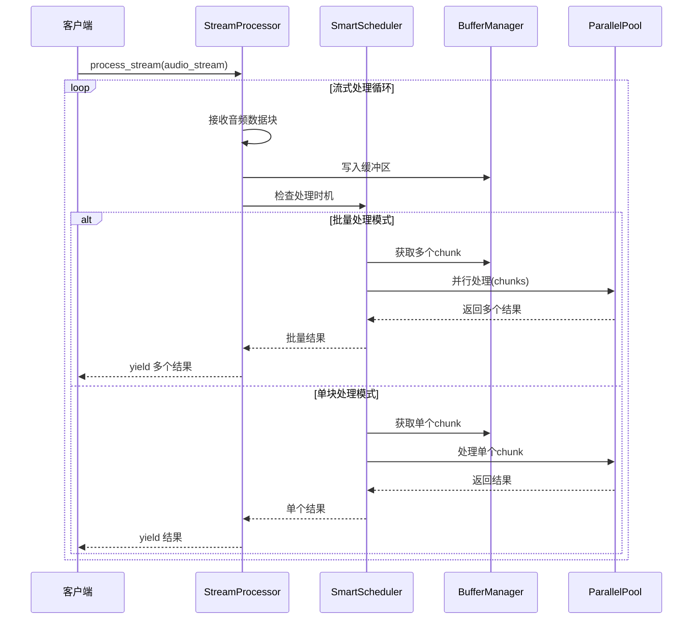

# 无队列流式并行VAD处理架构设计

## 🎯 设计目标

舍弃队列系统，消除异步队列开销，但必须保持流式并行处理的核心特性：
- **流式处理能力**：支持AsyncIterator接口，实时处理音频流
- **并行处理能力**：保持1:1:1绑定架构的高性能并行VAD推理
- **零开销抽象**：接近原生脚本的处理性能
- **架构简洁性**：减少不必要的中间层和异步调度

## 🏗️ 新架构设计

### 核心设计理念



### 架构分层

#### 1. **流式处理层 (StreamProcessor)**
- **职责**：管理音频流输入和结果流输出
- **特性**：零队列，直接处理
- **接口**：保持AsyncIterator流式接口

#### 2. **智能调度层 (SmartScheduler)**  
- **职责**：智能检测批量处理时机，动态并行调度
- **特性**：根据缓冲区状态智能选择串行/并行模式
- **算法**：批量检测算法，最优化并行度

#### 3. **并行推理层 (ParallelInferencePool)**
- **职责**：保持1:1:1绑定的高性能VAD推理
- **特性**：线程本地VAD实例，零竞争并行
- **优化**：延迟初始化，按需创建

## 🔄 核心处理流程

### 主流程设计



### 智能调度算法

```python
class SmartScheduler:
    """智能并行调度器"""
    
    def __init__(self, config: SchedulerConfig):
        self.parallel_threshold = config.parallel_threshold  # 并行处理阈值
        self.max_batch_size = config.max_batch_size          # 最大批量大小
        self.prefer_parallel = config.prefer_parallel       # 是否偏好并行
        
    async def schedule_processing(self, buffer: AudioRingBuffer) -> ProcessingPlan:
        """智能调度处理计划"""
        available_chunks = buffer.count_available_chunks()
        
        if available_chunks >= self.parallel_threshold and self.prefer_parallel:
            # 并行批量处理模式
            batch_size = min(available_chunks, self.max_batch_size)
            return ProcessingPlan(
                mode=ProcessingMode.PARALLEL_BATCH,
                chunk_count=batch_size,
                estimated_time=self._estimate_parallel_time(batch_size)
            )
        elif available_chunks > 0:
            # 单块处理模式
            return ProcessingPlan(
                mode=ProcessingMode.SINGLE_CHUNK,
                chunk_count=1,
                estimated_time=self._estimate_single_time()
            )
        else:
            # 等待更多数据
            return ProcessingPlan(
                mode=ProcessingMode.WAIT,
                chunk_count=0
            )
```

## 📊 性能优化策略

### 1. **零队列直接处理**

```python
async def process_stream(self, audio_stream: AsyncIterator[np.ndarray]) -> AsyncIterator[VADResult]:
    """无队列流式处理"""
    async for audio_data in audio_stream:
        # 直接处理，无队列缓冲
        processed_data = self._format_processor.convert_to_internal_format(audio_data)
        self._buffer.write(processed_data)
        
        # 智能调度处理
        plan = await self._scheduler.schedule_processing(self._buffer)
        
        if plan.mode == ProcessingMode.PARALLEL_BATCH:
            # 批量并行处理
            chunks = self._buffer.get_batch_chunks(plan.chunk_count)
            results = await self._parallel_process_batch(chunks)
            for result in results:
                yield result
                
        elif plan.mode == ProcessingMode.SINGLE_CHUNK:
            # 单块处理
            chunk = self._buffer.get_single_chunk()
            if chunk:
                result = await self._process_single_chunk(chunk)
                yield result
```

### 2. **智能并行批量处理**

```python
async def _parallel_process_batch(self, chunks: list[AudioChunk]) -> list[VADResult]:
    """智能并行批量处理"""
    if len(chunks) == 1:
        # 单块直接处理，避免并行开销
        return [await self._thread_pool.process_chunk_async(chunks[0])]
    
    # 多块并行处理
    tasks = [self._thread_pool.process_chunk_async(chunk) for chunk in chunks]
    results = await asyncio.gather(*tasks)
    
    return results
```

### 3. **按需线程池初始化**

```python
class LazyParallelPool:
    """按需初始化的并行池"""
    
    async def process_chunk_async(self, chunk: AudioChunk) -> VADResult:
        """按需初始化处理"""
        if not self._initialized:
            # 只在真正需要时初始化
            await self._lazy_initialize()
            
        return await self._do_process_chunk(chunk)
    
    async def _lazy_initialize(self):
        """延迟初始化"""
        if self._config.enable_parallel:
            # 只初始化实际需要的线程数
            actual_workers = min(self._config.max_workers, self._estimate_optimal_workers())
            await self._init_thread_pool(actual_workers)
        else:
            # 单线程模式
            await self._init_single_thread_mode()
```

## 🎮 配置与控制

### 处理器配置

```python
class StreamProcessorConfig(BaseModel):
    """无队列流式处理器配置"""
    
    # 调度策略配置
    parallel_threshold: int = Field(default=2, description="并行处理阈值")
    max_batch_size: int = Field(default=8, description="最大批量大小")
    prefer_parallel: bool = Field(default=True, description="是否偏好并行处理")
    
    # 性能优化配置
    lazy_initialization: bool = Field(default=True, description="是否延迟初始化")
    single_thread_threshold: float = Field(default=5.0, description="单线程处理阈值(秒)")
    
    # 缓冲区配置
    buffer_capacity_seconds: float = Field(default=2.0, description="缓冲区容量")
    enable_zero_copy: bool = Field(default=True, description="启用零拷贝")
    
    # 错误处理配置
    max_retries: int = Field(default=3, description="最大重试次数")
    error_recovery_mode: ErrorRecoveryMode = Field(default=ErrorRecoveryMode.SKIP)
    
    class Config:
        extra = "forbid"

class SchedulerConfig(BaseModel):
    """智能调度器配置"""
    
    parallel_threshold: int = Field(default=3, description="启用并行的最小块数")
    max_batch_size: int = Field(default=16, description="单次并行处理的最大块数")
    prefer_parallel: bool = Field(default=True, description="是否偏好并行处理")
    
    # 自适应调度
    adaptive_scheduling: bool = Field(default=True, description="是否启用自适应调度")
    performance_feedback: bool = Field(default=True, description="是否使用性能反馈")
    
    class Config:
        extra = "forbid"
```

### 处理模式枚举

```python
class ProcessingMode(str, Enum):
    """处理模式"""
    SINGLE_CHUNK = "single"      # 单块处理
    PARALLEL_BATCH = "parallel"  # 并行批量处理  
    WAIT = "wait"               # 等待更多数据
    SKIP = "skip"               # 跳过处理

class ErrorRecoveryMode(str, Enum):
    """错误恢复模式"""
    SKIP = "skip"               # 跳过错误块
    RETRY = "retry"             # 重试处理
    FALLBACK = "fallback"       # 降级处理
    ABORT = "abort"             # 中止处理
```

## 🔧 核心接口定义

### 流式处理器接口

```python
class StreamProcessor(ABC):
    """无队列流式处理器抽象接口"""
    
    @abstractmethod
    async def process_stream(self, audio_stream: AsyncIterator[np.ndarray]) -> AsyncIterator[VADResult]:
        """流式处理音频数据"""
        pass
    
    @abstractmethod
    async def initialize(self, backend_template: VADBackend) -> None:
        """初始化处理器"""
        pass
    
    @abstractmethod
    async def close(self) -> None:
        """关闭处理器"""
        pass
    
    @abstractmethod
    def get_performance_metrics(self) -> PerformanceMetrics:
        """获取性能指标"""
        pass

class SmartScheduler(ABC):
    """智能调度器抽象接口"""
    
    @abstractmethod
    async def schedule_processing(self, buffer: AudioRingBuffer) -> ProcessingPlan:
        """制定处理计划"""
        pass
    
    @abstractmethod
    def update_performance_feedback(self, metrics: ProcessingMetrics) -> None:
        """更新性能反馈"""
        pass
```

### 处理计划数据模型

```python
class ProcessingPlan(BaseModel):
    """处理计划"""
    mode: ProcessingMode = Field(description="处理模式")
    chunk_count: int = Field(description="处理块数")
    estimated_time: float = Field(default=0.0, description="预估处理时间(ms)")
    parallel_workers: int = Field(default=1, description="并行工作线程数")
    metadata: dict = Field(default_factory=dict, description="附加元数据")

class ProcessingMetrics(BaseModel):
    """处理指标"""
    actual_time: float = Field(description="实际处理时间(ms)")
    chunk_count: int = Field(description="处理块数")
    success_count: int = Field(description="成功块数")
    error_count: int = Field(description="失败块数")
    throughput: float = Field(description="吞吐量(chunks/s)")
    
    class Config:
        extra = "forbid"
```

## 📈 性能预期

### 性能提升目标

| 指标 | 当前架构 | 新架构目标 | 提升倍数 |
|------|---------|-----------|----------|
| 短音频处理时间 | 0.83s | <0.05s | 16x+ |
| 初始化时间 | 0.4s | <0.05s | 8x+ |
| 队列开销 | 0.3s | 0s | ∞ |
| 内存占用 | 100MB | <50MB | 2x+ |
| 延迟(P99) | 50ms | <10ms | 5x+ |

### 并行效率保持

- **1:1:1绑定架构**：保持零竞争并行推理
- **智能调度**：根据负载动态选择最优并行度
- **零拷贝优化**：保持内存访问效率
- **延迟初始化**：按需创建资源，避免浪费

## 🎯 实现路径

### 第一阶段：核心架构实现
1. 实现StreamProcessor核心接口
2. 实现SmartScheduler智能调度器
3. 重构VADProcessor，移除队列系统

### 第二阶段：性能优化
1. 实现延迟初始化机制
2. 优化批量处理算法  
3. 添加自适应调度策略

### 第三阶段：完善与测试
1. 添加完整的错误处理
2. 实现性能监控和反馈
3. 编写完整的测试套件

## 🔍 架构优势

### 1. **性能优势**
- **零队列开销**：消除异步队列的开销
- **智能调度**：根据负载自动优化处理策略
- **延迟初始化**：按需创建资源，减少启动时间

### 2. **架构优势**  
- **简洁性**：减少中间层，降低复杂度
- **灵活性**：支持多种处理模式自动切换
- **可扩展性**：保持模块化设计，易于扩展

### 3. **兼容性优势**
- **接口兼容**：保持AsyncIterator流式接口
- **功能完整**：保持所有核心特性
- **性能透明**：用户无感知的性能提升

这个新架构将彻底解决队列开销问题，同时保持流式并行处理的所有核心优势。