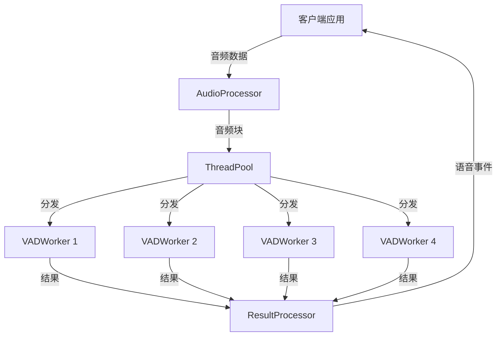
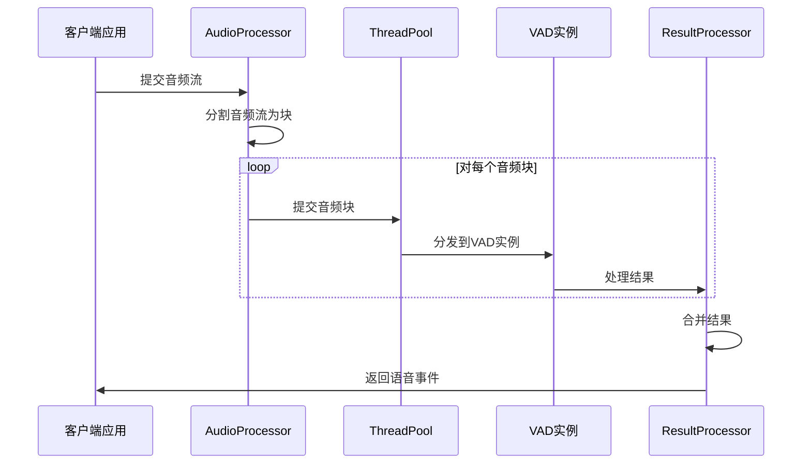
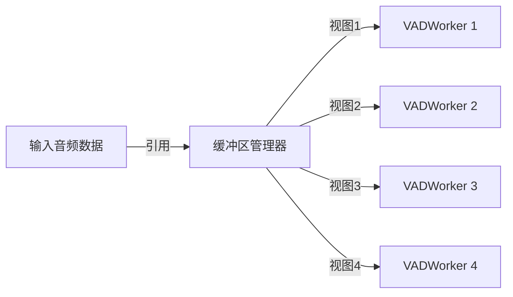
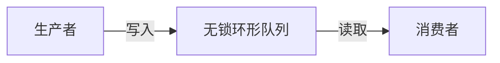
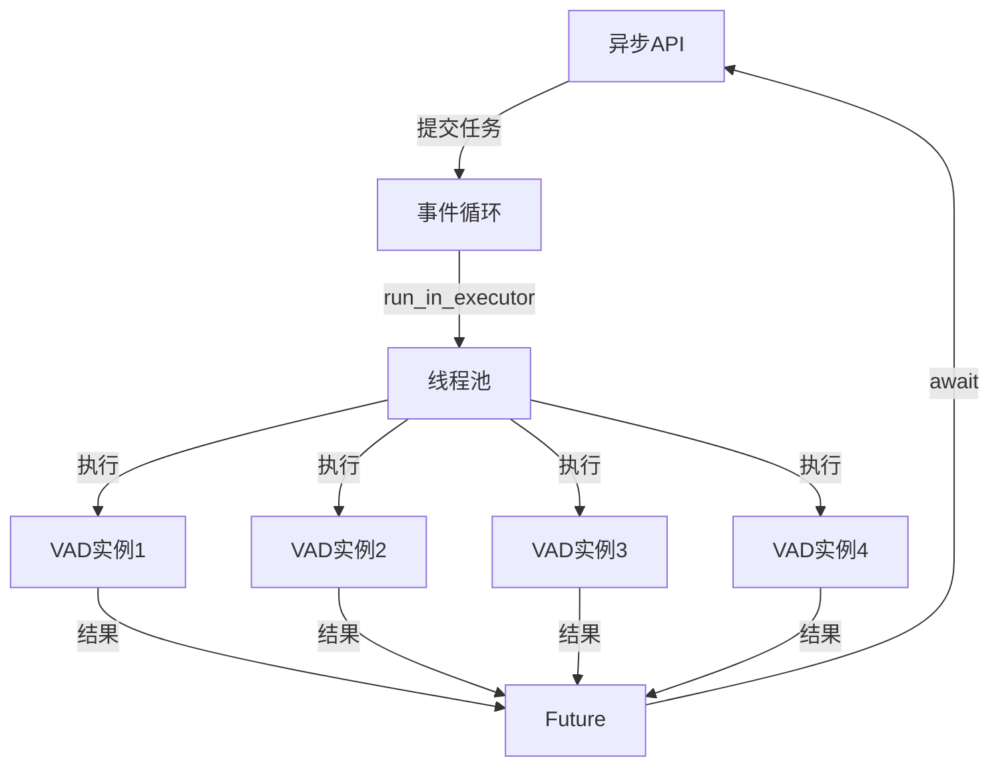
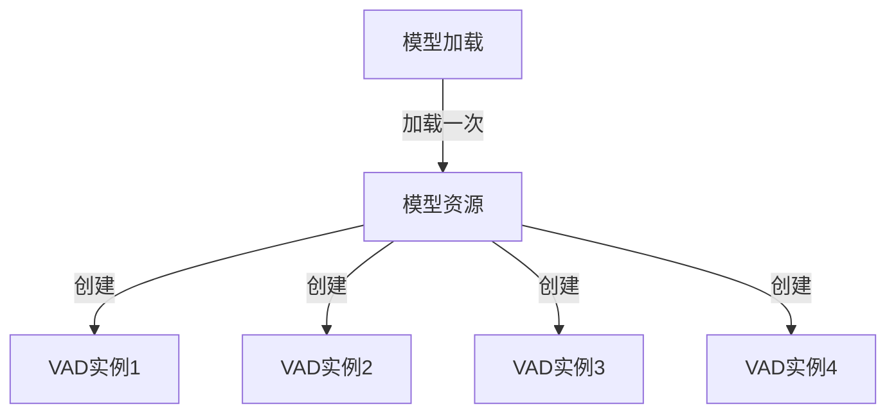

# 异步并行VAD处理库架构设计

## 1. 项目背景与需求

### 1.1 项目背景

本项目旨在解决音频流进入VAD（Voice Activity Detection，语音活动检测）之前的处理问题。当前VAD处理音频的方式存在严重延迟问题，每个VAD模型处理的音频块大小时会根据音频频率和格式而定，常见的有256个采样点（约16ms）和512个采样点，如果每次传入的音频大小是2s的音频，就需要将2s的音频切割为多个适应vad模型处理的音频块，这会导致严重的处理延迟。

### 1.2 核心需求

1. **并行处理**：将2s的音频切割为多块（根据线程数量而定），使用多个VAD实例并行处理
2. **顺序保证**：这些音频块有序列顺序，不管是哪个块检测到语音，最终都应该得到完整的正在讲话的语音块的事件戳
3. **异步处理**：整个处理过程和代码都要是异步的，使用uvloop构建事件循环。
4. **并发能力**：需要有强大的并发处理能力，会有不同的用户audiostream进来，然后将audiostream中的音频块chunk拆解为不同的有顺序和时序的小音频块分发给不同的VAD实例处理
5. **结果合并**：不管是哪个小音频块里包含数据，都要等待所有的VAD实例处理完成，然后拼接最终的VAD识别到的在说话的音频
6. **线程安全**：整个处理过程要保证线程和变量安全，项目会基于Python 3.12开发
7. **库形式**：系统应该作为一个库被其他Python应用程序调用，提供异步API接口
8. **流式处理**：整个项目实现是基于流式音频的，必须具备低延迟的处理速度
9. **多后端支持**：对于VAD的启动和实例管理，要支持vllm、vllm api和onnxruntime两种加载模型的方式，使用工厂+继承的方式实现模型装载工厂。
10. **线程池管理**：线程池是核心全局参数，一个线程对应一个VAD实例对应一个最小化的原子音频chunk

## 2. 系统架构概述

### 2.1 包结构设计

采用清晰的包结构设计，避免过度抽象，直接面向功能组织代码：

```
pre_vad/
├── __init__.py
├── config.py                # 配置管理
├── core/                    # 核心功能
│   ├── __init__.py
│   ├── audio_processor.py   # 音频处理
│   ├── vad_engine.py        # VAD引擎
│   └── result_processor.py  # 结果处理
├── backends/                # VAD后端实现
│   ├── __init__.py
│   ├── base.py              # 基础接口
│   ├── vllm_backend.py      # VLLM后端
│   └── onnx_backend.py      # ONNX后端
├── utils/                   # 工具函数
│   ├── __init__.py
│   ├── audio_utils.py       # 音频处理工具
│   ├── concurrency.py       # 并发工具
│   └── profiling.py         # 性能分析工具
└── examples/                # 示例代码
    ├── __init__.py
    ├── basic_usage.py       # 基本使用示例
    └── advanced_usage.py    # 高级使用示例
```

### 2.2 系统架构图



### 2.3 处理流程



## 3. 核心模块设计

### 3.1 音频处理器（AudioProcessor）

#### 3.1.1 功能职责

- 接收音频流数据
- 将音频流分割为固定大小的块
- 添加块之间的重叠区域
- 将音频块提交给线程池处理

#### 3.1.2 关键设计

- **零拷贝分割**：使用内存视图而非复制数据
- **重叠处理**：相邻块之间添加重叠，避免边界问题
- **异步接口**：提供异步API，支持流式处理

#### 3.1.3 接口定义

```python
class AudioProcessor:
    async def initialize(self):
        """初始化音频处理器"""
        pass
        
    async def process_chunk(self, audio_data):
        """处理音频块"""
        pass
        
    async def finalize(self):
        """完成处理，刷新缓冲区"""
        pass
```

### 3.2 VAD引擎（VADEngine）

#### 3.2.1 功能职责

- 管理多个VAD实例
- 将音频块分发给VAD实例处理
- 收集VAD处理结果

#### 3.2.2 关键设计

- **工厂模式**：使用工厂创建不同后端的VAD实例
- **线程绑定**：每个线程绑定一个VAD实例
- **并行处理**：多个VAD实例并行处理音频块

#### 3.2.3 接口定义

```python
class VADEngine:
    async def initialize(self, backend_type, num_workers, **kwargs):
        """初始化VAD引擎"""
        pass
        
    async def process(self, audio_chunks):
        """处理音频块"""
        pass
        
    async def close(self):
        """关闭VAD引擎"""
        pass
```

### 3.3 VAD后端（VADBackend）

#### 3.3.1 功能职责

- 提供统一的VAD处理接口
- 封装不同的VAD实现（VLLM和ONNXRuntime）

#### 3.3.2 关键设计

- **继承结构**：基类定义接口，子类实现具体功能
- **工厂创建**：使用工厂方法创建具体实例
- **资源管理**：妥善管理模型资源

#### 3.3.3 接口定义

```python
class VADBase:
    async def initialize(self):
        """初始化VAD实例"""
        pass
        
    async def process(self, audio_data):
        """处理音频数据"""
        pass
        
    async def reset(self):
        """重置VAD状态"""
        pass
        
    async def close(self):
        """关闭VAD实例"""
        pass
```

### 3.4 结果处理器（ResultProcessor）

#### 3.4.1 功能职责

- 收集来自不同VAD实例的处理结果
- 按顺序合并结果
- 生成语音事件

#### 3.4.2 关键设计

- **有序合并**：按序号合并结果，保证时序正确
- **语音段合并**：合并相邻的语音段
- **事件生成**：生成语音开始、结束等事件

#### 3.4.3 接口定义

```python
class ResultProcessor:
    async def process(self, vad_results):
        """处理VAD结果"""
        pass
        
    async def get_events(self):
        """获取语音事件"""
        pass
```

### 3.5 线程池（ThreadPool）

#### 3.5.1 功能职责

- 管理工作线程
- 分发处理任务
- 收集处理结果

#### 3.5.2 关键设计

- **线程亲和性**：将线程绑定到特定CPU核心
- **资源绑定**：将VAD实例绑定到特定线程
- **工作窃取**：实现工作窃取算法，平衡负载

#### 3.5.3 接口定义

```python
class ThreadPool:
    def __init__(self, num_workers):
        """初始化线程池"""
        pass
        
    def submit(self, task, *args, **kwargs):
        """提交任务"""
        pass
        
    def submit_to_worker(self, worker_id, task, *args, **kwargs):
        """提交任务给特定工作线程"""
        pass
        
    def bind_resource(self, worker_id, resource):
        """将资源绑定到特定工作线程"""
        pass
        
    def shutdown(self):
        """关闭线程池"""
        pass
```

## 4. 高性能缓冲区与消息队列

### 4.1 零拷贝缓冲区

#### 4.1.1 设计原理

为实现低延迟，设计零拷贝缓冲区机制：



- **内存视图**：使用NumPy的视图机制或Python的memoryview，避免数据复制
- **预分配缓冲区**：预先分配固定大小的缓冲区，避免动态内存分配
- **环形缓冲区**：使用环形缓冲区实现高效的数据流转

#### 4.1.2 实现策略

```python
class AudioBuffer:
    def __init__(self, capacity, chunk_size):
        # 预分配固定大小的缓冲区
        self.buffer = np.zeros(capacity, dtype=np.float32)
        self.chunk_size = chunk_size
        self.write_pos = 0
        self.read_pos = 0
        self._lock = threading.Lock()
    
    def write(self, data):
        # 写入数据，如果缓冲区满则阻塞或覆盖旧数据
        with self._lock:
            # 实现零拷贝写入
            # ...
    
    def read_chunk(self):
        # 读取一个音频块，返回内存视图而非复制
        with self._lock:
            # 返回内存视图
            # ...
```

### 4.2 无锁消息队列

#### 4.2.1 设计原理

为实现低延迟，设计无锁消息队列：



- **无锁设计**：使用原子操作实现无锁队列，避免锁竞争
- **批量操作**：支持批量入队和出队，减少操作次数
- **预分配内存**：预先分配队列空间，避免动态内存分配

#### 4.2.2 实现策略

```python
class LockFreeQueue:
    def __init__(self, capacity):
        # 预分配固定大小的队列
        self.queue = [None] * capacity
        self.capacity = capacity
        self.head = atomic.AtomicInteger(0)
        self.tail = atomic.AtomicInteger(0)
    
    def enqueue(self, item):
        # 无锁入队
        while True:
            tail = self.tail.get()
            next_tail = (tail + 1) % self.capacity
            if next_tail == self.head.get():
                # 队列满
                return False
            if self.tail.compare_and_set(tail, next_tail):
                self.queue[tail] = item
                return True
    
    def dequeue(self):
        # 无锁出队
        while True:
            head = self.head.get()
            if head == self.tail.get():
                # 队列空
                return None
            item = self.queue[head]
            next_head = (head + 1) % self.capacity
            if self.head.compare_and_set(head, next_head):
                return item
```

## 5. 同步模型与异步架构集成

### 5.1 问题与挑战

VLLM和ONNXRuntime主要提供同步API，它们本身不直接支持异步调用。在异步架构中集成同步模型调用面临以下挑战：

1. **阻塞问题**：同步模型调用会阻塞事件循环，影响整体性能
2. **资源竞争**：多线程访问同一模型实例可能导致竞争和性能下降
3. **模型启动开销**：模型加载和初始化通常耗时较长
4. **实例管理**：需要区分模型加载和实例创建，合理管理资源

### 5.2 线程池执行方案

采用线程池执行方案，在异步代码中使用`asyncio.loop.run_in_executor`将同步模型调用放入线程池执行，避免阻塞事件循环：



### 5.3 模型加载与实例管理

区分模型加载和实例创建，一个加载的模型可以创建多个实例来处理调用：



#### 5.3.1 模型加载策略

```python
class ModelLoader:
    def __init__(self, backend_type, model_path, **kwargs):
        self.backend_type = backend_type
        self.model_path = model_path
        self.kwargs = kwargs
        self.model_resource = None
        self._lock = threading.Lock()
    
    async def load_model(self):
        """异步加载模型"""
        if self.model_resource is not None:
            return self.model_resource
            
        # 使用线程池执行同步加载
        loop = asyncio.get_running_loop()
        with self._lock:
            if self.model_resource is None:
                self.model_resource = await loop.run_in_executor(
                    None, self._load_model_sync
                )
        return self.model_resource
    
    def _load_model_sync(self):
        """同步加载模型"""
        if self.backend_type == "vllm":
            # 加载VLLM模型
            # ...
        elif self.backend_type == "onnx":
            # 加载ONNX模型
            # ...
        else:
            raise ValueError(f"Unsupported backend type: {self.backend_type}")
        
        return model_resource
```

#### 5.3.2 实例创建策略

```python
class VADFactory:
    def __init__(self, model_loader):
        self.model_loader = model_loader
    
    async def create_vad_instance(self):
        """创建VAD实例"""
        # 确保模型已加载
        model_resource = await self.model_loader.load_model()
        
        # 创建VAD实例
        if self.model_loader.backend_type == "vllm":
            return VLLMVadImpl(model_resource)
        elif self.model_loader.backend_type == "onnx":
            return ONNXRuntimeVadImpl(model_resource)
        else:
            raise ValueError(f"Unsupported backend type: {self.model_loader.backend_type}")
```

### 5.4 异步包装同步调用

为同步API创建异步包装器，隐藏同步调用的细节：

```python
class AsyncVADWrapper:
    def __init__(self, vad_instance, thread_pool):
        self.vad_instance = vad_instance
        self.thread_pool = thread_pool
    
    async def process(self, audio_data):
        """异步处理音频数据"""
        loop = asyncio.get_running_loop()
        return await loop.run_in_executor(
            self.thread_pool,
            self.vad_instance.process,
            audio_data
        )
```

### 5.5 批处理优化

收集一批请求后一次性提交给模型，减少调用次数：

```python
class BatchProcessor:
    def __init__(self, vad_instance, batch_size=4, max_wait_time=0.01):
        self.vad_instance = vad_instance
        self.batch_size = batch_size
        self.max_wait_time = max_wait_time
        self.batch = []
        self.futures = []
        self.lock = asyncio.Lock()
        self.processing = False
    
    async def process(self, audio_data):
        """异步批处理"""
        future = asyncio.Future()
        
        async with self.lock:
            self.batch.append(audio_data)
            self.futures.append(future)
            
            if len(self.batch) >= self.batch_size and not self.processing:
                self.processing = True
                asyncio.create_task(self._process_batch())
        
        return await future
    
    async def _process_batch(self):
        """处理一批数据"""
        loop = asyncio.get_running_loop()
        
        while True:
            async with self.lock:
                if not self.batch:
                    self.processing = False
                    break
                    
                current_batch = self.batch[:self.batch_size]
                current_futures = self.futures[:self.batch_size]
                self.batch = self.batch[self.batch_size:]
                self.futures = self.futures[self.batch_size:]
            
            # 在线程池中执行批处理
            results = await loop.run_in_executor(
                None,
                self._process_batch_sync,
                current_batch
            )
            
            # 设置结果
            for future, result in zip(current_futures, results):
                future.set_result(result)
    
    def _process_batch_sync(self, batch):
        """同步批处理"""
        return [self.vad_instance.process(item) for item in batch]
```

## 6. 性能优化策略

### 6.1 内存优化

- **内存池**：使用内存池重用内存空间，减少内存分配和释放
- **内存对齐**：确保数据内存对齐，提高访问效率
- **内存预热**：预先分配和初始化内存，避免运行时分配
- **零拷贝**：使用内存视图而非复制数据

### 6.2 计算优化

- **SIMD指令**：利用CPU的SIMD指令集加速计算
- **计算缓存**：缓存中间计算结果，避免重复计算
- **计算批处理**：将多个小计算任务合并为一个大任务，减少调度开销
- **预热模型**：预先运行模型，避免冷启动延迟

### 6.3 并发优化

- **细粒度锁**：使用细粒度锁或无锁算法，减少锁竞争
- **避免共享状态**：尽量避免线程间共享状态，减少同步开销
- **异步IO**：使用异步IO操作，避免阻塞线程
- **线程亲和性**：将线程绑定到特定CPU核心，提高缓存命中率

### 6.4 低延迟保障

- **实时调度**：使用实时调度策略，提高处理优先级
- **超时控制**：设置处理超时时间，避免单个任务阻塞整个流程
- **负载均衡**：动态调整线程数和任务分配，平衡系统负载
- **背压机制**：实现背压机制，避免过载

## 7. 异步API设计

### 7.1 主要接口

```python
class AsyncParallelVAD:
    async def __aenter__(self):
        # 初始化资源
        return self
    
    async def __aexit__(self, exc_type, exc_val, exc_tb):
        # 释放资源
        pass
    
    async def process_chunk(self, audio_data):
        # 处理音频块
        pass
    
    async def get_results(self):
        # 获取处理结果
        pass
```

### 7.2 使用示例

```python
# 基本使用示例
import asyncio
from pre_vad import AsyncParallelVAD

async def main():
    # 创建VAD实例
    vad = AsyncParallelVAD(
        backend_type="onnx",
        num_workers=4,
        hop_size=256,
        threshold=0.5
    )
    
    # 初始化
    await vad.initialize()
    
    # 处理音频流
    async for chunk in audio_stream:
        await vad.process_chunk(chunk)
    
    # 获取结果
    results = await vad.get_results()
    
    # 处理结果
    for result in results:
        print(f"Speech detected: {result.start_time_ms}ms - {result.end_time_ms}ms")
    
    # 关闭VAD实例
    await vad.close()

# 运行主函数
asyncio.run(main())
```

## 8. 配置与参数

### 8.1 关键配置参数

- **线程池大小**：根据CPU核心数设置，通常为CPU核心数或略少
- **音频块大小**：16ms（256个采样点）或更小，根据VAD要求设置
- **重叠大小**：1-2ms，避免边界问题
- **缓冲区容量**：根据内存限制和延迟要求设置，通常为音频块大小的10-20倍
- **批处理大小**：根据VAD模型特性设置，通常为4-8个音频块

### 8.2 性能调优参数

- **预热迭代次数**：预热VAD模型的迭代次数，通常为10-20次
- **工作队列容量**：线程池工作队列的容量，通常为线程数的2-4倍
- **合并阈值**：合并相邻语音段的时间阈值，通常为200-300ms
- **超时时间**：处理超时时间，通常为音频块持续时间的2-3倍

## 9. 实现计划

### 9.1 阶段一：核心框架实现

1. 实现基本的包结构
2. 实现VAD后端接口和工厂
3. 实现线程池和工作线程
4. 实现基本的音频处理器

### 9.2 阶段二：高性能组件实现

1. 实现零拷贝缓冲区
2. 实现无锁消息队列
3. 实现结果处理器
4. 实现异步API接口

### 9.3 阶段三：性能优化

1. 实现内存优化策略
2. 实现计算优化策略
3. 实现并发优化策略
4. 实现低延迟保障机制

### 9.4 阶段四：测试与文档

1. 编写单元测试
2. 进行性能测试
3. 编写文档
4. 编写示例代码

## 10. 性能目标

### 10.1 延迟目标

- **处理延迟**：<10ms（从接收音频块到完成VAD处理）
- **端到端延迟**：<50ms（从接收音频块到生成语音事件）
- **吞吐量**：>100个音频块/秒/线程

### 10.2 资源使用目标

- **CPU使用率**：每个VAD实例<50%的CPU核心
- **内存使用**：<100MB（不包括VAD模型）
- **线程数**：等于或略少于CPU核心数

## 11. 总结与展望

本文档详细描述了异步并行VAD处理库的架构设计，包括项目背景与需求、系统架构概述、核心模块设计、高性能缓冲区与消息队列、同步模型与异步架构集成、性能优化策略、异步API设计、配置与参数、实现计划以及性能目标。

该设计方案旨在解决当前VAD处理音频时存在的延迟问题，通过并行处理和异步设计，显著提高处理速度和降低延迟。同时，通过精心设计的缓冲区和消息队列，确保高效的数据流转和低延迟处理。特别是通过线程池执行方案，解决了同步模型调用与异步架构集成的问题，实现了低延迟的处理。

未来可以考虑以下方向的扩展：

1. 支持更多的VAD后端（如TensorFlow、PyTorch等）
2. 实现分布式处理，支持跨机器的并行处理
3. 添加更多的音频预处理和后处理功能
4. 实现自适应的参数调整，根据系统负载和音频特性动态调整处理参数
5. 提供更丰富的API和工具，方便集成到不同的应用场景
