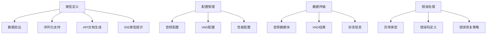
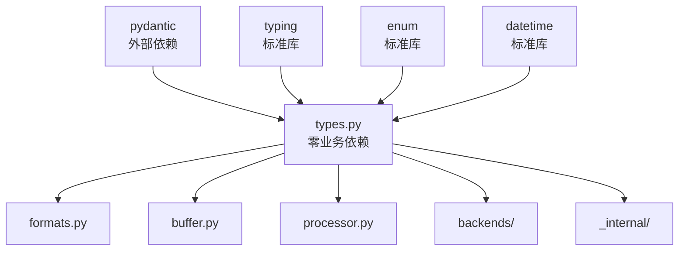

# 核心pydantic类型系统设计 (types.py)

## 1. 模块定位与职责

### 1.1 模块定位
types.py是Cascade架构中的**零依赖基础模块**，作为整个系统的数据契约基础，定义所有模块间交互的数据结构和验证规则。

### 1.2 核心职责


**功能边界**：
- ✅ **数据契约**：定义所有模块间的数据结构
- ✅ **类型验证**：pydantic验证器确保数据正确性
- ✅ **配置管理**：音频、VAD、性能等各类配置
- ✅ **序列化支持**：JSON序列化/反序列化
- ✅ **文档生成**：自动API文档和类型提示
- ✅ **错误定义**：统一的异常类型体系
- ❌ **不负责**：具体的业务逻辑实现

### 1.3 依赖关系设计



**依赖原则**：
- **零业务依赖**：不依赖任何业务模块
- **标准库优先**：尽可能使用Python标准库
- **pydantic专用**：充分利用pydantic的验证和序列化能力

## 2. 核心类型设计

### 2.1 基础枚举类型

```python
# types.py - 核心类型系统
"""
Cascade核心类型系统

提供整个项目的数据契约基础，包括：
- 音频处理相关类型
- VAD配置和结果类型
- 性能监控类型
- 错误处理类型
- 状态管理类型

设计原则：
- 零依赖（除pydantic外）
- 类型安全优先
- 完整的验证规则
- 自动文档生成
"""

from typing import Optional, Dict, Any, List, Union, Literal
from enum import Enum
from datetime import datetime, timezone
from pydantic import BaseModel, Field, validator, root_validator
import sys

# === 基础枚举类型 ===

class AudioFormat(str, Enum):
    """支持的音频格式"""
    WAV = "wav"
    PCMA = "pcma"
    
    @classmethod
    def get_supported_formats(cls) -> List[str]:
        """获取支持的格式列表"""
        return [format.value for format in cls]

class VADBackend(str, Enum):
    """支持的VAD后端"""
    ONNX = "onnx"
    VLLM = "vllm"
    
    @classmethod
    def get_default_backend(cls) -> str:
        """获取默认后端"""
        return cls.ONNX.value

class ProcessingMode(str, Enum):
    """处理模式"""
    STREAMING = "streaming"      # 流式处理
    BATCH = "batch"             # 批量处理
    REALTIME = "realtime"       # 实时处理

class LogLevel(str, Enum):
    """日志级别"""
    DEBUG = "debug"
    INFO = "info"
    WARNING = "warning"
    ERROR = "error"
    CRITICAL = "critical"

class BufferStrategy(str, Enum):
    """缓冲区溢出策略"""
    BLOCK = "block"             # 阻塞等待
    OVERWRITE = "overwrite"     # 覆盖旧数据
    REJECT = "reject"           # 拒绝新数据

class OptimizationLevel(str, Enum):
    """优化级别"""
    NONE = "none"               # 无优化
    BASIC = "basic"             # 基础优化
    AGGRESSIVE = "aggressive"    # 激进优化
    ALL = "all"                 # 全部优化
```

### 2.2 音频相关类型

```python
# === 音频相关类型 ===

class AudioConfig(BaseModel):
    """
    音频处理配置
    
    定义音频数据的基本参数，影响整个处理流程。
    """
    sample_rate: int = Field(
        default=16000, 
        description="采样率（Hz）",
        ge=1000,  # 最小1kHz
        le=48000  # 最大48kHz
    )
    format: AudioFormat = Field(
        default=AudioFormat.WAV,
        description="音频格式"
    )
    channels: int = Field(
        default=1,
        description="声道数",
        ge=1,
        le=2
    )
    dtype: str = Field(
        default="float32",
        description="内部数据类型"
    )
    bit_depth: Optional[int] = Field(
        default=None,
        description="位深度",
        ge=8,
        le=32
    )
    
    @validator('sample_rate')
    def validate_sample_rate(cls, v):
        """验证采样率"""
        supported_rates = [8000, 16000, 22050, 44100, 48000]
        if v not in supported_rates:
            raise ValueError(f'采样率必须是以下之一: {supported_rates}')
        return v
    
    @validator('channels')
    def validate_channels(cls, v):
        """验证声道数"""
        if v != 1:
            raise ValueError('当前版本仅支持单声道音频')
        return v
    
    @validator('dtype')
    def validate_dtype(cls, v):
        """验证数据类型"""
        supported_dtypes = ['float32', 'float64', 'int16', 'int32']
        if v not in supported_dtypes:
            raise ValueError(f'数据类型必须是以下之一: {supported_dtypes}')
        return v
    
    @root_validator
    def validate_format_compatibility(cls, values):
        """验证格式兼容性"""
        format_type = values.get('format')
        sample_rate = values.get('sample_rate')
        
        if format_type == AudioFormat.PCMA:
            # PCMA格式限制
            if sample_rate not in [8000, 16000]:
                raise ValueError('PCMA格式仅支持8kHz和16kHz采样率')
        
        return values
    
    def get_frame_size(self, duration_ms: int) -> int:
        """计算指定时长的帧大小（样本数）"""
        return int(duration_ms * self.sample_rate / 1000)
    
    def get_bytes_per_second(self) -> int:
        """计算每秒字节数"""
        bytes_per_sample = {
            'float32': 4,
            'float64': 8,
            'int16': 2,
            'int32': 4
        }.get(self.dtype, 4)
        
        return self.sample_rate * self.channels * bytes_per_sample
    
    class Config:
        extra = "forbid"
        use_enum_values = True
        schema_extra = {
            "examples": [
                {
                    "sample_rate": 16000,
                    "format": "wav",
                    "channels": 1,
                    "dtype": "float32"
                }
            ]
        }

class AudioChunk(BaseModel):
    """
    音频数据块
    
    封装音频数据及其元数据，用于模块间传输。
    """
    data: Any = Field(
        description="音频数据（numpy数组或类似结构）"
    )
    sequence_number: int = Field(
        description="序列号",
        ge=0
    )
    start_frame: int = Field(
        description="起始帧位置",
        ge=0
    )
    chunk_size: int = Field(
        description="主要块大小（样本数）",
        gt=0
    )
    overlap_size: int = Field(
        default=0,
        description="重叠区域大小（样本数）",
        ge=0
    )
    timestamp_ms: float = Field(
        description="时间戳（毫秒）",
        ge=0.0
    )
    sample_rate: int = Field(
        description="采样率",
        gt=0
    )
    is_last: bool = Field(
        default=False,
        description="是否为最后一块"
    )
    metadata: Optional[Dict[str, Any]] = Field(
        default=None,
        description="附加元数据"
    )
    
    @validator('overlap_size')
    def validate_overlap_size(cls, v, values):
        """验证重叠大小"""
        chunk_size = values.get('chunk_size', 0)
        if v >= chunk_size:
            raise ValueError('重叠大小不能大于等于块大小')
        return v
    
    def get_total_size(self) -> int:
        """获取总大小（包括重叠）"""
        return self.chunk_size + self.overlap_size
    
    def get_duration_ms(self) -> float:
        """获取块时长（毫秒）"""
        return self.chunk_size * 1000.0 / self.sample_rate
    
    def get_end_timestamp_ms(self) -> float:
        """获取结束时间戳"""
        return self.timestamp_ms + self.get_duration_ms()
    
    class Config:
        arbitrary_types_allowed = True
        extra = "allow"  # 允许额外字段以支持扩展

class AudioMetadata(BaseModel):
    """音频元数据"""
    title: Optional[str] = Field(default=None, description="标题")
    duration_seconds: Optional[float] = Field(default=None, description="总时长（秒）", ge=0)
    file_size_bytes: Optional[int] = Field(default=None, description="文件大小（字节）", ge=0)
    encoding: Optional[str] = Field(default=None, description="编码格式")
    bitrate: Optional[int] = Field(default=None, description="比特率", ge=0)
    created_at: Optional[datetime] = Field(default=None, description="创建时间")
    source: Optional[str] = Field(default=None, description="音频源")
    quality_score: Optional[float] = Field(default=None, description="质量评分", ge=0.0, le=1.0)
    
    class Config:
        json_encoders = {
            datetime: lambda v: v.isoformat()
        }
```

### 2.3 VAD配置和结果类型

```python
# === VAD配置和结果类型 ===

class VADConfig(BaseModel):
    """
    VAD处理配置
    
    控制VAD处理行为的所有参数。
    """
    backend: VADBackend = Field(
        default=VADBackend.ONNX,
        description="VAD后端类型"
    )
    workers: int = Field(
        default=4,
        description="工作线程数",
        ge=1,
        le=32
    )
    threshold: float = Field(
        default=0.5,
        description="VAD检测阈值",
        ge=0.0,
        le=1.0
    )
    chunk_duration_ms: int = Field(
        default=500,
        description="处理块时长（毫秒）",
        ge=100,
        le=5000
    )
    overlap_ms: int = Field(
        default=16,
        description="重叠区域时长（毫秒）",
        ge=0,
        le=200
    )
    buffer_capacity_seconds: int = Field(
        default=5,
        description="缓冲区容量（秒）",
        ge=1,
        le=60
    )
    processing_mode: ProcessingMode = Field(
        default=ProcessingMode.STREAMING,
        description="处理模式"
    )
    optimization_level: OptimizationLevel = Field(
        default=OptimizationLevel.ALL,
        description="优化级别"
    )
    
    # 高级参数
    min_speech_duration_ms: int = Field(
        default=100,
        description="最小语音段时长（毫秒）",
        ge=10
    )
    max_silence_duration_ms: int = Field(
        default=500,
        description="最大静音段时长（毫秒）",
        ge=50
    )
    energy_threshold: Optional[float] = Field(
        default=None,
        description="能量阈值",
        ge=0.0
    )
    smoothing_window_ms: int = Field(
        default=50,
        description="平滑窗口大小（毫秒）",
        ge=10,
        le=200
    )
    
    @validator('overlap_ms')
    def validate_overlap(cls, v, values):
        """验证重叠时长"""
        chunk_duration = values.get('chunk_duration_ms', 500)
        if v >= chunk_duration * 0.5:
            raise ValueError('重叠时长不能超过块时长的50%')
        return v
    
    @validator('workers')
    def validate_workers(cls, v):
        """验证工作线程数"""
        import os
        max_workers = min(32, (os.cpu_count() or 4) * 2)
        if v > max_workers:
            raise ValueError(f'工作线程数不能超过 {max_workers}')
        return v
    
    @root_validator
    def validate_timing_consistency(cls, values):
        """验证时间参数一致性"""
        chunk_duration = values.get('chunk_duration_ms', 500)
        min_speech = values.get('min_speech_duration_ms', 100)
        max_silence = values.get('max_silence_duration_ms', 500)
        
        if min_speech > chunk_duration:
            raise ValueError('最小语音段时长不能超过块时长')
        
        if max_silence > chunk_duration * 2:
            raise ValueError('最大静音段时长过长')
        
        return values
    
    def get_chunk_samples(self, sample_rate: int) -> int:
        """计算块样本数"""
        return int(self.chunk_duration_ms * sample_rate / 1000)
    
    def get_overlap_samples(self, sample_rate: int) -> int:
        """计算重叠样本数"""
        return int(self.overlap_ms * sample_rate / 1000)
    
    class Config:
        extra = "forbid"
        use_enum_values = True
        schema_extra = {
            "examples": [
                {
                    "backend": "onnx",
                    "workers": 4,
                    "threshold": 0.5,
                    "chunk_duration_ms": 500,
                    "overlap_ms": 16
                }
            ]
        }

class VADResult(BaseModel):
    """
    VAD检测结果
    
    包含语音活动检测的所有相关信息。
    """
    is_speech: bool = Field(
        description="是否检测到语音"
    )
    probability: float = Field(
        description="语音概率",
        ge=0.0,
        le=1.0
    )
    start_ms: float = Field(
        description="开始时间（毫秒）",
        ge=0.0
    )
    end_ms: float = Field(
        description="结束时间（毫秒）",
        ge=0.0
    )
    chunk_id: int = Field(
        description="块ID",
        ge=0
    )
    confidence: float = Field(
        default=0.0,
        description="置信度",
        ge=0.0,
        le=1.0
    )
    energy_level: Optional[float] = Field(
        default=None,
        description="能量级别",
        ge=0.0
    )
    snr_db: Optional[float] = Field(
        default=None,
        description="信噪比（dB）"
    )
    speech_type: Optional[str] = Field(
        default=None,
        description="语音类型（如：male, female, child）"
    )
    metadata: Optional[Dict[str, Any]] = Field(
        default=None,
        description="附加元数据"
    )
    
    @validator('end_ms')
    def validate_time_order(cls, v, values):
        """验证时间顺序"""
        start_ms = values.get('start_ms')
        if start_ms is not None and v <= start_ms:
            raise ValueError('结束时间必须大于开始时间')
        return v
    
    @validator('probability')
    def validate_probability_confidence_consistency(cls, v, values):
        """验证概率和置信度的一致性"""
        # 如果置信度已设置，确保它与概率相关
        return v
    
    def get_duration_ms(self) -> float:
        """获取时长（毫秒）"""
        return self.end_ms - self.start_ms
    
    def get_speech_ratio(self) -> float:
        """获取语音比例（用于统计）"""
        return self.probability if self.is_speech else 0.0
    
    def is_high_confidence(self, threshold: float = 0.8) -> bool:
        """判断是否为高置信度检测"""
        return self.confidence >= threshold
    
    class Config:
        extra = "allow"
        schema_extra = {
            "examples": [
                {
                    "is_speech": True,
                    "probability": 0.85,
                    "start_ms": 1000.0,
                    "end_ms": 1500.0,
                    "chunk_id": 2,
                    "confidence": 0.9
                }
            ]
        }

class VADSegment(BaseModel):
    """VAD语音段"""
    start_ms: float = Field(description="开始时间（毫秒）", ge=0.0)
    end_ms: float = Field(description="结束时间（毫秒）", ge=0.0)
    confidence: float = Field(description="平均置信度", ge=0.0, le=1.0)
    peak_probability: float = Field(description="峰值概率", ge=0.0, le=1.0)
    chunk_count: int = Field(description="包含的块数", ge=1)
    energy_stats: Optional[Dict[str, float]] = Field(default=None, description="能量统计")
    
    @validator('end_ms')
    def validate_duration(cls, v, values):
        start_ms = values.get('start_ms')
        if start_ms is not None and v <= start_ms:
            raise ValueError('结束时间必须大于开始时间')
        return v
    
    def get_duration_ms(self) -> float:
        """获取段时长"""
        return self.end_ms - self.start_ms
```

### 2.4 后端配置类型

```python
# === 后端配置类型 ===

class BackendConfig(BaseModel):
    """VAD后端配置基类"""
    model_path: Optional[str] = Field(
        default=None,
        description="模型文件路径"
    )
    device: str = Field(
        default="cpu",
        description="计算设备"
    )
    optimization_level: OptimizationLevel = Field(
        default=OptimizationLevel.ALL,
        description="优化级别"
    )
    max_batch_size: int = Field(
        default=1,
        description="最大批处理大小",
        ge=1,
        le=64
    )
    warmup_iterations: int = Field(
        default=3,
        description="预热迭代次数",
        ge=0,
        le=10
    )
    
    class Config:
        extra = "allow"  # 允许后端特定配置

class ONNXConfig(BackendConfig):
    """ONNX后端配置"""
    providers: List[str] = Field(
        default=["CPUExecutionProvider"],
        description="执行提供者列表"
    )
    intra_op_num_threads: int = Field(
        default=1,
        description="线程内操作线程数",
        ge=1,
        le=16
    )
    inter_op_num_threads: int = Field(
        default=1,
        description="线程间操作线程数",
        ge=1,
        le=16
    )
    execution_mode: str = Field(
        default="sequential",
        description="执行模式"
    )
    graph_optimization_level: str = Field(
        default="all",
        description="图优化级别"
    )
    
    @validator('providers')
    def validate_providers(cls, v):
        """验证执行提供者"""
        valid_providers = [
            "CPUExecutionProvider",
            "CUDAExecutionProvider", 
            "TensorrtExecutionProvider",
            "OpenVINOExecutionProvider"
        ]
        for provider in v:
            if provider not in valid_providers:
                raise ValueError(f'无效的执行提供者: {provider}')
        return v
    
    class Config:
        schema_extra = {
            "examples": [
                {
                    "model_path": "/path/to/model.onnx",
                    "providers": ["CPUExecutionProvider"],
                    "intra_op_num_threads": 1
                }
            ]
        }

class VLLMConfig(BackendConfig):
    """VLLM后端配置"""
    tensor_parallel_size: int = Field(
        default=1,
        description="张量并行大小",
        ge=1,
        le=8
    )
    max_model_len: int = Field(
        default=2048,
        description="最大模型长度",
        ge=512,
        le=8192
    )
    gpu_memory_utilization: float = Field(
        default=0.9,
        description="GPU内存利用率",
        ge=0.1,
        le=1.0
    )
    swap_space: int = Field(
        default=4,
        description="交换空间（GB）",
        ge=0,
        le=32
    )
    dtype: str = Field(
        default="auto",
        description="数据类型"
    )
    
    @validator('dtype')
    def validate_dtype(cls, v):
        """验证数据类型"""
        valid_dtypes = ["auto", "half", "float16", "bfloat16", "float", "float32"]
        if v not in valid_dtypes:
            raise ValueError(f'无效的数据类型: {v}')
        return v
```

### 2.5 性能监控类型

```python
# === 性能监控类型 ===

class PerformanceMetrics(BaseModel):
    """
    性能监控指标
    
    收集和展示系统性能数据。
    """
    # 延迟指标
    avg_latency_ms: float = Field(
        description="平均延迟（毫秒）",
        ge=0.0
    )
    p50_latency_ms: float = Field(
        description="P50延迟（毫秒）",
        ge=0.0
    )
    p95_latency_ms: float = Field(
        description="P95延迟（毫秒）",
        ge=0.0
    )
    p99_latency_ms: float = Field(
        description="P99延迟（毫秒）",
        ge=0.0
    )
    max_latency_ms: float = Field(
        description="最大延迟（毫秒）",
        ge=0.0
    )
    
    # 吞吐量指标
    throughput_qps: float = Field(
        description="吞吐量（QPS）",
        ge=0.0
    )
    throughput_mbps: float = Field(
        description="数据吞吐量（MB/s）",
        ge=0.0
    )
    
    # 错误指标
    error_rate: float = Field(
        description="错误率",
        ge=0.0,
        le=1.0
    )
    success_count: int = Field(
        description="成功次数",
        ge=0
    )
    error_count: int = Field(
        description="错误次数",
        ge=0
    )
    
    # 资源指标
    memory_usage_mb: float = Field(
        description="内存使用量（MB）",
        ge=0.0
    )
    cpu_usage_percent: float = Field(
        description="CPU使用率（%）",
        ge=0.0,
        le=100.0
    )
    active_threads: int = Field(
        description="活跃线程数",
        ge=0
    )
    queue_depth: int = Field(
        description="队列深度",
        ge=0
    )
    
    # 缓冲区指标
    buffer_utilization: float = Field(
        description="缓冲区利用率",
        ge=0.0,
        le=1.0
    )
    zero_copy_rate: float = Field(
        description="零拷贝率",
        ge=0.0,
        le=1.0
    )
    cache_hit_rate: float = Field(
        description="缓存命中率",
        ge=0.0,
        le=1.0
    )
    
    # 时间戳
    measurement_time: datetime = Field(
        default_factory=lambda: datetime.now(timezone.utc),
        description="测量时间"
    )
    collection_duration_seconds: float = Field(
        description="收集时长（秒）",
        gt=0.0
    )
    
    def get_total_operations(self) -> int:
        """获取总操作数"""
        return self.success_count + self.error_count
    
    def get_success_rate(self) -> float:
        """获取成功率"""
        total = self.get_total_operations()
        return self.success_count / total if total > 0 else 0.0
    
    def is_healthy(self, 
                   max_error_rate: float = 0.01,
                   min_throughput: float = 1.0,
                   max_latency_p99: float = 100.0) -> bool:
        """判断性能是否健康"""
        return (self.error_rate <= max_error_rate and
                self.throughput_qps >= min_throughput and
                self.p99_latency_ms <= max_latency_p99)
    
    class Config:
        json_encoders = {
            datetime: lambda v: v.isoformat()
        }

class SystemStatus(BaseModel):
    """系统状态"""
    status: Literal["healthy", "warning", "critical", "unknown"] = Field(
        description="系统状态"
    )
    uptime_seconds: float = Field(
        description="运行时间（秒）",
        ge=0.0
    )
    total_processed_chunks: int = Field(
        description="已处理块总数",
        ge=0
    )
    total_audio_duration_seconds: float = Field(
        description="已处理音频总时长（秒）",
        ge=0.0
    )
    current_load: float = Field(
        description="当前负载",
        ge=0.0,
        le=1.0
    )
    health_issues: List[str] = Field(
        default=[],
        description="健康问题列表"
    )
    last_error: Optional[str] = Field(
        default=None,
        description="最近的错误"
    )
    performance_summary: Optional[PerformanceMetrics] = Field(
        default=None,
        description="性能摘要"
    )
    
    def is_operational(self) -> bool:
        """判断是否可操作"""
        return self.status in ["healthy", "warning"]
    
    def add_health_issue(self, issue: str) -> None:
        """添加健康问题"""
        if issue not in self.health_issues:
            self.health_issues.append(issue)
            
    def clear_health_issues(self) -> None:
        """清除健康问题"""
        self.health_issues.clear()

class BufferStatus(BaseModel):
    """缓冲区状态"""
    capacity: int = Field(description="总容量（样本数）", gt=0)
    available_samples: int = Field(description="可用样本数", ge=0)
    free_samples: int = Field(description="空闲样本数", ge=0)
    usage_ratio: float = Field(description="使用率", ge=0.0, le=1.0)
    status_level: Literal["normal", "warning", "critical"] = Field(description="状态级别")
    write_position: int = Field(description="写入位置", ge=0)
    read_position: int = Field(description="读取位置", ge=0)
    overflow_count: int = Field(description="溢出次数", ge=0)
    underflow_count: int = Field(description="下溢次数", ge=0)
    peak_usage: float = Field(description="峰值使用率", ge=0.0, le=1.0)
    
    @validator('available_samples')
    def validate_available_samples(cls, v, values):
        capacity = values.get('capacity', 0)
        if v > capacity:
            raise ValueError('可用样本数不能超过总容量')
        return v
    
    def is_healthy(self) -> bool:
        """判断缓冲区是否健康"""
        return self.status_level != "critical" and self.overflow_count == 0
```

### 2.6 错误处理类型

```python
# === 错误处理类型 ===

class ErrorCode(str, Enum):
    """错误码定义"""
    # 通用错误
    UNKNOWN_ERROR = "E0000"
    INVALID_INPUT = "E0001"
    INVALID_CONFIG = "E0002"
    INITIALIZATION_FAILED = "E0003"
    
    # 音频相关错误
    UNSUPPORTED_FORMAT = "E1001"
    INVALID_SAMPLE_RATE = "E1002"
    INVALID_CHANNELS = "E1003"
    AUDIO_CORRUPTION = "E1004"
    
    # 缓冲区错误
    BUFFER_FULL = "E2001"
    BUFFER_EMPTY = "E2002"
    INSUFFICIENT_DATA = "E2003"
    BUFFER_CORRUPTION = "E2004"
    
    # VAD处理错误
    MODEL_LOAD_FAILED = "E3001"
    INFERENCE_FAILED = "E3002"
    RESULT_VALIDATION_FAILED = "E3003"
    BACKEND_UNAVAILABLE = "E3004"
    
    # 性能相关错误
    TIMEOUT_ERROR = "E4001"
    MEMORY_ERROR = "E4002"
    THREAD_ERROR = "E4003"
    RESOURCE_EXHAUSTED = "E4004"

class ErrorSeverity(str, Enum):
    """错误严重程度"""
    LOW = "low"           # 低：不影响功能
    MEDIUM = "medium"     # 中：影响性能
    HIGH = "high"         # 高：影响功能
    CRITICAL = "critical" # 严重：系统不可用

class PreVADError(Exception):
    """Cascade错误基类"""
    def __init__(self, 
                 message: str,
                 error_code: ErrorCode = ErrorCode.UNKNOWN_ERROR,
                 severity: ErrorSeverity = ErrorSeverity.MEDIUM,
                 context: Optional[Dict[str, Any]] = None):
        super().__init__(message)
        self.message = message
        self.error_code = error_code
        self.severity = severity
        self.context = context or {}
        self.timestamp = datetime.now(timezone.utc)
    
    def to_dict(self) -> Dict[str, Any]:
        """转换为字典"""
        return {
            "message": self.message,
            "error_code": self.error_code.value,
            "severity": self.severity.value,
            "context": self.context,
            "timestamp": self.timestamp.isoformat()
        }

class AudioFormatError(PreVADError):
    """音频格式错误"""
    def __init__(self, message: str, format_info: Optional[Dict[str, Any]] = None):
        super().__init__(
            message,
            ErrorCode.UNSUPPORTED_FORMAT,
            ErrorSeverity.HIGH,
            {"format_info": format_info}
        )

class BufferError(PreVADError):
    """缓冲区错误"""
    pass

class BufferFullError(BufferError):
    """缓冲区已满错误"""
    def __init__(self, capacity: int, attempted_size: int):
        super().__init__(
            f"缓冲区已满: 容量={capacity}, 尝试写入={attempted_size}",
            ErrorCode.BUFFER_FULL,
            ErrorSeverity.MEDIUM,
            {"capacity": capacity, "attempted_size": attempted_size}
        )

class InsufficientDataError(BufferError):
    """数据不足错误"""
    def __init__(self, available: int, required: int):
        super().__init__(
            f"数据不足: 可用={available}, 需要={required}",
            ErrorCode.INSUFFICIENT_DATA,
            ErrorSeverity.LOW,
            {"available": available, "required": required}
        )

class VADProcessingError(PreVADError):
    """VAD处理错误"""
    pass

class ModelLoadError(VADProcessingError):
    """模型加载错误"""
    def __init__(self, model_path: str, reason: str):
        super().__init__(
            f"模型加载失败: {model_path}, 原因: {reason}",
            ErrorCode.MODEL_LOAD_FAILED,
            ErrorSeverity.CRITICAL,
            {"model_path": model_path, "reason": reason}
        )

class ErrorInfo(BaseModel):
    """错误信息"""
    error_code: ErrorCode = Field(description="错误码")
    message: str = Field(description="错误消息")
    severity: ErrorSeverity = Field(description="严重程度")
    timestamp: datetime = Field(description="发生时间")
    context: Dict[str, Any] = Field(default={}, description="错误上下文")
    stack_trace: Optional[str] = Field(default=None, description="堆栈跟踪")
    recovery_suggestions: List[str] = Field(default=[], description="恢复建议")
    
    @classmethod
    def from_exception(cls, exc: Exception) -> 'ErrorInfo':
        """从异常创建错误信息"""
        if isinstance(exc, PreVADError):
            return cls(
                error_code=exc.error_code,
                message=exc.message,
                severity=exc.severity,
                timestamp=exc.timestamp,
                context=exc.context
            )
        else:
            return cls(
                error_code=ErrorCode.UNKNOWN_ERROR,
                message=str(exc),
                severity=ErrorSeverity.MEDIUM,
                timestamp=datetime.now(timezone.utc),
                context={"exception_type": type(exc).__name__}
            )
    
    class Config:
        json_encoders = {
            datetime: lambda v: v.isoformat()
        }
```

### 2.7 版本和兼容性类型

```python
# === 版本和兼容性类型 ===

class VersionInfo(BaseModel):
    """版本信息"""
    major: int = Field(description="主版本号", ge=0)
    minor: int = Field(description="次版本号", ge=0)
    patch: int = Field(description="补丁版本号", ge=0)
    pre_release: Optional[str] = Field(default=None, description="预发布标识")
    build_metadata: Optional[str] = Field(default=None, description="构建元数据")
    
    def __str__(self) -> str:
        """版本字符串表示"""
        version = f"{self.major}.{self.minor}.{self.patch}"
        if self.pre_release:
            version += f"-{self.pre_release}"
        if self.build_metadata:
            version += f"+{self.build_metadata}"
        return version
    
    def is_compatible_with(self, other: 'VersionInfo') -> bool:
        """检查版本兼容性"""
        # 主版本号相同才兼容
        if self.major != other.major:
            return False
        # 当前版本应该 >= 其他版本
        return (self.minor, self.patch) >= (other.minor, other.patch)
    
    @classmethod
    def parse(cls, version_string: str) -> 'VersionInfo':
        """解析版本字符串"""
        import re
        pattern = r'^(\d+)\.(\d+)\.(\d+)(?:-([^+]+))?(?:\+(.+))?$'
        match = re.match(pattern, version_string)
        
        if not match:
            raise ValueError(f"无效的版本字符串: {version_string}")
        
        major, minor, patch, pre_release, build_metadata = match.groups()
        
        return cls(
            major=int(major),
            minor=int(minor),
            patch=int(patch),
            pre_release=pre_release,
            build_metadata=build_metadata
        )

class CompatibilityInfo(BaseModel):
    """兼容性信息"""
    min_python_version: str = Field(description="最小Python版本")
    supported_platforms: List[str] = Field(description="支持的平台")
    required_dependencies: Dict[str, str] = Field(description="必需依赖")
    optional_dependencies: Dict[str, str] = Field(default={}, description="可选依赖")
    api_version: VersionInfo = Field(description="API版本")
    
    def check_python_compatibility(self) -> bool:
        """检查Python版本兼容性"""
        import sys
        current_version = VersionInfo.parse(f"{sys.version_info.major}.{sys.version_info.minor}.{sys.version_info.micro}")
        min_version = VersionInfo.parse(self.min_python_version)
        return current_version.is_compatible_with(min_version)
    
    def check_platform_compatibility(self) -> bool:
        """检查平台兼容性"""
        import platform
        current_platform = platform.system().lower()
        return any(current_platform in supported.lower() for supported in self.supported_platforms)

# === 导出的类型定义 ===

__all__ = [
    # 枚举类型
    "AudioFormat", "VADBackend", "ProcessingMode", "LogLevel", 
    "BufferStrategy", "OptimizationLevel", "ErrorCode", "ErrorSeverity",
    
    # 音频类型
    "AudioConfig", "AudioChunk", "AudioMetadata",
    
    # VAD类型
    "VADConfig", "VADResult", "VADSegment",
    
    # 后端配置
    "BackendConfig", "ONNXConfig", "VLLMConfig",
    
    # 性能监控
    "PerformanceMetrics", "SystemStatus", "BufferStatus",
    
    # 错误处理
    "PreVADError", "AudioFormatError", "BufferError", "BufferFullError",
    "InsufficientDataError", "VADProcessingError", "ModelLoadError", "ErrorInfo",
    
    # 版本兼容性
    "VersionInfo", "CompatibilityInfo"
]
```

## 3. 类型系统特性

### 3.1 自动验证

所有pydantic模型提供：
- **数据类型验证**：确保字段类型正确
- **数值范围验证**：ge, le, gt, lt约束
- **自定义验证器**：复杂业务规则验证
- **交叉字段验证**：多字段一致性检查

### 3.2 序列化支持

```python
# 自动JSON序列化
config = AudioConfig(sample_rate=16000, format="wav")
json_str = config.json()

# 从JSON反序列化
restored_config = AudioConfig.parse_raw(json_str)

# 字典转换
config_dict = config.dict()
```

### 3.3 自动文档生成

```python
# 获取JSON Schema
schema = AudioConfig.schema()

# 生成OpenAPI文档
from pydantic import create_model
api_model = create_model('AudioAPI', config=(AudioConfig, ...))
```

### 3.4 IDE支持

完整的类型提示和自动完成：
```python
config: AudioConfig = AudioConfig()
config.sample_rate  # IDE自动提示类型和文档
```

## 4. 扩展性设计

### 4.1 插件化支持

```python
class PluginConfig(BaseModel):
    """插件配置基类"""
    plugin_name: str = Field(description="插件名称")
    plugin_version: str = Field(description="插件版本")
    enabled: bool = Field(default=True, description="是否启用")
    config: Dict[str, Any] = Field(default={}, description="插件配置")
    
    class Config:
        extra = "allow"
```

### 4.2 自定义验证器

```python
# 支持注册自定义验证器
def register_custom_validator(field_name: str, validator_func):
    """注册自定义验证器"""
    pass
```

### 4.3 向后兼容性

```python
class ConfigMigrator:
    """配置迁移器"""
    
    @staticmethod
    def migrate_v1_to_v2(old_config: dict) -> dict:
        """从v1配置迁移到v2"""
        pass
```

## 5. 测试策略

### 5.1 类型验证测试

```python
class TestTypes:
    """类型系统测试"""
    
    def test_audio_config_validation(self):
        """测试音频配置验证"""
        # 有效配置
        valid_config = AudioConfig(sample_rate=16000, format="wav")
        assert valid_config.sample_rate == 16000
        
        # 无效配置
        with pytest.raises(ValidationError):
            AudioConfig(sample_rate=99999)  # 不支持的采样率
    
    def test_vad_result_consistency(self):
        """测试VAD结果一致性"""
        result = VADResult(
            is_speech=True,
            probability=0.9,
            start_ms=100.0,
            end_ms=200.0,
            chunk_id=1
        )
        assert result.get_duration_ms() == 100.0
    
    def test_error_handling(self):
        """测试错误处理"""
        error = BufferFullError(capacity=1000, attempted_size=1500)
        assert error.error_code == ErrorCode.BUFFER_FULL
        assert error.severity == ErrorSeverity.MEDIUM
    
    def test_serialization(self):
        """测试序列化"""
        config = VADConfig(workers=8, threshold=0.7)
        json_str = config.json()
        restored = VADConfig.parse_raw(json_str)
        assert restored.workers == 8
        assert restored.threshold == 0.7
```

### 5.2 性能测试

```python
def test_type_validation_performance():
    """测试类型验证性能"""
    import time
    
    start = time.time()
    for _ in range(10000):
        AudioConfig(sample_rate=16000, format="wav")
    duration = time.time() - start
    
    # 验证性能目标：10k次创建 < 100ms
    assert duration < 0.1
```

## 6. 总结

### 6.1 类型系统优势

- **零依赖基础**：为所有模块提供统一数据契约
- **完整验证**：自动数据验证和错误处理
- **文档自动生成**：类型注释自动生成API文档
- **IDE友好**：完整的类型提示和自动完成
- **序列化支持**：内置JSON序列化/反序列化
- **扩展性强**：支持插件和自定义验证

### 6.2 集成要点

1. **零依赖原则**：不依赖任何业务模块
2. **严格验证**：确保数据边界的类型安全
3. **向后兼容**：支持配置迁移和版本兼容性
4. **性能优化**：验证性能满足高频使用需求

### 6.3 下一步实施

1. 实现基础类型定义和验证器
2. 添加序列化和文档生成支持
3. 完善错误处理和异常体系
4. 进行全面的类型验证测试
5. 集成到其他模块中作为数据契约

这个设计确保了Cascade项目的**类型安全**、**数据一致性**和**开发效率**，为整个系统提供了坚实的类型基础。