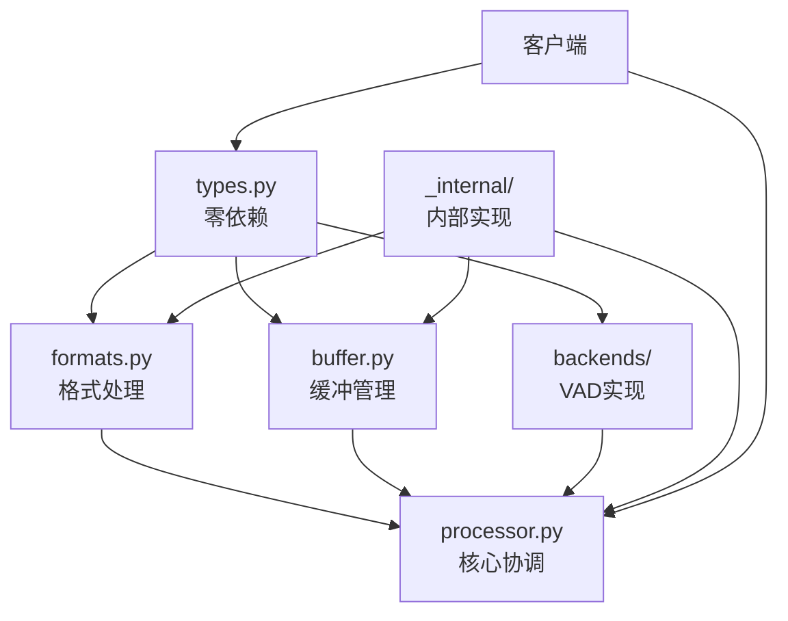
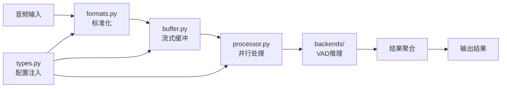
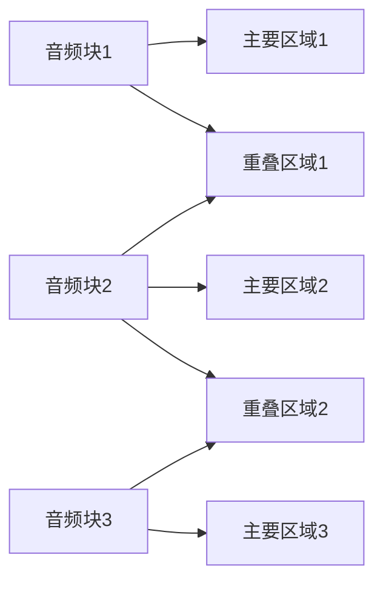

# Cascade 重构架构设计

## 1. 重构背景与目标

### 1.1 项目背景（保留原有核心价值）

Cascade是一个高性能、低延迟的音频流处理库，专为语音活动检测(VAD)设计。通过并行处理技术，显著降低VAD处理延迟，同时保证检测结果的准确性。

**核心技术优势**：
- **并行处理**：将音频分割为多块，使用多个VAD实例并行处理
- **重叠处理**：通过块间重叠区域解决边界问题，确保检测准确性
- **线程池+模型实例池**：1:1:1绑定设计，零竞争高性能推理
- **零拷贝设计**：最小化内存复制，提高处理效率

### 1.2 重构目标

1. **消除循环依赖**：实现严格的单向数据流架构
2. **功能模块化**：每个模块专注单一职责，高内聚低耦合
3. **pydantic类型统一**：统一所有数据边界和配置管理
4. **保持高性能**：零成本抽象，保持原有性能优势
5. **最小接口暴露**：模块间通过精简API通信

## 2. 重构架构设计

### 2.1 新包结构设计

```
cascade/
├── __init__.py                 # 核心API暴露，严格最小接口
├── types.py                    # pydantic类型定义，零依赖
├── processor.py                # 音频处理核心，协调者模式
├── buffer.py                   # 缓冲区功能模块，纯功能
├── formats.py                  # 格式处理功能模块，纯功能
├── backends/                   # VAD后端实现
│   ├── __init__.py
│   ├── base.py                 # 抽象基类定义
│   ├── onnx.py                 # ONNX后端实现
│   └── vllm.py                 # VLLM后端实现
├── _internal/                  # 内部实现，隔离复杂性
│   ├── __init__.py
│   ├── thread_pool.py          # 线程池管理
│   ├── performance.py          # 性能监控
│   ├── atomic.py               # 原子操作工具
│   └── utils.py                # 内部工具函数
└── py.typed                    # 类型标注支持
```

**设计原则**：
- **types.py**: 零依赖的pydantic类型定义，作为整个系统的数据契约
- **processor.py**: 协调者模式，单向依赖其他模块，不被依赖
- **buffer.py & formats.py**: 纯功能模块，只提供功能，不依赖业务逻辑
- **_internal/**: 隔离内部复杂实现，外部模块不直接依赖

### 2.2 严格单向数据流架构

#### 2.2.1 依赖关系图



#### 2.2.2 数据流向



### 2.3 核心pydantic类型系统

#### 2.3.1 基础类型定义

```python
# types.py - 零依赖的类型定义
from pydantic import BaseModel, validator, Field
from typing import Optional, Dict, Any, AsyncIterator, Union
from enum import Enum
import numpy as np

class AudioFormat(str, Enum):
    """支持的音频格式"""
    WAV = "wav"
    PCMA = "pcma"

class VADBackend(str, Enum):
    """支持的VAD后端"""
    ONNX = "onnx"
    VLLM = "vllm"

class AudioConfig(BaseModel):
    """音频处理配置"""
    sample_rate: int = Field(default=16000, description="采样率")
    format: AudioFormat = Field(default=AudioFormat.WAV, description="音频格式")
    channels: int = Field(default=1, description="通道数")
    dtype: str = Field(default="float32", description="数据类型")
    
    @validator('sample_rate')
    def valid_sample_rate(cls, v):
        if v not in [8000, 16000]:
            raise ValueError('sample_rate must be 8000 or 16000')
        return v
    
    @validator('channels')
    def valid_channels(cls, v):
        if v != 1:
            raise ValueError('Only mono audio is supported')
        return v
    
    class Config:
        extra = "forbid"
        use_enum_values = True

class VADConfig(BaseModel):
    """VAD处理配置"""
    backend: VADBackend = Field(default=VADBackend.ONNX, description="VAD后端")
    workers: int = Field(default=4, description="工作线程数", ge=1, le=32)
    threshold: float = Field(default=0.5, description="VAD阈值", ge=0.0, le=1.0)
    chunk_duration_ms: int = Field(default=500, description="块大小(毫秒)", ge=100, le=2000)
    overlap_ms: int = Field(default=16, description="重叠区域(毫秒)", ge=0, le=100)
    buffer_capacity_seconds: int = Field(default=5, description="缓冲区容量(秒)", ge=1, le=60)
    
    class Config:
        extra = "forbid"
        use_enum_values = True

class AudioChunk(BaseModel):
    """音频数据块"""
    data: Any = Field(description="音频数据(numpy数组)")
    sequence_number: int = Field(description="序列号")
    start_frame: int = Field(description="起始帧")
    chunk_size: int = Field(description="块大小")
    overlap_size: int = Field(default=0, description="重叠大小")
    timestamp_ms: float = Field(description="时间戳(毫秒)")
    metadata: Optional[Dict[str, Any]] = Field(default=None, description="元数据")
    
    class Config:
        arbitrary_types_allowed = True

class VADResult(BaseModel):
    """标准化VAD结果"""
    is_speech: bool = Field(description="是否为语音")
    probability: float = Field(description="语音概率", ge=0.0, le=1.0)
    start_ms: float = Field(description="开始时间(毫秒)")
    end_ms: float = Field(description="结束时间(毫秒)")
    chunk_id: int = Field(description="块ID")
    confidence: float = Field(default=0.0, description="置信度", ge=0.0, le=1.0)
    metadata: Optional[Dict[str, Any]] = Field(default=None, description="附加元数据")
    
    @validator('end_ms')
    def end_after_start(cls, v, values):
        if 'start_ms' in values and v <= values['start_ms']:
            raise ValueError('end_ms must be greater than start_ms')
        return v

class PerformanceMetrics(BaseModel):
    """性能监控指标"""
    avg_latency_ms: float = Field(description="平均延迟(毫秒)")
    p95_latency_ms: float = Field(description="P95延迟(毫秒)")
    p99_latency_ms: float = Field(description="P99延迟(毫秒)")
    throughput_qps: float = Field(description="吞吐量(QPS)")
    error_rate: float = Field(description="错误率", ge=0.0, le=1.0)
    memory_usage_mb: float = Field(description="内存使用(MB)")
    active_threads: int = Field(description="活跃线程数")
    queue_depth: int = Field(description="队列深度")

class ProcessingState(BaseModel):
    """处理状态"""
    total_chunks_processed: int = Field(default=0, description="已处理块数")
    total_audio_duration_ms: float = Field(default=0.0, description="总音频时长(毫秒)")
    current_buffer_level: float = Field(default=0.0, description="当前缓冲区级别")
    is_processing: bool = Field(default=False, description="是否正在处理")
    last_update_timestamp: float = Field(description="最后更新时间戳")
```

#### 2.3.2 后端配置类型

```python
class BackendConfig(BaseModel):
    """VAD后端配置基类"""
    model_path: Optional[str] = Field(default=None, description="模型路径")
    device: str = Field(default="cpu", description="设备类型")
    optimization_level: str = Field(default="all", description="优化级别")
    
    class Config:
        extra = "allow"  # 允许后端特定配置

class ONNXConfig(BackendConfig):
    """ONNX后端配置"""
    providers: list = Field(default=["CPUExecutionProvider"], description="执行提供者")
    intra_op_num_threads: int = Field(default=1, description="线程内操作线程数")
    inter_op_num_threads: int = Field(default=1, description="线程间操作线程数")
    
class VLLMConfig(BackendConfig):
    """VLLM后端配置"""
    tensor_parallel_size: int = Field(default=1, description="张量并行大小")
    max_model_len: int = Field(default=2048, description="最大模型长度")
    gpu_memory_utilization: float = Field(default=0.9, description="GPU内存利用率")
```

## 3. 核心模块设计

### 3.1 音频格式处理模块 (formats.py)

#### 3.1.1 模块职责
- **格式验证**：验证输入音频格式是否支持
- **格式转换**：将不同格式音频统一转换为内部处理格式
- **采样率适配**：处理不同采样率的音频数据
- **块大小计算**：根据配置计算音频块大小

#### 3.1.2 核心接口设计

```python
# formats.py - 纯功能模块
from .types import AudioConfig, AudioFormat
import numpy as np

class AudioFormatProcessor:
    """音频格式处理器 - 纯功能实现"""
    
    def __init__(self, config: AudioConfig):
        self.config = config
        self._chunk_size_cache = {}  # 预计算缓存
        self._conversion_cache = {}  # 转换函数缓存
    
    def validate_format(self, format_type: AudioFormat, sample_rate: int, channels: int) -> bool:
        """验证音频格式是否支持"""
        pass
    
    def convert_to_internal_format(self, audio_data: np.ndarray, 
                                 format_type: AudioFormat, 
                                 sample_rate: int) -> np.ndarray:
        """转换为内部处理格式(float32)"""
        pass
    
    def calculate_chunk_size(self, duration_ms: int, sample_rate: int) -> int:
        """计算指定时长的块大小"""
        pass
    
    def calculate_overlap_size(self, overlap_ms: int, sample_rate: int) -> int:
        """计算重叠区域大小"""
        pass
    
    def get_frame_size(self, sample_rate: int) -> int:
        """获取VAD帧大小(16ms)"""
        pass
```

#### 3.1.3 格式转换实现（保留原有优化）

```python
# 预计算块大小映射（原架构优秀设计保留）
CHUNK_SIZES = {
    8000: {16: 128, 32: 256, 250: 2000, 500: 4000},
    16000: {16: 256, 32: 512, 250: 4000, 500: 8000}
}

def pcma_to_pcm_optimized(pcma_data: np.ndarray) -> np.ndarray:
    """优化的PCMA到PCM转换（保留原有查找表优化）"""
    pass

def optimize_memory_layout(data: np.ndarray, target_arch: str = "x86_64") -> np.ndarray:
    """内存布局优化（保留原有SIMD优化思路）"""
    pass
```

### 3.2 音频缓冲区模块 (buffer.py)

#### 3.2.1 模块职责（保留原有核心设计）
- **环形缓冲区**：高效的音频数据存储和访问
- **零拷贝读取**：使用内存视图避免数据复制
- **线程安全**：细粒度锁设计确保多线程安全
- **重叠支持**：专门支持重叠块获取

#### 3.2.2 核心接口设计

```python
# buffer.py - 高性能缓冲区实现
from .types import AudioConfig, AudioChunk
import numpy as np
import threading
from typing import Tuple, Optional

class AudioRingBuffer:
    """高性能环形缓冲区（保留原有优秀设计）"""
    
    def __init__(self, config: AudioConfig, capacity_seconds: int):
        self.config = config
        self.capacity = int(capacity_seconds * config.sample_rate)
        self.buffer = self._create_aligned_buffer()
        
        # 原有的线程安全设计
        self._read_lock = threading.RLock()
        self._write_lock = threading.RLock()
        self._not_empty = threading.Condition(self._read_lock)
        self._not_full = threading.Condition(self._write_lock)
        
        # 原有的原子操作设计
        self.write_pos = 0
        self.read_pos = 0
        self.available_data = 0
        self.sequence_counter = 0
        self.total_frames_written = 0
        self.total_frames_read = 0
    
    def write(self, data: np.ndarray, blocking: bool = True, timeout: Optional[float] = None) -> bool:
        """写入音频数据（保留原有批量写入优化）"""
        pass
    
    def get_chunk_with_overlap(self, chunk_size: int, overlap_size: int) -> Tuple[AudioChunk, bool]:
        """获取带重叠的音频块（核心功能，保留原有设计）"""
        pass
    
    def advance_read_position(self, size: int) -> None:
        """前进读取位置（处理完成后调用）"""
        pass
    
    def _create_aligned_buffer(self) -> np.ndarray:
        """创建内存对齐的缓冲区（保留原有优化）"""
        pass
```

#### 3.2.3 零拷贝实现（保留原有核心优化）

```python
def get_chunk_with_overlap(self, chunk_size: int, overlap_size: int) -> Tuple[AudioChunk, bool]:
    """零拷贝获取音频块（保留原有高性能设计）"""
    with self._read_lock:
        total_size = chunk_size + overlap_size
        
        if self.available_data < total_size:
            return None, False
        
        # 零拷贝实现（原有优秀设计）
        if self.read_pos + total_size <= self.capacity:
            # 连续区域，使用内存视图
            data_view = self.buffer[self.read_pos:self.read_pos + total_size]
        else:
            # 跨越边界，需要复制（最小化复制场景）
            data_view = np.empty(total_size, dtype=self.buffer.dtype)
            first_part = self.capacity - self.read_pos
            data_view[:first_part] = self.buffer[self.read_pos:]
            data_view[first_part:] = self.buffer[:total_size - first_part]
        
        # 创建音频块元数据
        chunk = AudioChunk(
            data=data_view,
            sequence_number=self.sequence_counter,
            start_frame=self.total_frames_read,
            chunk_size=chunk_size,
            overlap_size=overlap_size,
            timestamp_ms=self.total_frames_read * 1000.0 / self.config.sample_rate,
            metadata={
                "buffer_level": self.available_data / self.capacity,
                "is_continuous": self.read_pos + total_size <= self.capacity
            }
        )
        
        self.sequence_counter += 1
        return chunk, True
```

### 3.3 VAD后端模块 (backends/)

#### 3.3.1 抽象基类设计

```python
# backends/base.py - VAD后端抽象接口
from abc import ABC, abstractmethod
from ..types import VADResult, BackendConfig, AudioChunk
from typing import List, Optional

class VADBackend(ABC):
    """VAD后端抽象基类"""
    
    def __init__(self, config: BackendConfig):
        self.config = config
        self.is_initialized = False
    
    @abstractmethod
    async def initialize(self) -> None:
        """异步初始化后端"""
        pass
    
    @abstractmethod
    def process_chunk(self, chunk: AudioChunk) -> VADResult:
        """同步处理音频块（在工作线程中调用）"""
        pass
    
    @abstractmethod
    async def close(self) -> None:
        """关闭后端，释放资源"""
        pass
    
    @abstractmethod
    def warmup(self, dummy_chunk: AudioChunk) -> None:
        """预热模型（消除首次推理延迟）"""
        pass
```

#### 3.3.2 ONNX后端实现

```python
# backends/onnx.py - ONNX后端实现
from .base import VADBackend
from ..types import ONNXConfig, VADResult, AudioChunk
import onnxruntime as ort

class ONNXVADBackend(VADBackend):
    """ONNX VAD后端实现（保留原有线程本地设计）"""
    
    def __init__(self, config: ONNXConfig):
        super().__init__(config)
        self._thread_local = threading.local()
    
    def _get_session(self) -> ort.InferenceSession:
        """获取线程本地ONNX会话（保留原有1:1绑定设计）"""
        if not hasattr(self._thread_local, 'session'):
            self._thread_local.session = ort.InferenceSession(
                self.config.model_path,
                providers=self.config.providers,
                sess_options=self._create_session_options()
            )
        return self._thread_local.session
    
    def process_chunk(self, chunk: AudioChunk) -> VADResult:
        """同步处理音频块（线程安全）"""
        session = self._get_session()
        
        # VAD推理逻辑
        inputs = {session.get_inputs()[0].name: chunk.data}
        outputs = session.run(None, inputs)
        
        # 解析结果
        probability = float(outputs[0][0])
        is_speech = probability > self.config.threshold
        
        return VADResult(
            is_speech=is_speech,
            probability=probability,
            start_ms=chunk.timestamp_ms,
            end_ms=chunk.timestamp_ms + (chunk.chunk_size * 1000.0 / 16000),
            chunk_id=chunk.sequence_number,
            confidence=probability,
            metadata={"backend": "onnx", "model_path": self.config.model_path}
        )
```

### 3.4 音频处理器模块 (processor.py)

#### 3.4.1 协调者模式设计

```python
# processor.py - 核心协调者（单向依赖设计）
from .types import VADConfig, AudioConfig, VADResult, AudioChunk, PerformanceMetrics
from .formats import AudioFormatProcessor
from .buffer import AudioRingBuffer
from .backends.base import VADBackend
from ._internal.thread_pool import VADThreadPool
from ._internal.performance import PerformanceMonitor
from typing import AsyncIterator, Optional
import asyncio

class VADProcessor:
    """VAD处理器核心（协调者模式）"""
    
    def __init__(self, vad_config: VADConfig, audio_config: AudioConfig):
        self.vad_config = vad_config
        self.audio_config = audio_config
        
        # 单向依赖其他模块
        self.format_processor = AudioFormatProcessor(audio_config)
        self.buffer = AudioRingBuffer(audio_config, vad_config.buffer_capacity_seconds)
        self.thread_pool = VADThreadPool(vad_config)
        self.performance_monitor = PerformanceMonitor()
        
        self._backend: Optional[VADBackend] = None
        self._is_initialized = False
        self._processing_tasks = set()
    
    async def initialize(self, backend: VADBackend) -> None:
        """初始化处理器"""
        self._backend = backend
        await self._backend.initialize()
        await self.thread_pool.initialize(self._backend)
        self._is_initialized = True
    
    async def process_stream(self, audio_stream) -> AsyncIterator[VADResult]:
        """处理音频流（主要接口）"""
        if not self._is_initialized:
            raise RuntimeError("Processor not initialized")
        
        async for audio_data in audio_stream:
            # 1. 格式标准化
            processed_data = self.format_processor.convert_to_internal_format(
                audio_data, self.audio_config.format, self.audio_config.sample_rate
            )
            
            # 2. 写入缓冲区
            self.buffer.write(processed_data)
            
            # 3. 并行处理可用块
            async for result in self._process_available_chunks():
                yield result
    
    async def _process_available_chunks(self) -> AsyncIterator[VADResult]:
        """处理缓冲区中可用的音频块"""
        chunk_size = self.format_processor.calculate_chunk_size(
            self.vad_config.chunk_duration_ms, 
            self.audio_config.sample_rate
        )
        overlap_size = self.format_processor.calculate_overlap_size(
            self.vad_config.overlap_ms,
            self.audio_config.sample_rate
        )
        
        while True:
            chunk, available = self.buffer.get_chunk_with_overlap(chunk_size, overlap_size)
            if not available:
                break
            
            # 提交到线程池处理
            result = await self.thread_pool.process_chunk_async(chunk)
            yield result
            
            # 前进读取位置
            self.buffer.advance_read_position(chunk_size)
    
    async def get_performance_metrics(self) -> PerformanceMetrics:
        """获取性能指标"""
        return await self.performance_monitor.get_metrics()
    
    async def close(self) -> None:
        """优雅关闭"""
        # 等待所有处理任务完成
        if self._processing_tasks:
            await asyncio.gather(*self._processing_tasks, return_exceptions=True)
        
        # 关闭组件
        await self.thread_pool.close()
        if self._backend:
            await self._backend.close()
```

### 3.5 线程池管理 (_internal/thread_pool.py)

#### 3.5.1 保留原有高性能设计

```python
# _internal/thread_pool.py - 线程池+实例池（保留原有优秀设计）
from ..types import VADConfig, VADResult, AudioChunk
from ..backends.base import VADBackend
from concurrent.futures import ThreadPoolExecutor
import threading
import asyncio
from typing import Optional

class VADThreadPool:
    """VAD线程池管理器（保留1:1:1绑定设计）"""
    
    def __init__(self, config: VADConfig):
        self.config = config
        self.thread_local = threading.local()
        self.executor = ThreadPoolExecutor(
            max_workers=config.workers,
            thread_name_prefix="vad-worker"
        )
        self._backend_template: Optional[VADBackend] = None
        self._warmup_completed = False
    
    async def initialize(self, backend_template: VADBackend) -> None:
        """初始化线程池（预热所有实例）"""
        self._backend_template = backend_template
        
        # 并行预热所有线程的VAD实例
        warmup_tasks = []
        for _ in range(self.config.workers):
            task = asyncio.get_event_loop().run_in_executor(
                self.executor, self._warmup_thread_backend
            )
            warmup_tasks.append(task)
        
        await asyncio.gather(*warmup_tasks)
        self._warmup_completed = True
    
    def _get_thread_backend(self) -> VADBackend:
        """获取线程本地VAD实例（保留原有零竞争设计）"""
        if not hasattr(self.thread_local, 'backend'):
            # 为每个线程创建独立的后端实例
            self.thread_local.backend = self._create_thread_backend()
        return self.thread_local.backend
    
    def _create_thread_backend(self) -> VADBackend:
        """创建线程专用后端实例"""
        # 根据配置创建后端实例副本
        # 每个线程拥有独立的模型会话
        pass
    
    def _warmup_thread_backend(self) -> None:
        """预热线程后端（消除首次推理延迟）"""
        backend = self._get_thread_backend()
        dummy_chunk = self._create_dummy_chunk()
        backend.warmup(dummy_chunk)
    
    async def process_chunk_async(self, chunk: AudioChunk) -> VADResult:
        """异步处理音频块"""
        loop = asyncio.get_event_loop()
        start_time = time.time()
        
        try:
            result = await loop.run_in_executor(
                self.executor,
                self._process_chunk_sync,
                chunk
            )
            # 记录性能指标
            self._record_success(time.time() - start_time)
            return result
        except Exception as e:
            self._record_error(time.time() - start_time, e)
            raise
    
    def _process_chunk_sync(self, chunk: AudioChunk) -> VADResult:
        """同步处理逻辑（在工作线程中执行）"""
        backend = self._get_thread_backend()
        return backend.process_chunk(chunk)
```

## 4. 边界问题解决方案（保留原有核心算法）

### 4.1 重叠处理策略

保留原架构文档中的优秀边界处理方案：



**处理规则**：
1. **重叠大小**：16-32ms（1-2个VAD帧）
2. **冲突解决**：前块优先原则
3. **连续性保证**：通过重叠区域确保语音段完整

### 4.2 结果合并算法（保留原有设计）

```python
class ResultMerger:
    """结果合并器（保留原有边界处理逻辑）"""
    
    def merge_overlapped_results(self, results: List[VADResult]) -> List[VADResult]:
        """合并重叠区域的VAD结果"""
        # 实现原有的前块优先策略
        pass
    
    def merge_adjacent_speech_segments(self, results: List[VADResult], 
                                     gap_threshold_ms: float = 50.0) -> List[VADResult]:
        """合并相邻语音段"""
        # 实现原有的语音段合并逻辑
        pass
```

## 5. 性能优化设计（保留原有优势）

### 5.1 性能目标（保持原有标准）

- **处理延迟**：<5ms（P99）
- **吞吐量**：>200 chunks/s/worker
- **内存使用**：<100MB/实例
- **CPU利用率**：>90%

### 5.2 优化策略

1. **零拷贝设计**：使用内存视图，最小化数据复制
2. **线程池+实例池**：1:1:1绑定，消除锁竞争
3. **内存对齐**：缓存友好的内存布局
4. **预计算缓存**：常用计算结果缓存
5. **SIMD优化**：批量数据处理加速

### 5.3 性能监控

```python
# _internal/performance.py - 性能监控
class PerformanceMonitor:
    """实时性能监控（保留原有监控设计）"""
    
    async def record_latency(self, latency_ms: float) -> None:
        """记录延迟指标"""
        pass
    
    async def record_throughput(self, chunks_processed: int, duration_ms: float) -> None:
        """记录吞吐量指标"""
        pass
    
    async def get_metrics(self) -> PerformanceMetrics:
        """获取实时性能指标"""
        pass
```

## 6. API接口设计

### 6.1 最小接口暴露

```python
# __init__.py - 核心API暴露
from .types import VADConfig, AudioConfig, VADResult
from .processor import VADProcessor
from .backends import ONNXVADBackend, VLLMVADBackend

__version__ = "0.1.0"
__all__ = [
    "VADProcessor", 
    "VADConfig", 
    "AudioConfig", 
    "VADResult",
    "ONNXVADBackend",
    "VLLMVADBackend"
]

# 工厂函数 - 简化创建过程
def create_processor(backend_type: str = "onnx", **kwargs) -> VADProcessor:
    """创建VAD处理器的工厂函数"""
    pass

async def process_audio_file(file_path: str, **kwargs) -> List[VADResult]:
    """简化的文件处理函数"""
    pass
```

### 6.2 使用示例

```python
# 高级用法 - 完全控制
from cascade import VADProcessor, VADConfig, AudioConfig, ONNXVADBackend

async def advanced_usage():
    # 自定义配置
    vad_config = VADConfig(
        backend="onnx",
        workers=8,
        threshold=0.7,
        chunk_duration_ms=300
    )
    
    audio_config = AudioConfig(
        sample_rate=16000,
        format="wav"
    )
    
    # 创建组件
    processor = VADProcessor(vad_config, audio_config)
    backend = ONNXVADBackend(model_path="model.onnx")
    
    # 初始化
    await processor.initialize(backend)
    
    try:
        # 处理音频流
        async for result in processor.process_stream(audio_stream):
            if result.is_speech:
                print(f"语音段: {result.start_ms}ms - {result.end_ms}ms")
        
        # 获取性能指标
        metrics = await processor.get_performance_metrics()
        print(f"平均延迟: {metrics.avg_latency_ms:.2f}ms")
        
    finally:
        await processor.close()
```

## 7. 测试策略

### 7.1 测试体系结构

```
tests/
├── unit/                       # 单元测试
│   ├── test_types.py          # 类型系统测试
│   ├── test_formats.py        # 格式处理测试  
│   ├── test_buffer.py         # 缓冲区测试
│   ├── test_backends.py       # 后端测试
│   └── test_processor.py      # 处理器测试
├── integration/               # 集成测试
│   ├── test_end_to_end.py    # 端到端测试
│   ├── test_performance.py   # 性能测试
│   └── test_edge_cases.py    # 边界情况测试
├── benchmarks/                # 性能基准
│   ├── test_latency.py       # 延迟基准
│   ├── test_throughput.py    # 吞吐量基准
│   └── test_memory.py        # 内存使用基准
└── fixtures/                  # 测试数据
    ├── audio_samples/        # 音频样本
    └── expected_results/     # 期望结果
```

### 7.2 测试覆盖率目标

- **核心模块**：100%测试覆盖率
- **集成测试**：覆盖主要使用场景
- **性能测试**：确保延迟<5ms，吞吐量>200 chunks/s

## 8. 总结

### 8.1 重构成果

1. **架构简化**：从循环依赖改为严格单向数据流
2. **类型统一**：全面使用pydantic管理数据边界
3. **模块化**：功能模块优先，高内聚低耦合
4. **性能保持**：保留所有原有的性能优化设计
5. **接口精简**：最小接口暴露，降低使用复杂度

### 8.2 保留的核心价值

- **线程池+模型实例池**：1:1:1绑定的零竞争设计
- **边界问题解决**：重叠处理和前块优先策略
- **零拷贝优化**：内存视图和批量操作优化
- **性能监控**：实时性能指标收集和分析

### 8.3 架构优势

1. **可维护性**：清晰的模块边界和依赖关系
2. **可扩展性**：预留的后端扩展点和配置系统
3. **可测试性**：模块化设计便于单元测试
4. **高性能**：保持原有的所有性能优化
5. **类型安全**：pydantic提供完整的类型检查和验证

通过这次重构，Cascade在保持技术优势的同时，获得了更清晰的架构、更简单的接口和更好的可维护性。