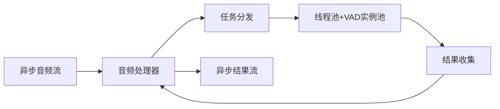
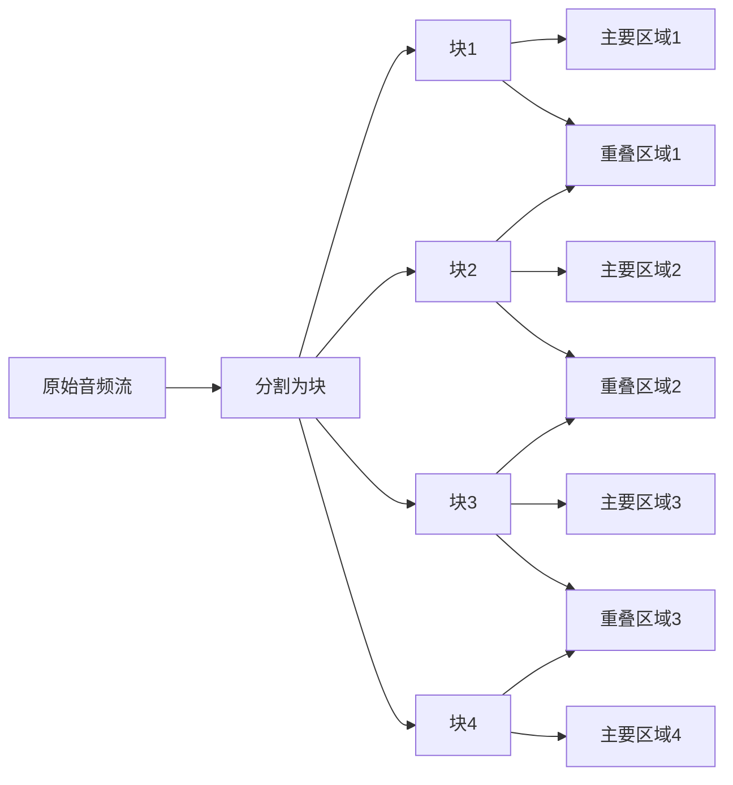
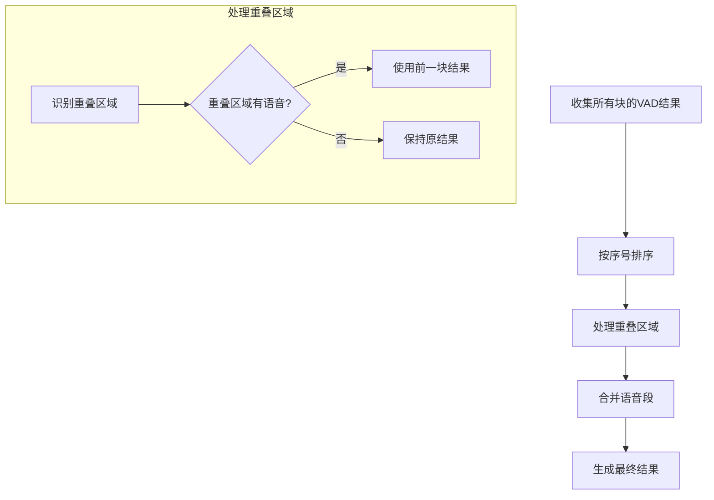

# 音频处理器模块设计

## 1. 模块功能与职责重定义

音频处理器(AudioProcessor)在新的线程池+模型实例池架构中，职责重新定义为：

### 1.1 核心职责
- **异步流管理**：管理音频数据流的接收、缓冲和分发
- **任务调度优化**：将异步音频流任务高效分发到线程池
- **结果聚合处理**：收集来自多个线程的VAD结果并进行时序合并
- **性能监控**：实时监控处理延迟、吞吐量和错误率

### 1.2 架构定位
音频处理器作为异步层与同步推理层的桥梁：



## 2. 边界问题的架构级解决方案

新架构下，边界问题通过系统性设计得到根本解决：

### 2.1 问题重新分析

**传统边界问题**：
1. **上下文依赖**：VAD算法需要前后帧上下文
2. **语音连续性**：语音段可能被分割点打断
3. **状态连续性**：VAD内部状态在分割时中断

**新架构解决方案**：
1. **线程本地状态保持**：每个线程的VAD实例保持独立状态
2. **智能重叠策略**：16-32ms重叠区域提供充分上下文
3. **前块优先原则**：时序冲突时优先采用前块结果

## 3. 重叠处理方案

为解决边界问题，我们采用重叠处理方案：

### 3.1 音频块分割与重叠设计



- **块大小**：根据线程数量和音频长度确定，例如将2秒音频分为4块，每块约500ms
- **重叠区域大小**：建议设置为16-32ms（1-2个VAD帧），足够提供上下文但不会显著增加计算量
- **块标识**：每个块需要包含序列号、时间戳等元数据，确保处理和合并时的正确顺序

### 3.2 重叠区域处理策略

对于重叠区域的VAD检测，我们采用以下策略：

- 如果在重叠区域检测到语音活动，则在最终结果拼接时，直接取时序上前一个块的结果作为音频的开始
- 这确保了语音段的连续性，避免了同一段语音被重复检测或被错误分割

## 4. 结果合并策略

### 4.1 重叠区域结果合并



- **重叠区域识别**：根据块的元数据识别重叠区域
- **结果选择**：如果重叠区域检测到语音，使用前一块的结果
- **时间戳调整**：确保合并后的时间戳连续且准确

### 4.2 语音段合并

- 相邻语音段之间的间隔小于阈值（如50ms）时，将它们合并为一个语音段
- 合并时取最大的语音概率作为合并后段的概率
- 保持时间戳的连续性和准确性

## 5. 性能优化考虑

### 5.1 重叠区域大小的权衡

重叠区域大小需要权衡准确性和性能：
- **过小**：可能无法提供足够的上下文，边界问题仍然存在
- **过大**：增加计算量，降低并行效率
- **建议**：1-2个VAD帧（16-32ms）通常是一个好的平衡点

### 5.2 零拷贝实现

为了减少内存使用和提高性能，可以使用零拷贝技术：
- 使用NumPy的视图机制或Python的memoryview
- 避免在分割和重叠处理时复制数据
- 只传递数据的引用和范围信息

### 5.3 并行处理优化

- **批量分割**：一次性分割所有块，减少操作次数
- **预分配内存**：预先分配结果数组，避免动态分配
- **异步提交**：异步提交块到处理队列，避免等待

## 6. 可能的挑战与简单解决方案

### 6.1 边界检测不一致

**挑战**：重叠区域的VAD结果可能与非重叠区域不一致。

**简单解决方案**：
- 采用"前块优先"原则，保证时间顺序的一致性
- 如有必要，可以稍微增加重叠区域大小

### 6.2 时间戳准确性

**挑战**：在合并结果时，确保时间戳的准确性和连续性。

**简单解决方案**：
- 维护全局时间戳映射
- 在合并阶段进行时间戳校准

### 6.3 内存使用效率

**挑战**：重叠处理会增加内存使用。

**简单解决方案**：
- 使用流式处理，避免一次性加载所有数据
- 处理完成后及时释放内存

## 7. 接口设计

```python
class AudioProcessor:
    async def initialize(self):
        """初始化音频处理器"""
        pass
        
    async def process_chunk(self, audio_data):
        """处理音频块"""
        pass
        
    async def finalize(self):
        """完成处理，刷新缓冲区"""
        pass
```

## 8. 未来优化方向

以下优化方向可作为后续升级考虑：

- 状态传递：在VAD实例之间传递关键状态信息
- 自适应分割：根据音频特性动态调整分割点
- 分层处理：先进行粗粒度检测，再对边界区域进行细粒度处理
- 动态重叠：根据音频特性动态调整重叠区域大小