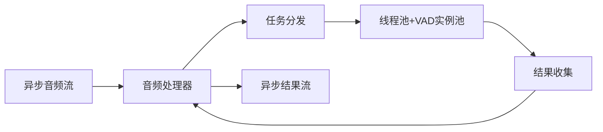
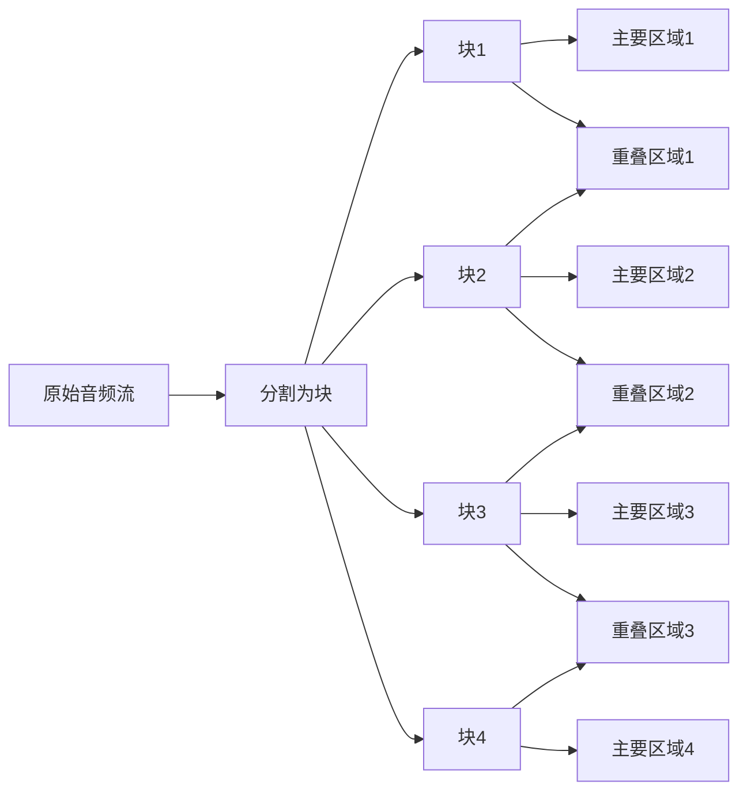
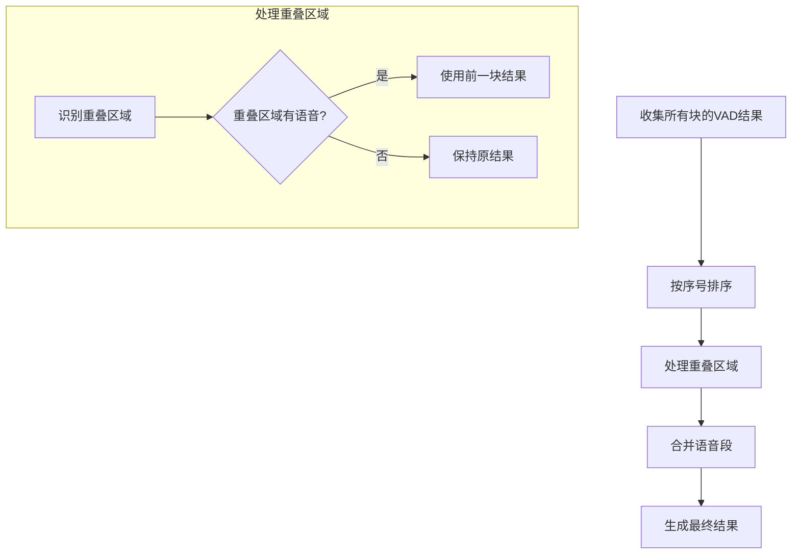
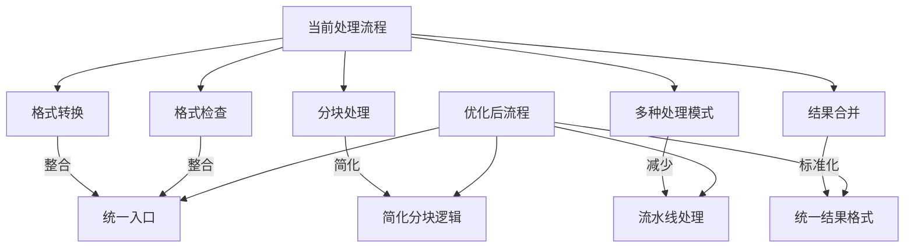
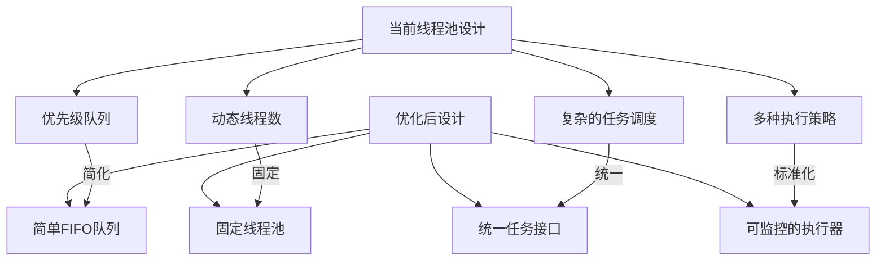
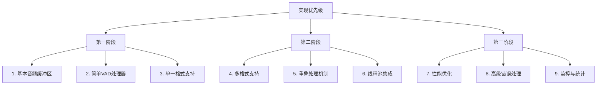

# 音频处理器模块设计

## 1. 模块功能与职责重定义

音频处理器(AudioProcessor)在新的线程池+模型实例池架构中，职责重新定义为：

### 1.1 核心职责
- **异步流管理**：管理音频数据流的接收、缓冲和分发
- **任务调度优化**：将异步音频流任务高效分发到线程池
- **结果聚合处理**：收集来自多个线程的VAD结果并进行时序合并
- **性能监控**：实时监控处理延迟、吞吐量和错误率

### 1.2 架构定位
音频处理器作为异步层与同步推理层的桥梁：


```mermaid
graph LR
    A[异步音频流] --> B[音频处理器]
    B --> C[任务分发]
    C --> D[线程池+VAD实例池]
    D --> E[结果收集]
    E --> B
    B --> F[异步结果流]
```

## 2. 边界问题的架构级解决方案

新架构下，边界问题通过系统性设计得到根本解决：

### 2.1 问题重新分析

**传统边界问题**：
1. **上下文依赖**：VAD算法需要前后帧上下文
2. **语音连续性**：语音段可能被分割点打断
3. **状态连续性**：VAD内部状态在分割时中断

**新架构解决方案**：
1. **线程本地状态保持**：每个线程的VAD实例保持独立状态
2. **智能重叠策略**：16-32ms重叠区域提供充分上下文
3. **前块优先原则**：时序冲突时优先采用前块结果

## 3. 重叠处理方案

为解决边界问题，我们采用重叠处理方案：

### 3.1 音频块分割与重叠设计


```mermaid
graph LR
    A[原始音频流] --> B[分割为块]
    B --> C1[块1]
    B --> C2[块2]
    B --> C3[块3]
    B --> C4[块4]
    
    C1 --> D1[主要区域1]
    C1 --> E1[重叠区域1]
    C2 --> E1
    C2 --> D2[主要区域2]
    C2 --> E2[重叠区域2]
    C3 --> E2
    C3 --> D3[主要区域3]
    C3 --> E3[重叠区域3]
    C4 --> E3
    C4 --> D4[主要区域4]
```

- **块大小**：根据线程数量和音频长度确定，例如将2秒音频分为4块，每块约500ms
- **重叠区域大小**：建议设置为16-32ms（1-2个VAD帧），足够提供上下文但不会显著增加计算量
- **块标识**：每个块需要包含序列号、时间戳等元数据，确保处理和合并时的正确顺序

### 3.2 重叠区域处理策略

对于重叠区域的VAD检测，我们采用以下策略：

- 如果在重叠区域检测到语音活动，则在最终结果拼接时，直接取时序上前一个块的结果作为音频的开始
- 这确保了语音段的连续性，避免了同一段语音被重复检测或被错误分割

## 4. 结果合并策略

### 4.1 重叠区域结果合并


```mermaid
graph TD
    A[收集所有块的VAD结果] --> B[按序号排序]
    B --> C[处理重叠区域]
    C --> D[合并语音段]
    D --> E[生成最终结果]
    
    subgraph 处理重叠区域
        C1[识别重叠区域] --> C2{重叠区域有语音?}
        C2 -->|是| C3[使用前一块结果]
        C2 -->|否| C4[保持原结果]
    end
```

- **重叠区域识别**：根据块的元数据识别重叠区域
- **结果选择**：如果重叠区域检测到语音，使用前一块的结果
- **时间戳调整**：确保合并后的时间戳连续且准确

### 4.2 语音段合并

- 相邻语音段之间的间隔小于阈值（如50ms）时，将它们合并为一个语音段
- 合并时取最大的语音概率作为合并后段的概率
- 保持时间戳的连续性和准确性

## 5. 性能优化考虑

### 5.1 重叠区域大小的权衡

重叠区域大小需要权衡准确性和性能：
- **过小**：可能无法提供足够的上下文，边界问题仍然存在
- **过大**：增加计算量，降低并行效率
- **建议**：1-2个VAD帧（16-32ms）通常是一个好的平衡点

### 5.2 零拷贝实现

为了减少内存使用和提高性能，可以使用零拷贝技术：
- 使用NumPy的视图机制或Python的memoryview
- 避免在分割和重叠处理时复制数据
- 只传递数据的引用和范围信息

### 5.3 并行处理优化

- **批量分割**：一次性分割所有块，减少操作次数
- **预分配内存**：预先分配结果数组，避免动态分配
- **异步提交**：异步提交块到处理队列，避免等待

## 6. 可能的挑战与简单解决方案

### 6.1 边界检测不一致

**挑战**：重叠区域的VAD结果可能与非重叠区域不一致。

**简单解决方案**：
- 采用"前块优先"原则，保证时间顺序的一致性
- 如有必要，可以稍微增加重叠区域大小

### 6.2 时间戳准确性

**挑战**：在合并结果时，确保时间戳的准确性和连续性。

**简单解决方案**：
- 维护全局时间戳映射
- 在合并阶段进行时间戳校准

### 6.3 内存使用效率

**挑战**：重叠处理会增加内存使用。

**简单解决方案**：
- 使用流式处理，避免一次性加载所有数据
- 处理完成后及时释放内存

## 7. 接口设计

### 7.1 管道式处理流程


```mermaid
graph TD
    A[当前处理流程] --> B[格式检查]
    A --> C[格式转换]
    A --> D[分块处理]
    A --> E[结果合并]
    A --> F[多种处理模式]
    
    G[优化后流程] --> H[统一入口]
    G --> I[流水线处理]
    G --> J[简化分块逻辑]
    G --> K[统一结果格式]
    
    B -- 整合 --> H
    C -- 整合 --> H
    D -- 简化 --> J
    E -- 标准化 --> K
    F -- 减少 --> I
```

```python
from enum import Enum
from pydantic import BaseModel, Field
from typing import List, Dict, Any, Optional

class OverlapStrategy(str, Enum):
    """重叠处理策略"""
    FRONT_PRIORITY = "front_priority"  # 前块优先
    BACK_PRIORITY = "back_priority"    # 后块优先
    MAX_CONFIDENCE = "max_confidence"  # 最高置信度优先

class AudioConfig(BaseModel):
    """音频配置"""
    format_type: str = Field(description="音频格式类型")
    sample_rate: int = Field(description="采样率")
    channels: int = Field(default=1, description="通道数")
    chunk_duration_ms: int = Field(default=250, description="块时长（毫秒）")
    overlap_ms: int = Field(default=16, description="重叠区域时长（毫秒）")
    overlap_strategy: OverlapStrategy = Field(default=OverlapStrategy.FRONT_PRIORITY, description="重叠处理策略")

class AudioProcessor:
    def __init__(self, vad_engine, overlap_strategy=OverlapStrategy.FRONT_PRIORITY):
        """初始化音频处理器"""
        self.vad_engine = vad_engine
        self.overlap_strategy = overlap_strategy
        
    async def process_audio(self, audio_data, audio_config: AudioConfig):
        """统一的音频处理入口"""
        # 使用管道模式处理
        pipeline = [
            self._prepare_audio,    # 准备音频（格式转换等）
            self._split_into_chunks, # 分割为块
            self._process_chunks,    # 处理块
            self._merge_results      # 合并结果
        ]
        
        # 初始化上下文
        context = {
            "audio_data": audio_data,
            "config": audio_config,
            "chunks": [],
            "results": []
        }
        
        # 执行管道
        for step in pipeline:
            context = await step(context)
            
        return context["results"]
        
    async def _prepare_audio(self, context):
        """准备音频数据"""
        # 格式转换等预处理
        return context
        
    async def _split_into_chunks(self, context):
        """分割为处理块"""
        # 简化的分块逻辑
        return context
        
    async def _process_chunks(self, context):
        """处理所有块"""
        # 并行处理
        tasks = [self._process_single_chunk(chunk) for chunk in context["chunks"]]
        context["results"] = await asyncio.gather(*tasks)
        return context
        
    async def _process_single_chunk(self, chunk):
        """处理单个块"""
        return await self.vad_engine.process(chunk)
        
    async def _merge_results(self, context):
        """合并处理结果"""
        # 简化的结果合并逻辑
        return context
```

### 7.2 简化重叠处理

```python
async def _merge_results(self, context):
    """合并处理结果"""
    results = context["results"]
    chunks = context["chunks"]
    config = context["config"]
    
    # 简化的合并逻辑
    merged_results = []
    
    for i in range(len(results) - 1):
        current_result = results[i]
        next_result = results[i + 1]
        current_chunk = chunks[i]
        next_chunk = chunks[i + 1]
        
        # 找出重叠区域
        overlap_start = next_chunk.start_frame
        overlap_end = current_chunk.start_frame + current_chunk.chunk_size
        
        # 处理重叠区域
        if config.overlap_strategy == OverlapStrategy.FRONT_PRIORITY:
            # 前块优先策略
            merged_results.append(current_result)
        elif config.overlap_strategy == OverlapStrategy.BACK_PRIORITY:
            # 后块优先策略
            # 修改当前结果，排除与下一块重叠的部分
            # ...
        elif config.overlap_strategy == OverlapStrategy.MAX_CONFIDENCE:
            # 最高置信度优先策略
            # 比较重叠区域的置信度，选择较高的
            # ...
            
    # 添加最后一个结果
    merged_results.append(results[-1])
    
    context["results"] = merged_results
    return context
```

## 8. 线程池优化

### 8.1 简化线程池管理


```mermaid
graph TD
    A[当前线程池设计] --> B[优先级队列]
    A --> C[动态线程数]
    A --> D[复杂的任务调度]
    A --> E[多种执行策略]
    
    F[优化后设计] --> G[固定线程池]
    F --> H[简单FIFO队列]
    F --> I[统一任务接口]
    F --> J[可监控的执行器]
    
    B -- 简化 --> H
    C -- 固定 --> G
    D -- 统一 --> I
    E -- 标准化 --> J
```

```python
from concurrent.futures import ThreadPoolExecutor
import threading
from typing import Dict, Any, Callable, List

class MonitoredThreadPool:
    """可监控的线程池"""
    def __init__(self, max_workers=None, thread_name_prefix=''):
        # 使用标准库的ThreadPoolExecutor
        self.executor = ThreadPoolExecutor(
            max_workers=max_workers,
            thread_name_prefix=thread_name_prefix
        )
        self.active_tasks = 0
        self.completed_tasks = 0
        self.failed_tasks = 0
        self._lock = threading.RLock()
        
    def submit(self, fn, *args, **kwargs):
        """提交任务到线程池"""
        with self._lock:
            self.active_tasks += 1
            
        future = self.executor.submit(fn, *args, **kwargs)
        
        def _done_callback(future):
            with self._lock:
                self.active_tasks -= 1
                if future.exception() is not None:
                    self.failed_tasks += 1
                else:
                    self.completed_tasks += 1
                    
        future.add_done_callback(_done_callback)
        return future
        
    def shutdown(self, wait=True):
        """关闭线程池"""
        self.executor.shutdown(wait=wait)
        
    def get_stats(self):
        """获取线程池统计信息"""
        with self._lock:
            return {
                "active_tasks": self.active_tasks,
                "completed_tasks": self.completed_tasks,
                "failed_tasks": self.failed_tasks,
                "total_tasks": self.active_tasks + self.completed_tasks + self.failed_tasks
            }
```

### 8.2 简化任务调度

```python
class AudioProcessor:
    def __init__(self, vad_engine, max_workers=None):
        self.vad_engine = vad_engine
        self.thread_pool = MonitoredThreadPool(
            max_workers=max_workers,
            thread_name_prefix="vad-worker"
        )
        
    async def _process_chunks(self, context):
        """处理所有块"""
        chunks = context["chunks"]
        loop = asyncio.get_running_loop()
        
        # 使用线程池并行处理
        futures = []
        for chunk in chunks:
            # 将同步处理函数包装为异步任务
            future = loop.run_in_executor(
                None,  # 使用默认执行器
                self._process_chunk_sync,
                chunk
            )
            futures.append(future)
            
        # 等待所有任务完成
        context["results"] = await asyncio.gather(*futures)
        return context
        
    def _process_chunk_sync(self, chunk):
        """同步处理单个块"""
        # 同步处理逻辑
        return self.vad_engine.process_sync(chunk)
```

## 9. 实现优先级建议


```mermaid
graph TD
    A[实现优先级] --> B[第一阶段]
    A --> C[第二阶段]
    A --> D[第三阶段]
    
    B --> B1[1. 基本音频缓冲区]
    B --> B2[2. 简单VAD处理器]
    B --> B3[3. 单一格式支持]
    
    C --> C1[4. 多格式支持]
    C --> C2[5. 重叠处理机制]
    C --> C3[6. 线程池集成]
    
    D --> D1[7. 性能优化]
    D --> D2[8. 高级错误处理]
    D --> D3[9. 监控与统计]
```

1. **第一阶段**：实现核心功能
   - 基本音频缓冲区（简化版）
   - 简单VAD处理器（单线程）
   - 单一格式支持（先支持WAV）

2. **第二阶段**：添加关键特性
   - 多格式支持（添加PCMA）
   - 重叠处理机制
   - 线程池集成

3. **第三阶段**：优化和完善
   - 性能优化（零拷贝、内存对齐等）
   - 高级错误处理
   - 监控与统计