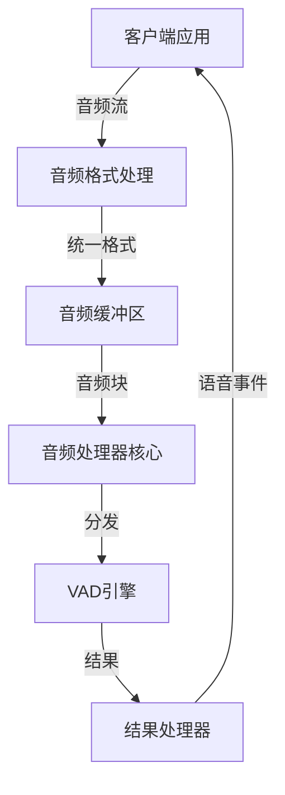
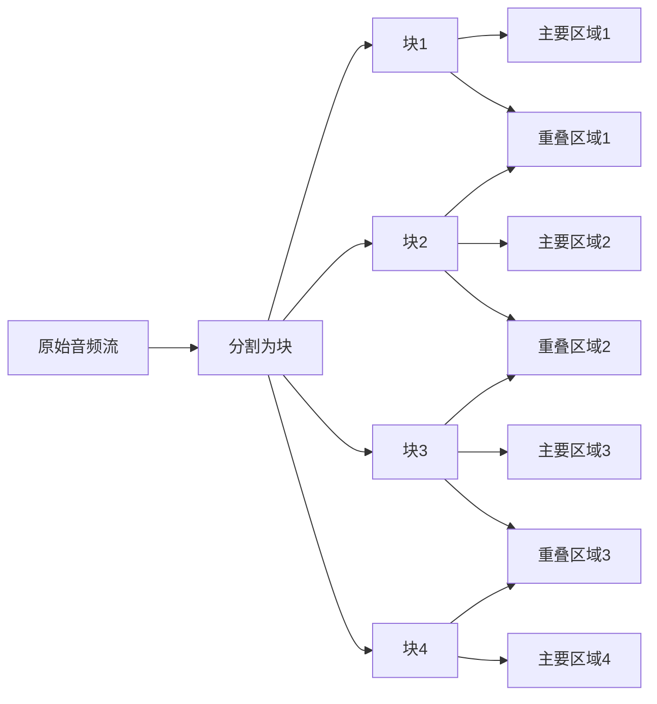
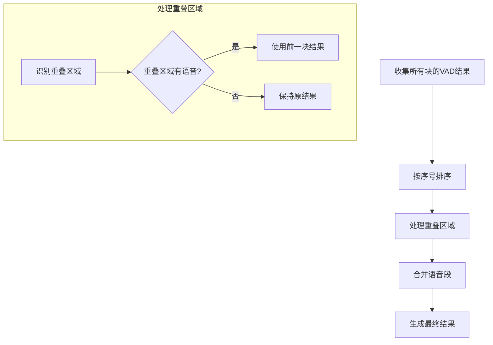
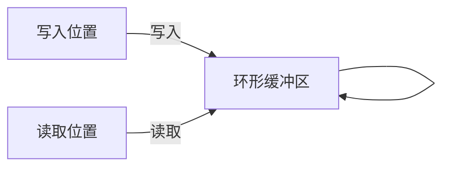
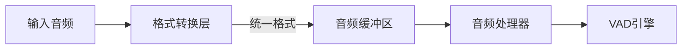
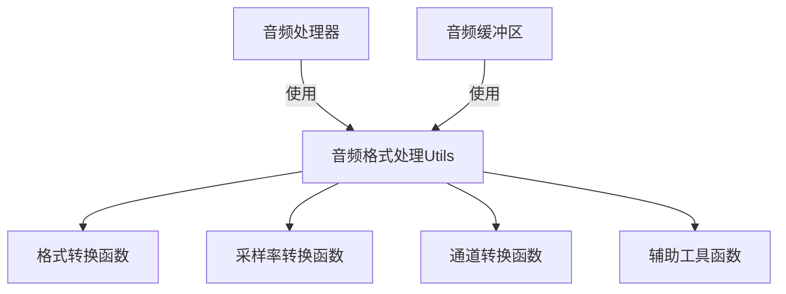
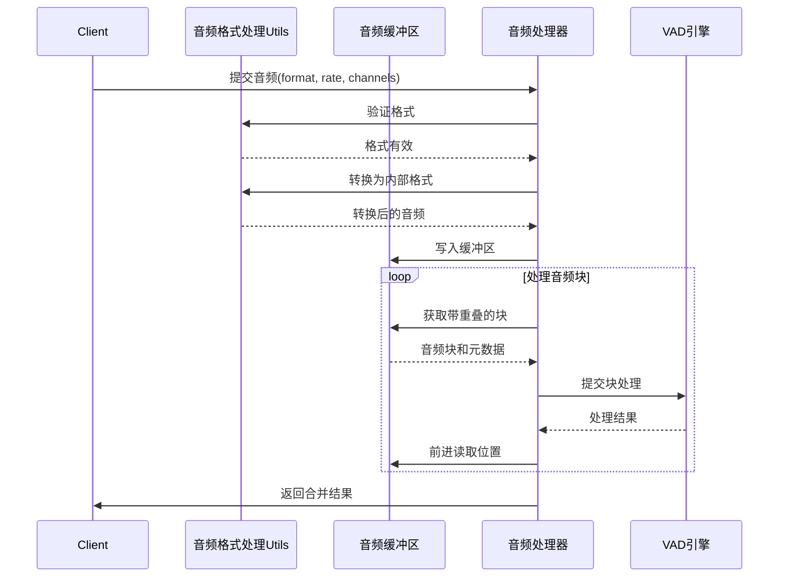

# 音频处理器架构设计

## 1. 概述

音频处理器是异步并行VAD处理库的核心组件，负责接收音频流、分割音频块、处理边界问题，并将处理结果传递给VAD引擎。本文档详细描述音频处理器的架构设计，包括音频处理器核心、音频缓冲区和音频格式处理三个主要部分，以及它们之间的集成与兼容性。



## 2. 音频处理器核心

### 2.1 功能与职责

音频处理器核心主要负责：

- 接收音频流数据
- 将音频流分割为固定大小的块
- 添加块之间的重叠区域
- 将音频块提交给线程池处理
- 收集处理结果并进行合并

### 2.2 边界问题分析

在将长音频分割成多个块并行处理时，边界问题主要源于以下几个原因：

1. **VAD算法的上下文依赖性**：大多数VAD算法不仅依赖当前帧的信息，还依赖前后帧的上下文来做出更准确的判断。当我们将音频分割成独立块时，每个块的边界处缺少了相邻块的上下文信息。

2. **语音特征的连续性**：语音的开始和结束通常是渐变的，而不是突变的。如果一个语音片段恰好被分割在两个块的边界处，单独处理每个块可能会导致检测不准确。

3. **VAD状态的连续性**：许多VAD算法内部维护状态信息（如噪声估计、能量平均值等），当处理被分割时，这种状态连续性被打断。

### 2.3 重叠处理方案

为解决边界问题，我们采用重叠处理方案：



- **块大小**：根据线程数量和音频长度确定，例如将2秒音频分为4块，每块约500ms
- **重叠区域大小**：建议设置为16-32ms（1-2个VAD帧），足够提供上下文但不会显著增加计算量
- **块标识**：每个块需要包含序列号、时间戳等元数据，确保处理和合并时的正确顺序

### 2.4 重叠区域处理策略

对于重叠区域的VAD检测，我们采用以下策略：

- 如果在重叠区域检测到语音活动，则在最终结果拼接时，直接取时序上前一个块的结果作为音频的开始
- 这确保了语音段的连续性，避免了同一段语音被重复检测或被错误分割

### 2.5 结果合并策略



- **重叠区域识别**：根据块的元数据识别重叠区域
- **结果选择**：如果重叠区域检测到语音，使用前一块的结果
- **时间戳调整**：确保合并后的时间戳连续且准确

### 2.6 接口设计

```python
class AudioProcessor:
    async def initialize(self):
        """初始化音频处理器"""
        pass
        
    async def process_chunk(self, audio_data, format_type=None, sample_rate=None, channels=None):
        """处理音频块"""
        pass
        
    async def finalize(self):
        """完成处理，刷新缓冲区"""
        pass
```

## 3. 音频缓冲区

### 3.1 设计目标

音频缓冲区是音频处理模块的核心组件，需要满足以下设计目标：

- **低延迟**：支持快速的数据读写操作
- **数据完整性**：不遗漏或丢失任何音频数据
- **线程安全**：在多线程环境下保证数据一致性
- **内存效率**：避免不必要的数据复制，减少内存使用
- **与处理器兼容**：提供专门接口支持音频处理器的需求

### 3.2 环形缓冲区设计

采用环形缓冲区（Ring Buffer）设计，具有以下优势：



- **连续写入**：支持连续的数据写入，无需频繁重置
- **内存重用**：自动重用已处理的内存空间，减少内存分配
- **高效实现**：环形结构便于实现高效的读写操作

### 3.3 线程安全机制

```python
class AudioRingBuffer:
    def __init__(self, capacity_seconds, sample_rate, channels=1, dtype=np.float32):
        # ...
        self._read_lock = threading.RLock()  # 读取锁
        self._write_lock = threading.RLock()  # 写入锁
        self._not_empty = threading.Condition(self._read_lock)  # 非空条件
        self._not_full = threading.Condition(self._write_lock)  # 非满条件
```

- **读写分离锁**：使用单独的锁保护读取和写入操作，减少锁竞争
- **原子操作**：使用原子操作更新位置指针和数据计数
- **条件变量**：支持阻塞读取和写入，实现线程间同步

### 3.4 零拷贝设计

```python
def get_chunk(self, chunk_size, overlap_size=0):
    with self._read_lock:
        # ...
        # 返回内存视图而非复制
        if self.read_pos + chunk_size <= self.capacity:
            # 连续区域
            return memoryview(self.buffer[self.read_pos:self.read_pos + chunk_size])
        else:
            # 跨越边界，这种情况需要复制
            chunk = np.empty(chunk_size, dtype=self.buffer.dtype)
            first_part_size = self.capacity - self.read_pos
            chunk[:first_part_size] = self.buffer[self.read_pos:]
            chunk[first_part_size:] = self.buffer[:chunk_size - first_part_size]
            return chunk
```

- **内存视图**：使用memoryview或NumPy的视图机制，避免数据复制
- **边界处理**：处理环形缓冲区边界情况，必要时才进行复制
- **重叠处理**：支持获取带重叠的数据块，用于边界问题处理

### 3.5 与音频处理器集成

为支持音频处理器需求，设计专用接口：

```python
def get_chunk_with_overlap(self, chunk_size, overlap_size):
    """
    获取指定大小的音频块，包含重叠区域
    
    Args:
        chunk_size: 主要块大小
        overlap_size: 重叠区域大小
        
    Returns:
        包含重叠区域的音频块，以及块的元数据
    """
    with self._read_lock:
        # 检查可用数据
        if self.available_data.get() < chunk_size + overlap_size:
            raise BufferError("Not enough data available")
            
        # 获取主要块和重叠区域
        total_size = chunk_size + overlap_size
        
        if self.read_pos + total_size <= self.capacity:
            # 连续区域
            data = self.buffer[self.read_pos:self.read_pos + total_size]
        else:
            # 跨越边界
            data = np.empty(total_size, dtype=self.buffer.dtype)
            first_part_size = self.capacity - self.read_pos
            data[:first_part_size] = self.buffer[self.read_pos:]
            data[first_part_size:] = self.buffer[:total_size - first_part_size]
        
        # 创建块元数据
        metadata = {
            "sequence_number": self.sequence_counter,
            "start_frame": self.total_frames_read,
            "chunk_size": chunk_size,
            "overlap_size": overlap_size,
            "is_last": False  # 可以根据需要设置
        }
        
        self.sequence_counter += 1
        
        # 更新读取位置（只移动主要块大小，保留重叠区域）
        self.read_pos = (self.read_pos + chunk_size) % self.capacity
        self.available_data.add(-chunk_size)
        self.total_frames_read += chunk_size
        
        # 通知等待的写入线程
        self._not_full.notify_all()
        
        return data, metadata
```

### 3.6 溢出处理策略

提供两种溢出处理策略：

1. **阻塞策略**：当缓冲区满时，写入操作阻塞等待，直到有足够空间
2. **覆盖策略**：当缓冲区满时，覆盖最旧的数据，适用于实时处理场景

### 3.7 低延迟优化

- **内存对齐**：确保缓冲区起始地址对齐到缓存行，提高访问效率
- **批处理优化**：支持批量读写操作，减少函数调用和锁操作
- **预分配内存**：预先分配固定大小的缓冲区，避免动态内存分配

### 3.8 完整接口设计

```python
class AudioRingBuffer:
    def __init__(self, capacity_seconds, sample_rate, channels=1, dtype=np.float32):
        """初始化音频环形缓冲区"""
        pass
        
    def write(self, data, blocking=True, timeout=None):
        """写入数据到缓冲区"""
        pass
        
    def read(self, size, blocking=True, timeout=None):
        """从缓冲区读取指定大小的数据"""
        pass
        
    def get_chunk(self, chunk_size, overlap_size=0):
        """获取指定大小的数据块，可以包含重叠区域"""
        pass
        
    def get_chunk_with_overlap(self, chunk_size, overlap_size):
        """获取指定大小的音频块，包含重叠区域，专为音频处理器设计"""
        pass
        
    def advance_after_processing(self, chunk_size):
        """处理完成后前进读取位置"""
        pass
        
    def peek(self, size):
        """查看数据但不移动读取位置"""
        pass
        
    def skip(self, size):
        """跳过指定大小的数据"""
        pass
        
    def available(self):
        """返回可读取的数据量"""
        pass
        
    def remaining(self):
        """返回剩余可写入的空间"""
        pass
        
    def clear(self):
        """清空缓冲区"""
        pass
        
    def is_empty(self):
        """检查缓冲区是否为空"""
        pass
        
    def is_full(self):
        """检查缓冲区是否已满"""
        pass
        
    def close(self):
        """关闭缓冲区，释放资源"""
        pass
```

## 4. 音频格式处理

### 4.1 支持的音频格式

根据需求，系统默认支持并仅支持以下音频格式：

- **格式**：WAV和PCMA（A-law）
- **采样率**：16kHz和8kHz
- **通道数**：单声道（mono）

### 4.2 音频格式对处理流程的影响

不同的音频格式会影响音频处理器和缓冲区的逻辑，主要体现在以下几个方面：

#### 4.2.1 数据表示差异

- **WAV (PCM)**：通常是未压缩的线性PCM数据，可以是16位整数（int16）或32位浮点数（float32）
- **PCMA (A-law)**：是一种压缩格式，每个样本使用8位表示，需要解压缩为线性PCM才能进行处理

#### 4.2.2 采样率影响

- **缓冲区大小计算**：不同采样率下，相同时长的音频对应不同数量的样本
- **处理块大小**：16ms的音频块在16kHz下是256个样本，在8kHz下是128个样本
- **VAD性能**：VAD算法可能对特定采样率有优化，可能需要重新训练或调整参数

#### 4.2.3 数据类型考虑

- **内存使用**：不同数据类型占用不同大小的内存（int16: 2字节/样本，float32: 4字节/样本）
- **计算效率**：不同数据类型的计算效率不同，浮点运算通常更慢但精度更高
- **动态范围**：int16的动态范围是±32767，float32可以表示更大的动态范围

### 4.3 音频格式处理方案

#### 4.3.1 格式转换层

在音频处理器和缓冲区之前添加一个格式转换层，负责将不同格式的音频统一转换为内部处理格式：



- **统一内部格式**：选择float32作为内部处理格式，提供足够的精度和动态范围
- **按需转换**：仅在需要时进行格式转换，避免不必要的计算
- **零拷贝原则**：尽可能使用视图而非复制进行格式转换

#### 4.3.2 格式检测与转换

```python
def convert_to_internal_format(audio_data, format_type, sample_rate, channels):
    """
    将输入音频转换为内部处理格式
    
    Args:
        audio_data: 输入音频数据
        format_type: 音频格式类型（'wav'或'pcma'）
        sample_rate: 采样率（8000或16000）
        channels: 通道数
        
    Returns:
        转换后的音频数据，采样率，通道数
    """
    # 检查格式是否支持
    if format_type not in ['wav', 'pcma']:
        raise ValueError(f"Unsupported audio format: {format_type}")
        
    if sample_rate not in [8000, 16000]:
        raise ValueError(f"Unsupported sample rate: {sample_rate}")
        
    if channels != 1:
        raise ValueError(f"Only mono audio is supported, got {channels} channels")
    
    # 格式转换
    if format_type == 'pcma':
        # 将PCMA解压缩为线性PCM
        audio_data = pcma_to_pcm(audio_data)
    
    # 确保数据类型为float32
    if audio_data.dtype != np.float32:
        # 如果是int16，归一化到[-1.0, 1.0]范围
        if audio_data.dtype == np.int16:
            audio_data = audio_data.astype(np.float32) / 32767.0
        else:
            audio_data = audio_data.astype(np.float32)
    
    return audio_data, sample_rate, channels
```

#### 4.3.3 采样率适配

```python
def adapt_sample_rate(audio_data, current_rate, target_rate):
    """
    调整音频采样率
    
    Args:
        audio_data: 输入音频数据
        current_rate: 当前采样率
        target_rate: 目标采样率
        
    Returns:
        调整后的音频数据
    """
    if current_rate == target_rate:
        return audio_data
        
    # 使用高质量的重采样算法
    return librosa.resample(audio_data, orig_sr=current_rate, target_sr=target_rate)
```

#### 4.3.4 块大小计算

```python
def calculate_chunk_size(duration_ms, sample_rate):
    """
    计算指定时长和采样率下的块大小
    
    Args:
        duration_ms: 时长（毫秒）
        sample_rate: 采样率
        
    Returns:
        块大小（样本数）
    """
    return int(duration_ms * sample_rate / 1000)
```

### 4.4 性能优化

#### 4.4.1 预计算块大小

对于固定的采样率，可以预计算不同时长对应的块大小，避免重复计算：

```python
# 预计算块大小
CHUNK_SIZES = {
    8000: {  # 8kHz
        16: 128,    # 16ms
        32: 256,    # 32ms
        250: 2000,  # 250ms
    },
    16000: {  # 16kHz
        16: 256,    # 16ms
        32: 512,    # 32ms
        250: 4000,  # 250ms
    }
}

def get_chunk_size(duration_ms, sample_rate):
    """获取预计算的块大小"""
    return CHUNK_SIZES.get(sample_rate, {}).get(
        duration_ms, 
        int(duration_ms * sample_rate / 1000)
    )
```

#### 4.4.2 格式转换优化

对于频繁使用的格式转换，可以使用优化的实现：

```python
def pcma_to_pcm_optimized(pcma_data):
    """优化的PCMA到PCM转换"""
    # 使用查找表加速转换
    pcma_to_pcm_table = np.array([...])  # 预计算的转换表
    return pcma_to_pcm_table[pcma_data]
```

#### 4.4.3 内存布局优化

根据不同的音频格式，优化内存布局：

```python
def optimize_buffer_layout(buffer, dtype):
    """优化缓冲区内存布局"""
    if dtype == np.float32:
        # 确保对齐到32字节边界（AVX指令集）
        return np.zeros(buffer.shape, dtype=dtype, order='C', align=32)
    elif dtype == np.int16:
        # 确保对齐到16字节边界（SSE指令集）
        return np.zeros(buffer.shape, dtype=dtype, order='C', align=16)
    else:
        return np.zeros(buffer.shape, dtype=dtype)
```

## 5. 组件集成与兼容性

### 5.1 模块化设计

音频处理器架构采用模块化设计，包括三个主要组件：



- **独立性**：各组件之间保持独立，通过明确的接口进行交互
- **低耦合**：组件之间的依赖关系清晰，减少耦合
- **高内聚**：每个组件专注于自己的职责，内部逻辑高度内聚

### 5.2 数据流设计



- **单向数据流**：数据从客户端流向音频处理器，再流向VAD引擎，最后结果返回给客户端
- **清晰的责任划分**：每个组件负责特定的处理阶段
- **异步处理**：支持异步处理流程，提高并发性能

### 5.3 接口兼容性

#### 5.3.1 音频格式处理与音频处理器

音频处理器需要的接口：

1. **格式验证**：验证输入音频格式是否支持
2. **格式转换**：将输入音频转换为内部处理格式
3. **块大小计算**：根据时长和采样率计算块大小
4. **VAD参数适配**：根据采样率调整VAD参数

音频格式处理utils提供的接口：

```python
class AudioFormatUtils:
    @staticmethod
    def validate_format(format_type, sample_rate, channels):
        """验证格式是否支持"""
        pass
        
    @staticmethod
    def convert_to_internal_format(audio_data, format_type, sample_rate, channels):
        """转换为内部格式"""
        pass
        
    @staticmethod
    def calculate_chunk_size(duration_ms, sample_rate):
        """计算块大小"""
        pass
        
    @staticmethod
    def get_vad_params(sample_rate):
        """获取VAD参数"""
        pass
```

#### 5.3.2 音频格式处理与音频缓冲区

音频缓冲区需要的接口：

1. **块大小计算**：根据时长和采样率计算块大小
2. **内存优化**：优化内存布局，提高访问效率
3. **格式验证**：验证数据类型是否支持

音频格式处理utils提供的接口：

```python
class AudioFormatUtils:
    @staticmethod
    def calculate_chunk_size(duration_ms, sample_rate):
        """计算块大小"""
        pass
        
    @staticmethod
    def optimize_buffer_layout(buffer, dtype):
        """优化内存布局"""
        pass
        
    @staticmethod
    def validate_dtype(dtype):
        """验证数据类型是否支持"""
        pass
```

#### 5.3.3 音频处理器与音频缓冲区

音频处理器需要的缓冲区接口：

1. **写入数据**：将音频数据写入缓冲区
2. **获取带重叠的块**：获取指定大小的音频块，包含重叠区域
3. **前进读取位置**：处理完成后前进读取位置

音频缓冲区提供的接口：

```python
class AudioRingBuffer:
    def write(self, data, blocking=True, timeout=None):
        """写入数据到缓冲区"""
        pass
        
    def get_chunk_with_overlap(self, chunk_size, overlap_size):
        """获取指定大小的音频块，包含重叠区域"""
        pass
        
    def advance_after_processing(self, chunk_size):
        """处理完成后前进读取位置"""
        pass
```

### 5.4 性能兼容性

#### 5.4.1 低延迟要求

三个组件都需要满足低延迟要求：

- **音频格式处理**：使用优化的格式转换算法，支持零拷贝设计
- **音频缓冲区**：使用环形缓冲区设计，支持零拷贝读取，优化内存布局
- **音频处理器**：使用异步处理，支持并行处理，优化结果合并

#### 5.4.2 内存效率

三个组件都需要高效使用内存：

- **音频格式处理**：尽可能使用视图而非复制，避免不必要的内存分配
- **音频缓冲区**：预分配固定大小的缓冲区，重用内存空间
- **音频处理器**：使用引用传递，避免不必要的数据复制

#### 5.4.3 CPU效率

三个组件都需要高效使用CPU：

- **音频格式处理**：使用优化的算法，支持SIMD指令，使用查找表加速
- **音频缓冲区**：优化内存布局，提高缓存命中率
- **音频处理器**：使用线程池，支持并行处理，减少锁竞争

### 5.5 错误处理兼容性

三个组件需要协调的错误处理机制：

- **统一的异常类型**：定义专门的异常类型，便于精确的错误处理
- **一致的错误信息格式**：使用一致的错误信息格式，便于调试
- **错误传播机制**：明确错误传播路径，避免错误被吞噬

```python
# 异常类型定义
class AudioProcessingError(Exception):
    """音频处理错误基类"""
    pass
    
class FormatError(AudioProcessingError):
    """格式错误"""
    pass
    
class BufferError(AudioProcessingError):
    """缓冲区错误"""
    pass
    
class ProcessingError(AudioProcessingError):
    """处理错误"""
    pass
```

## 6. 集成示例

### 6.1 基本使用流程

```python
async def process_audio(audio_data, format_type, sample_rate, channels):
    # 初始化组件
    format_utils = AudioFormatUtils()
    buffer = AudioRingBuffer(capacity_seconds=5, sample_rate=sample_rate)
    processor = AudioProcessor(num_workers=4)
    vad_engine = VADEngine(backend_type="onnx")
    
    # 验证格式
    format_utils.validate_format(format_type, sample_rate, channels)
    
    # 转换为内部格式
    internal_data, internal_rate, internal_channels = format_utils.convert_to_internal_format(
        audio_data, format_type, sample_rate, channels
    )
    
    # 写入缓冲区
    buffer.write(internal_data)
    
    # 计算块大小和重叠大小
    chunk_size = format_utils.calculate_chunk_size(500, internal_rate)  # 500ms
    overlap_size = format_utils.calculate_chunk_size(16, internal_rate)  # 16ms
    
    # 处理音频块
    results = []
    while buffer.available() >= chunk_size + overlap_size:
        # 获取带重叠的音频块
        chunk, metadata = buffer.get_chunk_with_overlap(chunk_size, overlap_size)
        
        # 处理音频块
        result = await processor.process_chunk(chunk, metadata)
        results.append(result)
        
        # 前进读取位置（已在get_chunk_with_overlap中处理）
    
    # 合并结果
    final_result = processor.merge_results(results)
    
    return final_result

```
### 6.2 流式处理示例

```python
async def process_audio_stream(audio_stream, format_type, sample_rate, channels):
    # 初始化组件
    format_utils = AudioFormatUtils()
    buffer = AudioRingBuffer(capacity_seconds=5, sample_rate=sample_rate)
    processor = AudioProcessor(num_workers=4)
    vad_engine = VADEngine(backend_type="onnx")
    
    # 验证格式
    format_utils.validate_format(format_type, sample_rate, channels)
    
    # 计算块大小和重叠大小
    chunk_size = format_utils.calculate_chunk_size(500, sample_rate)  # 500ms
    overlap_size = format_utils.calculate_chunk_size(16, sample_rate)  # 16ms
    
    # 处理音频流
    results = []
    async for audio_chunk in audio_stream:
        # 转换为内部格式
        internal_chunk, _, _ = format_utils.convert_to_internal_format(
            audio_chunk, format_type, sample_rate, channels
        )
        
        # 写入缓冲区
        buffer.write(internal_chunk)
        
        # 处理可用的音频块
        while buffer.available() >= chunk_size + overlap_size:
            # 获取带重叠的音频块
            chunk, metadata = buffer.get_chunk_with_overlap(chunk_size, overlap_size)
            
            # 处理音频块
            result = await processor.process_chunk(chunk, metadata)
            results.append(result)
    
    # 处理缓冲区中剩余的数据
    while buffer.available() > 0:
        remaining = min(buffer.available(), chunk_size)
        if remaining < overlap_size:
            break
            
        chunk, metadata = buffer.get_chunk_with_overlap(
            remaining - overlap_size, overlap_size
        )
        
        result = await processor.process_chunk(chunk, metadata)
        results.append(result)
    
    # 合并结果
    final_result = processor.merge_results(results)
    
    return final_result
```

### 6.3 多用户并发处理示例

```python
class UserSession:
    def __init__(self, user_id, format_type, sample_rate, channels):
        self.user_id = user_id
        self.format_type = format_type
        self.sample_rate = sample_rate
        self.channels = channels
        self.format_utils = AudioFormatUtils()
        self.buffer = AudioRingBuffer(capacity_seconds=5, sample_rate=sample_rate)
        self.processor = AudioProcessor(num_workers=2)  # 每个用户使用较少的工作线程
        self.results = []
        
        # 验证格式
        self.format_utils.validate_format(format_type, sample_rate, channels)
        
        # 计算块大小和重叠大小
        self.chunk_size = self.format_utils.calculate_chunk_size(500, sample_rate)
        self.overlap_size = self.format_utils.calculate_chunk_size(16, sample_rate)

async def process_multi_user(user_sessions, shared_vad_engine):
    # 并发处理多个用户的音频
    async def process_user(session):
        while session.buffer.available() >= session.chunk_size + session.overlap_size:
            # 获取带重叠的音频块
            chunk, metadata = session.buffer.get_chunk_with_overlap(
                session.chunk_size, session.overlap_size
            )
            
            # 处理音频块
            result = await session.processor.process_chunk(
                chunk, metadata, vad_engine=shared_vad_engine
            )
            session.results.append(result)
    
    # 并行处理所有用户
    await asyncio.gather(*[process_user(session) for session in user_sessions])
    
    # 返回每个用户的结果
    return {session.user_id: session.processor.merge_results(session.results) 
            for session in user_sessions}
```

# 7. 总结与展望
## 7.1 架构总结  
本文档详细描述了音频处理器的架构设计，包括三个核心组件：  

1. **音频处理器核心**  
   - 负责接收音频流、分割音频块、处理边界问题  
   - 将处理结果传递给VAD引擎  

2. **音频缓冲区**  
   - 提供高效的音频数据存储和访问机制  
   - 支持零拷贝设计和线程安全操作  

3. **音频格式处理**  
   - 负责音频格式的验证、转换和适配  
   - 确保系统能够处理不同格式的音频  

这三个组件通过明确的接口进行交互，形成一个完整的音频处理流水线，能够高效地处理音频流，并将处理结果传递给VAD引擎。  

## 7.2 关键特性  

- **并行处理**：通过将音频分割为多个块，使用多个VAD实例并行处理，显著降低处理延迟  
- **重叠处理**：通过在块之间添加重叠区域，解决边界问题，确保检测结果的准确性  
- **异步设计**：使用异步编程模型，提高系统的并发处理能力  
- **零拷贝设计**：尽可能避免不必要的数据复制，提高内存使用效率  
- **线程安全**：使用细粒度锁和原子操作，确保多线程环境下的数据一致性  
- **格式适配**：支持WAV和PCMA格式，16kHz和8kHz采样率，单声道音频  

## 7.3 未来展望  

- **支持更多音频格式**：扩展音频格式处理模块，支持更多的音频格式和采样率  
- **自适应参数调整**：根据音频特性和系统负载动态调整处理参数（如块大小、重叠大小等）  
- **分布式处理**：支持跨机器的分布式处理，进一步提高系统的处理能力  
- **实时监控与调优**：添加实时监控和调优功能，便于系统运行时的性能优化  
- **更多VAD后端**：支持更多的VAD后端，如TensorFlow、PyTorch等  


