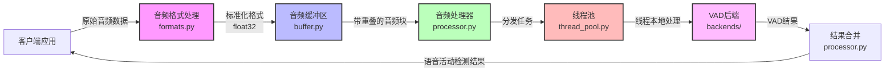
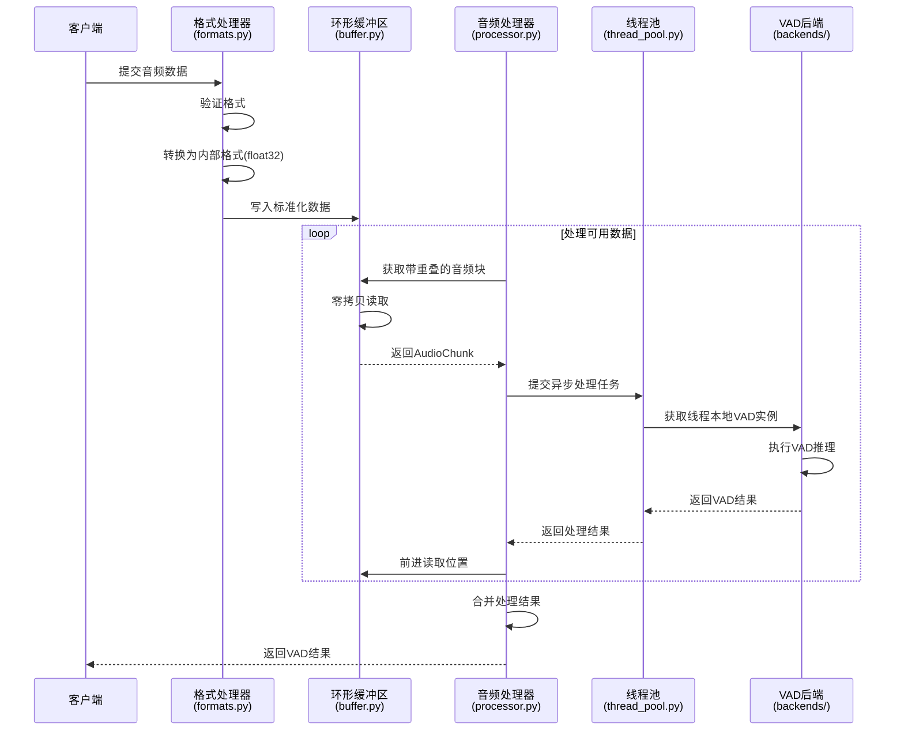
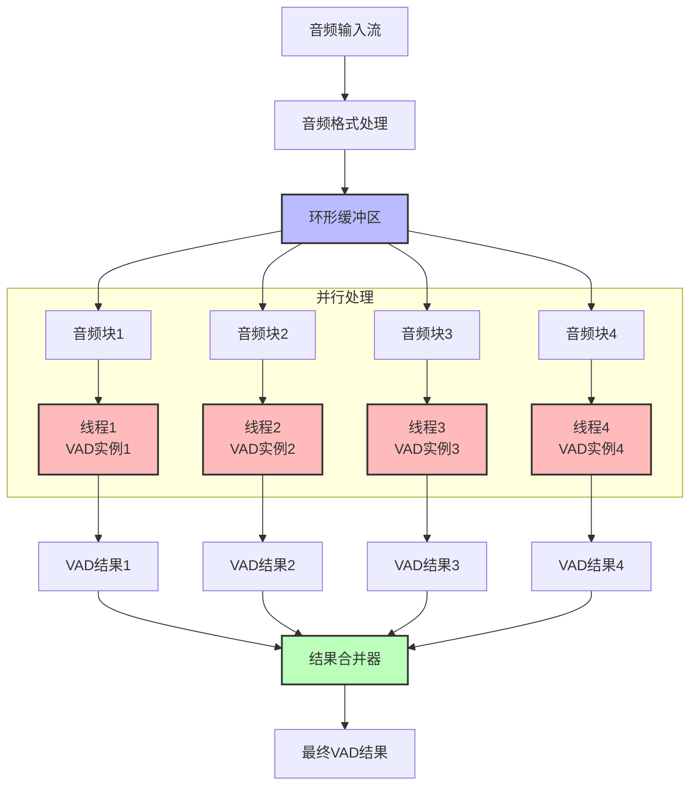
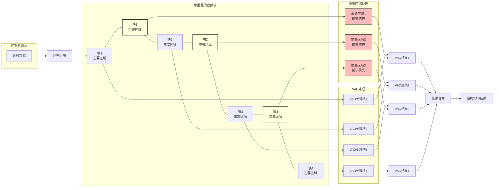
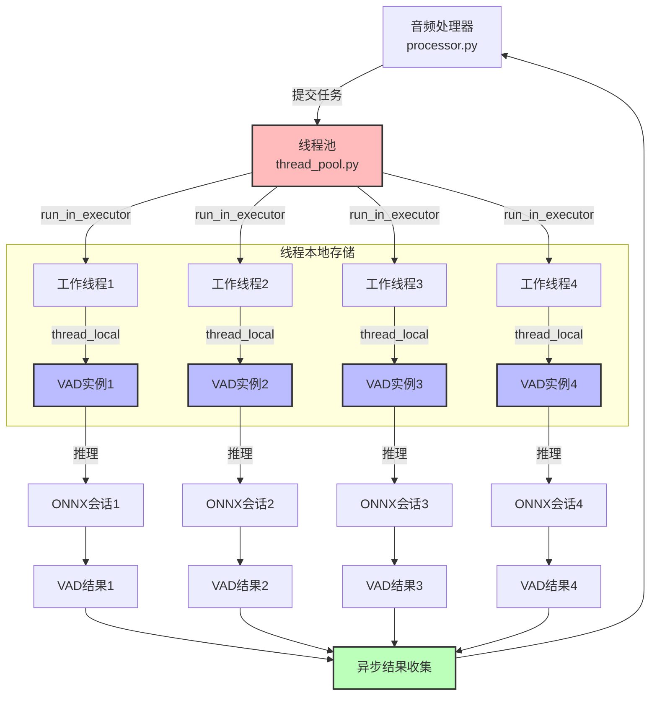
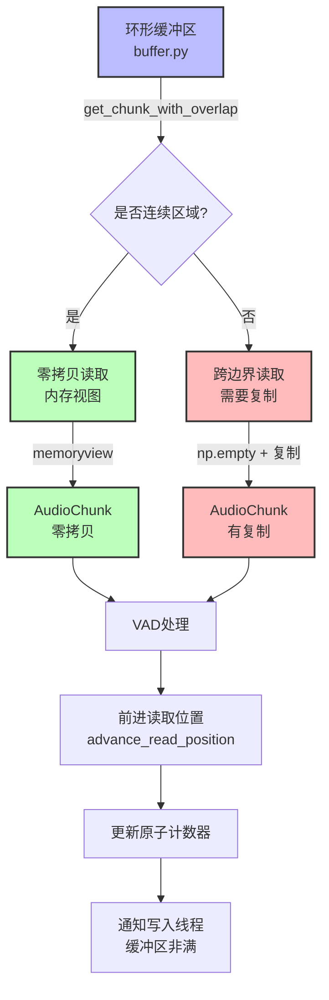
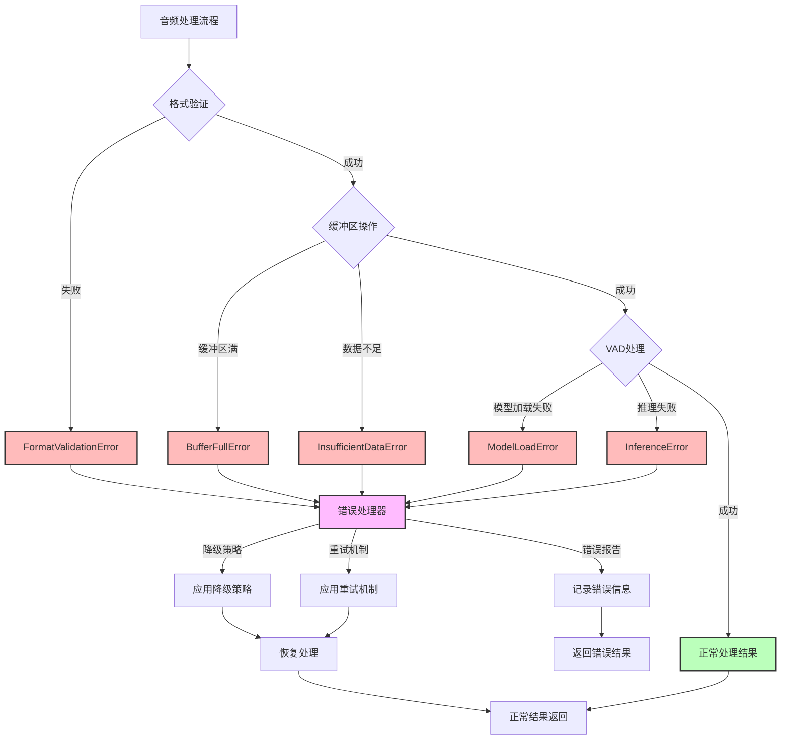
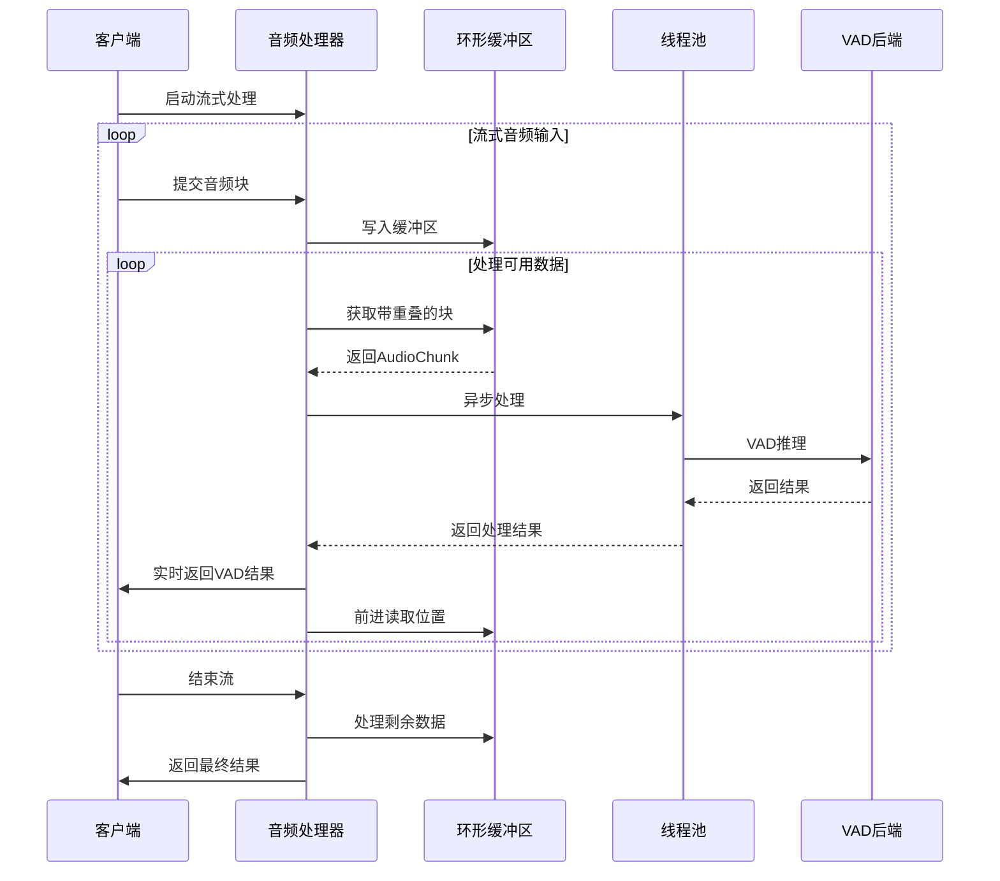
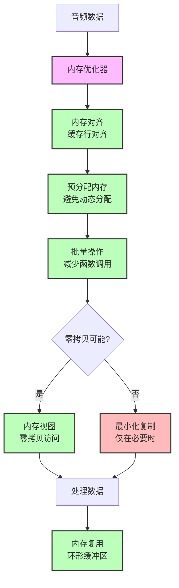
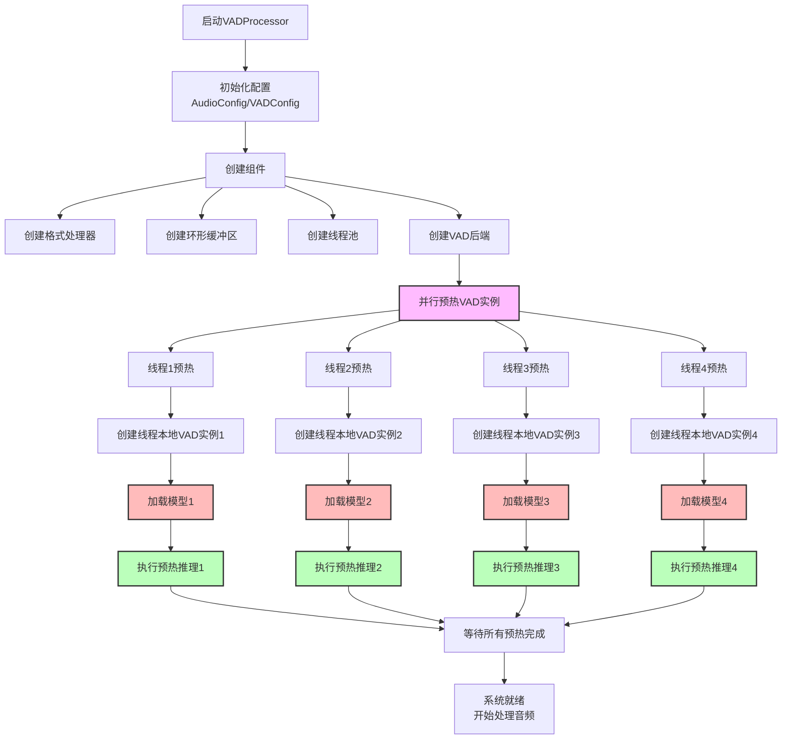

# Cascade音频处理流程图集

本文档提供了Cascade系统音频处理流程的多个视角图解，帮助理解系统的工作原理、数据流向和优化策略。

## 1. 整体数据流程图

下图展示了音频数据在Cascade系统中的完整流转路径，从客户端应用到最终结果的返回：

**关键点说明**：
- 音频格式处理模块将不同格式的输入音频统一转换为内部处理格式（float32）
- 音频缓冲区提供高效的数据存储和零拷贝访问
- 音频处理器作为核心协调者，管理整个处理流程
- 线程池实现并行处理，提高系统吞吐量
- VAD后端执行实际的语音活动检测算法
- 结果合并处理重叠区域，生成最终结果

## 2. 模块交互流程图

下图展示了各模块之间的详细交互过程，包括方法调用和数据传递：

**关键点说明**：
- 格式处理器负责验证和转换音频格式
- 环形缓冲区提供零拷贝读取机制，减少内存复制
- 处理器循环获取音频块并提交异步处理任务
- 线程池获取线程本地VAD实例，避免线程间竞争
- 处理完成后，处理器前进缓冲区读取位置
- 最后合并所有处理结果，返回给客户端

## 3. 并行处理流程图

下图展示了Cascade系统的并行处理机制，多个音频块同时被处理：

**关键点说明**：
- 环形缓冲区将音频数据分割为多个块
- 每个块由独立的线程和VAD实例处理
- 每个线程绑定一个专用的VAD实例，避免竞争
- 所有处理结果最终由结果合并器合并
- 并行处理显著降低了总体处理延迟

## 4. 重叠处理流程图

下图展示了Cascade系统如何处理音频块之间的重叠区域，解决边界问题：

**关键点说明**：
- 原始音频流被分割为多个块，每个块包含主要区域和重叠区域
- 重叠区域通常为16-32ms，提供足够的上下文信息
- 重叠区域采用"前块优先"策略处理，确保语音段的连续性
- 这种设计解决了传统VAD系统中的边界问题
- 重叠处理确保了检测结果的准确性，避免了语音段被错误分割

## 5. 线程池与模型实例池工作流程图

下图展示了线程池和模型实例池的工作机制，这是Cascade系统性能优势的核心：

**关键点说明**：
- 音频处理器将任务提交到线程池
- 线程池使用run_in_executor将异步任务转换为同步执行
- 每个工作线程通过thread_local获取专属的VAD实例
- 每个VAD实例绑定一个独立的ONNX会话
- 这种1:1:1绑定设计（线程:VAD实例:ONNX会话）实现了零竞争
- 所有结果通过异步结果收集器返回给处理器
- 这种设计显著提高了系统的并行处理能力和吞吐量

## 6. 零拷贝缓冲区读取流程图

下图展示了环形缓冲区的零拷贝读取机制，这是系统性能优化的关键部分：

**关键点说明**：
- 环形缓冲区通过get_chunk_with_overlap方法获取音频块
- 系统首先判断要读取的区域是否连续
- 对于连续区域，使用内存视图(memoryview)实现零拷贝读取
- 对于跨越缓冲区边界的区域，需要创建新数组并复制数据
- 处理完成后，前进读取位置并更新原子计数器
- 最后通知等待的写入线程缓冲区非满
- 零拷贝设计显著减少了内存复制操作，提高了系统性能

## 7. 错误处理流程图

下图展示了Cascade系统的错误处理机制，确保系统在各种异常情况下的稳定性：

**关键点说明**：
- 系统在处理流程的各个阶段进行错误检查
- 格式验证、缓冲区操作和VAD处理都有专门的错误类型
- 所有错误都由统一的错误处理器处理
- 错误处理器根据错误类型应用不同的策略：
  - 降级策略：使用备选方案继续处理
  - 重试机制：在特定条件下重试操作
  - 错误报告：记录详细的错误信息
- 系统尽可能恢复处理，确保服务的连续性
- 当无法恢复时，返回明确的错误结果
- 这种多层次的错误处理机制确保了系统的健壮性和可靠性

## 8. 流式处理流程图

下图展示了Cascade系统的流式处理机制，适用于实时音频处理场景：

**关键点说明**：
- 客户端启动流式处理并持续提交音频块
- 处理器将音频数据写入缓冲区
- 处理器循环获取可用数据并异步处理
- 处理结果实时返回给客户端
- 当客户端结束流时，处理器处理剩余数据
- 最后返回最终结果
- 这种流式处理机制适用于实时语音识别、实时会议转录等场景

## 9. 内存优化流程图

下图展示了Cascade系统的内存优化策略，确保高效的内存使用：

**关键点说明**：
- 内存优化器应用多种策略优化内存使用
- 内存对齐确保数据访问效率，通常对齐到64字节（缓存行大小）
- 预分配内存避免频繁的动态内存分配和释放
- 批量操作减少函数调用和锁操作开销
- 系统优先使用零拷贝访问，避免不必要的数据复制
- 当零拷贝不可行时，最小化复制操作
- 环形缓冲区设计实现内存复用，自动重用已处理的内存空间
- 这些优化策略显著提高了系统的内存使用效率和性能

## 10. 初始化与预热流程图

下图展示了Cascade系统的初始化和预热过程，消除首次推理延迟：

**关键点说明**：
- 系统启动时首先初始化配置
- 然后创建各个组件：格式处理器、环形缓冲区、线程池和VAD后端
- 系统并行预热所有VAD实例，避免首次推理延迟
- 每个工作线程创建自己的线程本地VAD实例
- 每个VAD实例加载模型并执行预热推理
- 系统等待所有预热任务完成
- 预热完成后，系统进入就绪状态，开始处理音频
- 这种预热策略消除了首次推理的延迟，确保系统从一开始就能高效运行

## 总结

以上流程图从不同角度展示了Cascade系统的音频处理流程，包括整体数据流、模块交互、并行处理、重叠处理、线程池工作、零拷贝缓冲区、错误处理、流式处理、内存优化以及初始化与预热流程。这些流程图全面展示了系统的工作原理和优化策略，有助于理解Cascade系统的设计思想和实现细节。

Cascade系统的核心优势在于：
1. 并行处理架构，显著降低处理延迟
2. 重叠处理策略，解决边界问题
3. 线程池+模型实例池的1:1:1绑定设计，实现零竞争
4. 零拷贝缓冲区，减少内存复制
5. 多层次错误处理，确保系统稳定性
6. 流式处理支持，适用于实时场景
7. 全面的内存优化，提高资源利用效率
8. 预热机制，消除首次推理延迟

这些设计使Cascade成为一个高性能、低延迟、高可靠性的音频处理系统，特别适合语音活动检测(VAD)等实时音频处理场景。