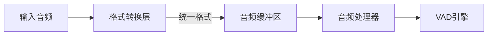

# 音频格式处理设计

## 1. 支持的音频格式

根据需求，系统默认支持并仅支持以下音频格式：

- **格式**：WAV和PCMA（A-law）
- **采样率**：16kHz和8kHz
- **通道数**：单声道（mono）

## 2. 音频格式对处理流程的影响

不同的音频格式会影响音频处理器和缓冲区的逻辑，主要体现在以下几个方面：

### 2.1 数据表示差异

- **WAV (PCM)**：通常是未压缩的线性PCM数据，可以是16位整数（int16）或32位浮点数（float32）
- **PCMA (A-law)**：是一种压缩格式，每个样本使用8位表示，需要解压缩为线性PCM才能进行处理

### 2.2 采样率影响

- **缓冲区大小计算**：不同采样率下，相同时长的音频对应不同数量的样本
- **处理块大小**：16ms的音频块在16kHz下是256个样本，在8kHz下是128个样本
- **VAD性能**：VAD算法可能对特定采样率有优化，可能需要重新训练或调整参数

### 2.3 数据类型考虑

- **内存使用**：不同数据类型占用不同大小的内存（int16: 2字节/样本，float32: 4字节/样本）
- **计算效率**：不同数据类型的计算效率不同，浮点运算通常更慢但精度更高
- **动态范围**：int16的动态范围是±32767，float32可以表示更大的动态范围

## 3. 音频格式处理方案

### 3.1 格式转换层

在音频处理器和缓冲区之前添加一个格式转换层，负责将不同格式的音频统一转换为内部处理格式：



- **统一内部格式**：选择float32作为内部处理格式，提供足够的精度和动态范围
- **按需转换**：仅在需要时进行格式转换，避免不必要的计算
- **零拷贝原则**：尽可能使用视图而非复制进行格式转换

### 3.2 格式检测与转换

```python
def convert_to_internal_format(audio_data, format_type, sample_rate, channels):
    """
    将输入音频转换为内部处理格式
    
    Args:
        audio_data: 输入音频数据
        format_type: 音频格式类型（'wav'或'pcma'）
        sample_rate: 采样率（8000或16000）
        channels: 通道数
        
    Returns:
        转换后的音频数据，采样率，通道数
    """
    # 检查格式是否支持
    if format_type not in ['wav', 'pcma']:
        raise ValueError(f"Unsupported audio format: {format_type}")
        
    if sample_rate not in [8000, 16000]:
        raise ValueError(f"Unsupported sample rate: {sample_rate}")
        
    if channels != 1:
        raise ValueError(f"Only mono audio is supported, got {channels} channels")
    
    # 格式转换
    if format_type == 'pcma':
        # 将PCMA解压缩为线性PCM
        audio_data = pcma_to_pcm(audio_data)
    
    # 确保数据类型为float32
    if audio_data.dtype != np.float32:
        # 如果是int16，归一化到[-1.0, 1.0]范围
        if audio_data.dtype == np.int16:
            audio_data = audio_data.astype(np.float32) / 32767.0
        else:
            audio_data = audio_data.astype(np.float32)
    
    return audio_data, sample_rate, channels
```

### 3.3 采样率适配

```python
def adapt_sample_rate(audio_data, current_rate, target_rate):
    """
    调整音频采样率
    
    Args:
        audio_data: 输入音频数据
        current_rate: 当前采样率
        target_rate: 目标采样率
        
    Returns:
        调整后的音频数据
    """
    if current_rate == target_rate:
        return audio_data
        
    # 使用高质量的重采样算法
    return librosa.resample(audio_data, orig_sr=current_rate, target_sr=target_rate)
```

### 3.4 块大小计算

```python
def calculate_chunk_size(duration_ms, sample_rate):
    """
    计算指定时长和采样率下的块大小
    
    Args:
        duration_ms: 时长（毫秒）
        sample_rate: 采样率
        
    Returns:
        块大小（样本数）
    """
    return int(duration_ms * sample_rate / 1000)
```

## 4. 音频缓冲区适配

### 4.1 动态配置

修改音频缓冲区，使其能够适应不同的音频格式：

```python
class AudioRingBuffer:
    def __init__(self, capacity_seconds, sample_rate, dtype=np.float32):
        """
        初始化音频环形缓冲区
        
        Args:
            capacity_seconds: 缓冲区容量（秒）
            sample_rate: 采样率
            dtype: 数据类型
        """
        self.sample_rate = sample_rate
        self.dtype = dtype
        self.capacity = int(capacity_seconds * sample_rate)
        self.buffer = np.zeros(self.capacity, dtype=dtype)
        # ...
        
    def get_chunk_with_overlap(self, duration_ms, overlap_ms):
        """
        获取指定时长的音频块，包含重叠区域
        
        Args:
            duration_ms: 主要块时长（毫秒）
            overlap_ms: 重叠区域时长（毫秒）
            
        Returns:
            包含重叠区域的音频块，以及块的元数据
        """
        chunk_size = int(duration_ms * self.sample_rate / 1000)
        overlap_size = int(overlap_ms * self.sample_rate / 1000)
        
        # 获取数据块
        # ...
```

### 4.2 格式感知元数据

扩展音频块元数据，包含格式信息：

```python
def get_chunk_with_overlap(self, duration_ms, overlap_ms):
    # ...
    
    # 创建块元数据
    metadata = {
        "sequence_number": self.sequence_counter,
        "start_frame": self.total_frames_read,
        "chunk_size": chunk_size,
        "overlap_size": overlap_size,
        "sample_rate": self.sample_rate,
        "dtype": str(self.dtype),
        "duration_ms": duration_ms,
        "overlap_ms": overlap_ms
    }
    
    # ...
```

## 5. 音频处理器适配

### 5.1 格式感知处理

修改音频处理器，使其能够处理不同格式的音频：

```python
class AudioProcessor:
    def __init__(self, vad_engine, supported_formats=None):
        """
        初始化音频处理器
        
        Args:
            vad_engine: VAD引擎
            supported_formats: 支持的格式配置
        """
        self.vad_engine = vad_engine
        
        # 默认支持的格式
        self.supported_formats = supported_formats or {
            "formats": ["wav", "pcma"],
            "sample_rates": [8000, 16000],
            "channels": [1]
        }
        
    async def process_chunk(self, audio_data, format_type, sample_rate, channels):
        """
        处理音频块
        
        Args:
            audio_data: 音频数据
            format_type: 音频格式类型
            sample_rate: 采样率
            channels: 通道数
            
        Returns:
            处理结果
        """
        # 检查格式是否支持
        if format_type not in self.supported_formats["formats"]:
            raise ValueError(f"Unsupported audio format: {format_type}")
            
        if sample_rate not in self.supported_formats["sample_rates"]:
            raise ValueError(f"Unsupported sample rate: {sample_rate}")
            
        if channels not in self.supported_formats["channels"]:
            raise ValueError(f"Unsupported channels: {channels}")
        
        # 转换为内部处理格式
        internal_data, internal_rate, internal_channels = convert_to_internal_format(
            audio_data, format_type, sample_rate, channels
        )
        
        # 计算块大小和重叠大小
        frame_duration_ms = 16  # 16ms per frame for VAD
        frame_size = calculate_chunk_size(frame_duration_ms, internal_rate)
        
        # 分割为VAD帧
        num_frames = len(internal_data) // frame_size
        
        # 处理每一帧
        results = []
        for i in range(num_frames):
            frame_data = internal_data[i * frame_size: (i + 1) * frame_size]
            result = await self.vad_engine.process_frame(frame_data)
            results.append(result)
            
        return results
```

### 5.2 VAD参数适配

根据不同的采样率调整VAD参数：

```python
def get_vad_params(sample_rate):
    """
    根据采样率获取VAD参数
    
    Args:
        sample_rate: 采样率
        
    Returns:
        VAD参数
    """
    if sample_rate == 16000:
        return {
            "hop_size": 256,  # 16ms @ 16kHz
            "threshold": 0.5
        }
    elif sample_rate == 8000:
        return {
            "hop_size": 128,  # 16ms @ 8kHz
            "threshold": 0.5
        }
    else:
        raise ValueError(f"Unsupported sample rate: {sample_rate}")
```

## 6. 集成示例

### 6.1 处理WAV格式

```python
async def process_wav_file(file_path):
    # 读取WAV文件
    sample_rate, audio_data = wavfile.read(file_path)
    
    # 检查格式
    if sample_rate not in [8000, 16000]:
        raise ValueError(f"Unsupported sample rate: {sample_rate}")
        
    if len(audio_data.shape) > 1 and audio_data.shape[1] > 1:
        raise ValueError("Only mono audio is supported")
    
    # 创建音频处理器
    processor = AudioProcessor(vad_engine)
    
    # 处理音频
    results = await processor.process_chunk(audio_data, "wav", sample_rate, 1)
    
    return results
```

### 6.2 处理PCMA格式

```python
async def process_pcma_stream(pcma_data, sample_rate=8000):
    # 检查采样率
    if sample_rate not in [8000, 16000]:
        raise ValueError(f"Unsupported sample rate: {sample_rate}")
    
    # 创建音频处理器
    processor = AudioProcessor(vad_engine)
    
    # 处理音频
    results = await processor.process_chunk(pcma_data, "pcma", sample_rate, 1)
    
    return results
```

### 6.3 实时流处理

```python
async def process_audio_stream(stream, format_type, sample_rate, channels):
    # 创建音频缓冲区
    buffer = AudioRingBuffer(capacity_seconds=5, sample_rate=sample_rate)
    
    # 创建音频处理器
    processor = AudioProcessor(vad_engine)
    
    # 处理音频流
    async for chunk in stream:
        # 写入缓冲区
        buffer.write(chunk)
        
        # 获取带重叠的音频块
        frame_duration_ms = 16  # 16ms per frame for VAD
        overlap_ms = 16  # 16ms overlap
        
        audio_chunk, metadata = buffer.get_chunk_with_overlap(
            duration_ms=250,  # 250ms chunk
            overlap_ms=overlap_ms
        )
        
        # 处理音频块
        results = await processor.process_chunk(
            audio_chunk, format_type, sample_rate, channels
        )
        
        # 处理结果
        # ...
        
        # 前进读取位置
        buffer.advance_after_processing(
            calculate_chunk_size(250 - overlap_ms, sample_rate)
        )
```

## 7. 性能优化考虑

### 7.1 预计算块大小

对于固定的采样率，可以预计算不同时长对应的块大小，避免重复计算：

```python
# 预计算块大小
CHUNK_SIZES = {
    8000: {  # 8kHz
        16: 128,    # 16ms
        32: 256,    # 32ms
        250: 2000,  # 250ms
    },
    16000: {  # 16kHz
        16: 256,    # 16ms
        32: 512,    # 32ms
        250: 4000,  # 250ms
    }
}

def get_chunk_size(duration_ms, sample_rate):
    """获取预计算的块大小"""
    return CHUNK_SIZES.get(sample_rate, {}).get(
        duration_ms, 
        int(duration_ms * sample_rate / 1000)
    )
```

### 7.2 格式转换优化

对于频繁使用的格式转换，可以使用优化的实现：

```python
def pcma_to_pcm_optimized(pcma_data):
    """优化的PCMA到PCM转换"""
    # 使用查找表加速转换
    pcma_to_pcm_table = np.array([...])  # 预计算的转换表
    return pcma_to_pcm_table[pcma_data]
```

### 7.3 内存布局优化

根据不同的音频格式，优化内存布局：

```python
def optimize_buffer_layout(buffer, dtype):
    """优化缓冲区内存布局"""
    if dtype == np.float32:
        # 确保对齐到32字节边界（AVX指令集）
        return np.zeros(buffer.shape, dtype=dtype, order='C', align=32)
    elif dtype == np.int16:
        # 确保对齐到16字节边界（SSE指令集）
        return np.zeros(buffer.shape, dtype=dtype, order='C', align=16)
    else:
        return np.zeros(buffer.shape, dtype=dtype)
```

## 8. 总结

不同的音频格式确实会影响音频处理器和缓冲区的逻辑，但通过合理的设计，可以使系统灵活地处理不同格式的音频。关键点包括：

1. **格式转换层**：在处理前将不同格式统一转换为内部处理格式
2. **动态配置**：根据音频格式动态调整缓冲区和处理参数
3. **格式感知元数据**：在元数据中包含格式信息，便于后续处理
4. **预计算优化**：对固定格式预计算参数，提高处理效率

通过这些设计，系统可以高效地支持WAV和PCMA格式，16kHz和8kHz采样率，单声道的音频数据，同时保持低延迟和高性能。