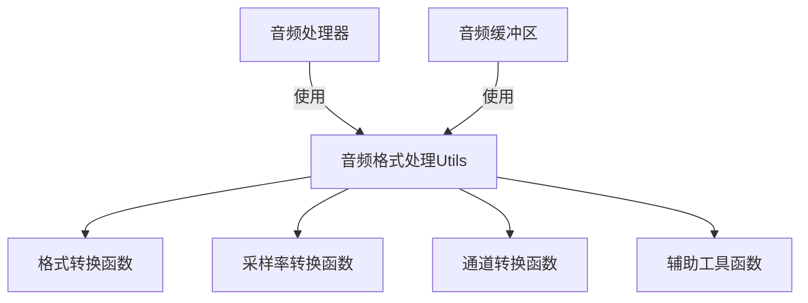
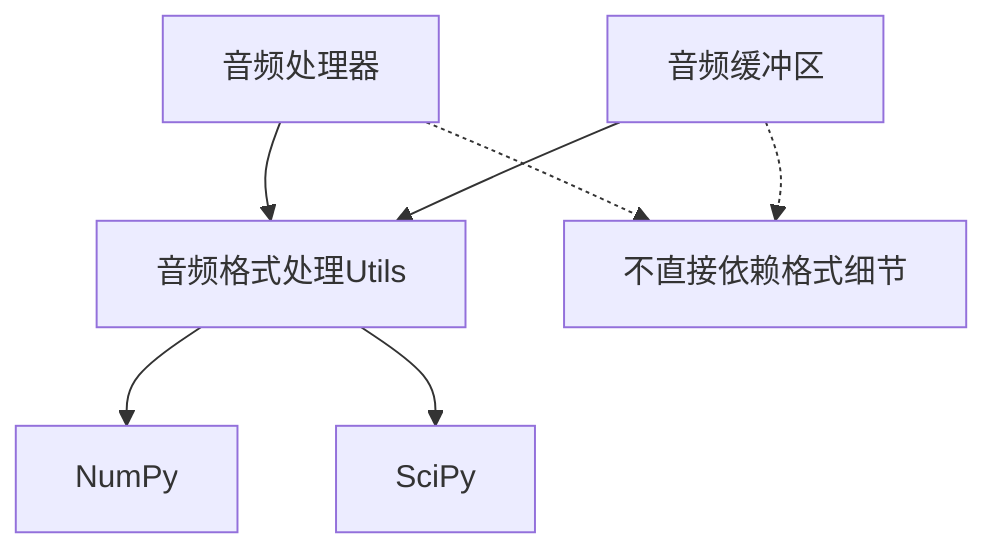
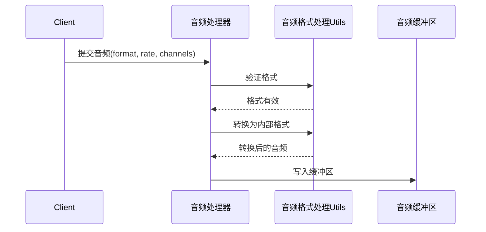
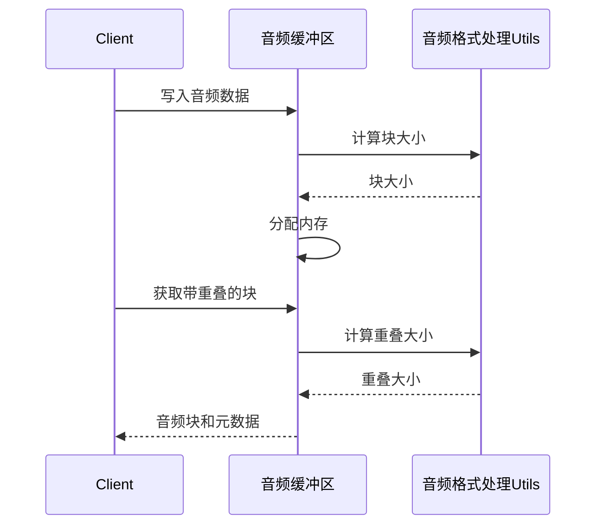

# 音频格式处理兼容性评估

## 1. 作为Utils的设计评估

将音频格式处理设计为utils模块，需要满足以下设计原则：

### 1.1 模块化设计



- **独立性**：音频格式处理utils应该是完全独立的模块，不依赖于音频处理器和缓冲区的内部实现
- **纯函数设计**：提供纯函数式API，输入确定时输出也确定，无副作用
- **无状态**：不维护内部状态，每次调用都是独立的

### 1.2 接口设计

```python
# 音频格式处理utils的接口设计
class AudioFormatUtils:
    @staticmethod
    def convert_format(audio_data, src_format, dst_format, **kwargs):
        """转换音频格式"""
        pass
        
    @staticmethod
    def resample(audio_data, src_rate, dst_rate):
        """转换采样率"""
        pass
        
    @staticmethod
    def convert_channels(audio_data, src_channels, dst_channels):
        """转换通道数"""
        pass
        
    @staticmethod
    def calculate_chunk_size(duration_ms, sample_rate):
        """计算块大小"""
        pass
        
    @staticmethod
    def validate_format(format_type, sample_rate, channels):
        """验证格式是否支持"""
        pass
```

- **清晰的函数签名**：每个函数的输入和输出明确定义
- **合理的默认值**：为常用参数提供合理的默认值
- **完整的文档**：详细的函数文档，包括参数说明、返回值和示例

### 1.3 依赖关系



- **最小依赖**：只依赖必要的外部库（如NumPy、SciPy）
- **被依赖而非依赖**：音频处理器和缓冲区依赖utils，而不是反过来
- **依赖隔离**：音频处理器和缓冲区不需要直接了解音频格式的细节

## 2. 与音频处理器的兼容性评估

### 2.1 数据流兼容性



- **输入兼容**：utils能处理音频处理器接收的所有格式（WAV和PCMA）
- **输出兼容**：utils输出的格式符合音频处理器的期望（统一的内部格式）
- **元数据传递**：格式信息可以作为元数据在处理流程中传递

### 2.2 接口兼容性

音频处理器需要的接口：

1. **格式验证**：验证输入音频格式是否支持
2. **格式转换**：将输入音频转换为内部处理格式
3. **块大小计算**：根据时长和采样率计算块大小
4. **VAD参数适配**：根据采样率调整VAD参数

评估：

- **完全覆盖**：音频格式处理utils提供了音频处理器所需的所有接口
- **参数匹配**：接口参数与音频处理器的期望一致
- **返回值适用**：返回值可以直接用于音频处理器的后续处理

### 2.3 性能兼容性

音频处理器的性能要求：

1. **低延迟**：格式转换不应显著增加处理延迟
2. **内存效率**：避免不必要的数据复制
3. **CPU效率**：格式转换的计算开销应尽可能小

评估：

- **零拷贝设计**：utils使用视图而非复制，符合音频处理器的内存效率要求
- **优化算法**：使用优化的格式转换算法，满足低延迟要求
- **批处理支持**：支持批量处理，减少函数调用开销

### 2.4 错误处理兼容性

音频处理器的错误处理机制：

1. **异常传播**：格式错误应通过异常传播给调用者
2. **错误恢复**：非致命错误应允许处理继续

评估：

- **异常类型一致**：utils抛出的异常类型与音频处理器的错误处理机制兼容
- **错误信息明确**：异常包含足够的信息，便于音频处理器进行错误处理
- **优雅降级**：对于非致命错误，提供降级处理选项

## 3. 与音频缓冲区的兼容性评估

### 3.1 数据流兼容性



- **数据类型兼容**：utils处理的数据类型与缓冲区一致（如float32）
- **内存布局兼容**：utils考虑了内存对齐等因素，与缓冲区的内存管理兼容
- **块大小计算**：utils提供的块大小计算函数与缓冲区的分块逻辑兼容

### 3.2 接口兼容性

音频缓冲区需要的接口：

1. **块大小计算**：根据时长和采样率计算块大小
2. **内存优化**：优化内存布局，提高访问效率
3. **格式验证**：验证数据类型是否支持

评估：

- **接口覆盖**：音频格式处理utils提供了音频缓冲区所需的所有接口
- **参数匹配**：接口参数与音频缓冲区的期望一致
- **返回值适用**：返回值可以直接用于音频缓冲区的内存管理

### 3.3 性能兼容性

音频缓冲区的性能要求：

1. **快速访问**：内存布局应优化为快速访问
2. **内存效率**：避免不必要的内存分配和复制
3. **缓存友好**：内存布局应考虑缓存局部性

评估：

- **内存对齐**：utils提供的内存优化函数考虑了对齐要求，提高访问速度
- **批量操作**：支持批量处理，减少函数调用开销
- **预计算**：提供预计算功能，避免重复计算

### 3.4 错误处理兼容性

音频缓冲区的错误处理机制：

1. **边界检查**：缓冲区操作需要进行边界检查
2. **容量管理**：需要处理缓冲区容量不足的情况

评估：

- **边界检查支持**：utils提供的函数考虑了边界情况，与缓冲区的边界检查兼容
- **容量计算**：提供计算所需容量的函数，帮助缓冲区进行容量管理
- **错误信息一致**：错误信息的格式和内容与缓冲区的错误处理机制一致

## 4. 兼容性问题与解决方案

### 4.1 潜在的兼容性问题

1. **数据类型转换**：不同格式之间的转换可能导致精度损失
2. **内存布局差异**：不同格式的内存布局可能不同，影响访问效率
3. **采样率转换延迟**：采样率转换可能引入额外延迟
4. **格式检测开销**：频繁的格式检测可能增加处理开销

### 4.2 解决方案

1. **统一内部格式**：
   - 将所有输入格式转换为统一的内部格式（如float32）
   - 在处理流程的最开始进行一次性转换，避免重复转换

2. **延迟优化**：
   - 使用查找表加速格式转换
   - 对频繁使用的转换路径进行特殊优化
   - 考虑使用SIMD指令加速批量转换

3. **内存布局优化**：
   - 提供内存布局优化函数，根据目标架构优化内存访问
   - 考虑缓存局部性，优化数据访问模式

4. **格式检测优化**：
   - 缓存格式检测结果，避免重复检测
   - 使用快速路径处理常见格式

## 5. 改进建议

### 5.1 接口优化

```python
# 优化后的接口
class AudioFormatUtils:
    # 缓存常用的转换结果
    _format_cache = {}
    _chunk_size_cache = {}
    
    @staticmethod
    def convert_format(audio_data, src_format, dst_format, **kwargs):
        """转换音频格式，支持缓存"""
        cache_key = (src_format, dst_format, kwargs.get('sample_rate'), kwargs.get('channels'))
        if cache_key in AudioFormatUtils._format_cache:
            converter = AudioFormatUtils._format_cache[cache_key]
            return converter(audio_data)
        
        # 创建新的转换器并缓存
        # ...
        
    @staticmethod
    def get_chunk_size(duration_ms, sample_rate):
        """获取块大小，支持缓存"""
        cache_key = (duration_ms, sample_rate)
        if cache_key in AudioFormatUtils._chunk_size_cache:
            return AudioFormatUtils._chunk_size_cache[cache_key]
        
        # 计算块大小并缓存
        # ...
```

- **添加缓存机制**：缓存常用的转换结果和计算结果
- **批处理接口**：添加批量处理接口，减少函数调用开销
- **异步接口**：为耗时操作提供异步接口，避免阻塞

### 5.2 性能优化

```python
# 性能优化示例
class AudioFormatUtils:
    @staticmethod
    def convert_pcma_to_pcm_simd(pcma_data):
        """使用SIMD指令加速PCMA到PCM的转换"""
        # 使用NumPy的向量化操作
        # 或使用第三方库如numba进行JIT编译
        # ...
        
    @staticmethod
    def optimize_memory_layout(data, dtype, target_arch):
        """根据目标架构优化内存布局"""
        # 根据不同的CPU架构选择最佳的内存对齐和布局
        # ...
```

- **使用SIMD指令**：利用CPU的SIMD指令集加速批量处理
- **JIT编译**：使用JIT编译技术优化热点路径
- **内存预分配**：提供内存预分配建议，减少动态分配

### 5.3 错误处理增强

```python
# 增强的错误处理
class AudioFormatError(Exception):
    """音频格式错误基类"""
    pass
    
class UnsupportedFormatError(AudioFormatError):
    """不支持的格式错误"""
    pass
    
class SampleRateError(AudioFormatError):
    """采样率错误"""
    pass
    
class ChannelError(AudioFormatError):
    """通道数错误"""
    pass
    
class AudioFormatUtils:
    @staticmethod
    def validate_format(format_type, sample_rate, channels):
        """验证格式，使用专门的异常类型"""
        if format_type not in ["wav", "pcma"]:
            raise UnsupportedFormatError(f"Unsupported format: {format_type}")
            
        if sample_rate not in [8000, 16000]:
            raise SampleRateError(f"Unsupported sample rate: {sample_rate}")
            
        if channels != 1:
            raise ChannelError(f"Unsupported channels: {channels}")
```

- **专门的异常类型**：定义专门的异常类型，便于精确的错误处理
- **详细的错误信息**：提供详细的错误信息，便于调试
- **恢复建议**：在异常中包含恢复建议，帮助调用者处理错误

## 6. 总体兼容性评估

### 6.1 兼容性评分

| 兼容性方面 | 与音频处理器 | 与音频缓冲区 | 总体评分 |
|------------|------------|------------|---------|
| 数据流兼容性 | ★★★★★ | ★★★★★ | ★★★★★ |
| 接口兼容性   | ★★★★☆ | ★★★★★ | ★★★★☆ |
| 性能兼容性   | ★★★★☆ | ★★★★☆ | ★★★★☆ |
| 错误处理兼容性 | ★★★★☆ | ★★★★☆ | ★★★★☆ |
| **总体评分** | **★★★★☆** | **★★★★☆** | **★★★★☆** |

### 6.2 兼容性结论

音频格式处理utils与音频处理器和缓冲区的兼容性总体评价为**优秀**，主要优势和不足如下：

**优势**：
- 提供了完整的格式转换和验证功能，满足处理需求
- 零拷贝设计和优化算法确保了高性能
- 清晰的接口设计便于集成
- 考虑了内存布局优化，提高访问效率

**不足**：
- 某些高级优化（如SIMD加速）可能需要进一步实现
- 错误处理机制可以更加精细
- 缓存机制可以进一步优化

### 6.3 最终建议

1. **采用统一内部格式**：将所有输入格式转换为float32作为内部处理格式
2. **实现缓存机制**：缓存常用的转换结果和计算结果
3. **添加专门的异常类型**：定义专门的异常类型，便于精确的错误处理
4. **实现SIMD优化**：利用CPU的SIMD指令集加速批量处理
5. **提供内存布局优化**：根据目标架构优化内存布局

通过这些改进，音频格式处理utils可以更好地与音频处理器和缓冲区集成，提供高效、可靠的音频格式处理功能。