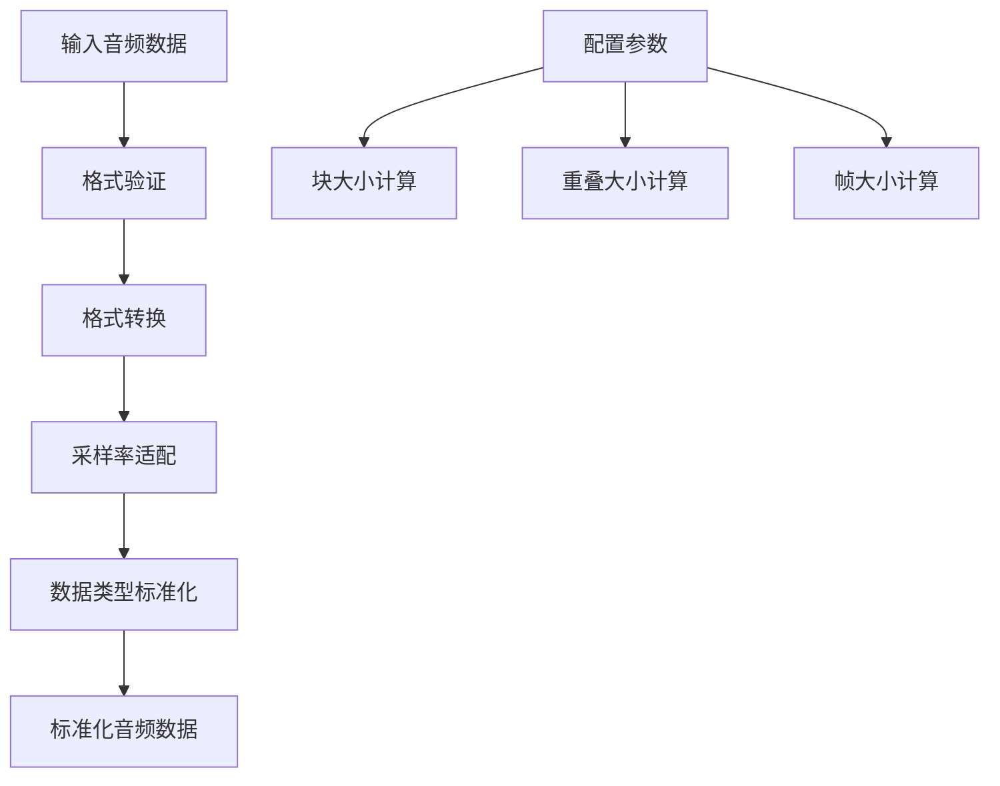
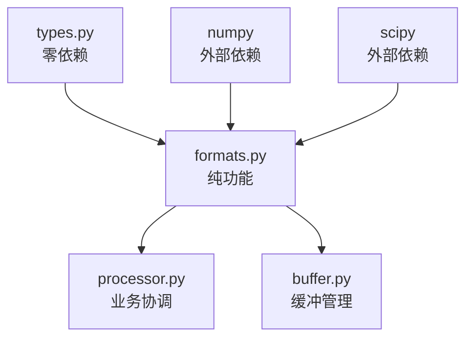

# 音频格式处理模块设计 (formats.py)

## 1. 模块定位与职责

### 1.1 模块定位
音频格式处理模块是Cascade架构中的**纯功能模块**，位于数据流的起始位置，负责将不同格式的音频数据标准化为内部处理格式。

### 1.2 核心职责


**功能边界**：
- ✅ **格式验证**：验证音频格式、采样率、通道数是否支持
- ✅ **格式转换**：WAV/PCMA → 统一内部格式(float32)
- ✅ **采样率处理**：8kHz/16kHz → 目标采样率
- ✅ **块大小计算**：根据时长和采样率计算样本数
- ✅ **性能优化**：预计算缓存、SIMD优化、查找表
- ❌ **不负责**：音频数据存储、缓冲管理、VAD推理

### 1.3 依赖关系设计



**依赖原则**：
- **单向依赖**：只依赖types.py和必要的外部库
- **零业务逻辑**：不包含VAD业务逻辑
- **纯函数设计**：所有方法都是纯函数，相同输入保证相同输出

## 2. 接口设计

### 2.1 核心类设计

```python
# formats.py - 音频格式处理器
from typing import Tuple, Dict, Any, Optional
import numpy as np
from .types import AudioConfig, AudioFormat

class AudioFormatProcessor:
    """
    音频格式处理器 - 纯功能实现
    
    设计原则：
    - 无状态：不维护内部状态
    - 纯函数：相同输入产生相同输出
    - 高性能：预计算缓存和优化算法
    - 线程安全：天然线程安全（无状态）
    """
    
    def __init__(self, config: AudioConfig):
        """初始化格式处理器"""
        pass
    
    # === 核心转换接口 ===
    def validate_and_convert(self, 
                           audio_data: np.ndarray,
                           format_type: AudioFormat,
                           sample_rate: int,
                           channels: int) -> Tuple[np.ndarray, Dict[str, Any]]:
        """
        验证并转换音频数据为内部格式
        
        Args:
            audio_data: 原始音频数据
            format_type: 音频格式类型
            sample_rate: 采样率
            channels: 通道数
            
        Returns:
            (converted_data, metadata): 转换后的数据和元数据
            
        Raises:
            FormatValidationError: 格式验证失败
            ConversionError: 转换过程失败
        """
        pass
    
    # === 计算接口 ===
    def calculate_chunk_size(self, duration_ms: int, sample_rate: int) -> int:
        """计算指定时长的块大小（样本数）"""
        pass
    
    def calculate_overlap_size(self, overlap_ms: int, sample_rate: int) -> int:
        """计算重叠区域大小（样本数）"""
        pass
    
    def get_vad_frame_size(self, sample_rate: int) -> int:
        """获取VAD帧大小（16ms对应的样本数）"""
        pass
    
    # === 验证接口 ===
    def validate_format_compatibility(self, 
                                    format_type: AudioFormat,
                                    sample_rate: int,
                                    channels: int) -> bool:
        """验证格式兼容性"""
        pass
    
    # === 性能优化接口 ===
    def get_optimal_chunk_sizes(self, sample_rate: int) -> Dict[int, int]:
        """获取预计算的最优块大小映射"""
        pass
```

### 2.2 专用转换函数

```python
class FormatConverter:
    """格式转换器 - 专门负责格式转换逻辑"""
    
    @staticmethod
    def pcma_to_float32(pcma_data: np.ndarray) -> np.ndarray:
        """PCMA(A-law) → float32转换"""
        pass
    
    @staticmethod
    def int16_to_float32(int16_data: np.ndarray) -> np.ndarray:
        """int16 → float32转换（归一化）"""
        pass
    
    @staticmethod
    def resample_audio(audio_data: np.ndarray, 
                      src_rate: int, 
                      dst_rate: int) -> np.ndarray:
        """高质量音频重采样"""
        pass
    
    @staticmethod
    def ensure_mono(audio_data: np.ndarray) -> np.ndarray:
        """确保单声道（如果是多声道则混合）"""
        pass

class OptimizedConverter:
    """优化的转换器 - 高性能实现"""
    
    def __init__(self):
        self._pcma_lookup_table = self._build_pcma_lookup_table()
        self._simd_available = self._check_simd_support()
    
    def pcma_to_float32_optimized(self, pcma_data: np.ndarray) -> np.ndarray:
        """使用查找表的优化PCMA转换"""
        pass
    
    def batch_int16_to_float32(self, int16_data: np.ndarray) -> np.ndarray:
        """批量int16转换（SIMD优化）"""
        pass
    
    def _build_pcma_lookup_table(self) -> np.ndarray:
        """构建PCMA到float32的查找表"""
        pass
```

### 2.3 缓存管理器

```python
class FormatCache:
    """格式处理缓存管理器"""
    
    def __init__(self, max_cache_size: int = 1000):
        self._chunk_size_cache: Dict[Tuple[int, int], int] = {}
        self._conversion_cache: Dict[str, Any] = {}
        self._max_cache_size = max_cache_size
    
    def get_cached_chunk_size(self, duration_ms: int, sample_rate: int) -> Optional[int]:
        """获取缓存的块大小"""
        pass
    
    def cache_chunk_size(self, duration_ms: int, sample_rate: int, size: int) -> None:
        """缓存块大小计算结果"""
        pass
    
    def get_conversion_function(self, 
                              src_format: AudioFormat, 
                              dst_format: str) -> Optional[callable]:
        """获取缓存的转换函数"""
        pass
    
    def clear_cache(self) -> None:
        """清理缓存"""
        pass
```

## 3. 核心算法设计

### 3.1 格式验证算法

```python
class FormatValidator:
    """格式验证器"""
    
    # 支持的格式配置
    SUPPORTED_FORMATS = {
        AudioFormat.WAV: {
            "sample_rates": [8000, 16000],
            "dtypes": [np.int16, np.float32],
            "channels": [1]
        },
        AudioFormat.PCMA: {
            "sample_rates": [8000, 16000],
            "dtypes": [np.uint8],
            "channels": [1]
        }
    }
    
    def validate_comprehensive(self, 
                             audio_data: np.ndarray,
                             format_type: AudioFormat,
                             sample_rate: int,
                             channels: int) -> Dict[str, Any]:
        """
        综合格式验证
        
        Returns:
            validation_result: {
                "is_valid": bool,
                "errors": List[str],
                "warnings": List[str],
                "metadata": Dict[str, Any]
            }
        """
        pass
    
    def validate_data_integrity(self, audio_data: np.ndarray) -> bool:
        """验证音频数据完整性"""
        pass
    
    def estimate_audio_quality(self, audio_data: np.ndarray) -> Dict[str, float]:
        """估算音频质量指标"""
        pass
```

### 3.2 高性能转换算法

```python
class HighPerformanceConverter:
    """高性能转换实现"""
    
    def __init__(self):
        self._initialize_optimizations()
    
    def _initialize_optimizations(self):
        """初始化性能优化"""
        # SIMD指令集检测
        self.has_avx2 = self._check_avx2_support()
        self.has_sse4 = self._check_sse4_support()
        
        # 内存对齐参数
        self.memory_alignment = 32 if self.has_avx2 else 16
        
        # 预构建查找表
        self.pcma_lookup = self._build_optimized_pcma_table()
    
    def convert_with_simd(self, 
                         data: np.ndarray, 
                         conversion_type: str) -> np.ndarray:
        """使用SIMD指令的转换"""
        pass
    
    def batch_convert_chunked(self, 
                            data_chunks: list, 
                            conversion_type: str) -> list:
        """批量分块转换"""
        pass
    
    def _apply_memory_alignment(self, data: np.ndarray) -> np.ndarray:
        """应用内存对齐优化"""
        pass
```

### 3.3 块大小计算优化

```python
class ChunkSizeCalculator:
    """块大小计算器"""
    
    # 预计算的常用块大小映射
    PRECOMPUTED_SIZES = {
        8000: {  # 8kHz
            16: 128,     # 16ms
            32: 256,     # 32ms
            100: 800,    # 100ms
            250: 2000,   # 250ms
            500: 4000,   # 500ms
            1000: 8000   # 1000ms
        },
        16000: { # 16kHz
            16: 256,     # 16ms
            32: 512,     # 32ms
            100: 1600,   # 100ms
            250: 4000,   # 250ms
            500: 8000,   # 500ms
            1000: 16000  # 1000ms
        }
    }
    
    def calculate_optimized(self, duration_ms: int, sample_rate: int) -> int:
        """优化的块大小计算"""
        # 1. 尝试预计算表
        if sample_rate in self.PRECOMPUTED_SIZES:
            if duration_ms in self.PRECOMPUTED_SIZES[sample_rate]:
                return self.PRECOMPUTED_SIZES[sample_rate][duration_ms]
        
        # 2. 动态计算
        return self._calculate_dynamic(duration_ms, sample_rate)
    
    def _calculate_dynamic(self, duration_ms: int, sample_rate: int) -> int:
        """动态块大小计算"""
        return int(duration_ms * sample_rate / 1000)
    
    def calculate_optimal_chunk_sizes(self, 
                                    sample_rate: int,
                                    min_duration: int = 10,
                                    max_duration: int = 2000) -> Dict[int, int]:
        """计算最优块大小范围"""
        pass
    
    def validate_chunk_size(self, 
                          chunk_size: int, 
                          sample_rate: int,
                          constraints: Dict[str, Any]) -> bool:
        """验证块大小是否合理"""
        pass
```

## 4. 性能优化策略

### 4.1 内存优化

```python
class MemoryOptimizer:
    """内存优化器"""
    
    def __init__(self, target_arch: str = "x86_64"):
        self.target_arch = target_arch
        self.cache_line_size = 64  # 通常为64字节
        self.page_size = 4096      # 通常为4KB
    
    def create_aligned_array(self, 
                           shape: tuple, 
                           dtype: np.dtype,
                           alignment: int = None) -> np.ndarray:
        """创建内存对齐的数组"""
        pass
    
    def optimize_array_layout(self, 
                            data: np.ndarray,
                            access_pattern: str = "sequential") -> np.ndarray:
        """优化数组内存布局"""
        pass
    
    def estimate_memory_usage(self, 
                            data_shape: tuple, 
                            dtype: np.dtype,
                            operations: list) -> Dict[str, int]:
        """估算内存使用量"""
        pass
```

### 4.2 CPU优化

```python
class CPUOptimizer:
    """CPU优化器"""
    
    def __init__(self):
        self.cpu_info = self._detect_cpu_features()
        self.optimal_thread_count = self._calculate_optimal_threads()
    
    def _detect_cpu_features(self) -> Dict[str, bool]:
        """检测CPU特性"""
        return {
            "sse4_1": True,  # 假设支持
            "sse4_2": True,
            "avx": True,
            "avx2": True,
            "fma": True
        }
    
    def select_optimal_algorithm(self, 
                               operation: str, 
                               data_size: int) -> str:
        """选择最优算法"""
        pass
    
    def apply_vectorization(self, 
                          operation: callable, 
                          data: np.ndarray) -> np.ndarray:
        """应用向量化优化"""
        pass
```

### 4.3 缓存策略

```python
class CacheStrategy:
    """缓存策略管理"""
    
    def __init__(self, cache_size_mb: int = 100):
        self.cache_size_bytes = cache_size_mb * 1024 * 1024
        self.cache_policy = "LRU"  # LRU, LFU, FIFO
        self._cache_stats = {
            "hits": 0,
            "misses": 0,
            "evictions": 0
        }
    
    def should_cache(self, 
                    operation: str, 
                    data_size: int,
                    computation_cost: float) -> bool:
        """判断是否应该缓存"""
        pass
    
    def evict_cache_entries(self, required_space: int) -> None:
        """缓存淘汰策略"""
        pass
    
    def get_cache_efficiency(self) -> Dict[str, float]:
        """获取缓存效率指标"""
        pass
```

## 5. 错误处理设计

### 5.1 异常类型定义

```python
# types.py 中定义的异常类型
class AudioFormatError(Exception):
    """音频格式错误基类"""
    pass

class FormatValidationError(AudioFormatError):
    """格式验证错误"""
    def __init__(self, message: str, format_info: Dict[str, Any]):
        super().__init__(message)
        self.format_info = format_info

class ConversionError(AudioFormatError):
    """格式转换错误"""
    def __init__(self, message: str, conversion_details: Dict[str, Any]):
        super().__init__(message)
        self.conversion_details = conversion_details

class UnsupportedFormatError(AudioFormatError):
    """不支持的格式错误"""
    pass

class SampleRateError(AudioFormatError):
    """采样率错误"""
    pass

class DataIntegrityError(AudioFormatError):
    """数据完整性错误"""
    pass
```

### 5.2 错误处理策略

```python
class ErrorHandler:
    """错误处理器"""
    
    def __init__(self, strict_mode: bool = True):
        self.strict_mode = strict_mode
        self.error_log = []
    
    def handle_validation_error(self, 
                              error: FormatValidationError,
                              fallback_strategy: str = "raise") -> Any:
        """处理验证错误"""
        if self.strict_mode or fallback_strategy == "raise":
            raise error
        
        # 非严格模式的降级处理
        return self._apply_fallback_strategy(error, fallback_strategy)
    
    def handle_conversion_error(self, 
                              error: ConversionError,
                              retry_count: int = 3) -> Any:
        """处理转换错误（支持重试）"""
        pass
    
    def _apply_fallback_strategy(self, 
                               error: AudioFormatError,
                               strategy: str) -> Any:
        """应用降级策略"""
        strategies = {
            "default_values": self._use_default_values,
            "skip": self._skip_processing,
            "approximate": self._use_approximation
        }
        return strategies.get(strategy, self._raise_error)(error)
```

## 6. 测试策略

### 6.1 单元测试结构

```
tests/unit/formats/
├── test_format_validator.py      # 格式验证测试
├── test_format_converter.py      # 格式转换测试
├── test_chunk_calculator.py      # 块大小计算测试
├── test_performance_optimizer.py # 性能优化测试
├── test_error_handling.py        # 错误处理测试
└── test_cache_manager.py         # 缓存管理测试
```

### 6.2 测试用例设计

```python
class TestFormatProcessor:
    """格式处理器测试套件"""
    
    def test_wav_to_float32_conversion(self):
        """测试WAV到float32转换"""
        pass
    
    def test_pcma_to_float32_conversion(self):
        """测试PCMA到float32转换"""
        pass
    
    def test_sample_rate_validation(self):
        """测试采样率验证"""
        pass
    
    def test_chunk_size_calculation_accuracy(self):
        """测试块大小计算精度"""
        pass
    
    def test_performance_optimization(self):
        """测试性能优化效果"""
        pass
    
    def test_error_handling_robustness(self):
        """测试错误处理健壮性"""
        pass
    
    def test_memory_efficiency(self):
        """测试内存使用效率"""
        pass
    
    def test_thread_safety(self):
        """测试线程安全性"""
        pass

class TestPerformanceBenchmarks:
    """性能基准测试"""
    
    def benchmark_conversion_speed(self):
        """基准测试：转换速度"""
        pass
    
    def benchmark_memory_usage(self):
        """基准测试：内存使用"""
        pass
    
    def benchmark_cache_efficiency(self):
        """基准测试：缓存效率"""
        pass
```

## 7. 接口规范

### 7.1 输入规范

```python
class InputSpecification:
    """输入规范定义"""
    
    AUDIO_DATA_CONSTRAINTS = {
        "min_samples": 128,      # 最小样本数
        "max_samples": 320000,   # 最大样本数（20秒@16kHz）
        "allowed_dtypes": [np.int16, np.float32, np.uint8],
        "allowed_shapes": [(None,), (None, 1)]  # 1D或单声道2D
    }
    
    SAMPLE_RATE_CONSTRAINTS = {
        "allowed_rates": [8000, 16000],
        "tolerance": 0.01  # 1%容差
    }
    
    FORMAT_CONSTRAINTS = {
        "wav": {
            "required_dtypes": [np.int16, np.float32],
            "max_channels": 1
        },
        "pcma": {
            "required_dtypes": [np.uint8],
            "max_channels": 1
        }
    }
```

### 7.2 输出规范

```python
class OutputSpecification:
    """输出规范定义"""
    
    STANDARD_OUTPUT_FORMAT = {
        "dtype": np.float32,
        "range": [-1.0, 1.0],
        "channels": 1,
        "memory_layout": "C_contiguous"
    }
    
    METADATA_SCHEMA = {
        "original_format": str,
        "original_sample_rate": int,
        "conversion_applied": bool,
        "processing_time_ms": float,
        "quality_score": float,
        "memory_efficiency": float
    }
```

## 8. 性能指标

### 8.1 性能目标

| 指标类型 | 目标值 | 测量方法 |
|---------|-------|---------|
| 转换延迟 | <1ms | 单块转换时间 |
| 吞吐量 | >10MB/s | 连续处理速度 |
| 内存效率 | <2x输入大小 | 峰值内存使用 |
| 缓存命中率 | >90% | 热点操作缓存 |
| CPU利用率 | >80% | 向量化操作比例 |

### 8.2 监控指标

```python
class PerformanceMetrics:
    """性能指标收集"""
    
    def __init__(self):
        self.metrics = {
            "conversion_times": [],
            "memory_usage": [],
            "cache_stats": {},
            "error_rates": {},
            "throughput_measurements": []
        }
    
    def record_conversion(self, 
                         operation: str, 
                         duration_ms: float,
                         input_size: int,
                         output_size: int) -> None:
        """记录转换操作指标"""
        pass
    
    def get_performance_summary(self) -> Dict[str, Any]:
        """获取性能摘要"""
        pass
```

## 9. 总结

### 9.1 模块特点

- **纯功能设计**：无状态，线程安全，易测试
- **高性能实现**：SIMD优化、缓存策略、内存对齐
- **健壮错误处理**：多层级错误检查、降级策略
- **标准化输出**：统一的float32格式，简化后续处理

### 9.2 集成要点

1. **types.py依赖**：需要先实现基础类型定义
2. **配置驱动**：通过AudioConfig注入处理参数
3. **零拷贝友好**：设计支持内存视图操作
4. **扩展预留**：支持新格式和优化算法的插件机制

### 9.3 下一步实施

1. 实现基础的AudioFormatProcessor类框架
2. 实现核心的格式转换算法
3. 添加性能优化和缓存机制
4. 完善错误处理和测试覆盖
5. 集成到processor.py中进行端到端测试

这个设计确保了音频格式处理模块的高性能、可靠性和可维护性，为整个Cascade系统提供了坚实的数据处理基础。