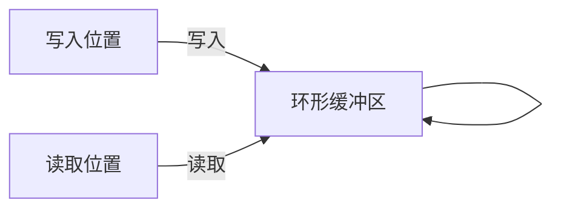

# 音频缓冲区设计方案

## 1. 设计目标

音频缓冲区是音频处理模块的核心组件，需要满足以下设计目标：

- **低延迟**：支持快速的数据读写操作
- **数据完整性**：不遗漏或丢失任何音频数据
- **线程安全**：在多线程环境下保证数据一致性
- **内存效率**：避免不必要的数据复制，减少内存使用
- **与处理器兼容**：提供专门接口支持音频处理器的需求

## 2. 缓冲区结构设计

### 2.1 环形缓冲区

采用环形缓冲区（Ring Buffer）设计，具有以下优势：



- **连续写入**：支持连续的数据写入，无需频繁重置
- **内存重用**：自动重用已处理的内存空间，减少内存分配
- **高效实现**：环形结构便于实现高效的读写操作

### 2.2 预分配固定大小

```python
class AudioRingBuffer:
    def __init__(self, capacity_seconds, sample_rate, channels=1, dtype=np.float32):
        # 预分配固定大小的缓冲区
        self.capacity = int(capacity_seconds * sample_rate * channels)
        self.buffer = np.zeros(self.capacity, dtype=dtype)
        self.write_pos = 0
        self.read_pos = 0
        self.available_data = 0  # 可读取的数据量
        # ...
```

- **避免动态分配**：预分配固定大小的缓冲区，避免运行时的内存分配
- **容量设计**：缓冲区容量应足够大，能够容纳峰值音频数据，建议为预期最大音频块的2-4倍

## 3. 线程安全机制

### 3.1 读写锁分离

```python
class AudioRingBuffer:
    def __init__(self, capacity_seconds, sample_rate, channels=1, dtype=np.float32):
        # ...
        self._read_lock = threading.RLock()  # 读取锁
        self._write_lock = threading.RLock()  # 写入锁
```

- **读写分离锁**：使用单独的锁保护读取和写入操作，减少锁竞争
- **可重入锁**：使用可重入锁，支持嵌套调用

### 3.2 原子操作

```python
class AudioRingBuffer:
    def __init__(self, capacity_seconds, sample_rate, channels=1, dtype=np.float32):
        # ...
        self.write_pos = atomic.AtomicInteger(0)
        self.read_pos = atomic.AtomicInteger(0)
        self.available_data = atomic.AtomicInteger(0)
```

- **原子计数器**：使用原子操作更新位置指针和数据计数
- **避免竞态条件**：确保在多线程环境下的数据一致性

### 3.3 条件变量

```python
class AudioRingBuffer:
    def __init__(self, capacity_seconds, sample_rate, channels=1, dtype=np.float32):
        # ...
        self._not_empty = threading.Condition(self._read_lock)  # 非空条件
        self._not_full = threading.Condition(self._write_lock)  # 非满条件
```

- **阻塞读取**：当缓冲区为空时，读取操作可以选择阻塞等待
- **阻塞写入**：当缓冲区满时，写入操作可以选择阻塞等待
- **条件通知**：写入数据后通知等待的读取线程，读取数据后通知等待的写入线程

## 4. 零拷贝设计

### 4.1 内存视图

```python
def get_chunk(self, chunk_size, overlap_size=0):
    with self._read_lock:
        # ...
        # 返回内存视图而非复制
        if self.read_pos + chunk_size <= self.capacity:
            # 连续区域
            return memoryview(self.buffer[self.read_pos:self.read_pos + chunk_size])
        else:
            # 跨越边界，这种情况需要复制
            chunk = np.empty(chunk_size, dtype=self.buffer.dtype)
            first_part_size = self.capacity - self.read_pos
            chunk[:first_part_size] = self.buffer[self.read_pos:]
            chunk[first_part_size:] = self.buffer[:chunk_size - first_part_size]
            return chunk
```

- **内存视图**：使用memoryview或NumPy的视图机制，避免数据复制
- **边界处理**：处理环形缓冲区边界情况，必要时才进行复制
- **重叠处理**：支持获取带重叠的数据块，用于边界问题处理

### 4.2 批量操作

```python
def write(self, data):
    data_size = len(data)
    with self._write_lock:
        # 等待足够的空间
        while self.available_data.get() + data_size > self.capacity:
            self._not_full.wait()
            
        # 批量写入
        if self.write_pos + data_size <= self.capacity:
            # 连续区域
            self.buffer[self.write_pos:self.write_pos + data_size] = data
        else:
            # 跨越边界
            first_part_size = self.capacity - self.write_pos
            self.buffer[self.write_pos:] = data[:first_part_size]
            self.buffer[:data_size - first_part_size] = data[first_part_size:]
            
        # 更新位置和可用数据量
        self.write_pos = (self.write_pos + data_size) % self.capacity
        with self._metadata_lock:
            self.available_data.add(data_size)
            
        # 通知等待的读取线程
        self._not_empty.notify_all()
```

- **批量读写**：支持批量读取和写入操作，减少函数调用和锁操作
- **边界处理**：处理数据跨越缓冲区边界的情况
- **通知机制**：写入后通知等待的读取线程

## 5. 与音频处理器集成

### 5.1 专用接口设计

为支持音频处理器需求，设计专用接口：

```python
def get_chunk_with_overlap(self, chunk_size, overlap_size):
    """
    获取指定大小的音频块，包含重叠区域
    
    Args:
        chunk_size: 主要块大小
        overlap_size: 重叠区域大小
        
    Returns:
        包含重叠区域的音频块，以及块的元数据
    """
    with self._read_lock:
        # 检查可用数据
        if self.available_data.get() < chunk_size + overlap_size:
            raise BufferError("Not enough data available")
            
        # 获取主要块和重叠区域
        total_size = chunk_size + overlap_size
        
        if self.read_pos + total_size <= self.capacity:
            # 连续区域
            data = self.buffer[self.read_pos:self.read_pos + total_size]
        else:
            # 跨越边界
            data = np.empty(total_size, dtype=self.buffer.dtype)
            first_part_size = self.capacity - self.read_pos
            data[:first_part_size] = self.buffer[self.read_pos:]
            data[first_part_size:] = self.buffer[:total_size - first_part_size]
        
        # 创建块元数据
        metadata = {
            "sequence_number": self.sequence_counter,
            "start_frame": self.total_frames_read,
            "chunk_size": chunk_size,
            "overlap_size": overlap_size,
            "is_last": False  # 可以根据需要设置
        }
        
        self.sequence_counter += 1
        
        # 更新读取位置（只移动主要块大小，保留重叠区域）
        self.read_pos = (self.read_pos + chunk_size) % self.capacity
        self.available_data.add(-chunk_size)
        self.total_frames_read += chunk_size
        
        # 通知等待的写入线程
        self._not_full.notify_all()
        
        return data, metadata
```

### 5.2 块处理支持

```python
def advance_after_processing(self, chunk_size):
    """
    处理完成后前进读取位置
    
    Args:
        chunk_size: 已处理的块大小（不包括重叠区域）
    """
    with self._read_lock:
        # 更新读取位置
        self.read_pos = (self.read_pos + chunk_size) % self.capacity
        self.available_data.add(-chunk_size)
        
        # 通知等待的写入线程
        self._not_full.notify_all()
```

## 6. 溢出处理策略

### 6.1 阻塞策略

```python
def write(self, data, blocking=True, timeout=None):
    data_size = len(data)
    with self._write_lock:
        if blocking:
            # 阻塞直到有足够空间或超时
            start_time = time.time()
            while self.available_data.get() + data_size > self.capacity:
                if timeout is not None and time.time() - start_time > timeout:
                    raise TimeoutError("Write operation timed out")
                self._not_full.wait(timeout=0.1 if timeout is None else min(0.1, timeout))
        else:
            # 非阻塞，如果空间不足则抛出异常
            if self.available_data.get() + data_size > self.capacity:
                raise BufferError("Buffer full")
                
        # 写入数据...
```

- **阻塞模式**：当缓冲区满时，写入操作阻塞等待，直到有足够空间
- **非阻塞模式**：当缓冲区满时，写入操作立即返回错误
- **超时机制**：支持设置阻塞超时时间，避免无限等待

### 6.2 覆盖策略

```python
def write_overwrite(self, data):
    data_size = len(data)
    with self._write_lock:
        if self.available_data.get() + data_size > self.capacity:
            # 计算需要覆盖的数据量
            overwrite_size = self.available_data.get() + data_size - self.capacity
            # 更新读取位置，丢弃最旧的数据
            with self._metadata_lock:
                self.read_pos = (self.read_pos + overwrite_size) % self.capacity
                self.available_data.add(-overwrite_size)
                
        # 写入数据...
```

- **覆盖最旧数据**：当缓冲区满时，覆盖最旧的数据
- **适用场景**：实时处理场景，新数据比旧数据更重要

## 7. 低延迟优化

### 7.1 内存对齐

```python
class AudioRingBuffer:
    def __init__(self, capacity_seconds, sample_rate, channels=1, dtype=np.float32):
        # 计算对齐后的容量
        alignment = 64  # 缓存行大小，通常为64字节
        element_size = np.dtype(dtype).itemsize
        aligned_capacity = (int(capacity_seconds * sample_rate * channels) * element_size + alignment - 1) // alignment * alignment // element_size
        
        # 创建对齐的缓冲区
        self.buffer = np.zeros(aligned_capacity, dtype=dtype)
        # ...
```

- **缓存对齐**：确保缓冲区起始地址对齐到缓存行
- **减少伪共享**：读写位置分别对齐到不同的缓存行
- **提高缓存效率**：减少缓存未命中

### 7.2 批处理优化

```python
def write_batch(self, data_batch):
    total_size = sum(len(data) for data in data_batch)
    with self._write_lock:
        # 检查空间
        # ...
        
        # 批量写入
        current_pos = self.write_pos
        for data in data_batch:
            data_size = len(data)
            # 写入单个数据块
            # ...
            current_pos = (current_pos + data_size) % self.capacity
            
        # 一次性更新写入位置
        self.write_pos = current_pos
        with self._metadata_lock:
            self.available_data.add(total_size)
            
        # 通知等待的读取线程
        self._not_empty.notify_all()
```

- **批量操作**：支持批量读写操作
- **减少锁操作**：减少获取和释放锁的次数
- **提高吞吐量**：提高数据处理效率

## 8. 完整接口设计

```python
class AudioRingBuffer:
    def __init__(self, capacity_seconds, sample_rate, channels=1, dtype=np.float32):
        """初始化音频环形缓冲区"""
        pass
        
    def write(self, data, blocking=True, timeout=None):
        """写入数据到缓冲区"""
        pass
        
    def read(self, size, blocking=True, timeout=None):
        """从缓冲区读取指定大小的数据"""
        pass
        
    def get_chunk(self, chunk_size, overlap_size=0):
        """获取指定大小的数据块，可以包含重叠区域"""
        pass
        
    def get_chunk_with_overlap(self, chunk_size, overlap_size):
        """获取指定大小的音频块，包含重叠区域，专为音频处理器设计"""
        pass
        
    def advance_after_processing(self, chunk_size):
        """处理完成后前进读取位置"""
        pass
        
    def peek(self, size):
        """查看数据但不移动读取位置"""
        pass
        
    def skip(self, size):
        """跳过指定大小的数据"""
        pass
        
    def available(self):
        """返回可读取的数据量"""
        pass
        
    def remaining(self):
        """返回剩余可写入的空间"""
        pass
        
    def clear(self):
        """清空缓冲区"""
        pass
        
    def is_empty(self):
        """检查缓冲区是否为空"""
        pass
        
    def is_full(self):
        """检查缓冲区是否已满"""
        pass
        
    def close(self):
        """关闭缓冲区，释放资源"""
        pass
```

## 9. 与音频处理器集成示例

```python
# 创建音频缓冲区
buffer = AudioRingBuffer(capacity_seconds=5, sample_rate=16000)

# 音频处理器使用缓冲区
async def process_audio():
    while True:
        # 获取带重叠的音频块
        chunk, metadata = buffer.get_chunk_with_overlap(
            chunk_size=4000,  # 250ms @ 16kHz
            overlap_size=256  # 16ms @ 16kHz
        )
        
        # 分发到VAD实例处理
        results = await vad_engine.process(chunk, metadata)
        
        # 处理结果
        # ...
```

## 10. 性能与安全性平衡

在设计音频缓冲区时，需要平衡性能和安全性：

- **高性能场景**：可以使用无锁设计或细粒度锁，减少同步开销
- **高安全性场景**：使用更严格的同步机制，确保数据一致性
- **混合策略**：关键路径使用高性能设计，非关键路径使用安全设计

根据具体应用场景和性能要求，可以调整缓冲区的设计参数和策略，找到最佳平衡点。