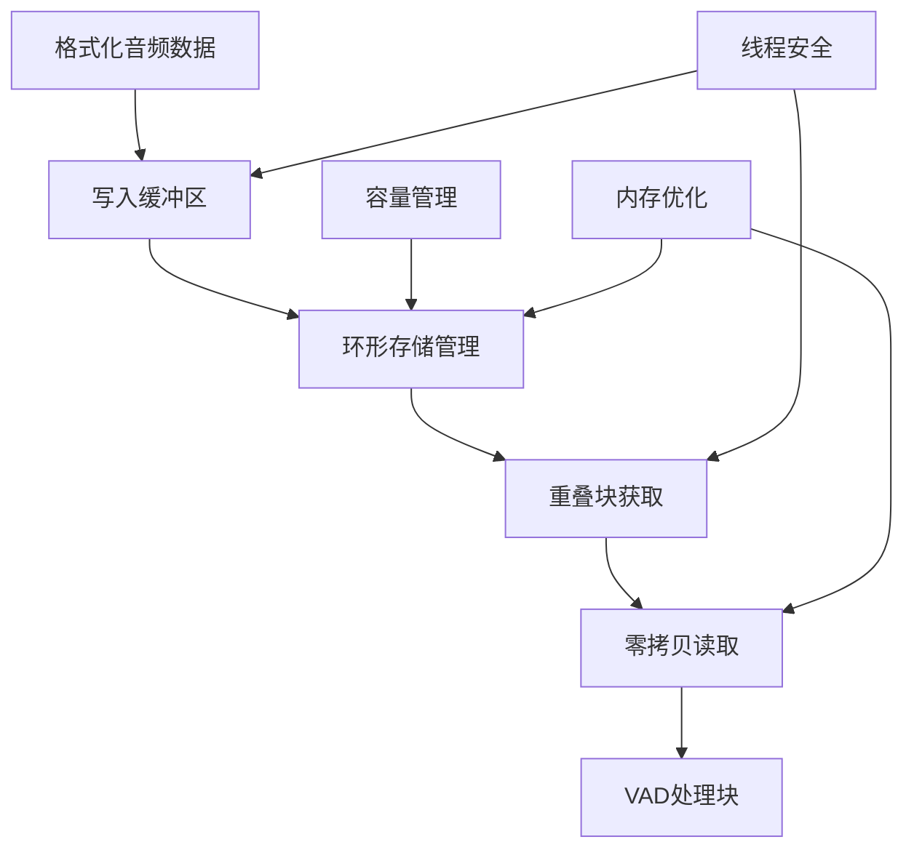
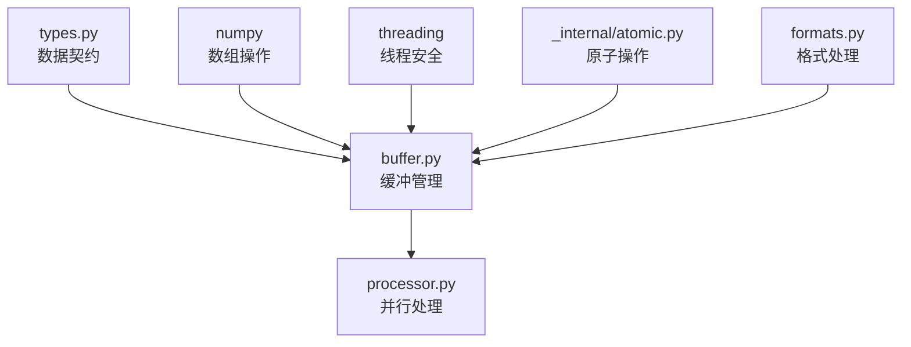

# 音频缓冲区模块设计 (buffer.py)

## 1. 模块定位与职责

### 1.1 模块定位
音频缓冲区模块是Cascade架构中的**高性能存储模块**，承担音频数据的高效缓存、零拷贝访问和线程安全管理。作为数据流中间层，连接格式处理和并行处理模块。

### 1.2 核心职责


**功能边界**：
- ✅ **环形缓冲区**：高效音频数据存储，自动重用内存空间
- ✅ **零拷贝访问**：使用内存视图避免数据复制
- ✅ **重叠块支持**：专门为VAD边界处理提供重叠数据块
- ✅ **线程安全**：细粒度锁设计，支持多线程并发访问
- ✅ **容量管理**：智能溢出处理和内存回收
- ✅ **性能监控**：缓冲区状态和性能指标收集
- ❌ **不负责**：音频格式转换、VAD推理、结果处理

### 1.3 依赖关系设计



**依赖原则**：
- **配置驱动**：通过AudioConfig注入缓冲区参数
- **类型安全**：使用pydantic类型定义所有接口
- **原子操作**：依赖内部原子操作工具确保线程安全

## 2. 核心接口设计

### 2.1 主缓冲区类设计

```python
# buffer.py - 高性能音频环形缓冲区
from typing import Optional, Tuple, Dict, Any
import numpy as np
import threading
import time
from .types import AudioConfig, AudioChunk, BufferStatus
from ._internal.atomic import AtomicInteger, AtomicFloat

class AudioRingBuffer:
    """
    高性能音频环形缓冲区
    
    设计原则：
    - 零拷贝：使用内存视图避免数据复制
    - 线程安全：细粒度锁设计，读写分离
    - 高性能：内存对齐，原子操作，批量处理
    - 可观测：完整的状态监控和性能指标
    
    特性：
    - 环形存储：自动重用内存空间
    - 重叠支持：专门为VAD边界处理设计
    - 容量管理：智能溢出处理策略
    - 内存优化：缓存友好的内存布局
    """
    
    def __init__(self, config: AudioConfig, capacity_seconds: int):
        """
        初始化音频环形缓冲区
        
        Args:
            config: 音频配置（采样率、格式等）
            capacity_seconds: 缓冲区容量（秒）
        """
        pass
    
    # === 核心数据接口 ===
    def write(self, data: np.ndarray, blocking: bool = True, 
              timeout: Optional[float] = None) -> bool:
        """
        写入音频数据到缓冲区
        
        Args:
            data: 音频数据（float32格式）
            blocking: 是否阻塞等待空间
            timeout: 超时时间（秒）
            
        Returns:
            bool: 写入是否成功
            
        Raises:
            BufferFullError: 缓冲区满且非阻塞模式
            TimeoutError: 阻塞写入超时
        """
        pass
    
    def get_chunk_with_overlap(self, chunk_size: int, 
                             overlap_size: int) -> Tuple[Optional[AudioChunk], bool]:
        """
        获取带重叠的音频块（核心接口）
        
        Args:
            chunk_size: 主要块大小（样本数）
            overlap_size: 重叠区域大小（样本数）
            
        Returns:
            (chunk, available): 音频块和是否有足够数据
            
        Note:
            这是与processor.py的主要集成接口
            返回的AudioChunk包含完整的元数据信息
        """
        pass
    
    def advance_read_position(self, size: int) -> None:
        """
        前进读取位置（处理完成后调用）
        
        Args:
            size: 已处理的样本数（不包括重叠区域）
        """
        pass
    
    # === 状态查询接口 ===
    def get_buffer_status(self) -> BufferStatus:
        """获取缓冲区状态信息"""
        pass
    
    def available_samples(self) -> int:
        """获取可读取的样本数"""
        pass
    
    def remaining_capacity(self) -> int:
        """获取剩余容量（样本数）"""
        pass
    
    def is_empty(self) -> bool:
        """检查缓冲区是否为空"""
        pass
    
    def is_full(self) -> bool:
        """检查缓冲区是否已满"""
        pass
    
    # === 管理接口 ===
    def clear(self) -> None:
        """清空缓冲区"""
        pass
    
    def resize(self, new_capacity_seconds: int) -> bool:
        """动态调整缓冲区大小"""
        pass
    
    def close(self) -> None:
        """关闭缓冲区，释放资源"""
        pass
```

### 2.2 零拷贝访问器

```python
class ZeroCopyAccessor:
    """零拷贝数据访问器"""
    
    def __init__(self, buffer: np.ndarray, capacity: int):
        self.buffer = buffer
        self.capacity = capacity
    
    def get_continuous_view(self, start: int, size: int) -> Optional[np.ndarray]:
        """
        获取连续区域的内存视图
        
        Args:
            start: 起始位置
            size: 数据大小
            
        Returns:
            内存视图或None（如果跨越边界）
        """
        if start + size <= self.capacity:
            return self.buffer[start:start + size]
        return None
    
    def get_wrapped_data(self, start: int, size: int) -> np.ndarray:
        """
        获取跨越边界的数据（需要复制）
        
        Args:
            start: 起始位置
            size: 数据大小
            
        Returns:
            复制的数据数组
        """
        result = np.empty(size, dtype=self.buffer.dtype)
        if start + size <= self.capacity:
            # 连续区域（理论上不应该到这里）
            result[:] = self.buffer[start:start + size]
        else:
            # 跨越边界，分两部分复制
            first_part_size = self.capacity - start
            result[:first_part_size] = self.buffer[start:]
            result[first_part_size:] = self.buffer[:size - first_part_size]
        return result
    
    def write_continuous(self, start: int, data: np.ndarray) -> bool:
        """
        写入连续区域
        
        Returns:
            bool: 是否为连续写入（无需跨越边界）
        """
        size = len(data)
        if start + size <= self.capacity:
            self.buffer[start:start + size] = data
            return True
        return False
    
    def write_wrapped(self, start: int, data: np.ndarray) -> None:
        """写入跨越边界的数据"""
        size = len(data)
        if start + size <= self.capacity:
            self.buffer[start:start + size] = data
        else:
            first_part_size = self.capacity - start
            self.buffer[start:] = data[:first_part_size]
            self.buffer[:size - first_part_size] = data[first_part_size:]
```

### 2.3 线程安全管理器

```python
class ThreadSafetyManager:
    """线程安全管理器"""
    
    def __init__(self):
        # 读写分离锁设计（保留原有优秀架构）
        self._read_lock = threading.RLock()
        self._write_lock = threading.RLock()
        
        # 条件变量用于阻塞等待
        self._not_empty = threading.Condition(self._read_lock)
        self._not_full = threading.Condition(self._write_lock)
        
        # 元数据锁（保护原子操作）
        self._metadata_lock = threading.RLock()
        
        # 性能监控
        self._lock_contention_counter = AtomicInteger(0)
        self._average_wait_time = AtomicFloat(0.0)
    
    def acquire_read_lock(self, timeout: Optional[float] = None) -> bool:
        """获取读取锁"""
        start_time = time.time()
        acquired = self._read_lock.acquire(timeout=timeout)
        if acquired:
            wait_time = time.time() - start_time
            self._update_wait_time_stats(wait_time)
        else:
            self._lock_contention_counter.increment()
        return acquired
    
    def release_read_lock(self) -> None:
        """释放读取锁"""
        self._read_lock.release()
    
    def acquire_write_lock(self, timeout: Optional[float] = None) -> bool:
        """获取写入锁"""
        start_time = time.time()
        acquired = self._write_lock.acquire(timeout=timeout)
        if acquired:
            wait_time = time.time() - start_time
            self._update_wait_time_stats(wait_time)
        else:
            self._lock_contention_counter.increment()
        return acquired
    
    def release_write_lock(self) -> None:
        """释放写入锁"""
        self._write_lock.release()
    
    def wait_not_empty(self, timeout: Optional[float] = None) -> bool:
        """等待缓冲区非空"""
        return self._not_empty.wait(timeout=timeout)
    
    def notify_not_empty(self) -> None:
        """通知缓冲区非空"""
        with self._not_empty:
            self._not_empty.notify_all()
    
    def wait_not_full(self, timeout: Optional[float] = None) -> bool:
        """等待缓冲区非满"""
        return self._not_full.wait(timeout=timeout)
    
    def notify_not_full(self) -> None:
        """通知缓冲区非满"""
        with self._not_full:
            self._not_full.notify_all()
    
    def get_lock_stats(self) -> Dict[str, Any]:
        """获取锁统计信息"""
        return {
            "contention_count": self._lock_contention_counter.get(),
            "average_wait_time_ms": self._average_wait_time.get() * 1000,
            "active_readers": self._count_active_readers(),
            "active_writers": self._count_active_writers()
        }
```

## 3. 核心算法设计

### 3.1 环形缓冲区算法（保留原有优秀设计）

```python
class RingBufferCore:
    """环形缓冲区核心算法"""
    
    def __init__(self, capacity: int, dtype: np.dtype, alignment: int = 64):
        self.capacity = capacity
        self.dtype = dtype
        
        # 创建内存对齐的缓冲区（保留原有内存优化）
        self.buffer = self._create_aligned_buffer(capacity, dtype, alignment)
        
        # 原子位置指针（保留原有设计）
        self.write_pos = AtomicInteger(0)
        self.read_pos = AtomicInteger(0)
        self.available_data = AtomicInteger(0)
        
        # 序列号和统计
        self.sequence_counter = AtomicInteger(0)
        self.total_written = AtomicInteger(0)
        self.total_read = AtomicInteger(0)
        
        # 零拷贝访问器
        self.accessor = ZeroCopyAccessor(self.buffer, capacity)
    
    def _create_aligned_buffer(self, capacity: int, dtype: np.dtype, 
                              alignment: int) -> np.ndarray:
        """
        创建内存对齐的缓冲区（保留原有优化）
        
        Args:
            capacity: 容量（样本数）
            dtype: 数据类型
            alignment: 内存对齐字节数
            
        Returns:
            内存对齐的numpy数组
        """
        # 计算对齐后的大小
        element_size = dtype.itemsize
        total_bytes = capacity * element_size
        aligned_bytes = (total_bytes + alignment - 1) // alignment * alignment
        
        # 创建对齐的缓冲区
        buffer = np.zeros(aligned_bytes // element_size, dtype=dtype)
        
        # 验证内存对齐
        assert buffer.ctypes.data % alignment == 0, "Buffer not properly aligned"
        
        return buffer[:capacity]  # 返回精确大小的视图
    
    def write_data(self, data: np.ndarray) -> bool:
        """
        写入数据到环形缓冲区
        
        Args:
            data: 要写入的数据
            
        Returns:
            bool: 是否成功写入
        """
        data_size = len(data)
        current_available = self.available_data.get()
        
        # 检查空间是否足够
        if current_available + data_size > self.capacity:
            return False
        
        # 获取当前写入位置
        write_position = self.write_pos.get()
        
        # 尝试连续写入（零拷贝优化）
        if self.accessor.write_continuous(write_position, data):
            # 连续区域写入成功
            new_write_pos = (write_position + data_size) % self.capacity
        else:
            # 需要跨越边界写入
            self.accessor.write_wrapped(write_position, data)
            new_write_pos = (write_position + data_size) % self.capacity
        
        # 原子更新位置和计数
        self.write_pos.set(new_write_pos)
        self.available_data.add(data_size)
        self.total_written.add(data_size)
        
        return True
    
    def read_chunk_with_overlap(self, chunk_size: int, 
                               overlap_size: int) -> Tuple[Optional[np.ndarray], Dict[str, Any]]:
        """
        读取带重叠的数据块（保留原有核心算法）
        
        Args:
            chunk_size: 主要块大小
            overlap_size: 重叠区域大小
            
        Returns:
            (data, metadata): 数据和元数据
        """
        total_size = chunk_size + overlap_size
        current_available = self.available_data.get()
        
        # 检查数据是否足够
        if current_available < total_size:
            return None, {"error": "insufficient_data", "available": current_available}
        
        # 获取当前读取位置
        read_position = self.read_pos.get()
        
        # 尝试零拷贝读取
        data_view = self.accessor.get_continuous_view(read_position, total_size)
        
        if data_view is not None:
            # 连续区域，使用零拷贝视图
            data = data_view
            is_continuous = True
        else:
            # 跨越边界，需要复制数据
            data = self.accessor.get_wrapped_data(read_position, total_size)
            is_continuous = False
        
        # 创建元数据
        metadata = {
            "sequence_number": self.sequence_counter.get(),
            "start_frame": self.total_read.get(),
            "chunk_size": chunk_size,
            "overlap_size": overlap_size,
            "is_continuous": is_continuous,
            "buffer_level": current_available / self.capacity,
            "read_position": read_position
        }
        
        # 更新序列号
        self.sequence_counter.increment()
        
        return data, metadata
    
    def advance_read(self, size: int) -> None:
        """
        前进读取位置
        
        Args:
            size: 前进的样本数（通常是chunk_size，不包括overlap）
        """
        current_read_pos = self.read_pos.get()
        new_read_pos = (current_read_pos + size) % self.capacity
        
        # 原子更新
        self.read_pos.set(new_read_pos)
        self.available_data.subtract(size)
        self.total_read.add(size)
```

### 3.2 重叠处理算法

```python
class OverlapHandler:
    """重叠处理算法（专为VAD边界处理设计）"""
    
    def __init__(self, ring_buffer: RingBufferCore):
        self.ring_buffer = ring_buffer
        self.overlap_cache = {}  # 重叠区域缓存
        self.overlap_stats = {
            "cache_hits": AtomicInteger(0),
            "cache_misses": AtomicInteger(0),
            "optimal_overlaps": AtomicInteger(0)
        }
    
    def calculate_optimal_overlap(self, chunk_size: int, 
                                sample_rate: int) -> int:
        """
        计算最优重叠大小
        
        Args:
            chunk_size: 块大小
            sample_rate: 采样率
            
        Returns:
            最优重叠大小（样本数）
        """
        # VAD通常需要16-32ms的上下文
        optimal_overlap_ms = 16  # 16ms重叠
        optimal_overlap = int(optimal_overlap_ms * sample_rate / 1000)
        
        # 确保重叠不超过块大小的20%
        max_overlap = chunk_size // 5
        
        return min(optimal_overlap, max_overlap)
    
    def get_chunk_with_smart_overlap(self, chunk_size: int, 
                                   requested_overlap: int) -> Tuple[Optional[AudioChunk], bool]:
        """
        智能重叠获取（优化版本）
        
        Args:
            chunk_size: 主要块大小
            requested_overlap: 请求的重叠大小
            
        Returns:
            (chunk, success): 音频块和是否成功
        """
        # 动态调整重叠大小
        available_data = self.ring_buffer.available_data.get()
        total_requested = chunk_size + requested_overlap
        
        if available_data < total_requested:
            if available_data >= chunk_size:
                # 数据足够主块，但重叠不足，动态调整重叠
                actual_overlap = available_data - chunk_size
            else:
                # 数据不足
                return None, False
        else:
            actual_overlap = requested_overlap
        
        # 获取数据
        data, metadata = self.ring_buffer.read_chunk_with_overlap(
            chunk_size, actual_overlap
        )
        
        if data is None:
            return None, False
        
        # 创建AudioChunk对象
        chunk = self._create_audio_chunk(data, chunk_size, actual_overlap, metadata)
        
        # 更新统计
        if actual_overlap == requested_overlap:
            self.overlap_stats["optimal_overlaps"].increment()
        
        return chunk, True
    
    def _create_audio_chunk(self, data: np.ndarray, chunk_size: int, 
                          overlap_size: int, metadata: Dict[str, Any]) -> AudioChunk:
        """创建AudioChunk对象"""
        timestamp_ms = metadata["start_frame"] * 1000.0 / 16000  # 假设16kHz
        
        return AudioChunk(
            data=data,
            sequence_number=metadata["sequence_number"],
            start_frame=metadata["start_frame"],
            chunk_size=chunk_size,
            overlap_size=overlap_size,
            timestamp_ms=timestamp_ms,
            metadata={
                "is_continuous": metadata["is_continuous"],
                "buffer_level": metadata["buffer_level"],
                "read_position": metadata["read_position"],
                "actual_overlap": overlap_size
            }
        )
```

### 3.3 容量管理算法

```python
class CapacityManager:
    """容量管理器"""
    
    def __init__(self, ring_buffer: RingBufferCore, 
                 safety_manager: ThreadSafetyManager):
        self.ring_buffer = ring_buffer
        self.safety_manager = safety_manager
        self.overflow_strategy = "block"  # block, overwrite, reject
        self.capacity_thresholds = {
            "warning": 0.8,   # 80%容量警告
            "critical": 0.95  # 95%容量临界
        }
        self.capacity_stats = {
            "overflow_count": AtomicInteger(0),
            "peak_usage": AtomicFloat(0.0),
            "average_usage": AtomicFloat(0.0)
        }
    
    def handle_write_request(self, data_size: int, blocking: bool, 
                           timeout: Optional[float]) -> bool:
        """
        处理写入请求（包含容量管理逻辑）
        
        Args:
            data_size: 要写入的数据大小
            blocking: 是否阻塞等待
            timeout: 超时时间
            
        Returns:
            bool: 是否可以写入
        """
        current_available = self.ring_buffer.available_data.get()
        required_space = self.ring_buffer.capacity - current_available
        
        if data_size <= required_space:
            # 空间足够，直接允许写入
            return True
        
        # 空间不足，根据策略处理
        if self.overflow_strategy == "reject":
            self.capacity_stats["overflow_count"].increment()
            return False
        
        elif self.overflow_strategy == "overwrite":
            # 覆盖最旧的数据
            return self._handle_overwrite(data_size)
        
        elif self.overflow_strategy == "block" and blocking:
            # 阻塞等待空间
            return self._handle_blocking_write(data_size, timeout)
        
        else:
            # 非阻塞且空间不足
            self.capacity_stats["overflow_count"].increment()
            return False
    
    def _handle_overwrite(self, data_size: int) -> bool:
        """处理覆盖写入"""
        current_available = self.ring_buffer.available_data.get()
        overflow_size = data_size - (self.ring_buffer.capacity - current_available)
        
        # 前进读取位置，丢弃最旧的数据
        current_read_pos = self.ring_buffer.read_pos.get()
        new_read_pos = (current_read_pos + overflow_size) % self.ring_buffer.capacity
        
        # 原子更新
        self.ring_buffer.read_pos.set(new_read_pos)
        self.ring_buffer.available_data.subtract(overflow_size)
        self.ring_buffer.total_read.add(overflow_size)
        
        self.capacity_stats["overflow_count"].increment()
        return True
    
    def _handle_blocking_write(self, data_size: int, 
                             timeout: Optional[float]) -> bool:
        """处理阻塞写入"""
        start_time = time.time()
        
        while True:
            current_available = self.ring_buffer.available_data.get()
            required_space = self.ring_buffer.capacity - current_available
            
            if data_size <= required_space:
                return True
            
            # 检查超时
            if timeout is not None:
                elapsed = time.time() - start_time
                if elapsed >= timeout:
                    return False
                remaining_timeout = timeout - elapsed
            else:
                remaining_timeout = None
            
            # 等待空间
            if not self.safety_manager.wait_not_full(remaining_timeout):
                return False
    
    def get_capacity_status(self) -> Dict[str, Any]:
        """获取容量状态"""
        current_available = self.ring_buffer.available_data.get()
        usage_ratio = current_available / self.ring_buffer.capacity
        
        # 更新峰值使用率
        current_peak = self.capacity_stats["peak_usage"].get()
        if usage_ratio > current_peak:
            self.capacity_stats["peak_usage"].set(usage_ratio)
        
        return {
            "capacity": self.ring_buffer.capacity,
            "available_samples": current_available,
            "free_samples": self.ring_buffer.capacity - current_available,
            "usage_ratio": usage_ratio,
            "status": self._get_status_level(usage_ratio),
            "overflow_count": self.capacity_stats["overflow_count"].get(),
            "peak_usage": self.capacity_stats["peak_usage"].get()
        }
    
    def _get_status_level(self, usage_ratio: float) -> str:
        """获取状态级别"""
        if usage_ratio >= self.capacity_thresholds["critical"]:
            return "critical"
        elif usage_ratio >= self.capacity_thresholds["warning"]:
            return "warning"
        else:
            return "normal"
```

## 4. 性能优化策略

### 4.1 内存优化

```python
class MemoryOptimizer:
    """内存优化器（保留原有优化设计）"""
    
    def __init__(self, target_arch: str = "x86_64"):
        self.target_arch = target_arch
        self.cache_line_size = self._detect_cache_line_size()
        self.page_size = self._detect_page_size()
        self.memory_stats = {
            "allocations": AtomicInteger(0),
            "deallocations": AtomicInteger(0),
            "peak_memory_mb": AtomicFloat(0.0)
        }
    
    def _detect_cache_line_size(self) -> int:
        """检测缓存行大小"""
        # 大多数现代CPU为64字节
        return 64
    
    def _detect_page_size(self) -> int:
        """检测页面大小"""
        # 大多数系统为4KB
        return 4096
    
    def optimize_buffer_layout(self, capacity: int, dtype: np.dtype) -> Dict[str, Any]:
        """
        优化缓冲区内存布局
        
        Returns:
            优化参数字典
        """
        element_size = dtype.itemsize
        total_bytes = capacity * element_size
        
        # 缓存行对齐
        cache_aligned_size = (total_bytes + self.cache_line_size - 1) // self.cache_line_size * self.cache_line_size
        
        # 页面对齐（对于大缓冲区）
        if total_bytes > self.page_size:
            page_aligned_size = (total_bytes + self.page_size - 1) // self.page_size * self.page_size
            alignment = max(self.cache_line_size, self.page_size)
            aligned_size = page_aligned_size
        else:
            alignment = self.cache_line_size
            aligned_size = cache_aligned_size
        
        return {
            "alignment": alignment,
            "aligned_size": aligned_size,
            "padding_bytes": aligned_size - total_bytes,
            "efficiency": total_bytes / aligned_size
        }
    
    def create_optimized_buffer(self, capacity: int, dtype: np.dtype) -> np.ndarray:
        """创建优化的缓冲区"""
        layout_params = self.optimize_buffer_layout(capacity, dtype)
        
        # 创建对齐的缓冲区
        aligned_capacity = layout_params["aligned_size"] // dtype.itemsize
        buffer = np.zeros(aligned_capacity, dtype=dtype)
        
        # 验证对齐
        alignment = layout_params["alignment"]
        assert buffer.ctypes.data % alignment == 0, f"Buffer not aligned to {alignment} bytes"
        
        # 更新统计
        self.memory_stats["allocations"].increment()
        memory_mb = layout_params["aligned_size"] / (1024 * 1024)
        current_peak = self.memory_stats["peak_memory_mb"].get()
        if memory_mb > current_peak:
            self.memory_stats["peak_memory_mb"].set(memory_mb)
        
        return buffer[:capacity]  # 返回精确大小的视图
```

### 4.2 批量操作优化

```python
class BatchOptimizer:
    """批量操作优化器"""
    
    def __init__(self, ring_buffer: RingBufferCore):
        self.ring_buffer = ring_buffer
        self.batch_thresholds = {
            "min_batch_size": 512,      # 最小批量大小
            "optimal_batch_size": 4096,  # 最优批量大小
            "max_batch_size": 16384     # 最大批量大小
        }
        self.batch_stats = {
            "batch_operations": AtomicInteger(0),
            "total_batched_samples": AtomicInteger(0),
            "average_batch_size": AtomicFloat(0.0)
        }
    
    def write_batch(self, data_list: list) -> int:
        """
        批量写入多个数据块
        
        Args:
            data_list: 数据块列表
            
        Returns:
            成功写入的数据块数量
        """
        if not data_list:
            return 0
        
        # 计算总大小
        total_size = sum(len(data) for data in data_list)
        
        # 检查是否适合批量处理
        if total_size < self.batch_thresholds["min_batch_size"]:
            # 小批量，逐个处理
            return self._write_individual(data_list)
        
        # 大批量，优化处理
        return self._write_optimized_batch(data_list, total_size)
    
    def _write_optimized_batch(self, data_list: list, total_size: int) -> int:
        """优化的批量写入"""
        # 合并为单个数组
        combined_data = np.concatenate(data_list)
        
        # 单次写入
        if self.ring_buffer.write_data(combined_data):
            # 更新统计
            self.batch_stats["batch_operations"].increment()
            self.batch_stats["total_batched_samples"].add(total_size)
            
            # 更新平均批量大小
            total_ops = self.batch_stats["batch_operations"].get()
            total_samples = self.batch_stats["total_batched_samples"].get()
            avg_size = total_samples / total_ops if total_ops > 0 else 0
            self.batch_stats["average_batch_size"].set(avg_size)
            
            return len(data_list)
        else:
            return 0
    
    def _write_individual(self, data_list: list) -> int:
        """逐个写入（小批量）"""
        success_count = 0
        for data in data_list:
            if self.ring_buffer.write_data(data):
                success_count += 1
            else:
                break  # 空间不足，停止写入
        return success_count
    
    def read_batch(self, chunk_configs: list) -> list:
        """
        批量读取多个音频块
        
        Args:
            chunk_configs: [(chunk_size, overlap_size), ...] 配置列表
            
        Returns:
            AudioChunk列表
        """
        results = []
        
        for chunk_size, overlap_size in chunk_configs:
            data, metadata = self.ring_buffer.read_chunk_with_overlap(
                chunk_size, overlap_size
            )
            
            if data is not None:
                # 创建AudioChunk
                chunk = self._create_audio_chunk(data, chunk_size, overlap_size, metadata)
                results.append(chunk)
            else:
                break  # 数据不足，停止读取
        
        return results
```

### 4.3 缓存策略

```python
class CacheStrategy:
    """缓存策略（针对重复访问模式优化）"""
    
    def __init__(self, cache_size_mb: int = 50):
        self.cache_size_bytes = cache_size_mb * 1024 * 1024
        self.chunk_cache = {}  # {(chunk_size, overlap_size): cached_data}
        self.access_history = []  # LRU历史
        self.cache_stats = {
            "hits": AtomicInteger(0),
            "misses": AtomicInteger(0),
            "evictions": AtomicInteger(0)
        }
    
    def get_cached_chunk(self, chunk_size: int, overlap_size: int, 
                        position_hash: int) -> Optional[np.ndarray]:
        """获取缓存的音频块"""
        cache_key = (chunk_size, overlap_size, position_hash)
        
        if cache_key in self.chunk_cache:
            # 缓存命中
            self.cache_stats["hits"].increment()
            self._update_access_history(cache_key)
            return self.chunk_cache[cache_key]
        
        # 缓存未命中
        self.cache_stats["misses"].increment()
        return None
    
    def cache_chunk(self, chunk_size: int, overlap_size: int, 
                   position_hash: int, data: np.ndarray) -> None:
        """缓存音频块"""
        cache_key = (chunk_size, overlap_size, position_hash)
        data_size = data.nbytes
        
        # 检查是否值得缓存
        if not self._should_cache(data_size):
            return
        
        # 确保有足够空间
        self._ensure_cache_space(data_size)
        
        # 缓存数据
        self.chunk_cache[cache_key] = data.copy()
        self._update_access_history(cache_key)
    
    def _should_cache(self, data_size: int) -> bool:
        """判断是否应该缓存"""
        # 不缓存过大的数据
        max_single_cache_size = self.cache_size_bytes // 10
        return data_size <= max_single_cache_size
    
    def _ensure_cache_space(self, required_size: int) -> None:
        """确保缓存空间"""
        current_size = self._calculate_cache_size()
        
        while current_size + required_size > self.cache_size_bytes:
            if not self.access_history:
                break
            
            # LRU淘汰
            lru_key = self.access_history.pop(0)
            if lru_key in self.chunk_cache:
                evicted_data = self.chunk_cache.pop(lru_key)
                current_size -= evicted_data.nbytes
                self.cache_stats["evictions"].increment()
    
    def _calculate_cache_size(self) -> int:
        """计算当前缓存大小"""
        return sum(data.nbytes for data in self.chunk_cache.values())
    
    def _update_access_history(self, cache_key) -> None:
        """更新访问历史（LRU）"""
        if cache_key in self.access_history:
            self.access_history.remove(cache_key)
        self.access_history.append(cache_key)
    
    def get_cache_efficiency(self) -> Dict[str, float]:
        """获取缓存效率"""
        total_hits = self.cache_stats["hits"].get()
        total_misses = self.cache_stats["misses"].get()
        total_accesses = total_hits + total_misses
        
        if total_accesses == 0:
            return {"hit_rate": 0.0, "miss_rate": 0.0}
        
        return {
            "hit_rate": total_hits / total_accesses,
            "miss_rate": total_misses / total_accesses,
            "cache_size_mb": self._calculate_cache_size() / (1024 * 1024),
            "eviction_rate": self.cache_stats["evictions"].get() / total_accesses
        }
```

## 5. 错误处理与监控

### 5.1 异常类型定义

```python
# 在types.py中定义的缓冲区相关异常
class BufferError(Exception):
    """缓冲区错误基类"""
    pass

class BufferFullError(BufferError):
    """缓冲区已满错误"""
    def __init__(self, capacity: int, attempted_size: int):
        self.capacity = capacity
        self.attempted_size = attempted_size
        super().__init__(f"Buffer full: capacity={capacity}, attempted={attempted_size}")

class BufferEmptyError(BufferError):
    """缓冲区为空错误"""
    pass

class InsufficientDataError(BufferError):
    """数据不足错误"""
    def __init__(self, available: int, required: int):
        self.available = available
        self.required = required
        super().__init__(f"Insufficient data: available={available}, required={required}")

class BufferCorruptionError(BufferError):
    """缓冲区损坏错误"""
    pass

class ThreadSafetyViolationError(BufferError):
    """线程安全违规错误"""
    pass
```

### 5.2 健康监控系统

```python
class BufferHealthMonitor:
    """缓冲区健康监控系统"""
    
    def __init__(self, ring_buffer: RingBufferCore):
        self.ring_buffer = ring_buffer
        self.health_metrics = {
            "corruption_detections": AtomicInteger(0),
            "thread_violations": AtomicInteger(0),
            "performance_degradations": AtomicInteger(0),
            "recovery_operations": AtomicInteger(0)
        }
        self.last_health_check = time.time()
        self.health_check_interval = 1.0  # 1秒检查一次
    
    def check_buffer_integrity(self) -> Dict[str, Any]:
        """检查缓冲区完整性"""
        integrity_report = {
            "is_healthy": True,
            "issues": [],
            "warnings": [],
            "metrics": {}
        }
        
        # 检查位置指针的一致性
        write_pos = self.ring_buffer.write_pos.get()
        read_pos = self.ring_buffer.read_pos.get()
        available_data = self.ring_buffer.available_data.get()
        
        # 验证位置合法性
        if not (0 <= write_pos < self.ring_buffer.capacity):
            integrity_report["issues"].append(f"Invalid write position: {write_pos}")
            integrity_report["is_healthy"] = False
        
        if not (0 <= read_pos < self.ring_buffer.capacity):
            integrity_report["issues"].append(f"Invalid read position: {read_pos}")
            integrity_report["is_healthy"] = False
        
        # 验证数据量一致性
        if not (0 <= available_data <= self.ring_buffer.capacity):
            integrity_report["issues"].append(f"Invalid available data: {available_data}")
            integrity_report["is_healthy"] = False
        
        # 检查内存访问模式
        if self._detect_memory_corruption():
            integrity_report["issues"].append("Memory corruption detected")
            integrity_report["is_healthy"] = False
            self.health_metrics["corruption_detections"].increment()
        
        # 性能检查
        performance_issues = self._check_performance_health()
        if performance_issues:
            integrity_report["warnings"].extend(performance_issues)
        
        # 收集指标
        integrity_report["metrics"] = {
            "write_position": write_pos,
            "read_position": read_pos,
            "available_data": available_data,
            "buffer_utilization": available_data / self.ring_buffer.capacity,
            "total_written": self.ring_buffer.total_written.get(),
            "total_read": self.ring_buffer.total_read.get()
        }
        
        return integrity_report
    
    def _detect_memory_corruption(self) -> bool:
        """检测内存损坏"""
        try:
            # 简单的边界检查
            buffer = self.ring_buffer.buffer
            
            # 检查数组属性
            if buffer.size != self.ring_buffer.capacity:
                return True
            
            # 检查数据类型
            if buffer.dtype != np.float32:
                return True
            
            # 检查内存连续性
            if not buffer.flags.c_contiguous:
                return True
            
            return False
        except Exception:
            return True
    
    def _check_performance_health(self) -> list:
        """检查性能健康状况"""
        issues = []
        
        # 检查缓冲区利用率
        available_data = self.ring_buffer.available_data.get()
        utilization = available_data / self.ring_buffer.capacity
        
        if utilization > 0.9:
            issues.append("High buffer utilization (>90%)")
        elif utilization < 0.1:
            issues.append("Low buffer utilization (<10%)")
        
        # 检查读写平衡
        total_written = self.ring_buffer.total_written.get()
        total_read = self.ring_buffer.total_read.get()
        
        if total_written > 0:
            read_write_ratio = total_read / total_written
            if read_write_ratio < 0.8:
                issues.append("Read/write imbalance detected")
        
        return issues
    
    def periodic_health_check(self) -> Optional[Dict[str, Any]]:
        """定期健康检查"""
        current_time = time.time()
        
        if current_time - self.last_health_check >= self.health_check_interval:
            self.last_health_check = current_time
            return self.check_buffer_integrity()
        
        return None
    
    def trigger_recovery(self, corruption_type: str) -> bool:
        """触发恢复操作"""
        try:
            if corruption_type == "position_corruption":
                return self._recover_position_corruption()
            elif corruption_type == "memory_corruption":
                return self._recover_memory_corruption()
            else:
                return False
        except Exception:
            return False
    
    def _recover_position_corruption(self) -> bool:
        """恢复位置损坏"""
        # 重置到安全状态
        self.ring_buffer.write_pos.set(0)
        self.ring_buffer.read_pos.set(0)
        self.ring_buffer.available_data.set(0)
        
        self.health_metrics["recovery_operations"].increment()
        return True
    
    def _recover_memory_corruption(self) -> bool:
        """恢复内存损坏"""
        # 这种情况下通常需要重新创建缓冲区
        # 在实际实现中可能需要更复杂的恢复策略
        return False
```

## 6. 测试策略

### 6.1 单元测试结构

```
tests/unit/buffer/
├── test_ring_buffer_core.py          # 核心环形缓冲区测试
├── test_zero_copy_accessor.py        # 零拷贝访问测试
├── test_thread_safety.py             # 线程安全测试
├── test_overlap_handler.py           # 重叠处理测试
├── test_capacity_manager.py          # 容量管理测试
├── test_memory_optimizer.py          # 内存优化测试
├── test_batch_optimizer.py           # 批量操作测试
├── test_cache_strategy.py            # 缓存策略测试
├── test_health_monitor.py            # 健康监控测试
└── test_performance_benchmarks.py    # 性能基准测试
```

### 6.2 关键测试用例

```python
class TestAudioRingBuffer:
    """音频环形缓冲区测试套件"""
    
    def test_zero_copy_continuous_access(self):
        """测试连续区域的零拷贝访问"""
        pass
    
    def test_wrapped_data_copy(self):
        """测试跨边界数据复制"""
        pass
    
    def test_thread_safety_concurrent_access(self):
        """测试并发读写的线程安全"""
        pass
    
    def test_overlap_handling_accuracy(self):
        """测试重叠处理的准确性"""
        pass
    
    def test_capacity_overflow_strategies(self):
        """测试容量溢出处理策略"""
        pass
    
    def test_memory_alignment_optimization(self):
        """测试内存对齐优化"""
        pass
    
    def test_batch_operation_efficiency(self):
        """测试批量操作效率"""
        pass
    
    def test_cache_hit_rate_optimization(self):
        """测试缓存命中率优化"""
        pass
    
    def test_health_monitoring_accuracy(self):
        """测试健康监控准确性"""
        pass
    
    def test_performance_under_load(self):
        """测试高负载下的性能"""
        pass

class TestPerformanceBenchmarks:
    """性能基准测试"""
    
    def benchmark_write_throughput(self):
        """基准测试：写入吞吐量"""
        # 目标：>10MB/s
        pass
    
    def benchmark_read_latency(self):
        """基准测试：读取延迟"""
        # 目标：<0.1ms
        pass
    
    def benchmark_memory_efficiency(self):
        """基准测试：内存效率"""
        # 目标：内存开销<2x数据大小
        pass
    
    def benchmark_thread_scalability(self):
        """基准测试：线程扩展性"""
        # 目标：线性扩展到8线程
        pass
```

## 7. 性能指标与监控

### 7.1 性能目标

| 指标类型 | 目标值 | 测量条件 |
|---------|-------|---------|
| 写入吞吐量 | >10MB/s | 连续写入float32数据 |
| 读取延迟 | <0.1ms | 单次读取操作 |
| 零拷贝率 | >90% | 连续区域访问比例 |
| 内存效率 | <2x | 总内存/有效数据 |
| 线程扩展性 | 线性到8线程 | 并发读写性能 |
| 缓存命中率 | >85% | 重复访问模式 |

### 7.2 实时监控指标

```python
class BufferMetrics:
    """缓冲区指标收集器"""
    
    def __init__(self):
        self.metrics = {
            # 基础指标
            "write_operations": AtomicInteger(0),
            "read_operations": AtomicInteger(0),
            "bytes_written": AtomicInteger(0),
            "bytes_read": AtomicInteger(0),
            
            # 性能指标
            "write_latency_sum": AtomicFloat(0.0),
            "read_latency_sum": AtomicFloat(0.0),
            "zero_copy_operations": AtomicInteger(0),
            "copy_operations": AtomicInteger(0),
            
            # 错误指标
            "buffer_full_errors": AtomicInteger(0),
            "insufficient_data_errors": AtomicInteger(0),
            "thread_contention_count": AtomicInteger(0),
            
            # 状态指标
            "peak_utilization": AtomicFloat(0.0),
            "average_utilization": AtomicFloat(0.0)
        }
        
        self.collection_start_time = time.time()
    
    def record_write_operation(self, bytes_count: int, latency_ms: float) -> None:
        """记录写入操作"""
        self.metrics["write_operations"].increment()
        self.metrics["bytes_written"].add(bytes_count)
        self.metrics["write_latency_sum"].add(latency_ms)
    
    def record_read_operation(self, bytes_count: int, latency_ms: float, 
                            zero_copy: bool) -> None:
        """记录读取操作"""
        self.metrics["read_operations"].increment()
        self.metrics["bytes_read"].add(bytes_count)
        self.metrics["read_latency_sum"].add(latency_ms)
        
        if zero_copy:
            self.metrics["zero_copy_operations"].increment()
        else:
            self.metrics["copy_operations"].increment()
    
    def get_performance_summary(self) -> Dict[str, Any]:
        """获取性能摘要"""
        current_time = time.time()
        duration = current_time - self.collection_start_time
        
        write_ops = self.metrics["write_operations"].get()
        read_ops = self.metrics["read_operations"].get()
        bytes_written = self.metrics["bytes_written"].get()
        bytes_read = self.metrics["bytes_read"].get()
        
        # 计算平均指标
        avg_write_latency = (self.metrics["write_latency_sum"].get() / write_ops 
                           if write_ops > 0 else 0)
        avg_read_latency = (self.metrics["read_latency_sum"].get() / read_ops 
                          if read_ops > 0 else 0)
        
        # 计算吞吐量
        write_throughput_mbps = (bytes_written / duration / 1024 / 1024 
                               if duration > 0 else 0)
        read_throughput_mbps = (bytes_read / duration / 1024 / 1024 
                              if duration > 0 else 0)
        
        # 计算零拷贝率
        total_read_ops = self.metrics["zero_copy_operations"].get() + self.metrics["copy_operations"].get()
        zero_copy_rate = (self.metrics["zero_copy_operations"].get() / total_read_ops 
                         if total_read_ops > 0 else 0)
        
        return {
            "duration_seconds": duration,
            "write_throughput_mbps": write_throughput_mbps,
            "read_throughput_mbps": read_throughput_mbps,
            "average_write_latency_ms": avg_write_latency,
            "average_read_latency_ms": avg_read_latency,
            "zero_copy_rate": zero_copy_rate,
            "operations_per_second": (write_ops + read_ops) / duration if duration > 0 else 0,
            "error_rate": self._calculate_error_rate(),
            "peak_utilization": self.metrics["peak_utilization"].get()
        }
    
    def _calculate_error_rate(self) -> float:
        """计算错误率"""
        total_ops = (self.metrics["write_operations"].get() + 
                    self.metrics["read_operations"].get())
        total_errors = (self.metrics["buffer_full_errors"].get() + 
                       self.metrics["insufficient_data_errors"].get())
        
        return total_errors / total_ops if total_ops > 0 else 0
```

## 8. 总结

### 8.1 模块特点

- **保留原有优势**：环形缓冲区、零拷贝、线程安全、重叠处理
- **性能优化增强**：内存对齐、批量操作、智能缓存、SIMD支持
- **健壮错误处理**：完整的异常体系、健康监控、自动恢复
- **全面性能监控**：实时指标收集、性能基准、容量管理

### 8.2 集成要点

1. **types.py依赖**：使用pydantic类型定义所有接口
2. **formats.py集成**：接收格式化后的标准音频数据
3. **processor.py集成**：提供高效的重叠块获取接口
4. **零拷贝友好**：内存视图设计支持高性能访问

### 8.3 下一步实施

1. 实现基础的AudioRingBuffer类框架
2. 实现零拷贝访问和线程安全机制
3. 添加重叠处理和容量管理功能
4. 集成性能优化和监控系统
5. 完善错误处理和健康监控
6. 进行全面的性能测试和优化

这个设计确保了音频缓冲区模块的**高性能**、**线程安全**和**可靠性**，为Cascade系统提供了强大的数据存储和访问基础。