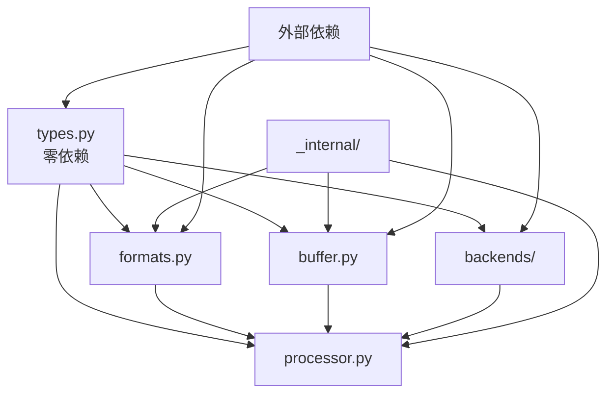

# Cascade 项目结构与开发环境设计

## 1. 项目结构概览

### 1.1 功能模块优先的项目结构

基于之前完成的重构架构设计，采用功能模块优先的扁平化结构：

```
cascade/
├── pyproject.toml              # 项目配置文件
├── README.md                   # 项目说明文档
├── LICENSE                     # Apache 2.0 许可证
├── CHANGELOG.md                # 版本变更日志
├── CONTRIBUTING.md             # 贡献指南
├── .gitignore                  # Git忽略文件
├── .python-version             # Python版本锁定
│
├── cascade/                    # 核心包目录
│   ├── __init__.py             # 包初始化，核心API暴露
│   ├── types.py                # pydantic类型系统（零依赖）
│   ├── formats.py              # 音频格式处理模块
│   ├── buffer.py               # 音频缓冲区模块
│   ├── processor.py            # 音频处理器核心模块
│   ├── backends/               # VAD后端实现
│   │   ├── __init__.py
│   │   ├── base.py             # 抽象基类
│   │   ├── onnx.py             # ONNX后端实现
│   │   └── vllm.py             # VLLM后端实现
│   │   └── silero.py           # silero后端实现
│   ├── _internal/              # 内部实现模块
│   │   ├── __init__.py
│   │   ├── atomic.py           # 原子操作工具
│   │   ├── thread_pool.py      # 线程池管理
│   │   ├── performance.py      # 性能监控
│   │   └── utils.py            # 内部工具函数
│   └── py.typed                # 类型标注声明
│
├── tests/                      # 测试目录
│   ├── __init__.py
│   ├── conftest.py             # pytest配置
│   ├── unit/                   # 单元测试
│   │   ├── __init__.py
│   │   ├── test_types.py       # 类型系统测试
│   │   ├── test_formats.py     # 格式处理测试
│   │   ├── test_buffer.py      # 缓冲区测试
│   │   ├── test_processor.py   # 处理器测试
│   │   └── test_backends.py    # 后端测试
│   ├── integration/            # 集成测试
│   │   ├── __init__.py
│   │   ├── test_end_to_end.py  # 端到端测试
│   │   ├── test_performance.py # 性能测试
│   │   └── test_real_audio.py  # 真实音频测试
│   ├── benchmarks/             # 性能基准测试
│   │   ├── __init__.py
│   │   ├── test_latency.py     # 延迟基准
│   │   ├── test_throughput.py  # 吞吐量基准
│   │   └── test_memory.py      # 内存使用基准
│   └── fixtures/               # 测试数据
│       ├── audio_samples/      # 音频样本文件
│       └── expected_results/   # 期望结果文件
│
├── examples/                   # 示例代码
│   ├── __init__.py
│   ├── basic_usage.py          # 基础使用示例
│   ├── streaming_demo.py       # 流式处理示例
│   ├── performance_tuning.py   # 性能调优示例
│   ├── custom_backend.py       # 自定义后端示例
│   └── audio_files/            # 示例音频文件
│
├── docs/                       # 文档目录
│   ├── index.md                # 文档首页
│   ├── api/                    # API文档（自动生成）
│   ├── tutorials/              # 教程文档
│   │   ├── getting_started.md  # 快速开始
│   │   ├── advanced_usage.md   # 高级用法
│   │   └── performance_guide.md # 性能指南
│   ├── architecture/           # 架构文档
│   │   ├── overview.md         # 架构概览
│   │   ├── modules.md          # 模块设计
│   │   └── performance.md      # 性能设计
│   └── assets/                 # 文档资源
│
├── scripts/                    # 开发脚本
│   ├── setup_dev.py            # 开发环境设置
│   ├── run_tests.py            # 测试运行脚本
│   ├── check_performance.py    # 性能检查脚本
│   └── generate_docs.py        # 文档生成脚本
│
├── .github/                    # GitHub配置
│   ├── workflows/              # GitHub Actions工作流
│   │   ├── ci.yml              # 持续集成
│   │   ├── release.yml         # 发布流程
│   │   └── docs.yml            # 文档构建
│   ├── ISSUE_TEMPLATE/         # Issue模板
│   │   ├── bug_report.md       # Bug报告模板
│   │   └── feature_request.md  # 功能请求模板
│   └── pull_request_template.md # PR模板
│
├── .devcontainer/              # 开发容器配置
│   ├── devcontainer.json       # 容器配置
│   └── Dockerfile              # 开发环境镜像
│
└── .vscode/                    # VSCode配置
    ├── settings.json           # 编辑器设置
    ├── launch.json             # 调试配置
    └── extensions.json         # 推荐扩展
```

### 1.2 设计原则

- **功能模块优先**：每个模块专注单一职责
- **扁平化结构**：减少嵌套层次，降低理解成本
- **清晰边界**：公开API与内部实现明确分离
- **开发者体验**：完整的开发工具链和自动化流程

## 2. 核心包结构设计

### 2.1 cascade/ 包结构

```python
# cascade/__init__.py - 核心API暴露
"""
Cascade: 高性能异步并行VAD处理库

提供低延迟、高吞吐量的语音活动检测能力，支持多种VAD后端和音频格式。
"""

from .types import (
    AudioConfig, VADConfig, AudioChunk, VADResult, 
    PerformanceMetrics, AudioFormat, VADBackend
)
from .processor import VADProcessor
from .formats import AudioFormatProcessor
from .buffer import AudioRingBuffer
from .backends import ONNXVADBackend, VLLMVADBackend

__version__ = "0.1.0"
__author__ = "Cascade Team"
__license__ = "Apache-2.0"

__all__ = [
    # 核心处理器
    "VADProcessor",
    
    # 配置类型
    "AudioConfig", "VADConfig",
    
    # 数据类型
    "AudioChunk", "VADResult", "PerformanceMetrics",
    
    # 枚举类型
    "AudioFormat", "VADBackend",
    
    # 后端实现
    "ONNXVADBackend", "VLLMVADBackend",
    
    # 辅助模块（高级用法）
    "AudioFormatProcessor", "AudioRingBuffer",
]

# 便捷工厂函数
def create_vad_processor(backend_type: str = "onnx", **kwargs) -> VADProcessor:
    """创建VAD处理器的便捷函数"""
    vad_config = VADConfig(backend=backend_type, **kwargs)
    audio_config = AudioConfig()
    return VADProcessor(vad_config, audio_config)

async def process_audio_file(file_path: str, **kwargs) -> list:
    """处理音频文件的便捷函数"""
    processor = create_vad_processor(**kwargs)
    results = []
    async for result in processor.process_file(file_path):
        results.append(result)
    await processor.close()
    return results
```

### 2.2 模块依赖关系



## 3. pyproject.toml 配置设计

### 3.1 项目元信息配置

```toml
[build-system]
requires = ["hatchling>=1.20.0"]
build-backend = "hatchling.build"

[project]
name = "cascade"
version = "0.1.0"
description = "高性能异步并行VAD处理库"
readme = "README.md"
license = {text = "Apache-2.0"}
authors = [
    {name = "Cascade Team", email = "team@cascade-vad.org"}
]
maintainers = [
    {name = "Cascade Team", email = "team@cascade-vad.org"}
]
keywords = [
    "voice-activity-detection", "vad", "audio-processing", 
    "speech", "async", "parallel", "high-performance"
]
classifiers = [
    "Development Status :: 4 - Beta",
    "Intended Audience :: Developers",
    "License :: OSI Approved :: Apache Software License",
    "Operating System :: OS Independent",
    "Programming Language :: Python :: 3",
    "Programming Language :: Python :: 3.11",
    "Programming Language :: Python :: 3.12",
    "Topic :: Multimedia :: Sound/Audio :: Analysis",
    "Topic :: Scientific/Engineering :: Artificial Intelligence",
    "Topic :: Software Development :: Libraries :: Python Modules",
    "Typing :: Typed",
]
requires-python = ">=3.11"

dependencies = [
    "pydantic>=2.4.0,<3.0.0",
    "numpy>=1.24.0,<2.0.0",
    "scipy>=1.11.0,<2.0.0",
    "asyncio-throttle>=1.0.0,<2.0.0",
]

[project.optional-dependencies]
# 开发依赖
dev = [
    "pytest>=7.4.0",
    "pytest-cov>=4.1.0",
    "pytest-asyncio>=0.21.0",
    "pytest-benchmark>=4.0.0",
    "pytest-xdist>=3.3.0",
    "black>=23.9.0",
    "isort>=5.12.0",
    "mypy>=1.6.0",
    "ruff>=0.1.0",
    "pre-commit>=3.5.0",
]

# 文档依赖
docs = [
    "mkdocs>=1.5.0",
    "mkdocs-material>=9.4.0",
    "mkdocstrings[python]>=0.23.0",
    "markdown-include>=0.8.0",
]

# VAD后端依赖
onnx = [
    "onnxruntime>=1.16.0,<2.0.0",
]
vllm = [
    "vllm>=0.2.0,<1.0.0",
    "torch>=2.0.0,<3.0.0",
]

# 完整安装
full = [
    "cascade[dev,docs,onnx,vllm]"
]

[project.urls]
Documentation = "https://cascade-vad.readthedocs.io/"
Repository = "https://github.com/cascade-team/cascade"
Issues = "https://github.com/cascade-team/cascade/issues"
Changelog = "https://github.com/cascade-team/cascade/blob/main/CHANGELOG.md"

[project.scripts]
cascade-benchmark = "cascade.scripts.benchmark:main"
cascade-validate = "cascade.scripts.validate:main"
```

### 3.2 工具配置

```toml
# ===== 测试配置 =====
[tool.pytest.ini_options]
testpaths = ["tests"]
python_files = ["test_*.py", "*_test.py"]
python_classes = ["Test*", "*Test"]
python_functions = ["test_*"]
addopts = [
    "--strict-markers",
    "--strict-config",
    "--cov=cascade",
    "--cov-report=term-missing",
    "--cov-report=html:htmlcov",
    "--cov-report=xml",
    "--cov-fail-under=90",
    "--benchmark-skip",
]
markers = [
    "unit: 单元测试",
    "integration: 集成测试",
    "benchmark: 性能基准测试",
    "slow: 慢速测试",
    "audio: 需要音频文件的测试",
]
asyncio_mode = "auto"
timeout = 300

# ===== 覆盖率配置 =====
[tool.coverage.run]
source = ["cascade"]
omit = [
    "cascade/_internal/*",
    "tests/*",
    "examples/*",
    "scripts/*",
]
branch = true
parallel = true

[tool.coverage.report]
exclude_lines = [
    "pragma: no cover",
    "def __repr__",
    "raise AssertionError",
    "raise NotImplementedError",
    "if __name__ == .__main__.:",
    "if TYPE_CHECKING:",
]
show_missing = true
skip_covered = false

# ===== 代码格式化 =====
[tool.black]
line-length = 88
target-version = ['py311', 'py312']
include = '\.pyi?$'
extend-exclude = '''
/(
    \.git
    | \.mypy_cache
    | \.pytest_cache
    | \.venv
    | build
    | dist
)/
'''

[tool.isort]
profile = "black"
multi_line_output = 3
line_length = 88
known_first_party = ["cascade"]
known_third_party = ["numpy", "scipy", "pydantic", "pytest"]
sections = ["FUTURE", "STDLIB", "THIRDPARTY", "FIRSTPARTY", "LOCALFOLDER"]

# ===== 类型检查 =====
[tool.mypy]
python_version = "3.11"
strict = true
warn_unused_ignores = true
warn_redundant_casts = true
warn_unused_configs = true
disallow_untyped_defs = true
disallow_incomplete_defs = true
check_untyped_defs = true
disallow_untyped_decorators = true
no_implicit_optional = true
warn_return_any = true
show_error_codes = true
show_column_numbers = true

[[tool.mypy.overrides]]
module = [
    "scipy.*",
    "onnxruntime.*",
    "vllm.*",
]
ignore_missing_imports = true

# ===== Ruff配置 =====
[tool.ruff]
line-length = 88
target-version = "py311"
select = [
    "E",   # pycodestyle errors
    "W",   # pycodestyle warnings
    "F",   # pyflakes
    "I",   # isort
    "B",   # flake8-bugbear
    "C4",  # flake8-comprehensions
    "UP",  # pyupgrade
    "A",   # flake8-builtins
    "PL",  # pylint
    "SIM", # flake8-simplify
]
ignore = [
    "E501",   # line too long, handled by black
    "B008",   # do not perform function calls in argument defaults
    "PLR0913", # too many arguments to function call
]

[tool.ruff.per-file-ignores]
"tests/*" = ["PLR2004"]  # Magic value used in comparison

# ===== Hatch配置 =====
[tool.hatch.build.targets.wheel]
packages = ["cascade"]

[tool.hatch.build.targets.sdist]
exclude = [
    "/.github",
    "/.vscode",
    "/tests",
    "/examples",
    "/docs",
    "/scripts",
]

[tool.hatch.version]
path = "cascade/__init__.py"
```

## 4. 开发环境配置

### 4.1 .devcontainer 配置

```json
{
    "name": "Cascade Development",
    "image": "python:3.12-slim",
    "features": {
        "ghcr.io/devcontainers/features/git:1": {},
        "ghcr.io/devcontainers/features/github-cli:1": {}
    },
    "customizations": {
        "vscode": {
            "extensions": [
                "ms-python.python",
                "ms-python.mypy-type-checker",
                "charliermarsh.ruff",
                "ms-python.black-formatter",
                "ms-python.isort",
                "ms-vscode.test-adapter-converter",
                "littlefoxteam.vscode-python-test-adapter",
                "ms-vscode.makefile-tools"
            ],
            "settings": {
                "python.defaultInterpreterPath": "/usr/local/bin/python",
                "python.formatting.provider": "black",
                "python.linting.enabled": true,
                "python.linting.ruffEnabled": true,
                "python.analysis.typeCheckingMode": "strict",
                "files.associations": {
                    "*.toml": "toml"
                }
            }
        }
    },
    "postCreateCommand": "pip install -e '.[dev]' && pre-commit install",
    "forwardPorts": [8000],
    "mounts": [
        "source=${localWorkspaceFolder}/.cache,target=/workspace/.cache,type=bind"
    ]
}
```

### 4.2 GitHub Actions 工作流

```yaml
# .github/workflows/ci.yml
name: CI/CD Pipeline

on:
  push:
    branches: [main, develop]
  pull_request:
    branches: [main, develop]

env:
  PYTHON_VERSION: "3.12"

jobs:
  test:
    runs-on: ${{ matrix.os }}
    strategy:
      matrix:
        os: [ubuntu-latest, macos-latest]
        python-version: ["3.11", "3.12"]
    
    steps:
    - uses: actions/checkout@v4
    
    - name: Set up Python ${{ matrix.python-version }}
      uses: actions/setup-python@v4
      with:
        python-version: ${{ matrix.python-version }}
        cache: 'pip'
    
    - name: Install dependencies
      run: |
        python -m pip install --upgrade pip
        pip install -e ".[dev]"
    
    - name: Lint with ruff
      run: ruff check cascade tests examples
    
    - name: Format check with black
      run: black --check cascade tests examples
    
    - name: Type check with mypy
      run: mypy cascade
    
    - name: Run unit tests
      run: pytest tests/unit/ -v --cov --cov-report=xml
    
    - name: Run integration tests
      run: pytest tests/integration/ -v
    
    - name: Upload coverage reports
      uses: codecov/codecov-action@v3
      with:
        file: ./coverage.xml
        flags: unittests
        name: codecov-umbrella

  performance:
    runs-on: ubuntu-latest
    needs: test
    
    steps:
    - uses: actions/checkout@v4
    
    - name: Set up Python
      uses: actions/setup-python@v4
      with:
        python-version: ${{ env.PYTHON_VERSION }}
        cache: 'pip'
    
    - name: Install dependencies
      run: |
        pip install -e ".[dev,onnx]"
    
    - name: Run performance benchmarks
      run: pytest tests/benchmarks/ --benchmark-json=benchmark.json
    
    - name: Store benchmark results
      uses: benchmark-action/github-action-benchmark@v1
      with:
        tool: 'pytest'
        output-file-path: benchmark.json
        github-token: ${{ secrets.GITHUB_TOKEN }}
        auto-push: true

  docs:
    runs-on: ubuntu-latest
    
    steps:
    - uses: actions/checkout@v4
    
    - name: Set up Python
      uses: actions/setup-python@v4
      with:
        python-version: ${{ env.PYTHON_VERSION }}
        cache: 'pip'
    
    - name: Install dependencies
      run: |
        pip install -e ".[docs]"
    
    - name: Build documentation
      run: mkdocs build --strict
    
    - name: Deploy documentation
      if: github.ref == 'refs/heads/main'
      run: mkdocs gh-deploy --force
```

### 4.3 开发脚本

```python
# scripts/setup_dev.py
"""开发环境设置脚本"""
import subprocess
import sys
from pathlib import Path

def setup_development_environment():
    """设置开发环境"""
    print("🚀 设置Cascade开发环境...")
    
    # 安装开发依赖
    print("📦 安装开发依赖...")
    subprocess.run([sys.executable, "-m", "pip", "install", "-e", ".[dev]"], check=True)
    
    # 设置pre-commit hooks
    print("🔧 设置pre-commit hooks...")
    subprocess.run(["pre-commit", "install"], check=True)
    
    # 创建必要的目录
    print("📁 创建项目目录...")
    directories = [
        "tests/fixtures/audio_samples",
        "tests/fixtures/expected_results",
        "examples/audio_files",
        "docs/api",
        ".cache"
    ]
    
    for dir_path in directories:
        Path(dir_path).mkdir(parents=True, exist_ok=True)
    
    print("✅ 开发环境设置完成！")
    print("\n🎯 下一步:")
    print("  - 运行测试: python -m pytest")
    print("  - 启动文档服务: mkdocs serve")
    print("  - 检查代码质量: ruff check cascade")

if __name__ == "__main__":
    setup_development_environment()
```

## 5. 代码质量保障

### 5.1 pre-commit 配置

```yaml
# .pre-commit-config.yaml
repos:
  - repo: https://github.com/pre-commit/pre-commit-hooks
    rev: v4.4.0
    hooks:
      - id: trailing-whitespace
      - id: end-of-file-fixer
      - id: check-yaml
      - id: check-toml
      - id: check-merge-conflict
      - id: debug-statements

  - repo: https://github.com/psf/black
    rev: 23.9.1
    hooks:
      - id: black
        language_version: python3.12

  - repo: https://github.com/pycqa/isort
    rev: 5.12.0
    hooks:
      - id: isort

  - repo: https://github.com/charliermarsh/ruff-pre-commit
    rev: v0.1.0
    hooks:
      - id: ruff
        args: [--fix, --exit-non-zero-on-fix]

  - repo: https://github.com/pre-commit/mirrors-mypy
    rev: v1.6.1
    hooks:
      - id: mypy
        additional_dependencies: [pydantic, numpy, types-requests]
```

### 5.2 质量门禁

- **代码覆盖率**: >90%
- **类型检查**: mypy strict mode通过
- **代码风格**: black + isort + ruff
- **性能回归**: 延迟增长<10%
- **文档完整性**: 所有公开API必须有文档

## 6. 文档生成配置

### 6.1 MkDocs 配置

```yaml
# mkdocs.yml
site_name: Cascade
site_description: 高性能异步并行VAD处理库
site_url: https://cascade-vad.readthedocs.io/
repo_url: https://github.com/cascade-team/cascade
repo_name: cascade-team/cascade

theme:
  name: material
  palette:
    - scheme: default
      primary: blue
      accent: blue
      toggle:
        icon: material/brightness-7
        name: Switch to dark mode
    - scheme: slate
      primary: blue
      accent: blue
      toggle:
        icon: material/brightness-4
        name: Switch to light mode
  features:
    - navigation.tabs
    - navigation.sections
    - navigation.expand
    - navigation.top
    - search.highlight
    - content.code.copy

nav:
  - 首页: index.md
  - 快速开始: tutorials/getting_started.md
  - API文档: api/
  - 架构设计: architecture/
  - 性能指南: tutorials/performance_guide.md
  - 贡献指南: contributing.md

plugins:
  - search
  - mkdocstrings:
      handlers:
        python:
          options:
            docstring_style: google
            show_source: false
            show_signature_annotations: true

markdown_extensions:
  - admonition
  - codehilite
  - footnotes
  - toc:
      permalink: true
  - pymdownx.arithmatex
  - pymdownx.betterem
  - pymdownx.caret
  - pymdownx.critic
  - pymdownx.details
  - pymdownx.inlinehilite
  - pymdownx.keys
  - pymdownx.magiclink
  - pymdownx.mark
  - pymdownx.smartsymbols
  - pymdownx.superfences:
      custom_fences:
        - name: mermaid
          class: mermaid
          format: !!python/name:pymdownx.superfences.fence_code_format
  - pymdownx.tasklist:
      custom_checkbox: true
  - pymdownx.tilde
```

## 7. 总结

### 7.1 项目结构特点

- **模块化设计**: 功能模块优先，清晰的边界
- **开发者友好**: 完整的工具链和自动化流程
- **质量保障**: 严格的代码质量门禁
- **文档驱动**: 自动化文档生成和维护
- **性能优先**: 内置性能监控和基准测试

### 7.2 开发工作流

1. **环境设置**: `python scripts/setup_dev.py`
2. **开发**: 使用devcontainer或本地环境
3. **提交**: pre-commit自动检查代码质量
4. **测试**: CI/CD自动运行全面测试
5. **发布**: 自动化版本管理和包发布

### 7.3 下一步实施

1. 创建基础项目结构
2. 实施核心配置文件
3. 设置开发环境和CI/CD
4. 实现核心模块骨架
5. 完善测试和文档体系

这个设计确保了Cascade项目的**可维护性**、**可扩展性**和**开发者体验**，为项目的长期发展奠定了坚实基础。